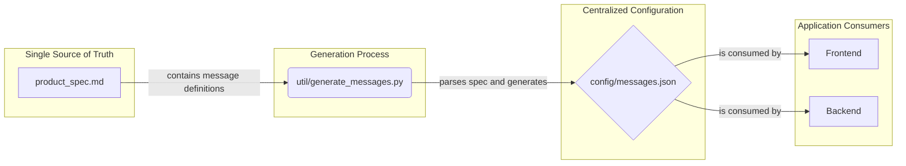

# Message Handling Strategy

This document outlines the centralized strategy for managing all user-facing messages within the Sentinel application. The primary goal is to ensure consistency between the frontend and backend, and to maintain `product_spec.md` as the single source of truth for all business logic and its corresponding text.

## Core Principle: Spec-Driven Messages

All user-facing messages, including informational messages, success confirmations, and error notifications, are derived directly from the "Messages" sections within `product_spec.md`. This ensures that the text displayed to the user is always in sync with the documented business rules.

## The Workflow

The process follows a "single source, dual distribution" model:



1.  **Single Source of Truth**: `product_spec.md` is the definitive source for all message keys (e.g., `P_E_1103`) and their corresponding message strings (e.g., "A portfolio with the name '{name}' already exists.").

2.  **Generation Script**: A Python script, located at `util/generate_messages.py`, is responsible for parsing `product_spec.md`. It finds all message lists, extracts the key-value pairs, and generates a centralized JSON file.

3.  **Centralized Message File**: The script outputs `config/messages.json`. This file acts as a language-agnostic repository of all messages used in the application.

    *Example `config/messages.json`:*
    ```json
    {
      "P_I_1001": "Portfolio '{name}' created successfully with ID {portfolioId}.",
      "P_E_1103": "A portfolio with the name '{name}' already exists.",
      "U_E_1105": "Username must be at least 3 characters long."
    }
    ```

4.  **Distribution**: The generated `messages.json` is consumed by both the frontend and backend, ensuring they use the exact same message strings.

## Implementation Details

### Frontend (Vue.js)

-   **Consumption**: The `messages.json` file is copied to `frontend/src/locales/en.json` during the generation step.
-   **Library**: The `vue-i18n` library is used to manage and display the messages.
-   **Usage**: Components can easily display messages, which is ideal for client-side validation and user feedback.
    ```javascript
    // Example in a Vue component
    $t('P_E_1105'); // Renders "Username must be at least 3 characters long."
    ```

### Backend (Python/FastAPI)

-   **Consumption**: The `messages.json` file is copied to `backend/config/messages.json` during the generation step. The backend reads the `backend/config/messages.json` file at startup.
-   **Usage**: A helper function (`get_message(key, **kwargs)`) is available for API endpoints to format and return standardized messages in API responses.

## How to Update Messages

1.  **Edit the Spec**: Make the desired changes to the message text directly in `product_spec.md`.
2.  **Run the Script**: Execute the generation script from the project root:
    ```bash
    python util/generate_messages.py
    ```
3.  **Commit Changes**: Commit the updated `product_spec.md` and the newly generated `config/messages.json` (and its frontend and backend copies) to version control.

This process guarantees that all user-facing text remains consistent and is tightly coupled to the project's core specification.
