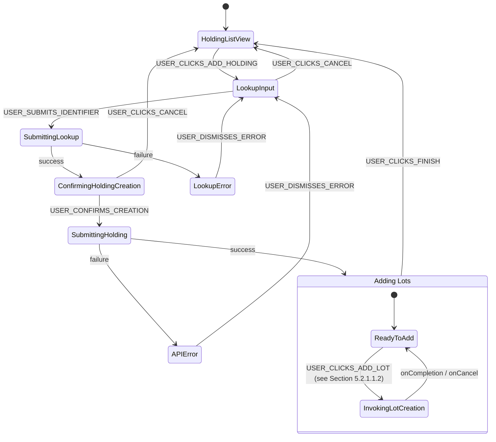

# State Machine DSL for User Interaction Flows

## 1. Purpose and Audience

This document defines the lightweight Domain-Specific Language (DSL) used within the `product_spec.md` to formally describe user interaction flows. This DSL provides a structured, unambiguous, and machine-readable format for defining state machines that model how a user moves through a specific task or process within the Sentinel application.

The primary purpose is to provide:
- **For Human Readers (Developers, PMs, Testers):** A clear, consistent, and easy-to-understand blueprint of every user flow, including all possible states, user actions, system responses, and error conditions.
- **For AI Automation Agents:** A formal, parsable specification that can be directly translated into frontend components, state management logic, and automated tests, minimizing ambiguity and implementation errors.

## 2. DSL Syntax and Keywords

Each flow is defined by a root object containing a `flowId`, an `initialState`, and a list of `states`.

### 2.1. Top-Level Keywords

- `flowId` (String, Required): A unique identifier for the entire user flow (e.g., `FLOW_CREATE_LOT_MANUAL`).
- `requiresAuth` (Boolean, Required): If `true`, the user must be authenticated to initiate and execute this flow. If `false`, it is a public flow (e.g., `FLOW_LOGIN`).
- `initialState` (String, Required): The name of the state where the flow begins. This must match the `name` of one of the defined states.
- `states` (Array, Required): A list of all possible state objects within the flow.

### 2.2. State Object Keywords

Each object within the `states` array represents a single state in the machine and has the following structure:

- `name` (String, Required): A unique, machine-friendly name for the state (e.g., `Idle`, `FormInput`, `Submitting`).
- `description` (String, Required): A human-readable sentence describing what this state represents for the user. It should clarify what the user sees or does in the UI at this stage.
- `renders` (String, Optional): The `viewId` of the view that this state is responsible for displaying. This creates an explicit, machine-readable link between a state and a view.

A state can contain one or more of the following blocks to define its behavior:

- `events` (Object, Optional): Defines transitions triggered directly by **user actions**.
    - **Key:** The name of the user event in `UPPER_SNAKE_CASE` (e.g., `USER_CLICKS_SAVE`).
    - **Value:** The `name` of the target state to transition to.

- `entryAction` (Object, Optional): Defines an **automated action** that is executed immediately upon entering this state.
    - `service` (String, Required): A description of the service being called (e.g., `"POST /api/users/me/holdings"`).
    - `transitions` (Object, Required): Defines the possible outcomes of the `service` call and which state to transition to for each outcome.
        - **Key:** The name of the outcome in `snake_case` (e.g., `success`, `failure`, `invalid`).
        - **Value:** The `name` of the target state.

- `exitAction` (Object, Optional): Defines an action that is executed when leaving this state.
    - `action` (String, Required): The type of action to perform (e.g., `Maps_TO`).
    - `target` (String, Required): The destination of the action (e.g., a `viewId` like `VIEW_PORTFOLIO_HOLDINGS`).

- `subflow` (Object, Optional): Defines a call to another, separate state machine flow.
    - `flowId` (String, Required): The `flowId` of the state machine to be invoked.
    - `onCompletion` (String, Required): The `name` of the state to transition to when the subflow finishes successfully.
    - `onCancel` (String, Required): The `name` of the state to if the user cancels the subflow.

- `activates` (Array, Optional): A list of state transitions to trigger in other concurrent flows upon entering this state.
    - `flowId` (String, Required): The `flowId` of the concurrent state machine to affect.
    - `targetState` (String, Required): The `name` of the state to transition to in the target flow.

## 3. Advanced Concepts: `subflow` vs. `activates`

It is important to understand the difference between `subflow` and `activates` to model complex UI interactions correctly.

-   **`subflow`**: Use this for a **blocking, sequential process**. When a state invokes a `subflow`, the parent flow **pauses and waits**. It cannot proceed until the subflow either completes (`onCompletion`) or is cancelled (`onCancel`). This is ideal for embedding a complete, self-contained task within another, like a wizard or a modal form that must be filled out before returning to the main view.
    -   **When to use**: Use `subflow` when Flow A needs to **call and wait for** Flow B to finish before Flow A can continue.

-   **`activates`**: Use this for **non-blocking, parallel state synchronization**. When a state `activates` a state in another flow, the parent flow **does not pause**. It simply sends a one-way signal to a concurrent, independent state machine to change its state. This is for coordinating different components that are active on the same view at the same time.
    -   **When to use**: Use `activates` when Flow A needs to **tell** Flow B to change its state, but both flows continue to run side-by-side, independently.

## 4. Example: Manual Holding Creation Flow

The following example illustrates how the DSL is used to define the flow for a user manually adding a new holding to their portfolio.

### Manual Creation of a Holding
An authenticated user can add a new holding to their portfolio from the dashboard's holding list view. The process first requires the user to find and select a financial instrument. Once the instrument is selected, the system creates the new holding, which is initially empty. The user is then immediately given the option to add one or more purchase lots to this new holding. A newly created holding can remain empty if the user chooses. After the user indicates they are finished, the view returns to the holding list.

#### Visual Representation



#### State Machine for Manual Holding Creation

```yaml
flowId: FLOW_ADD_HOLDING_MANUAL
requiresAuth: true
initialState: HoldingListView
states:
  - name: HoldingListView
    renders: VIEW_PORTFOLIO_HOLDINGS # This flow starts on the main holdings list view.
    description: "The user is viewing the list of holdings in their default portfolio."
    events:
      USER_CLICKS_ADD_HOLDING: LookupInput

  - name: LookupInput
    renders: VIEW_SECURITY_LOOKUP_MODAL # This state brings up the lookup modal.
    description: "The user is prompted to enter a Ticker, ISIN, or WKN for the new holding."
    events:
      USER_SUBMITS_IDENTIFIER: SubmittingLookup
      USER_CLICKS_CANCEL: HoldingListView

  - name: SubmittingLookup
    renders: VIEW_SECURITY_LOOKUP_MODAL # The lookup modal remains visible, showing a loading state.
    description: "The system is searching for the financial instrument."
    entryAction:
      service: "FinancialInstrumentLookupService.search(identifier)"
      transitions:
        success: ConfirmingHoldingCreation
        failure: LookupError

  - name: ConfirmingHoldingCreation
    renders: VIEW_SECURITY_LOOKUP_MODAL # The modal updates to show confirmation details.
    description: "The user is shown the details of the found instrument and asked to confirm its creation."
    events:
      USER_CONFIRMS_CREATION: SubmittingHolding
      USER_CLICKS_CANCEL: HoldingListView

  - name: SubmittingHolding
    renders: VIEW_SECURITY_LOOKUP_MODAL # The modal remains visible, showing a loading state.
    description: "The system is creating the new, empty holding."
    entryAction:
      service: "POST /api/users/me/holdings"
      transitions:
        success: AddingLots
        failure: APIError

  - name: AddingLots
    renders: VIEW_HOLDING_DETAIL # The user is now on the new holding's detail page.
    description: "The user is viewing the newly created holding and can now optionally add one or more purchase lots."
    events:
      USER_CLICKS_ADD_LOT: AddingSingleLot
      USER_CLICKS_FINISH: HoldingListView

  - name: AddingSingleLot
    description: "The system is now invoking the lot creation subflow."
    subflow:
      flowId: FLOW_CREATE_LOT_MANUAL
      onCompletion: AddingLots
      onCancel: AddingLots

  - name: LookupError
    renders: VIEW_SECURITY_LOOKUP_MODAL # The modal updates to show an error message.
    description: "The user is shown an error message that the instrument could not be found."
    events:
      USER_DISMISSES_ERROR: LookupInput

  - name: APIError
    renders: VIEW_SECURITY_LOOKUP_MODAL # The modal updates to show a generic API error.
    description: "The user is shown a generic error message that the holding could not be saved."
    events:
      USER_DISMISSES_ERROR: LookupInput
```
