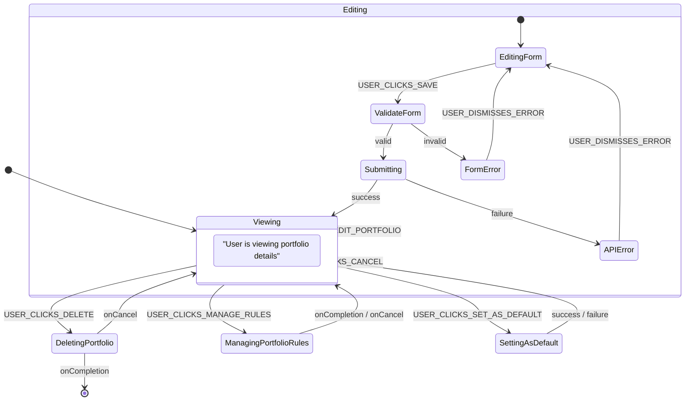

# State Machine DSL for User Interaction Flows

## 1. Purpose and Audience

This document defines the lightweight Domain-Specific Language (DSL) used within the `product_spec.md` to formally describe user interaction flows. This DSL provides a structured, unambiguous, and machine-readable format for defining state machines that model how a user moves through a specific task or process within the Sentinel application.

The primary purpose is to provide:
- **For Human Readers (Developers, PMs, Testers):** A clear, consistent, and easy-to-understand blueprint of every user flow, including all possible states, user actions, system responses, and error conditions.
- **For AI Automation Agents:** A formal, parsable specification that can be directly translated into frontend components, state management logic, and automated tests, minimizing ambiguity and implementation errors.

## 2. DSL Syntax and Keywords

Each flow is defined by a root object containing a `flowId`, an `initialState`, and a list of `states`.

### 2.1. Top-Level Keywords

- `flowId` (String, Required): A unique identifier for the entire user flow (e.g., `FLOW_CREATE_LOT_MANUAL`).
- `requiresAuth` (Boolean, Required): If `true`, the user must be authenticated to initiate and execute this flow. If `false`, it is a public flow (e.g., `FLOW_LOGIN`).
- `initialState` (String, Required): The name of the state where the flow begins. This must match the `name` of one of the defined states.
- `states` (Array, Required): A list of all possible state objects within the flow.

### 2.2. State Object Keywords

Each object within the `states` array represents a single state in the machine and has the following structure:

- `name` (String, Required): A unique, machine-friendly name for the state (e.g., `Idle`, `FormInput`, `Submitting`).
- `description` (String, Required): A human-readable sentence describing what this state represents for the user. It should clarify what the user sees or does in the UI at this stage.
- `renders` (String, Optional): The `viewId` of the view that this state is responsible for displaying. This creates an explicit, machine-readable link between a state and a view.

A state can contain one or more of the following blocks to define its behavior:

- `events` (Object, Optional): Defines transitions triggered directly by **user actions**.
    - **Key:** The name of the user event in `UPPER_SNAKE_CASE` (e.g., `USER_CLICKS_SAVE`).
    - **Value:** The `name` of the target state to transition to.

- `entryAction` (Object, Optional): Defines an **automated action** that is executed immediately upon entering this state.
    - `service` (String, Required): A description of the service being called (e.g., `"POST /api/users/me/holdings"`).
    - `transitions` (Object, Required): Defines the possible outcomes of the `service` call and which state to transition to for each outcome.
        - **Key:** The name of the outcome in `snake_case` (e.g., `success`, `failure`, `invalid`).
        - **Value:** The `name` of the target state.

- `exitAction` (Object, Optional): Defines an action that is executed when leaving this state.
    - `action` (String, Required): The type of action to perform (e.g., `Maps_TO`).
    - `target` (String, Required): The destination of the action (e.g., a `viewId` like `VIEW_PORTFOLIO_HOLDINGS`).

- `subflow` (Object, Optional): Defines a call to another, separate state machine flow.
    - `flowId` (String, Required): The `flowId` of the state machine to be invoked.
    - `onCompletion` (String, Required): The `name` of the state to transition to when the subflow finishes successfully.
    - `onCancel` (String, Required): The `name` of the state to if the user cancels the subflow.

- `activates` (Array, Optional): A list of state transitions to trigger in other concurrent flows upon entering this state.
    - `flowId` (String, Required): The `flowId` of the concurrent state machine to affect.
    - `targetState` (String, Required): The `name` of the state to transition to in the target flow.

## 3. Advanced Concepts: `subflow` vs. `activates`

It is important to understand the difference between `subflow` and `activates` to model complex UI interactions correctly.

-   **`subflow`**: Use this for a **blocking, sequential process**. When a state invokes a `subflow`, the parent flow **pauses and waits**. It cannot proceed until the subflow either completes (`onCompletion`) or is cancelled (`onCancel`). This is ideal for embedding a complete, self-contained task within another, like a wizard or a modal form that must be filled out before returning to the main view.
    -   **When to use**: Use `subflow` when Flow A needs to **call and wait for** Flow B to finish before Flow A can continue.

-   **`activates`**: Use this for **non-blocking, parallel state synchronization**. When a state `activates` a state in another flow, the parent flow **does not pause**. It simply sends a one-way signal to a concurrent, independent state machine to change its state. This is for coordinating different components that are active on the same view at the same time.
    -   **When to use**: Use `activates` when Flow A needs to **tell** Flow B to change its state, but both flows continue to run side-by-side, independently.

## 4. Example: Portfolio Detail Flow

The following example illustrates how the DSL is used to define the flow for viewing and managing a single portfolio. This is a good example because it showcases multiple features of the DSL, including `renders`, `events`, `activates` (to control a child view), and `subflow` (to invoke other processes like deletion or rule management).

### 4.1. Visual Representation

Mermaid Diagram for FLOW_VIEW_PORTFOLIO_DETAIL:



### 4.2. State Machine Definition

```yaml
flowId: FLOW_VIEW_PORTFOLIO_DETAIL
requiresAuth: true
initialState: ReadOnly
states:
  - name: ReadOnly
    renders: VIEW_PORTFOLIO_DETAIL
    description: "The user is viewing the portfolio's details in a read-only state."
    activates:
      - flowId: "FLOW_VIEW_HOLDINGS_LIST"
        targetState: "ReadOnlyMode"
    events:
      USER_CLICKS_EDIT_PORTFOLIO: ManageMode
      USER_CLICKS_DELETE: DeletingPortfolio
      USER_CLICKS_SET_AS_DEFAULT: SettingAsDefault
      USER_CLICKS_MANAGE_RULES: ManagingPortfolioRules

  - name: ManagingPortfolioRules 
    description: "Invoking the subflow to manage portfolio-level rules."
    subflow:
      flowId: FLOW_MANAGE_PORTFOLIO_RULES
      onCompletion: ReadOnly
      onCancel: ReadOnly

  - name: ManageMode
    renders: VIEW_PORTFOLIO_DETAIL
    description: "The user has entered manage mode. The portfolio's fields and its holdings list are editable."
    activates:
      - flowId: "FLOW_VIEW_HOLDINGS_LIST"
        targetState: "ManageMode"
    events:
      USER_CLICKS_SAVE: ValidateForm
      USER_CLICKS_CANCEL: ReadOnly

  - name: ValidateForm
    renders: VIEW_PORTFOLIO_DETAIL
    description: "Performing client-side validation on the updated form inputs."
    entryAction:
      service: "ValidationService.validate(form)"
      transitions:
        valid: Submitting
        invalid: FormError

  - name: Submitting
    renders: VIEW_PORTFOLIO_DETAIL
    description: "Submitting the updated portfolio data to the backend."
    entryAction:
      service: "PUT /api/users/me/portfolios/{portfolioId}"
      transitions:
        success: ReadOnly
        failure: APIError

  - name: FormError
    renders: VIEW_PORTFOLIO_DETAIL
    description: "An error message is shown indicating which form fields are invalid."
    events:
      USER_DISMISSES_ERROR: ManageMode

  - name: APIError
    renders: VIEW_PORTFOLIO_DETAIL
    description: "A generic error message is shown that the portfolio could not be updated."
    events:
      USER_DISMISSES_ERROR: ManageMode

  - name: DeletingPortfolio
    renders: VIEW_PORTFOLIO_DETAIL
    description: "The user is invoking the portfolio deletion subflow."
    subflow:
      flowId: FLOW_DELETE_PORTFOLIO_MANUAL
      onCompletion: (exit flow)
      onCancel: ReadOnly

  - name: SettingAsDefault
    renders: VIEW_PORTFOLIO_DETAIL
    description: "Submitting a request to set this portfolio as the user's default."
    entryAction:
      service: "PUT /api/users/me/settings (setting new defaultPortfolioId)"
      transitions:
        success: ReadOnly
        failure: ReadOnly
```
