# UI Flow Diagrams

> **Note:** This document is auto-generated by `util/generate_ui_flow_visuals_mermaid.py`. Do not edit it manually.

## Flow: `FLOW_CREATE_PORTFOLIO_MANUAL`

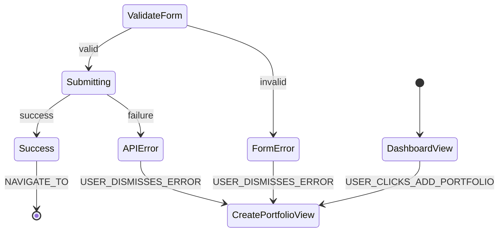
```mermaid
stateDiagram-v2
    [*] --> DashboardView
    DashboardView --> CreatePortfolioView : USER_CLICKS_ADD_PORTFOLIO
    ValidateForm --> Submitting : valid
    ValidateForm --> FormError : invalid
    Submitting --> Success : success
    Submitting --> APIError : failure
    Success --> [*] : NAVIGATE_TO
    FormError --> CreatePortfolioView : USER_DISMISSES_ERROR
    APIError --> CreatePortfolioView : USER_DISMISSES_ERROR
```

## Flow: `FLOW_VIEW_PORTFOLIO_LIST`

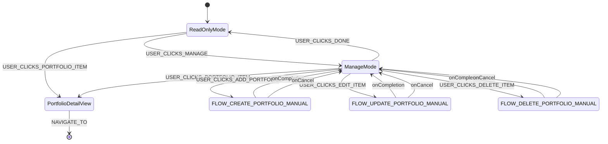
```mermaid
stateDiagram-v2
    [*] --> ReadOnlyMode
    ReadOnlyMode --> ManageMode : USER_CLICKS_MANAGE
    ReadOnlyMode --> PortfolioDetailView : USER_CLICKS_PORTFOLIO_ITEM
    ManageMode --> ReadOnlyMode : USER_CLICKS_DONE
    ManageMode --> PortfolioDetailView : USER_CLICKS_PORTFOLIO_ITEM
    ManageMode --> AddingPortfolio_subflow : USER_CLICKS_ADD_PORTFOLIO
    ManageMode --> EditingPortfolio_subflow : USER_CLICKS_EDIT_ITEM
    ManageMode --> DeletingPortfolio_subflow : USER_CLICKS_DELETE_ITEM
    PortfolioDetailView --> [*] : NAVIGATE_TO
    state "FLOW_CREATE_PORTFOLIO_MANUAL" as AddingPortfolio_subflow
    AddingPortfolio_subflow --> ManageMode : onCompletion
    AddingPortfolio_subflow --> ManageMode : onCancel
    state "FLOW_UPDATE_PORTFOLIO_MANUAL" as EditingPortfolio_subflow
    EditingPortfolio_subflow --> ManageMode : onCompletion
    EditingPortfolio_subflow --> ManageMode : onCancel
    state "FLOW_DELETE_PORTFOLIO_MANUAL" as DeletingPortfolio_subflow
    DeletingPortfolio_subflow --> ManageMode : onCompletion
    DeletingPortfolio_subflow --> ManageMode : onCancel
```

## Flow: `FLOW_VIEW_PORTFOLIO_DETAIL`

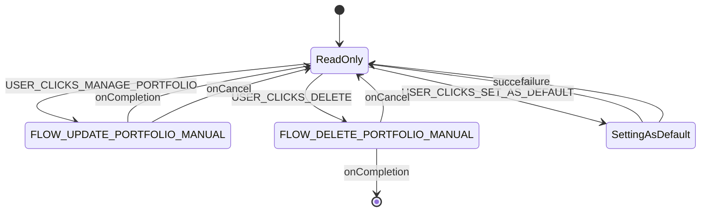
```mermaid
stateDiagram-v2
    [*] --> ReadOnly
    ReadOnly --> ManageMode_subflow : USER_CLICKS_MANAGE_PORTFOLIO
    ReadOnly --> DeletingPortfolio_subflow : USER_CLICKS_DELETE
    ReadOnly --> SettingAsDefault : USER_CLICKS_SET_AS_DEFAULT
    state "FLOW_UPDATE_PORTFOLIO_MANUAL" as ManageMode_subflow
    ManageMode_subflow --> ReadOnly : onCompletion
    ManageMode_subflow --> ReadOnly : onCancel
    state "FLOW_DELETE_PORTFOLIO_MANUAL" as DeletingPortfolio_subflow
    DeletingPortfolio_subflow --> [*] : onCompletion
    DeletingPortfolio_subflow --> ReadOnly : onCancel
    SettingAsDefault --> ReadOnly : success
    SettingAsDefault --> ReadOnly : failure
```

## Flow: `FLOW_UPDATE_PORTFOLIO_MANUAL`

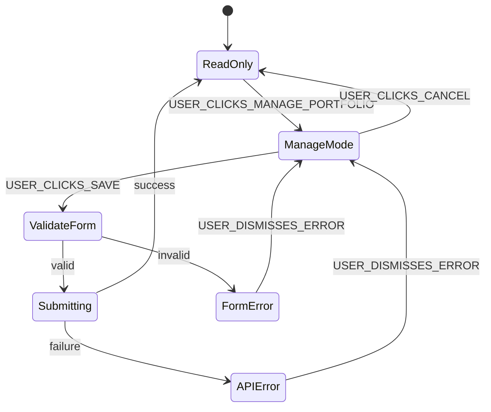
```mermaid
stateDiagram-v2
    [*] --> ReadOnly
    ReadOnly --> ManageMode : USER_CLICKS_MANAGE_PORTFOLIO
    ManageMode --> ValidateForm : USER_CLICKS_SAVE
    ManageMode --> ReadOnly : USER_CLICKS_CANCEL
    ValidateForm --> Submitting : valid
    ValidateForm --> FormError : invalid
    Submitting --> ReadOnly : success
    Submitting --> APIError : failure
    FormError --> ManageMode : USER_DISMISSES_ERROR
    APIError --> ManageMode : USER_DISMISSES_ERROR
```

## Flow: `FLOW_DELETE_PORTFOLIO_MANUAL`

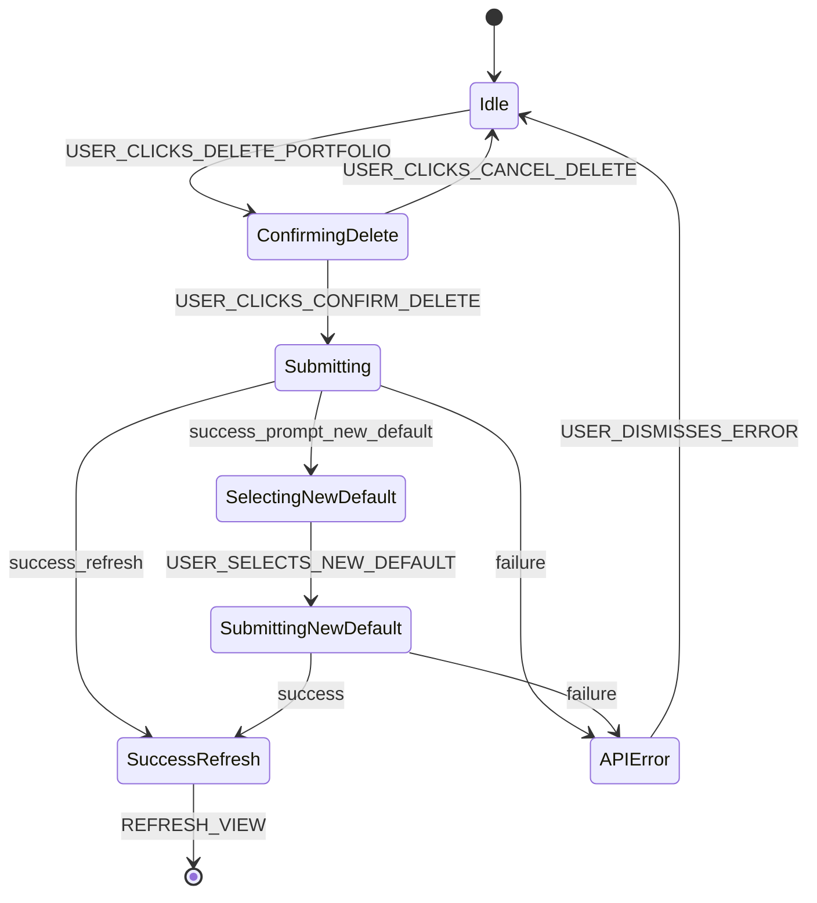
```mermaid
stateDiagram-v2
    [*] --> Idle
    Idle --> ConfirmingDelete : USER_CLICKS_DELETE_PORTFOLIO
    ConfirmingDelete --> Submitting : USER_CLICKS_CONFIRM_DELETE
    ConfirmingDelete --> Idle : USER_CLICKS_CANCEL_DELETE
    Submitting --> SuccessRefresh : success_refresh
    Submitting --> SelectingNewDefault : success_prompt_new_default
    Submitting --> APIError : failure
    SelectingNewDefault --> SubmittingNewDefault : USER_SELECTS_NEW_DEFAULT
    SubmittingNewDefault --> SuccessRefresh : success
    SubmittingNewDefault --> APIError : failure
    SuccessRefresh --> [*] : REFRESH_VIEW
    APIError --> Idle : USER_DISMISSES_ERROR
```

## Flow: `FLOW_IMPORT_TRANSACTIONS`

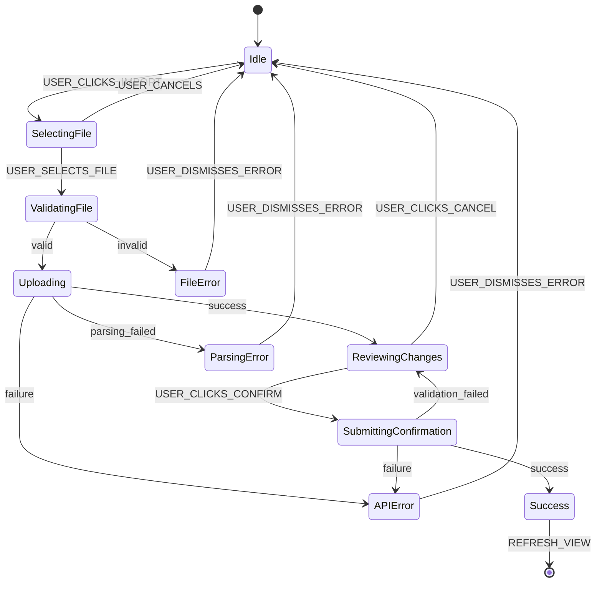
```mermaid
stateDiagram-v2
    [*] --> Idle
    Idle --> SelectingFile : USER_CLICKS_IMPORT
    SelectingFile --> ValidatingFile : USER_SELECTS_FILE
    SelectingFile --> Idle : USER_CANCELS
    ValidatingFile --> Uploading : valid
    ValidatingFile --> FileError : invalid
    Uploading --> ReviewingChanges : success
    Uploading --> ParsingError : parsing_failed
    Uploading --> APIError : failure
    ReviewingChanges --> SubmittingConfirmation : USER_CLICKS_CONFIRM
    ReviewingChanges --> Idle : USER_CLICKS_CANCEL
    SubmittingConfirmation --> Success : success
    SubmittingConfirmation --> ReviewingChanges : validation_failed
    SubmittingConfirmation --> APIError : failure
    Success --> [*] : REFRESH_VIEW
    FileError --> Idle : USER_DISMISSES_ERROR
    ParsingError --> Idle : USER_DISMISSES_ERROR
    APIError --> Idle : USER_DISMISSES_ERROR
```

## Flow: `FLOW_ADD_HOLDING_MANUAL`

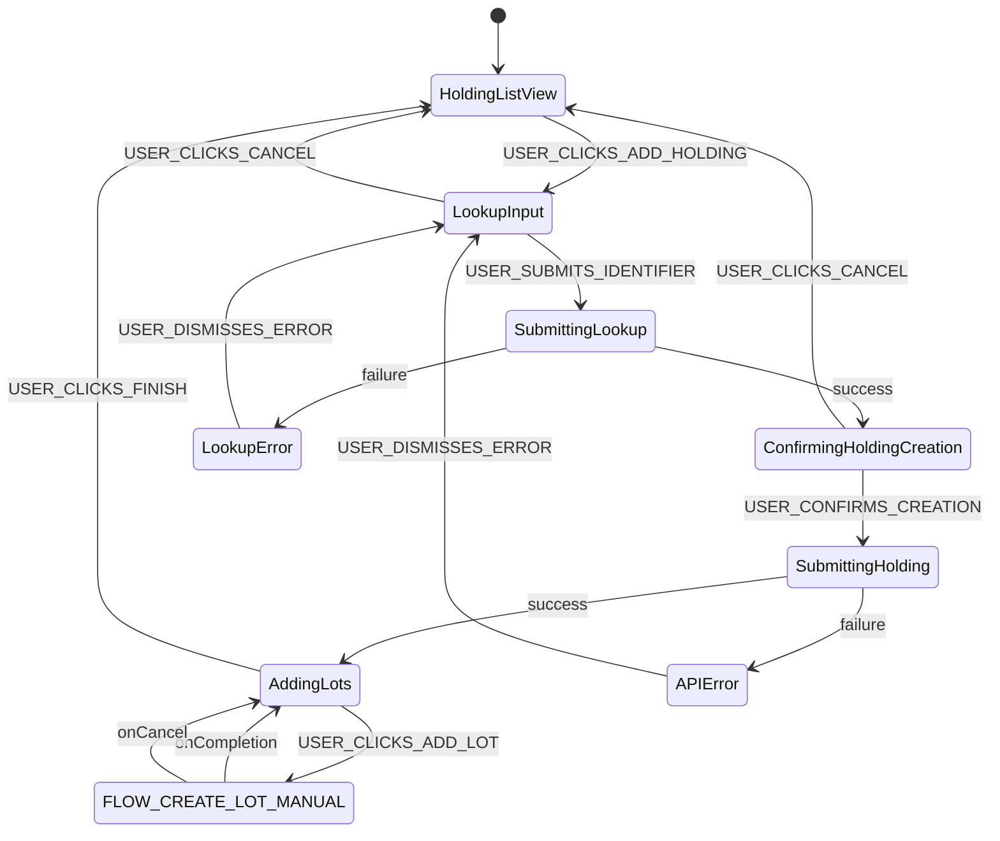
```mermaid
stateDiagram-v2
    [*] --> HoldingListView
    HoldingListView --> LookupInput : USER_CLICKS_ADD_HOLDING
    LookupInput --> SubmittingLookup : USER_SUBMITS_IDENTIFIER
    LookupInput --> HoldingListView : USER_CLICKS_CANCEL
    SubmittingLookup --> ConfirmingHoldingCreation : success
    SubmittingLookup --> LookupError : failure
    ConfirmingHoldingCreation --> SubmittingHolding : USER_CONFIRMS_CREATION
    ConfirmingHoldingCreation --> HoldingListView : USER_CLICKS_CANCEL
    SubmittingHolding --> AddingLots : success
    SubmittingHolding --> APIError : failure
    AddingLots --> AddingSingleLot_subflow : USER_CLICKS_ADD_LOT
    AddingLots --> HoldingListView : USER_CLICKS_FINISH
    state "FLOW_CREATE_LOT_MANUAL" as AddingSingleLot_subflow
    AddingSingleLot_subflow --> AddingLots : onCompletion
    AddingSingleLot_subflow --> AddingLots : onCancel
    LookupError --> LookupInput : USER_DISMISSES_ERROR
    APIError --> LookupInput : USER_DISMISSES_ERROR
```

## Flow: `FLOW_VIEW_HOLDING_LIST`

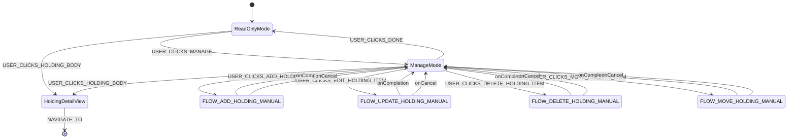
```mermaid
stateDiagram-v2
    [*] --> ReadOnlyMode
    ReadOnlyMode --> ManageMode : USER_CLICKS_MANAGE
    ReadOnlyMode --> HoldingDetailView : USER_CLICKS_HOLDING_BODY
    ManageMode --> ReadOnlyMode : USER_CLICKS_DONE
    ManageMode --> HoldingDetailView : USER_CLICKS_HOLDING_BODY
    ManageMode --> AddingHolding_subflow : USER_CLICKS_ADD_HOLDING
    ManageMode --> EditingHolding_subflow : USER_CLICKS_EDIT_HOLDING_ITEM
    ManageMode --> DeletingHolding_subflow : USER_CLICKS_DELETE_HOLDING_ITEM
    ManageMode --> MovingHolding_subflow : USER_CLICKS_MOVE_HOLDING_ITEM
    HoldingDetailView --> [*] : NAVIGATE_TO
    state "FLOW_ADD_HOLDING_MANUAL" as AddingHolding_subflow
    AddingHolding_subflow --> ManageMode : onCompletion
    AddingHolding_subflow --> ManageMode : onCancel
    state "FLOW_UPDATE_HOLDING_MANUAL" as EditingHolding_subflow
    EditingHolding_subflow --> ManageMode : onCompletion
    EditingHolding_subflow --> ManageMode : onCancel
    state "FLOW_DELETE_HOLDING_MANUAL" as DeletingHolding_subflow
    DeletingHolding_subflow --> ManageMode : onCompletion
    DeletingHolding_subflow --> ManageMode : onCancel
    state "FLOW_MOVE_HOLDING_MANUAL" as MovingHolding_subflow
    MovingHolding_subflow --> ManageMode : onCompletion
    MovingHolding_subflow --> ManageMode : onCancel
```

## Flow: `FLOW_VIEW_HOLDING_DETAIL`

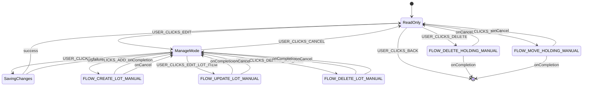
```mermaid
stateDiagram-v2
    [*] --> ReadOnly
    ReadOnly --> ManageMode : USER_CLICKS_EDIT
    ReadOnly --> DeletingHolding_subflow : USER_CLICKS_DELETE
    ReadOnly --> MovingHolding_subflow : USER_CLICKS_MOVE
    ReadOnly --> [*] : USER_CLICKS_BACK
    ManageMode --> SavingChanges : USER_CLICKS_SAVE
    ManageMode --> ReadOnly : USER_CLICKS_CANCEL
    ManageMode --> AddingLot_subflow : USER_CLICKS_ADD_LOT
    ManageMode --> EditingLot_subflow : USER_CLICKS_EDIT_LOT_ITEM
    ManageMode --> DeletingLot_subflow : USER_CLICKS_DELETE_LOT_ITEM
    SavingChanges --> ReadOnly : success
    SavingChanges --> ManageMode : failure
    state "FLOW_CREATE_LOT_MANUAL" as AddingLot_subflow
    AddingLot_subflow --> ManageMode : onCompletion
    AddingLot_subflow --> ManageMode : onCancel
    state "FLOW_UPDATE_LOT_MANUAL" as EditingLot_subflow
    EditingLot_subflow --> ManageMode : onCompletion
    EditingLot_subflow --> ManageMode : onCancel
    state "FLOW_DELETE_LOT_MANUAL" as DeletingLot_subflow
    DeletingLot_subflow --> ManageMode : onCompletion
    DeletingLot_subflow --> ManageMode : onCancel
    state "FLOW_DELETE_HOLDING_MANUAL" as DeletingHolding_subflow
    DeletingHolding_subflow --> [*] : onCompletion
    DeletingHolding_subflow --> ReadOnly : onCancel
    state "FLOW_MOVE_HOLDING_MANUAL" as MovingHolding_subflow
    MovingHolding_subflow --> [*] : onCompletion
    MovingHolding_subflow --> ReadOnly : onCancel
```

## Flow: `FLOW_UPDATE_HOLDING_MANUAL`

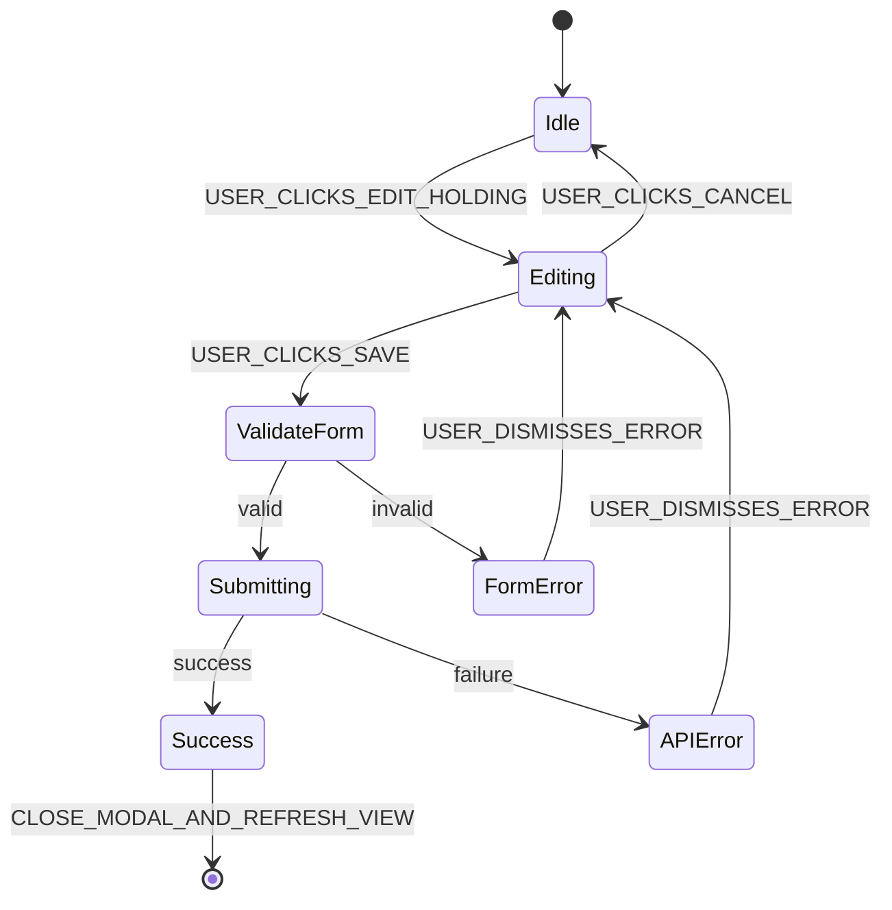
```mermaid
stateDiagram-v2
    [*] --> Idle
    Idle --> Editing : USER_CLICKS_EDIT_HOLDING
    Editing --> ValidateForm : USER_CLICKS_SAVE
    Editing --> Idle : USER_CLICKS_CANCEL
    ValidateForm --> Submitting : valid
    ValidateForm --> FormError : invalid
    Submitting --> Success : success
    Submitting --> APIError : failure
    Success --> [*] : CLOSE_MODAL_AND_REFRESH_VIEW
    FormError --> Editing : USER_DISMISSES_ERROR
    APIError --> Editing : USER_DISMISSES_ERROR
```

## Flow: `FLOW_DELETE_HOLDING_MANUAL`

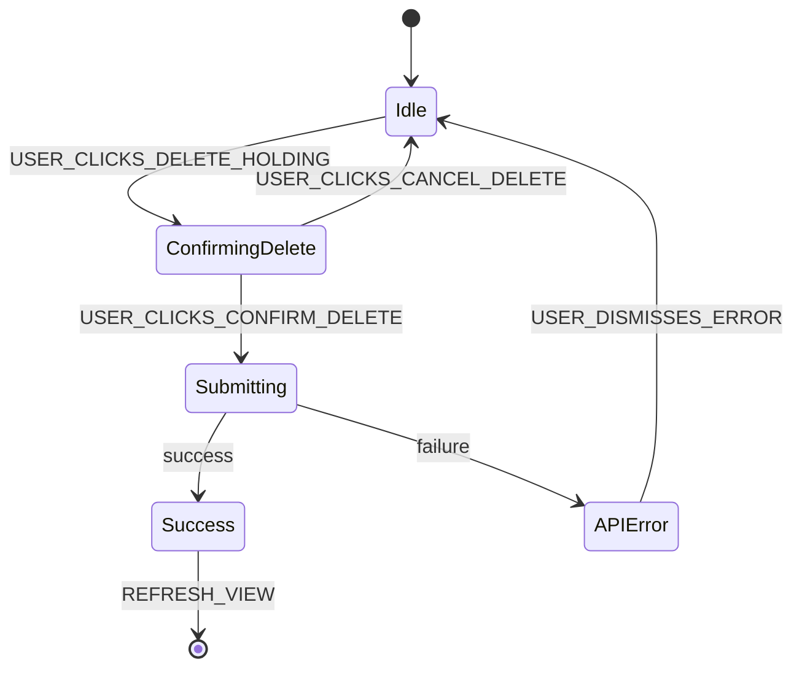
```mermaid
stateDiagram-v2
    [*] --> Idle
    Idle --> ConfirmingDelete : USER_CLICKS_DELETE_HOLDING
    ConfirmingDelete --> Submitting : USER_CLICKS_CONFIRM_DELETE
    ConfirmingDelete --> Idle : USER_CLICKS_CANCEL_DELETE
    Submitting --> Success : success
    Submitting --> APIError : failure
    Success --> [*] : REFRESH_VIEW
    APIError --> Idle : USER_DISMISSES_ERROR
```

## Flow: `FLOW_MOVE_HOLDING_MANUAL`

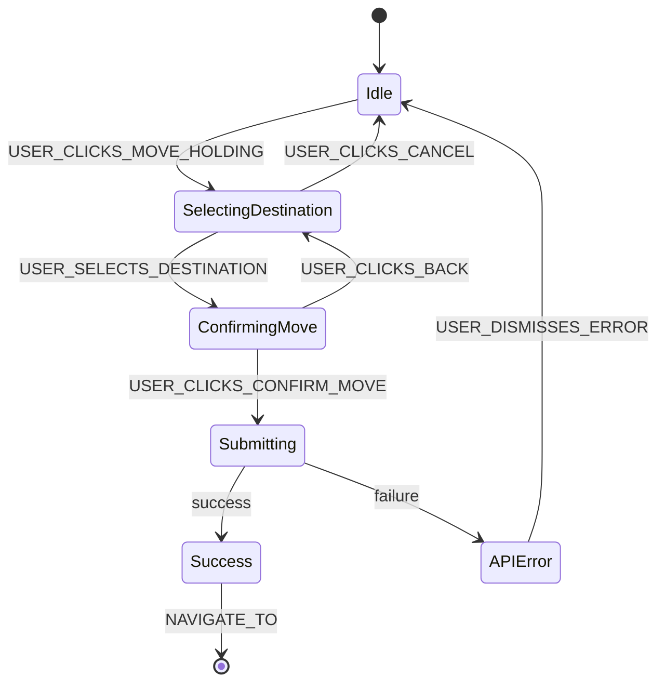
```mermaid
stateDiagram-v2
    [*] --> Idle
    Idle --> SelectingDestination : USER_CLICKS_MOVE_HOLDING
    SelectingDestination --> ConfirmingMove : USER_SELECTS_DESTINATION
    SelectingDestination --> Idle : USER_CLICKS_CANCEL
    ConfirmingMove --> Submitting : USER_CLICKS_CONFIRM_MOVE
    ConfirmingMove --> SelectingDestination : USER_CLICKS_BACK
    Submitting --> Success : success
    Submitting --> APIError : failure
    Success --> [*] : NAVIGATE_TO
    APIError --> Idle : USER_DISMISSES_ERROR
```

## Flow: `FLOW_CREATE_LOT_MANUAL`

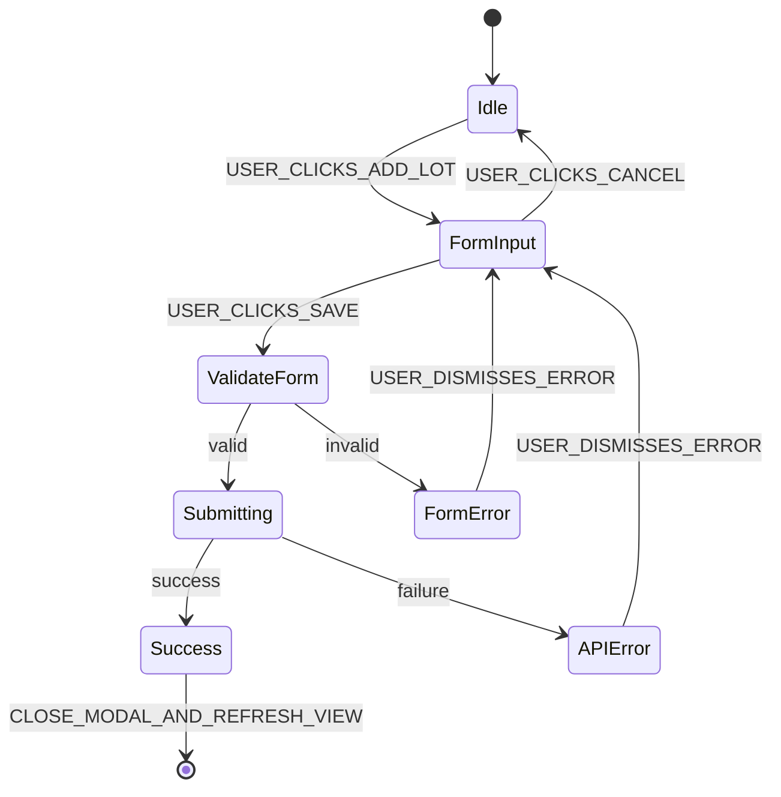
```mermaid
stateDiagram-v2
    [*] --> Idle
    Idle --> FormInput : USER_CLICKS_ADD_LOT
    FormInput --> ValidateForm : USER_CLICKS_SAVE
    FormInput --> Idle : USER_CLICKS_CANCEL
    ValidateForm --> Submitting : valid
    ValidateForm --> FormError : invalid
    Submitting --> Success : success
    Submitting --> APIError : failure
    Success --> [*] : CLOSE_MODAL_AND_REFRESH_VIEW
    FormError --> FormInput : USER_DISMISSES_ERROR
    APIError --> FormInput : USER_DISMISSES_ERROR
```

## Flow: `FLOW_MANAGE_LOTS_LIST`

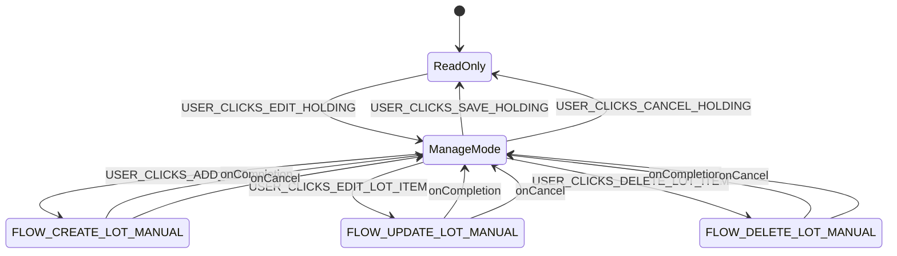
```mermaid
stateDiagram-v2
    [*] --> ReadOnly
    ReadOnly --> ManageMode : USER_CLICKS_EDIT_HOLDING
    ManageMode --> ReadOnly : USER_CLICKS_SAVE_HOLDING
    ManageMode --> ReadOnly : USER_CLICKS_CANCEL_HOLDING
    ManageMode --> AddingLot_subflow : USER_CLICKS_ADD_LOT
    ManageMode --> EditingLot_subflow : USER_CLICKS_EDIT_LOT_ITEM
    ManageMode --> DeletingLot_subflow : USER_CLICKS_DELETE_LOT_ITEM
    state "FLOW_CREATE_LOT_MANUAL" as AddingLot_subflow
    AddingLot_subflow --> ManageMode : onCompletion
    AddingLot_subflow --> ManageMode : onCancel
    state "FLOW_UPDATE_LOT_MANUAL" as EditingLot_subflow
    EditingLot_subflow --> ManageMode : onCompletion
    EditingLot_subflow --> ManageMode : onCancel
    state "FLOW_DELETE_LOT_MANUAL" as DeletingLot_subflow
    DeletingLot_subflow --> ManageMode : onCompletion
    DeletingLot_subflow --> ManageMode : onCancel
```

## Flow: `FLOW_UPDATE_LOT_MANUAL`

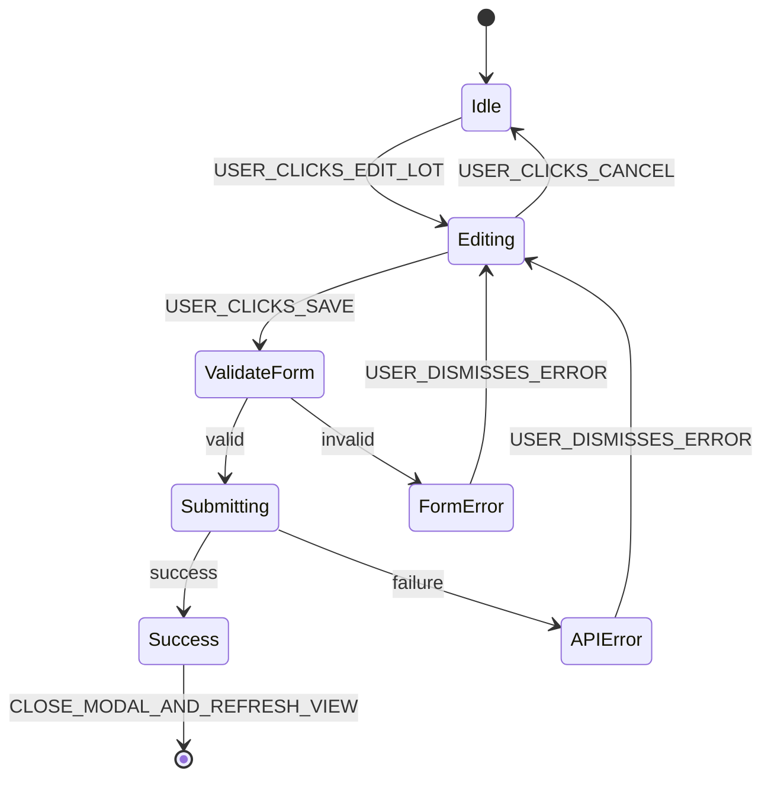
```mermaid
stateDiagram-v2
    [*] --> Idle
    Idle --> Editing : USER_CLICKS_EDIT_LOT
    Editing --> ValidateForm : USER_CLICKS_SAVE
    Editing --> Idle : USER_CLICKS_CANCEL
    ValidateForm --> Submitting : valid
    ValidateForm --> FormError : invalid
    Submitting --> Success : success
    Submitting --> APIError : failure
    Success --> [*] : CLOSE_MODAL_AND_REFRESH_VIEW
    FormError --> Editing : USER_DISMISSES_ERROR
    APIError --> Editing : USER_DISMISSES_ERROR
```

## Flow: `FLOW_DELETE_LOT_MANUAL`

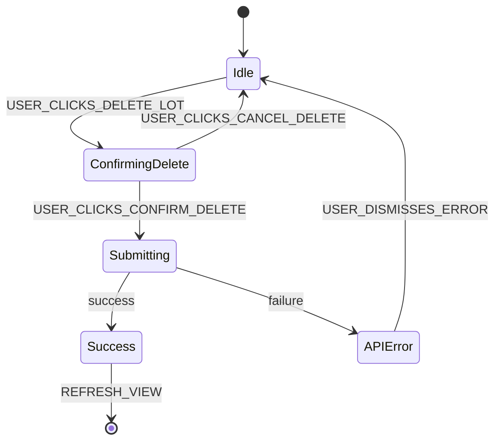
```mermaid
stateDiagram-v2
    [*] --> Idle
    Idle --> ConfirmingDelete : USER_CLICKS_DELETE_LOT
    ConfirmingDelete --> Submitting : USER_CLICKS_CONFIRM_DELETE
    ConfirmingDelete --> Idle : USER_CLICKS_CANCEL_DELETE
    Submitting --> Success : success
    Submitting --> APIError : failure
    Success --> [*] : REFRESH_VIEW
    APIError --> Idle : USER_DISMISSES_ERROR
```
