# UI Flow Diagrams


> **Note:** This document is auto-generated by `util/generate_ui_flow_visuals_mermaid.py`. Do not edit it manually.

## Flow: `FLOW_UNAUTHENTICATED_NAV`

```mermaid
stateDiagram-v2
    %% Flow ID: FLOW_UNAUTHENTICATED_NAV
    [*] --> HomePage
    state "🏠 HomePage<br/><font size="2"><i>(VIEW_HOME_PAGE)</i></font>" as HomePage
    HomePage --> NavigatingToLogin : USER_CLICKS_LOGIN
    state "NavigatingToLogin" as NavigatingToLogin
    state "➡️ subflow: FLOW_LOGIN" as NavigatingToLogin_subflow_node
    NavigatingToLogin --> NavigatingToLogin_subflow_node
    NavigatingToLogin_subflow_node --> [*] : ✅ onCompletion
    NavigatingToLogin_subflow_node --> HomePage : 🛑 onCancel
```

## Flow: `FLOW_LOGIN`

```mermaid
stateDiagram-v2
    %% Flow ID: FLOW_LOGIN
    [*] --> FormInput
    state "📝 FormInput<br/><font size="2"><i>(VIEW_LOGIN_FORM)</i></font>" as FormInput
    FormInput --> Submitting : USER_SUBMITS_LOGIN
    state "🛑 (exit onCancel)" as FormInput_exit_USER_CLICKS_CANCEL
    FormInput --> FormInput_exit_USER_CLICKS_CANCEL : USER_CLICKS_CANCEL
    FormInput_exit_USER_CLICKS_CANCEL --> [*]
    state "⏳ Submitting<br/><font size="2"><i>(VIEW_LOGIN_FORM)</i></font>" as Submitting
    Submitting --> Success : success
    Submitting --> AuthError : failure
    state "✅ Success" as Success
    state "➡️ VIEW_DASHBOARD" as Success_exit_action
    Success --> Success_exit_action
    Success_exit_action --> [*]
    state "❌ AuthError<br/><font size="2"><i>(VIEW_LOGIN_FORM)</i></font>" as AuthError
    AuthError --> FormInput : USER_DISMISSES_ERROR
```

## Flow: `FLOW_LOGOUT`

```mermaid
stateDiagram-v2
    %% Flow ID: FLOW_LOGOUT
    [*] --> Idle
    state "💤 Idle" as Idle
    Idle --> ConfirmingLogout : USER_CLICKS_LOGOUT
    state "🤔 ConfirmingLogout<br/><font size="2"><i>(VIEW_CONFIRM_LOGOUT_MODAL)</i></font>" as ConfirmingLogout
    ConfirmingLogout --> SubmittingLogout : USER_CONFIRMS_LOGOUT
    ConfirmingLogout --> Idle : USER_CLICKS_CANCEL
    state "⏳ SubmittingLogout<br/><font size="2"><i>(VIEW_CONFIRM_LOGOUT_MODAL)</i></font>" as SubmittingLogout
    SubmittingLogout --> Success : success
    SubmittingLogout --> Idle : failure
    state "✅ Success" as Success
    state "➡️ VIEW_HOME_PAGE" as Success_exit_action
    Success --> Success_exit_action
    Success_exit_action --> [*]
```

## Flow: `FLOW_MANAGE_PORTFOLIO_RULES`


## Flow: `FLOW_MANAGE_HOLDING_RULES`

```mermaid
stateDiagram-v2
    %% Flow ID: FLOW_MANAGE_HOLDING_RULES
    [*] --> CheckingForOverride
    state "🔍 CheckingForOverride" as CheckingForOverride
    CheckingForOverride --> EditingSpecificRules : has_specific_rules
    CheckingForOverride --> DisplayingInheritedRules : has_inherited_rules
    CheckingForOverride --> EditingSpecificRules : has_no_rules
    state "⚖️ DisplayingInheritedRules<br/><font size="2"><i>(VIEW_INHERITED_RULES_INFO)</i></font>" as DisplayingInheritedRules
    DisplayingInheritedRules --> EditingSpecificRules : USER_CLICKS_CREATE_OVERRIDE
    state "(exit)" as DisplayingInheritedRules_exit_USER_CLICKS_BACK
    DisplayingInheritedRules --> DisplayingInheritedRules_exit_USER_CLICKS_BACK : USER_CLICKS_BACK
    DisplayingInheritedRules_exit_USER_CLICKS_BACK --> [*]
    state "✏️ EditingSpecificRules<br/><font size="2"><i>(VIEW_RULE_SET_FORM)</i></font>" as EditingSpecificRules
    EditingSpecificRules --> Submitting : USER_CLICKS_SAVE_RULES
    state "(exit)" as EditingSpecificRules_exit_USER_CLICKS_CANCEL
    EditingSpecificRules --> EditingSpecificRules_exit_USER_CLICKS_CANCEL : USER_CLICKS_CANCEL
    EditingSpecificRules_exit_USER_CLICKS_CANCEL --> [*]
    state "⏳ Submitting<br/><font size="2"><i>(VIEW_RULE_SET_FORM)</i></font>" as Submitting
    Submitting --> Success : success
    Submitting --> APIError : failure
    state "✅ Success" as Success
    state "REFRESH_VIEW VIEW_HOLDING_DETAIL" as Success_exit_action
    Success --> Success_exit_action
    Success_exit_action --> [*]
    state "❌ APIError<br/><font size="2"><i>(VIEW_RULE_SET_FORM)</i></font>" as APIError
    APIError --> EditingSpecificRules : USER_DISMISSES_ERROR
```

## Flow: `FLOW_CREATE_PORTFOLIO_MANUAL`

```mermaid
stateDiagram-v2
    %% Flow ID: FLOW_CREATE_PORTFOLIO_MANUAL
    [*] --> DashboardView
    state "📊 DashboardView<br/><font size="2"><i>(VIEW_DASHBOARD)</i></font>" as DashboardView
    DashboardView --> CreatePortfolioView : USER_CLICKS_ADD_PORTFOLIO
    state "👁️ CreatePortfolioView" as CreatePortfolioView {
            state "✏️ EditingPortfolio" as EditingPortfolio
            EditingPortfolio --> AddingHolding : USER_CLICKS_ADD_HOLDING
            EditingPortfolio --> ValidateForm : USER_CLICKS_SAVE
            EditingPortfolio --> DashboardView : USER_CLICKS_CANCEL
            state "➕ AddingHolding" as AddingHolding
            state "➡️ subflow: FLOW_ADD_HOLDING_MANUAL" as AddingHolding_subflow_node
            AddingHolding --> AddingHolding_subflow_node
            AddingHolding_subflow_node --> EditingPortfolio : ✅ onCompletion
            AddingHolding_subflow_node --> EditingPortfolio : 🛑 onCancel
    }
    state "📝 ValidateForm<br/><font size="2"><i>(VIEW_PORTFOLIO_FORM)</i></font>" as ValidateForm
    ValidateForm --> Submitting : valid
    ValidateForm --> FormError : invalid
    state "⏳ Submitting<br/><font size="2"><i>(VIEW_PORTFOLIO_FORM)</i></font>" as Submitting
    Submitting --> Success : success
    Submitting --> APIError : failure
    state "✅ Success" as Success
    state "➡️ VIEW_DASHBOARD" as Success_exit_action
    Success --> Success_exit_action
    Success_exit_action --> [*]
    state "📝 FormError<br/><font size="2"><i>(VIEW_PORTFOLIO_FORM)</i></font>" as FormError
    FormError --> CreatePortfolioView : USER_DISMISSES_ERROR
    state "❌ APIError<br/><font size="2"><i>(VIEW_PORTFOLIO_FORM)</i></font>" as APIError
    APIError --> CreatePortfolioView : USER_DISMISSES_ERROR
```

## Flow: `FLOW_VIEW_PORTFOLIOS_LIST`

```mermaid
stateDiagram-v2
    %% Flow ID: FLOW_VIEW_PORTFOLIOS_LIST
    [*] --> ReadOnlyMode
    state "ReadOnlyMode<br/><font size="2"><i>(VIEW_PORTFOLIOS_LIST)</i></font>" as ReadOnlyMode
    ReadOnlyMode --> ManageMode : USER_CLICKS_EDIT_PORTFOLIOS
    ReadOnlyMode --> PortfolioDetailView : USER_SELECTS_PORTFOLIO
    state "ManageMode<br/><font size="2"><i>(VIEW_PORTFOLIOS_LIST)</i></font>" as ManageMode
    ManageMode --> ReadOnlyMode : USER_CLICKS_DONE
    ManageMode --> PortfolioDetailView : USER_SELECTS_PORTFOLIO
    ManageMode --> AddingPortfolio : USER_CLICKS_ADD_PORTFOLIO
    ManageMode --> EditingPortfolio : USER_CLICKS_EDIT_PORTFOLIO_ITEM
    ManageMode --> DeletingPortfolio : USER_CLICKS_DELETE_PORTFOLIO_ITEM
    state "👁️ PortfolioDetailView" as PortfolioDetailView
    state "➡️ VIEW_PORTFOLIO_DETAIL" as PortfolioDetailView_exit_action
    PortfolioDetailView --> PortfolioDetailView_exit_action
    PortfolioDetailView_exit_action --> [*]
    state "➕ AddingPortfolio" as AddingPortfolio
    state "➡️ subflow: FLOW_CREATE_PORTFOLIO_MANUAL" as AddingPortfolio_subflow_node
    AddingPortfolio --> AddingPortfolio_subflow_node
    AddingPortfolio_subflow_node --> ManageMode : ✅ onCompletion
    AddingPortfolio_subflow_node --> ManageMode : 🛑 onCancel
    state "✏️ EditingPortfolio" as EditingPortfolio
    state "➡️ subflow: FLOW_UPDATE_PORTFOLIO_MANUAL" as EditingPortfolio_subflow_node
    EditingPortfolio --> EditingPortfolio_subflow_node
    EditingPortfolio_subflow_node --> ManageMode : ✅ onCompletion
    EditingPortfolio_subflow_node --> ManageMode : 🛑 onCancel
    state "DeletingPortfolio" as DeletingPortfolio
    state "➡️ subflow: FLOW_DELETE_PORTFOLIO_MANUAL" as DeletingPortfolio_subflow_node
    DeletingPortfolio --> DeletingPortfolio_subflow_node
    DeletingPortfolio_subflow_node --> ManageMode : ✅ onCompletion
    DeletingPortfolio_subflow_node --> ManageMode : 🛑 onCancel
```

## Flow: `FLOW_VIEW_PORTFOLIO_DETAIL`


## Flow: `FLOW_UPDATE_PORTFOLIO_MANUAL`


## Flow: `FLOW_DELETE_PORTFOLIO_MANUAL`


## Flow: `FLOW_IMPORT_TRANSACTIONS`

```mermaid
stateDiagram-v2
    %% Flow ID: FLOW_IMPORT_TRANSACTIONS
    [*] --> Idle
    state "💤 Idle<br/><font size="2"><i>(VIEW_PORTFOLIO_DETAIL)</i></font>" as Idle
    Idle --> SelectingFile : USER_CLICKS_IMPORT
    state "👆 SelectingFile" as SelectingFile
    SelectingFile --> ValidatingFile : USER_SELECTS_FILE
    SelectingFile --> Idle : USER_CANCELS
    state "ValidatingFile<br/><font size="2"><i>(VIEW_PORTFOLIO_DETAIL)</i></font>" as ValidatingFile
    ValidatingFile --> Uploading : valid
    ValidatingFile --> FileError : invalid
    state "⏳ Uploading<br/><font size="2"><i>(VIEW_PORTFOLIO_DETAIL)</i></font>" as Uploading
    Uploading --> ReviewingChanges : success
    Uploading --> ParsingError : parsing_failed
    Uploading --> APIError : failure
    state "👁️ ReviewingChanges<br/><font size="2"><i>(VIEW_IMPORT_REVIEW)</i></font>" as ReviewingChanges
    ReviewingChanges --> SubmittingConfirmation : USER_CLICKS_CONFIRM
    ReviewingChanges --> Idle : USER_CLICKS_CANCEL
    state "⏳ SubmittingConfirmation<br/><font size="2"><i>(VIEW_IMPORT_REVIEW)</i></font>" as SubmittingConfirmation
    SubmittingConfirmation --> Success : success
    SubmittingConfirmation --> ReviewingChanges : validation_failed
    SubmittingConfirmation --> APIError : failure
    state "✅ Success" as Success
    state "REFRESH_VIEW VIEW_PORTFOLIO_DETAIL" as Success_exit_action
    Success --> Success_exit_action
    Success_exit_action --> [*]
    state "❌ FileError<br/><font size="2"><i>(VIEW_PORTFOLIO_DETAIL)</i></font>" as FileError
    FileError --> Idle : USER_DISMISSES_ERROR
    state "❌ ParsingError<br/><font size="2"><i>(VIEW_PORTFOLIO_DETAIL)</i></font>" as ParsingError
    ParsingError --> Idle : USER_DISMISSES_ERROR
    state "❌ APIError<br/><font size="2"><i>(VIEW_PORTFOLIO_DETAIL)</i></font>" as APIError
    APIError --> Idle : USER_DISMISSES_ERROR
```

## Flow: `FLOW_ADD_HOLDING_MANUAL`

```mermaid
stateDiagram-v2
    %% Flow ID: FLOW_ADD_HOLDING_MANUAL
    [*] --> HoldingListView
    state "👁️ HoldingListView<br/><font size="2"><i>(VIEW_PORTFOLIO_DETAIL)</i></font>" as HoldingListView
    HoldingListView --> LookupInput : USER_CLICKS_ADD_HOLDING
    state "⌨️ LookupInput<br/><font size="2"><i>(VIEW_INSTRUMENT_LOOKUP_MODAL)</i></font>" as LookupInput
    LookupInput --> SubmittingLookup : USER_SUBMITS_IDENTIFIER
    LookupInput --> HoldingListView : USER_CLICKS_CANCEL
    state "⏳ SubmittingLookup<br/><font size="2"><i>(VIEW_INSTRUMENT_LOOKUP_MODAL)</i></font>" as SubmittingLookup
    SubmittingLookup --> ConfirmingHoldingCreation : success
    SubmittingLookup --> LookupError : failure
    state "🤔 ConfirmingHoldingCreation<br/><font size="2"><i>(VIEW_INSTRUMENT_LOOKUP_MODAL)</i></font>" as ConfirmingHoldingCreation
    ConfirmingHoldingCreation --> SubmittingHolding : USER_CONFIRMS_CREATION
    ConfirmingHoldingCreation --> HoldingListView : USER_CLICKS_CANCEL
    state "⏳ SubmittingHolding<br/><font size="2"><i>(VIEW_INSTRUMENT_LOOKUP_MODAL)</i></font>" as SubmittingHolding
    SubmittingHolding --> AddingLots : success
    SubmittingHolding --> APIError : failure
    state "➕ AddingLots<br/><font size="2"><i>(VIEW_HOLDING_DETAIL)</i></font>" as AddingLots
    AddingLots --> AddingSingleLot : USER_CLICKS_ADD_LOT
    AddingLots --> HoldingListView : USER_CLICKS_FINISH
    state "➕ AddingSingleLot" as AddingSingleLot
    state "➡️ subflow: FLOW_CREATE_LOT_MANUAL" as AddingSingleLot_subflow_node
    AddingSingleLot --> AddingSingleLot_subflow_node
    AddingSingleLot_subflow_node --> AddingLots : ✅ onCompletion
    AddingSingleLot_subflow_node --> AddingLots : 🛑 onCancel
    state "❌ LookupError<br/><font size="2"><i>(VIEW_INSTRUMENT_LOOKUP_MODAL)</i></font>" as LookupError
    LookupError --> LookupInput : USER_DISMISSES_ERROR
    state "❌ APIError<br/><font size="2"><i>(VIEW_INSTRUMENT_LOOKUP_MODAL)</i></font>" as APIError
    APIError --> LookupInput : USER_DISMISSES_ERROR
```

## Flow: `FLOW_VIEW_HOLDINGS_LIST`

```mermaid
stateDiagram-v2
    %% Flow ID: FLOW_VIEW_HOLDINGS_LIST
    [*] --> ReadOnlyMode
    state "ReadOnlyMode<br/><font size="2"><i>(VIEW_HOLDINGS_LIST)</i></font>" as ReadOnlyMode
    ReadOnlyMode --> ManageMode : USER_CLICKS_MANAGE
    ReadOnlyMode --> HoldingDetailView : USER_CLICKS_HOLDING_BODY
    state "ManageMode<br/><font size="2"><i>(VIEW_HOLDINGS_LIST)</i></font>" as ManageMode
    ManageMode --> ReadOnlyMode : USER_CLICKS_DONE
    ManageMode --> HoldingDetailView : USER_CLICKS_HOLDING_BODY
    ManageMode --> AddingHolding : USER_CLICKS_ADD_HOLDING
    ManageMode --> EditingHolding : USER_CLICKS_EDIT_HOLDING_ITEM
    ManageMode --> DeletingHolding : USER_CLICKS_DELETE_HOLDING_ITEM
    ManageMode --> MovingHolding : USER_CLICKS_MOVE_HOLDING_ITEM
    state "👁️ HoldingDetailView" as HoldingDetailView
    state "➡️ VIEW_HOLDING_DETAIL" as HoldingDetailView_exit_action
    HoldingDetailView --> HoldingDetailView_exit_action
    HoldingDetailView_exit_action --> [*]
    state "➕ AddingHolding" as AddingHolding
    state "➡️ subflow: FLOW_ADD_HOLDING_MANUAL" as AddingHolding_subflow_node
    AddingHolding --> AddingHolding_subflow_node
    AddingHolding_subflow_node --> ManageMode : ✅ onCompletion
    AddingHolding_subflow_node --> ManageMode : 🛑 onCancel
    state "✏️ EditingHolding" as EditingHolding
    state "➡️ subflow: FLOW_UPDATE_HOLDING_MANUAL" as EditingHolding_subflow_node
    EditingHolding --> EditingHolding_subflow_node
    EditingHolding_subflow_node --> ManageMode : ✅ onCompletion
    EditingHolding_subflow_node --> ManageMode : 🛑 onCancel
    state "DeletingHolding" as DeletingHolding
    state "➡️ subflow: FLOW_DELETE_HOLDING_MANUAL" as DeletingHolding_subflow_node
    DeletingHolding --> DeletingHolding_subflow_node
    DeletingHolding_subflow_node --> ManageMode : ✅ onCompletion
    DeletingHolding_subflow_node --> ManageMode : 🛑 onCancel
    state "MovingHolding" as MovingHolding
    state "➡️ subflow: FLOW_MOVE_HOLDING_MANUAL" as MovingHolding_subflow_node
    MovingHolding --> MovingHolding_subflow_node
    MovingHolding_subflow_node --> ManageMode : ✅ onCompletion
    MovingHolding_subflow_node --> ManageMode : 🛑 onCancel
```

## Flow: `FLOW_VIEW_HOLDING_DETAIL`

```mermaid
stateDiagram-v2
    %% Flow ID: FLOW_VIEW_HOLDING_DETAIL
    [*] --> ReadOnly
    state "ReadOnly<br/><font size="2"><i>(VIEW_HOLDING_DETAIL)</i></font>" as ReadOnly
    ReadOnly --> ManageMode : USER_CLICKS_EDIT
    ReadOnly --> DeletingHolding : USER_CLICKS_DELETE
    ReadOnly --> MovingHolding : USER_CLICKS_MOVE
    state "(exit)" as ReadOnly_exit_USER_CLICKS_BACK
    ReadOnly --> ReadOnly_exit_USER_CLICKS_BACK : USER_CLICKS_BACK
    ReadOnly_exit_USER_CLICKS_BACK --> [*]
    ReadOnly --> ManagingHoldingRules : USER_CLICKS_MANAGE_RULES
    state "⚖️ ManagingHoldingRules" as ManagingHoldingRules
    state "➡️ subflow: FLOW_MANAGE_HOLDING_RULES" as ManagingHoldingRules_subflow_node
    ManagingHoldingRules --> ManagingHoldingRules_subflow_node
    ManagingHoldingRules_subflow_node --> ReadOnly : ✅ onCompletion
    ManagingHoldingRules_subflow_node --> ReadOnly : 🛑 onCancel
    state "ManageMode<br/><font size="2"><i>(VIEW_HOLDING_DETAIL)</i></font>" as ManageMode
    ManageMode --> SavingChanges : USER_CLICKS_SAVE
    ManageMode --> ReadOnly : USER_CLICKS_CANCEL
    ManageMode --> AddingLot : USER_CLICKS_ADD_LOT
    ManageMode --> EditingLot : USER_CLICKS_EDIT_LOT_ITEM
    ManageMode --> DeletingLot : USER_CLICKS_DELETE_LOT_ITEM
    note right of ManageMode
        activates: ManageMode in FLOW_VIEW_LOTS_LIST
    end note
    state "SavingChanges<br/><font size="2"><i>(VIEW_HOLDING_DETAIL)</i></font>" as SavingChanges
    SavingChanges --> ReadOnly : success
    SavingChanges --> ManageMode : failure
    state "➕ AddingLot<br/><font size="2"><i>(VIEW_HOLDING_DETAIL)</i></font>" as AddingLot
    state "➡️ subflow: FLOW_CREATE_LOT_MANUAL" as AddingLot_subflow_node
    AddingLot --> AddingLot_subflow_node
    AddingLot_subflow_node --> ManageMode : ✅ onCompletion
    AddingLot_subflow_node --> ManageMode : 🛑 onCancel
    state "✏️ EditingLot<br/><font size="2"><i>(VIEW_HOLDING_DETAIL)</i></font>" as EditingLot
    state "➡️ subflow: FLOW_UPDATE_LOT_MANUAL" as EditingLot_subflow_node
    EditingLot --> EditingLot_subflow_node
    EditingLot_subflow_node --> ManageMode : ✅ onCompletion
    EditingLot_subflow_node --> ManageMode : 🛑 onCancel
    state "DeletingLot<br/><font size="2"><i>(VIEW_HOLDING_DETAIL)</i></font>" as DeletingLot
    state "➡️ subflow: FLOW_DELETE_LOT_MANUAL" as DeletingLot_subflow_node
    DeletingLot --> DeletingLot_subflow_node
    DeletingLot_subflow_node --> ManageMode : ✅ onCompletion
    DeletingLot_subflow_node --> ManageMode : 🛑 onCancel
    state "DeletingHolding<br/><font size="2"><i>(VIEW_HOLDING_DETAIL)</i></font>" as DeletingHolding
    state "➡️ subflow: FLOW_DELETE_HOLDING_MANUAL" as DeletingHolding_subflow_node
    DeletingHolding --> DeletingHolding_subflow_node
    DeletingHolding_subflow_node --> [*] : ✅ onCompletion
    DeletingHolding_subflow_node --> ReadOnly : 🛑 onCancel
    state "MovingHolding<br/><font size="2"><i>(VIEW_HOLDING_DETAIL)</i></font>" as MovingHolding
    state "➡️ subflow: FLOW_MOVE_HOLDING_MANUAL" as MovingHolding_subflow_node
    MovingHolding --> MovingHolding_subflow_node
    MovingHolding_subflow_node --> [*] : ✅ onCompletion
    MovingHolding_subflow_node --> ReadOnly : 🛑 onCancel
```

## Flow: `FLOW_UPDATE_HOLDING_MANUAL`

```mermaid
stateDiagram-v2
    %% Flow ID: FLOW_UPDATE_HOLDING_MANUAL
    [*] --> Idle
    state "💤 Idle" as Idle
    Idle --> Editing : USER_CLICKS_EDIT_HOLDING
    state "✏️ Editing<br/><font size="2"><i>(VIEW_HOLDING_FORM)</i></font>" as Editing
    Editing --> ValidateForm : USER_CLICKS_SAVE
    Editing --> Idle : USER_CLICKS_CANCEL
    state "📝 ValidateForm<br/><font size="2"><i>(VIEW_HOLDING_FORM)</i></font>" as ValidateForm
    ValidateForm --> Submitting : valid
    ValidateForm --> FormError : invalid
    state "⏳ Submitting<br/><font size="2"><i>(VIEW_HOLDING_FORM)</i></font>" as Submitting
    Submitting --> Success : success
    Submitting --> APIError : failure
    state "✅ Success" as Success
    state "CLOSE_MODAL_AND_REFRESH_VIEW VIEW_HOLDING_DETAIL" as Success_exit_action
    Success --> Success_exit_action
    Success_exit_action --> [*]
    state "📝 FormError<br/><font size="2"><i>(VIEW_HOLDING_FORM)</i></font>" as FormError
    FormError --> Editing : USER_DISMISSES_ERROR
    state "❌ APIError<br/><font size="2"><i>(VIEW_HOLDING_FORM)</i></font>" as APIError
    APIError --> Editing : USER_DISMISSES_ERROR
```

## Flow: `FLOW_DELETE_HOLDING_MANUAL`

```mermaid
stateDiagram-v2
    %% Flow ID: FLOW_DELETE_HOLDING_MANUAL
    [*] --> Idle
    state "💤 Idle" as Idle
    Idle --> ConfirmingDelete : USER_CLICKS_DELETE_HOLDING
    state "🤔 ConfirmingDelete<br/><font size="2"><i>(VIEW_CONFIRM_DELETE_HOLDING_MODAL)</i></font>" as ConfirmingDelete
    ConfirmingDelete --> Submitting : USER_CLICKS_CONFIRM_DELETE
    ConfirmingDelete --> Idle : USER_CLICKS_CANCEL_DELETE
    state "⏳ Submitting<br/><font size="2"><i>(VIEW_CONFIRM_DELETE_HOLDING_MODAL)</i></font>" as Submitting
    Submitting --> Success : success
    Submitting --> APIError : failure
    state "✅ Success" as Success
    state "REFRESH_VIEW VIEW_PORTFOLIO_DETAIL" as Success_exit_action
    Success --> Success_exit_action
    Success_exit_action --> [*]
    state "❌ APIError<br/><font size="2"><i>(VIEW_CONFIRM_DELETE_HOLDING_MODAL)</i></font>" as APIError
    APIError --> Idle : USER_DISMISSES_ERROR
```

## Flow: `FLOW_MOVE_HOLDING_MANUAL`

```mermaid
stateDiagram-v2
    %% Flow ID: FLOW_MOVE_HOLDING_MANUAL
    [*] --> Idle
    state "💤 Idle" as Idle
    Idle --> SelectingDestination : USER_CLICKS_MOVE_HOLDING
    state "👆 SelectingDestination<br/><font size="2"><i>(VIEW_MOVE_HOLDING_MODAL)</i></font>" as SelectingDestination
    SelectingDestination --> ConfirmingMove : USER_SELECTS_DESTINATION
    SelectingDestination --> Idle : USER_CLICKS_CANCEL
    state "🤔 ConfirmingMove<br/><font size="2"><i>(VIEW_MOVE_HOLDING_MODAL)</i></font>" as ConfirmingMove
    ConfirmingMove --> Submitting : USER_CLICKS_CONFIRM_MOVE
    ConfirmingMove --> SelectingDestination : USER_CLICKS_BACK
    state "⏳ Submitting<br/><font size="2"><i>(VIEW_MOVE_HOLDING_MODAL)</i></font>" as Submitting
    Submitting --> Success : success
    Submitting --> APIError : failure
    state "✅ Success" as Success
    state "➡️ VIEW_PORTFOLIO_DETAIL" as Success_exit_action
    Success --> Success_exit_action
    Success_exit_action --> [*]
    state "❌ APIError<br/><font size="2"><i>(VIEW_MOVE_HOLDING_MODAL)</i></font>" as APIError
    APIError --> Idle : USER_DISMISSES_ERROR
```

## Flow: `FLOW_CREATE_LOT_MANUAL`


## Flow: `FLOW_VIEW_LOTS_LIST`

```mermaid
stateDiagram-v2
    %% Flow ID: FLOW_VIEW_LOTS_LIST
    [*] --> ReadOnly
    state "ReadOnly<br/><font size="2"><i>(VIEW_LOTS_LIST)</i></font>" as ReadOnly
    ReadOnly --> ManageMode : USER_CLICKS_EDIT_HOLDING
    state "ManageMode<br/><font size="2"><i>(VIEW_LOTS_LIST)</i></font>" as ManageMode
    ManageMode --> ReadOnly : USER_CLICKS_SAVE_HOLDING
    ManageMode --> ReadOnly : USER_CLICKS_CANCEL_HOLDING
    ManageMode --> AddingLot : USER_CLICKS_ADD_LOT
    ManageMode --> EditingLot : USER_CLICKS_EDIT_LOT_ITEM
    ManageMode --> DeletingLot : USER_CLICKS_DELETE_LOT_ITEM
    state "➕ AddingLot" as AddingLot
    state "➡️ subflow: FLOW_CREATE_LOT_MANUAL" as AddingLot_subflow_node
    AddingLot --> AddingLot_subflow_node
    AddingLot_subflow_node --> ManageMode : ✅ onCompletion
    AddingLot_subflow_node --> ManageMode : 🛑 onCancel
    state "✏️ EditingLot" as EditingLot
    state "➡️ subflow: FLOW_UPDATE_LOT_MANUAL" as EditingLot_subflow_node
    EditingLot --> EditingLot_subflow_node
    EditingLot_subflow_node --> ManageMode : ✅ onCompletion
    EditingLot_subflow_node --> ManageMode : 🛑 onCancel
    state "DeletingLot" as DeletingLot
    state "➡️ subflow: FLOW_DELETE_LOT_MANUAL" as DeletingLot_subflow_node
    DeletingLot --> DeletingLot_subflow_node
    DeletingLot_subflow_node --> ManageMode : ✅ onCompletion
    DeletingLot_subflow_node --> ManageMode : 🛑 onCancel
```

## Flow: `FLOW_UPDATE_LOT_MANUAL`

```mermaid
stateDiagram-v2
    %% Flow ID: FLOW_UPDATE_LOT_MANUAL
    [*] --> Idle
    state "💤 Idle" as Idle
    Idle --> Editing : USER_CLICKS_EDIT_LOT
    state "✏️ Editing<br/><font size="2"><i>(VIEW_LOT_FORM)</i></font>" as Editing
    Editing --> ValidateForm : USER_CLICKS_SAVE
    Editing --> Idle : USER_CLICKS_CANCEL
    state "📝 ValidateForm<br/><font size="2"><i>(VIEW_LOT_FORM)</i></font>" as ValidateForm
    ValidateForm --> Submitting : valid
    ValidateForm --> FormError : invalid
    state "⏳ Submitting<br/><font size="2"><i>(VIEW_LOT_FORM)</i></font>" as Submitting
    Submitting --> Success : success
    Submitting --> APIError : failure
    state "✅ Success" as Success
    state "CLOSE_MODAL_AND_REFRESH_VIEW VIEW_HOLDING_DETAIL" as Success_exit_action
    Success --> Success_exit_action
    Success_exit_action --> [*]
    state "📝 FormError<br/><font size="2"><i>(VIEW_LOT_FORM)</i></font>" as FormError
    FormError --> Editing : USER_DISMISSES_ERROR
    state "❌ APIError<br/><font size="2"><i>(VIEW_LOT_FORM)</i></font>" as APIError
    APIError --> Editing : USER_DISMISSES_ERROR
```

## Flow: `FLOW_DELETE_LOT_MANUAL`

```mermaid
stateDiagram-v2
    %% Flow ID: FLOW_DELETE_LOT_MANUAL
    [*] --> Idle
    state "💤 Idle" as Idle
    Idle --> ConfirmingDelete : USER_CLICKS_DELETE_LOT
    state "🤔 ConfirmingDelete<br/><font size="2"><i>(VIEW_CONFIRM_DELETE_LOT_MODAL)</i></font>" as ConfirmingDelete
    ConfirmingDelete --> Submitting : USER_CLICKS_CONFIRM_DELETE
    ConfirmingDelete --> Idle : USER_CLICKS_CANCEL_DELETE
    state "⏳ Submitting<br/><font size="2"><i>(VIEW_CONFIRM_DELETE_LOT_MODAL)</i></font>" as Submitting
    Submitting --> Success : success
    Submitting --> APIError : failure
    state "✅ Success" as Success
    state "REFRESH_VIEW VIEW_HOLDING_DETAIL" as Success_exit_action
    Success --> Success_exit_action
    Success_exit_action --> [*]
    state "❌ APIError<br/><font size="2"><i>(VIEW_CONFIRM_DELETE_LOT_MODAL)</i></font>" as APIError
    APIError --> Idle : USER_DISMISSES_ERROR
```

## Flow: `FLOW_SHOW_ALERTS_DROPDOWN`

```mermaid
stateDiagram-v2
    %% Flow ID: FLOW_SHOW_ALERTS_DROPDOWN
    [*] --> ShowingDropdown
    state "ShowingDropdown<br/><font size="2"><i>(VIEW_ALERTS_DROPDOWN_MODAL)</i></font>" as ShowingDropdown
    ShowingDropdown --> ViewAll : USER_CLICKS_VIEW_ALL_ALERTS
    state "🛑 (exit onCancel)" as ShowingDropdown_exit_USER_CLICKS_CLOSE_MODAL
    ShowingDropdown --> ShowingDropdown_exit_USER_CLICKS_CLOSE_MODAL : USER_CLICKS_CLOSE_MODAL
    ShowingDropdown_exit_USER_CLICKS_CLOSE_MODAL --> [*]
    state "👁️ ViewAll" as ViewAll
    state "➡️ VIEW_ALERTS_LIST" as ViewAll_exit_action
    ViewAll --> ViewAll_exit_action
    ViewAll_exit_action --> [*]
```

## Flow: `FLOW_VIEW_ALERTS`

```mermaid
stateDiagram-v2
    %% Flow ID: FLOW_VIEW_ALERTS
    [*] --> ViewingList
    state "👁️ ViewingList<br/><font size="2"><i>(VIEW_ALERTS_LIST)</i></font>" as ViewingList
    ViewingList --> ViewingDetail : USER_SELECTS_ALERT
    state "(exit)" as ViewingList_exit_USER_CLICKS_BACK
    ViewingList --> ViewingList_exit_USER_CLICKS_BACK : USER_CLICKS_BACK
    ViewingList_exit_USER_CLICKS_BACK --> [*]
    state "👁️ ViewingDetail<br/><font size="2"><i>(VIEW_ALERT_DETAIL)</i></font>" as ViewingDetail
    ViewingDetail --> ViewingDetail : USER_CLICKS_PREVIOUS_ALERT
    ViewingDetail --> ViewingDetail : USER_CLICKS_NEXT_ALERT
    ViewingDetail --> ViewingList : USER_CLICKS_BACK_TO_LIST
```
