# Creating Your First Trading Rule

The core power of Sentinel is its ability to monitor the market based on a **Rule Set** that you define. A rule set is a collection of conditions that, when met, will trigger a BUY or SELL alert.

You can set rules at the Portfolio level (which apply to all holdings within it) or at the individual Holding level (which will override the portfolio rules).

## Example: A "Buy the Dip" Rule

Let's create a simple but powerful rule to notify us when a stock we own has dropped significantly from its recent high, presenting a potential buying opportunity.

**Our Goal**: Receive a `BUY` alert for our holding if its price drops 20% from its 52-week high.

## Step-by-Step Guide

1.  **Navigate to a Holding**: From the dashboard, tap on a portfolio, then tap on the specific holding you want to create a rule for.
2.  **Open Rule Management**: Tap the Floating Action Button (FAB) at the bottom right and select the "Manage Rules" action.
3.  **Add a BUY Rule**: In the Rule Set form, click "Add Buy Rule".
4.  **Add a Condition**: In the new rule block, click "Add Condition".
5.  **Select the Condition Type**: From the dropdown, select the `DRAWDOWN_FROM_HIGH` condition.
6.  **Set the Parameter**: An input will appear. Enter `20` into the `percentage` field.
7.  **Save the Rule Set**: Click "Save Rules".

That's it! Sentinel's daily monitoring engine will now automatically track this holding's price relative to its 52-week high and will send you an alert if it ever drops by 20% or more.

```mermaid
flowchart LR
    classDef process fill:#eef,stroke:#333,stroke-width:2px;
    class decision fill:#f9f,stroke:#333,stroke-width:2px;
    class outcome fill:#cfc,stroke:#333,stroke-width:2px;
    class no_action fill:#fdd,stroke:#333,stroke-width:2px;

    A["📈 Market Closes for the Day"]:::process
    B{"Condition 1: Is RSI < 30?<br/><i>(Is it oversold?)</i>"}:::decision
    C{"Condition 2: Has Price<br/>Crossed Above SMA20?<br/><i>(Is momentum turning?)</i>"}:::decision
    D["✅ YES: Trigger 'BUY' Alert!"]:::outcome
    E["❌ NO: No Action Today"]:::no_action

    A --> B;
    B -- YES --> C;
    B -- NO --> E;
    C -- YES --> D;
    C -- NO --> E;
```

