# Getting Started: Creating Your First Portfolio

A **Portfolio** in Sentinel is a container for a group of your investments (holdings). You can create multiple portfolios to track different strategies or accounts (e.g., a "Long-Term Growth" portfolio and a "Speculative Tech" portfolio).

## The Process

Creating a portfolio is a straightforward process that starts from your main Dashboard.

```mermaid
stateDiagram-v2
    classDef view fill:#f9f,stroke:#333,stroke-width:2px
    class action fill:#bbf,stroke:#333,stroke-width:2px
    class success fill:#cfc,stroke:#333,stroke-width:2px

    [*] --> Dashboard

    state "📊 Dashboard" as Dashboard
    Dashboard --> FillForm : Click 'Add Portfolio'
    class Dashboard view

    state "📝 Fill Portfolio Form" as FillForm
    FillForm --> Dashboard : Cancel
    FillForm --> Save : Save
    class FillForm view

    state "💾 Save" as Save
    Save --> Success : Success
    class Save action
    
    state "✅ New Portfolio Created!" as Success
    Success --> [*]
    class Success success
```

## Step-by-Step Guide

1.  **Navigate to the Dashboard**: After logging in, you will land on the main "My Portfolios" dashboard.
2.  **Enter Edit Mode**: Tap the "Edit List" action from the Floating Action Button (FAB) at the bottom right of the screen.
3.  **Add Portfolio**: Tap the "Add Portfolio" action from the FAB.
4.  **Fill in the Details**: A form will appear. At a minimum, you must provide a unique **Name** for your portfolio. You can also add a description and set its default currency.
5.  **Save**: Once you are done, tap **Save**. You will be returned to the dashboard, where you will see your new portfolio in the list.

Congratulations! You've created your first portfolio and are ready to start adding your holdings.

