# Product Specification for Sentinel v0.1 (MVP)

[[_TOC_]]

## 0. Introduction

### 0.1. Purpose and Audience

This document defines the product specification for the Minimum Viable Product (MVP) of **Sentinel**, a personal investment strategy automation tool for disciplined, long-term retail investors. It serves as the single source of truth for the system's functionality, data models, business processes, and technical requirements, ensuring alignment across business, development, and testing teams.

The primary purpose is to provide:
- **Business Teams**: A human-readable, concise reference to validate the system's alignment with the investment philosophy.
- **Developers**: A detailed, systematic guide to implement the business logic, data structures, and technical components.
- **Testing Teams**: A comprehensive reference for validating system behavior, including success and error conditions.

This specification is inspired by the rigorous structure of financial system specifications (e.g., DESP for digital euro), adapted for a consumer-facing investment tool. It avoids agile artifacts like user stories, focusing instead on business processes, data models, and rule-based logic.

### 0.2. Core Problem and Vision

Sentinel addresses three challenges faced by retail investors:
1. **Time Constraints**: Investors lack the time to monitor markets continuously.
2. **Cost Barriers**: Professional wealth management is prohibitively expensive.
3. **Behavioral Gap**: Emotional decisions lead to suboptimal returns compared to market indices.

**Vision**: Sentinel empowers users to encode their long-term investment philosophy into automated rules, acting as an unemotional guardrail. It monitors markets and delivers timely, actionable notifications based on user-defined conditions, keeping users in control of their capital while automating market surveillance.

### 0.3. Structure and User Guide

The specification is organized as follows:
- **Chapter 1: System Architecture and General Notes**: Defines the overall architecture and global conventions.
- **Chapter 2: Frontend UI and User Interaction**: Describes the application's user interface, page flows, and interaction scenarios.
- **Chapter 3: Portfolio and Cash Management**: Details the management of user portfolios and cash reserves.
- **Chapter 4: Holding Management**: Details the management of individual holdings and their purchase lots within a portfolio.
- **Chapter 5: Lot Management**: Details the management of individual purchase lots within a holding.
- **Chapter 6: Strategy Rule Management**: Describes the creation, modification, and retrieval of buy and sell rules for a specific holding.
- **Chapter 7: Market Monitoring and Notification**: Outlines the automated monitoring process, rule triggering, and notification delivery.
- **Chapter 8: User Authentication and Authorization**: Covers user identity and access control.
- **Chapter 9: Technical Specifications**: Specifies security, data sources, and other non-functional requirements.

Each functional chapter (3-8) is structured to provide a multi-layered view of the system, from high-level process to detailed implementation logic:

1.  **Business Process (e.g., Section 3.1)**: Describes the "how" from a user's perspective for each major operation (e.g., Create, Update).
    *   **Visual Representation**: A Mermaid state diagram illustrating the user flow.
    *   **State Machine**: A formal definition of the flow using the project's DSL, detailing every state, user event, and system action.
2.  **Data Model (e.g., Section 3.2)**: Defines the data structures for the chapter's entities.
    *   **Stored Data Models**: The schema of the data as it is persisted in the database.
    *   **Computed Data Models**: On-the-fly calculated data that is added to API responses but not stored.
3.  **Business Rules (e.g., Section 3.3)**: Details the specific backend logic, constraints, and outcomes for each operation.
    *   **Sequence Diagram**: A Mermaid diagram showing the interaction between system components (Frontend, Backend, Database).
    *   **Sub-Rules Table**: A granular breakdown of conditions, checkpoints, and outcomes, each with a unique Rule ID (e.g., `P_I_1001`) and corresponding user-facing message key.

---

## 1. System Architecture and General Notes

### 1.1. Architectural Principles

- **Stateless Backend**: The backend API is designed to be completely stateless. User authentication is handled via short-lived, self-contained JWTs (Firebase ID Tokens) sent with each request. This eliminates the need for server-side sessions, enhances security, and allows for seamless horizontal scalability on platforms like Google Cloud Run.
- **Monolith for MVP**: The backend is a "Self-Contained System" (a well-structured monolith) for the MVP to prioritize development speed and simplicity. It can be refactored into microservices in the future if required by scale.

### 1.2. Components

- **Frontend**: Vue.js v3 (TypeScript), hosted on Firebase Hosting.
  - **UI Framework**: Vuetify (Material Design).
  - **State Management**: Pinia (Vuex alternative).
- **Authentication**: Firebase Authentication for user management, including email/password login and secure ID token issuance.
- **Backend API**: Python FastAPI, deployed on Google Cloud Run.
- **Database**: Google Cloud Firestore (NoSQL), containing user portfolios and a shared market data cache.
  - **idempotency keys** for state-changing requests, stored in a dedicated Firestore collection, TTL enabled on each document for automatic cleanup.
- **Notification Service**: SendGrid (email), Firebase Cloud Messaging (push).
- **Market Data**: Alpha Vantage API (for raw OHLCV price data).
- **Scheduler**: Google Cloud Scheduler (for triggering daily data sync).

### 1.3. Architectural Diagram


```mermaid
flowchart LR
    %% USER LAYER
    subgraph User["User Interaction"]
        A["Frontend Web App<br/>(Firebase Hosting)"]
    end

    %% PLATFORM CORE (Now includes Auth)
    subgraph Platform["Google Cloud Platform"]
        direction TB
        G["Firebase Authentication"]
        B{{"Backend API Server<br/>(Cloud Run)"}}
        C[("Database<br/>(Firestore)<br/>- Portfolios<br/>- Market Data Cache")]
        Scheduler["Cloud Scheduler"]
        E["Notification Service"]
    end

    %% EXTERNAL ZONE
    subgraph Ext["External Data/APIs"]
        F>"Market Data API<br/>(Alpha Vantage)"]
    end

    %% Flows

    %% ①② Authentication
    A -- "① Login/Signup" --> G
    G -- "② Issues ID Token" --> A

    %% ③④⑤⑥ Portfolio Read
    A -- "③ API Call with JWT<br/>(e.g., GET /api/users/me/portfolios)" --> B
    B -- "④ Verifies JWT" --> G
    B -- "⑤ Reads Portfolio Data" --> C
    B -- "⑥ Reads Market Data Cache" --> C

    %% Portfolio Write
    A -- "⑦ API Call with JWT<br/>(e.g., POST /api/users/me/portfolios)" --> B
    B -- "⑧ Writes Portfolio Data" --> C
    B -- "⑨ Triggers Backfill (async)" --> F
    F -- "⑩ Returns Historical Data" --> B
    B -- "⑪ Writes to Market Data Cache" --> C

    %% Scheduled Job (Daily Sync)
    Scheduler -- "⑫ Triggers Daily Sync" --> B
    B <-- "⑬ Fetches Latest Data" --> F
    %% F -- "⑭ Returns Latest Data" --> B
    B -- "⑭ Writes to Market Data Cache" --> C

    %% OPTIONAL: Notification Flow Example
    B -- "Rule Triggered" --> E
    E -- "Email/Push Notification" --> A

    %% Visual grouping
    classDef zone fill:#F7F9FF,stroke:#555,stroke-width:2px;
    class User,Platform,Ext zone;
```

### 1.4. General Data and Business Process Notes

- **Tax Calculations**: All tax-related calculations are informational, based on user-provided rates (e.g., capital gains tax, tax-free allowances).
- **Market Data**: Sourced daily from Alpha Vantage, using closing prices for calculations unless specified.

### 1.5. General User Interface/User Experience (UI/UX) Notes

- **Mobile-First Responsive Design**: The application's interface will be designed primarily for mobile phones. This means the layout will be clean, easy to navigate with a thumb, and optimized for smaller screens. When viewed on a larger screen, like a tablet or desktop computer, the application will automatically adapt its layout to make good use of the extra space, ensuring a comfortable and effective user experience on any device.
- **Application Bar**: A persistent application bar is displayed at the top of the screen.
    - On mobile devices or narrow screens, the bar displays the application title and a menu icon that, when tapped, reveals navigation links.
    - On wider screens (tablets, desktops), the navigation links are displayed directly within the application bar for quick access.
    - For authenticated users, the bar also provides access to user-specific actions, such as logging out.


### 1.6. General API and Technical Notes

- **Idempotency-Key**: Required for `POST`/`PUT`/`DELETE` operations, a client-side UUID v4 to ensure idempotent behavior. Keys expire after 24 hours.
- **API Design**: All API endpoints that operate on a user's specific data are nested under the `/api/users/me/` path. This ensures that all operations are clearly scoped to the authenticated user, enhancing security and clarity. For example, to get a portfolio, the endpoint is `/api/users/me/portfolios/{portfolioId}`.

---

## 2. Frontend UI and User Interaction

### 2.1 High Level Overview of User Interaction (View Transition)

This section provides a high-level overview of the application's user interface flow. Each distinct screen or modal is considered a "View" and will be assigned a unique View ID for easy reference in detailed specifications.

The diagram below illustrates the primary paths a user can take through the application. The typical journey begins with authentication. Once authenticated, the user is directed to their default portfolio's holding view, which serves as the main dashboard. From there, they can drill down into the details of a specific holding, manage strategy rules, or add new holdings to their portfolio.

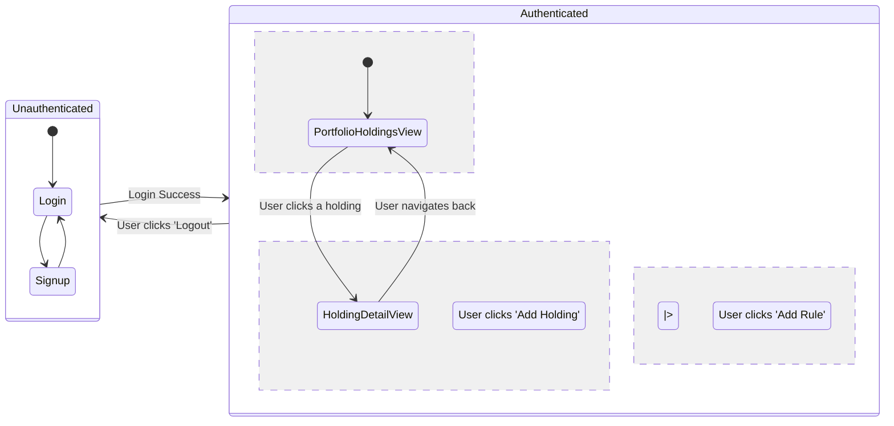
```mermaid
stateDiagram-v2
    direction LR

    state "Unauthenticated" as Unauthenticated {
        [*] --> Login
        Login --> Signup
        Signup --> Login
    }

    state "Authenticated" as Authenticated {
        [*] --> PortfolioHoldingsView
        PortfolioHoldingsView --> HoldingDetailView : User clicks a holding
        HoldingDetailView --> PortfolioHoldingsView : User navigates back

        PortfolioHoldingsView --|> AddHoldingModal : User clicks 'Add Holding'
        HoldingDetailView --|> AddRuleModal : User clicks 'Add Rule'
    }

    Unauthenticated --> Authenticated : Login Success
    Authenticated --> Unauthenticated : User clicks 'Logout'
```

### 2.2. User Interaction Flows

This section provides the detailed state machine definitions for all user journeys in the application, using the Flow DSL defined in `docs/state_machine_dsl.md`. Each flow describes how the user navigates between different views to accomplish a task.

*(This section will be populated with flow definitions.)*

### 2.3. View Specifications

This section provides a complete catalog of all the views and modals in the application. Each view is defined using the View DSL (see `docs/view_dsl.md`), which specifies its layout, components, data requirements, and the events it can dispatch.

*(This section will be populated with view definitions.)*

---

## 3. Portfolio and Cash Management

This section details the management of user portfolios. A user can create and manage multiple distinct portfolios (e.g., a "real money" portfolio and a "paper trading" portfolio). Each portfolio contains its own set of holdings, cash reserves, and tax settings, forming the foundation for rule evaluation.

### 3.1. Business Process

The management of portfolios follows the standard CRUD (Create, Retrieve, Update, Delete) operations. All operations are authenticated and authorized.

#### 3.1.1. Creation

Portfolio creation can be initiated in two ways: automatically upon user signup, or manually by the user at any time.

-   **Initial Portfolio:** Upon successful user signup, the Sentinel backend automatically creates a default portfolio for the user (e.g., named "My First Portfolio"). The ID of this new portfolio is then stored in the `defaultPortfolioId` field of the user's profile, marking it as their default. This ensures a smooth onboarding experience.

-   **Manual Creation:** After login, the user lands on the dashboard view (the Portfolio Holdings View). From here, they can create additional portfolios.
    -   The user clicks an "Add Portfolio" button, which transitions them to the "Create a Portfolio" view.
    -   In this view, the user can fill in the portfolio's details (name, description, currency, etc.).
    -   The view also contains an "Add a Holding" button. Clicking this button invokes the manual holding creation subflow (see Section 4.1.1.2, `FLOW_ADD_HOLDING_MANUAL`), allowing the user to populate the new portfolio with holdings before it's even created.
    -   A new portfolio can be saved without any holdings. Once the user saves the portfolio, they are returned to the dashboard.

-   **User-Selectable Default:** If a user has multiple portfolios, they can designate one as their "default" portfolio by updating the `defaultPortfolioId` field on their user profile. This portfolio will be the one displayed by default after login.

##### 3.1.1.1. Visual Representation
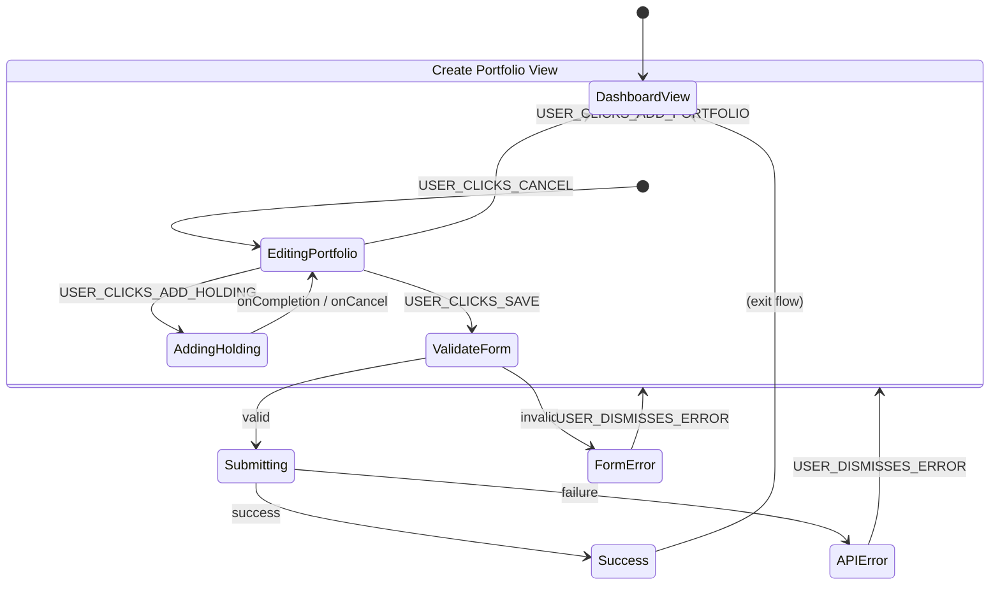
```mermaid
stateDiagram-v2
    [*] --> DashboardView
    DashboardView --> CreatePortfolioView : USER_CLICKS_ADD_PORTFOLIO

    state "Create Portfolio View" as CreatePortfolioView {
        [*] --> EditingPortfolio
        EditingPortfolio --> AddingHolding : USER_CLICKS_ADD_HOLDING
        AddingHolding --> EditingPortfolio : onCompletion / onCancel
        EditingPortfolio --> ValidateForm : USER_CLICKS_SAVE
        EditingPortfolio --> DashboardView : USER_CLICKS_CANCEL
    }

    ValidateForm --> Submitting : valid
    ValidateForm --> FormError : invalid
    Submitting --> Success : success
    Submitting --> APIError : failure

    FormError --> CreatePortfolioView : USER_DISMISSES_ERROR
    APIError --> CreatePortfolioView : USER_DISMISSES_ERROR
    Success --> DashboardView : (exit flow)
```

##### 3.1.1.2. State Machine for Manual Portfolio Creation
```yaml
flowId: FLOW_CREATE_PORTFOLIO_MANUAL
initialState: DashboardView
states:
  - name: DashboardView
    description: "The user is on the main dashboard, viewing their list of portfolios."
    events:
      USER_CLICKS_ADD_PORTFOLIO: CreatePortfolioView

  - name: CreatePortfolioView
    description: "The user is on the 'Create a Portfolio' view, with input fields for portfolio details and an 'Add Holding' button."
    initialState: EditingPortfolio
    states:
      - name: EditingPortfolio
        description: "The user is filling out the form for the new portfolio."
        events:
          USER_CLICKS_ADD_HOLDING: AddingHolding
          USER_CLICKS_SAVE: ValidateForm
          USER_CLICKS_CANCEL: DashboardView
      
      - name: AddingHolding
        description: "The user has clicked 'Add Holding' and is now in the holding creation subflow."
        subflow:
          # See section 4.1.1.2 for flow definition
          flowId: FLOW_ADD_HOLDING_MANUAL
          onCompletion: EditingPortfolio
          onCancel: EditingPortfolio

  - name: ValidateForm
    description: "The system is performing client-side validation on the form inputs."
    entryAction:
      service: "ValidationService.validate(form)"
      transitions:
        valid: Submitting
        invalid: FormError

  - name: Submitting
    description: "The system is submitting the new portfolio data to the backend."
    entryAction:
      service: "POST /api/users/me/portfolios"
      transitions:
        success: Success
        failure: APIError

  - name: Success
    description: "The portfolio was created successfully. The user is returned to the dashboard."
    exitAction:
      action: NAVIGATE_TO
      target: DashboardView

  - name: FormError
    description: "The user is shown an error message indicating which form fields are invalid."
    events:
      USER_DISMISSES_ERROR: CreatePortfolioView

  - name: APIError
    description: "The user is shown a generic error message that the portfolio could not be saved."
    events:
      USER_DISMISSES_ERROR: CreatePortfolioView
```

#### 3.1.2. Retrieval

Portfolios are retrieved and displayed in two main contexts: a summary list on the main dashboard, and a detailed view for a single portfolio.

##### 3.1.2.1. List Retrieval (Dashboard View)
Upon login, the user is presented with the Dashboard View, which lists all their portfolios. This view serves as the primary navigation hub for portfolio management. It has a "Read-Only Mode" for general viewing and a "Manage Mode" that enables CRUD operations on the portfolio list.

###### 3.1.2.1.1. Visual Representation
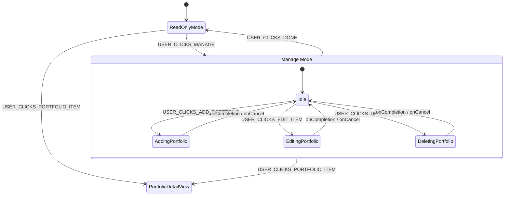
```mermaid
stateDiagram-v2
    [*] --> ReadOnlyMode
    ReadOnlyMode --> ManageMode : USER_CLICKS_MANAGE
    ManageMode --> ReadOnlyMode : USER_CLICKS_DONE

    ReadOnlyMode --> PortfolioDetailView : USER_CLICKS_PORTFOLIO_ITEM
    ManageMode --> PortfolioDetailView : USER_CLICKS_PORTFOLIO_ITEM

    state "Manage Mode" as ManageMode {
        [*] --> Idle
        Idle --> AddingPortfolio : USER_CLICKS_ADD_PORTFOLIO
        AddingPortfolio --> Idle : onCompletion / onCancel

        Idle --> EditingPortfolio : USER_CLICKS_EDIT_ITEM
        EditingPortfolio --> Idle : onCompletion / onCancel

        Idle --> DeletingPortfolio : USER_CLICKS_DELETE_ITEM
        DeletingPortfolio --> Idle : onCompletion / onCancel
    }
```

###### 3.1.2.1.2. State Machine for Portfolio List View
```yaml
flowId: FLOW_VIEW_PORTFOLIO_LIST
initialState: ReadOnlyMode
states:
  - name: ReadOnlyMode
    description: "The user is viewing a read-only list of their portfolios. A 'Manage' button is visible."
    events:
      USER_CLICKS_MANAGE: ManageMode
      USER_CLICKS_PORTFOLIO_ITEM: PortfolioDetailView

  - name: ManageMode
    description: "The user has entered manage mode. An 'Add Portfolio' button is visible, and each portfolio item shows 'Edit' and 'Delete' buttons."
    events:
      USER_CLICKS_DONE: ReadOnlyMode
      USER_CLICKS_PORTFOLIO_ITEM: PortfolioDetailView
      USER_CLICKS_ADD_PORTFOLIO: AddingPortfolio
      USER_CLICKS_EDIT_ITEM: EditingPortfolio
      USER_CLICKS_DELETE_ITEM: DeletingPortfolio

  - name: PortfolioDetailView
    description: "The user has clicked on a portfolio and is navigating to its detailed view."
    exitAction:
      action: NAVIGATE_TO
      target: VIEW_PORTFOLIO_DETAIL

  - name: AddingPortfolio
    description: "The user is invoking the portfolio creation subflow."
    subflow:
      flowId: FLOW_CREATE_PORTFOLIO_MANUAL
      onCompletion: ManageMode
      onCancel: ManageMode

  - name: EditingPortfolio
    description: "The user is invoking the portfolio update subflow."
    subflow:
      flowId: FLOW_UPDATE_PORTFOLIO_MANUAL
      onCompletion: ManageMode
      onCancel: ManageMode

  - name: DeletingPortfolio
    description: "The user is invoking the portfolio deletion subflow."
    subflow:
      flowId: FLOW_DELETE_PORTFOLIO_MANUAL
      onCompletion: ManageMode
      onCancel: ManageMode
```

##### 3.1.2.2. Single Retrieval (Portfolio Details View)
From the dashboard, a user can select a single portfolio to navigate to the Portfolio Details View. This view displays the portfolio's metadata and the list of its holdings. From here, the user can manage the portfolio's details, its holdings, or set it as their default portfolio.

###### 3.1.2.2.1. Visual Representation
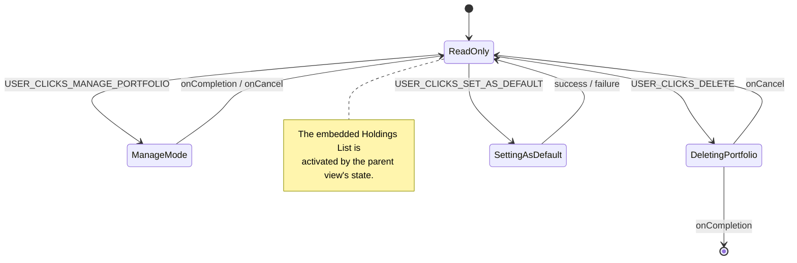
```mermaid
stateDiagram-v2
    [*] --> ReadOnly
    ReadOnly --> ManageMode : USER_CLICKS_MANAGE_PORTFOLIO
    ManageMode --> ReadOnly : onCompletion / onCancel

    ReadOnly --> DeletingPortfolio : USER_CLICKS_DELETE
    DeletingPortfolio --> ReadOnly : onCancel
    DeletingPortfolio --> [*] : onCompletion

    ReadOnly --> SettingAsDefault : USER_CLICKS_SET_AS_DEFAULT
    SettingAsDefault --> ReadOnly : success / failure

    note right of ReadOnly
      The embedded Holdings List is
      activated by the parent view's state.
    end note
```

###### 3.1.2.2.2. State Machine for Portfolio Detail View
```yaml
flowId: FLOW_VIEW_PORTFOLIO_DETAIL
initialState: ReadOnly
states:
  - name: ReadOnly
    description: "The user is viewing the portfolio's details. 'Manage', 'Delete', and 'Set as Default' buttons are visible."
    activates:
      - flowId: "FLOW_VIEW_HOLDING_LIST"
        targetState: "ReadOnlyMode"
    events:
      USER_CLICKS_MANAGE_PORTFOLIO: ManageMode
      USER_CLICKS_DELETE: DeletingPortfolio
      USER_CLICKS_SET_AS_DEFAULT: SettingAsDefault

  - name: ManageMode
    description: "The user has entered manage mode for the portfolio."
    subflow:
      # See section 3.1.3.2 for flow definition
      flowId: FLOW_UPDATE_PORTFOLIO_MANUAL
      onCompletion: ReadOnly
      onCancel: ReadOnly

  - name: DeletingPortfolio
    description: "The user has clicked the 'Delete' button for the portfolio."
    subflow:
      # See section 3.1.4.2 for flow definition
      flowId: FLOW_DELETE_PORTFOLIO_MANUAL
      onCompletion: (exit flow) # Navigates away from the now-deleted portfolio
      onCancel: ReadOnly

  - name: SettingAsDefault
    description: "The system is submitting a request to set this portfolio as the user's default."
    entryAction:
      service: "PUT /api/users/me/settings (setting new defaultPortfolioId)"
      transitions:
        success: ReadOnly # Returns to ReadOnly, UI should show a success indicator
        failure: ReadOnly # Returns to ReadOnly, UI should show an error message
```

#### 3.1.3. Update

An authenticated user can modify a specific portfolio they own. This is done from the "Portfolio Details View", which shows the portfolio's atomic fields (name, description, etc.) and the list of holdings it contains.

The view has two modes: a "Read-Only Mode" and a "Manage Mode".

-   **Read-Only Mode**: This is the default state. The user can see all the portfolio details and a read-only view of the holdings list. A "Manage Portfolio" button is displayed.
-   **Manage Mode**: Clicking the "Manage Portfolio" button puts the entire view into an editable state:
    1.  The portfolio's atomic fields (name, description, cash reserves, tax settings) become editable input fields.
    2.  The embedded "Holdings List View" simultaneously switches to its own "Manage Mode", as defined in **Section 4.1.2.1**. This makes the "Add Holding", "Edit", "Delete", and "Move" buttons visible for the holdings.
    3.  "Save" and "Cancel" buttons appear for the portfolio. Clicking "Save" will commit any changes to the portfolio's atomic fields, while "Cancel" will discard them and return the view to "Read-Only Mode". Changes made to the holdings list (e.g., adding a new holding) are handled by that component's subflow and are independent of the portfolio's "Save" action.

##### 3.1.3.1. Visual Representation

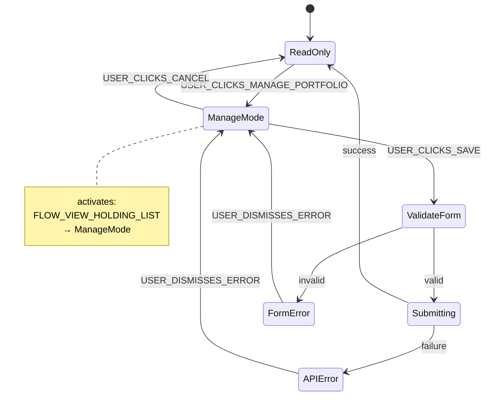
```mermaid
stateDiagram-v2
    [*] --> ReadOnly
    ReadOnly --> ManageMode : USER_CLICKS_MANAGE_PORTFOLIO
    ManageMode --> ValidateForm : USER_CLICKS_SAVE
    ManageMode --> ReadOnly : USER_CLICKS_CANCEL

    ValidateForm --> Submitting : valid
    ValidateForm --> FormError : invalid

    Submitting --> ReadOnly : success
    Submitting --> APIError : failure

    FormError --> ManageMode : USER_DISMISSES_ERROR
    APIError --> ManageMode : USER_DISMISSES_ERROR

    note right of ManageMode
      activates:<br>FLOW_VIEW_HOLDING_LIST<br>→ ManageMode
    end note
```

##### 3.1.3.2. State Machine for Manual Portfolio Update

```yaml
flowId: FLOW_UPDATE_PORTFOLIO_MANUAL
initialState: ReadOnly
states:
  - name: ReadOnly
    description: "The user is viewing the portfolio's details and its list of holdings. A 'Manage Portfolio' button is visible."
    events:
      USER_CLICKS_MANAGE_PORTFOLIO: ManageMode

  - name: ManageMode
    description: "The user has entered manage mode. The portfolio's fields are editable. 'Save' and 'Cancel' buttons are visible."
    activates:
      - flowId: "FLOW_VIEW_HOLDING_LIST"
        targetState: "ManageMode"
    events:
      USER_CLICKS_SAVE: ValidateForm
      USER_CLICKS_CANCEL: ReadOnly

  - name: ValidateForm
    description: "The system is performing client-side validation on the updated form inputs."
    entryAction:
      service: "ValidationService.validate(form)"
      transitions:
        valid: Submitting
        invalid: FormError

  - name: Submitting
    description: "The system is submitting the updated portfolio data (atomic fields only) to the backend."
    entryAction:
      service: "PUT /api/users/me/portfolios/{portfolioId}"
      transitions:
        success: ReadOnly
        failure: APIError

  - name: FormError
    description: "The user is shown an error message indicating which form fields are invalid."
    events:
      USER_DISMISSES_ERROR: ManageMode

  - name: APIError
    description: "The user is shown a generic error message that the portfolio could not be updated."
    events:
      USER_DISMISSES_ERROR: ManageMode
```

#### 3.1.4. Deletion

An authenticated user can delete an entire portfolio. This is a destructive action that also removes all associated holdings and rules. If the deleted portfolio was the user's designated default, the application will prompt the user to select a new default from their remaining portfolios, unless only one remains, in which case it will be set as the default automatically.

##### 3.1.4.1. Visual Representation
The following diagram visualizes the state machine flow for manually deleting a portfolio, including the conditional logic for handling a default portfolio.

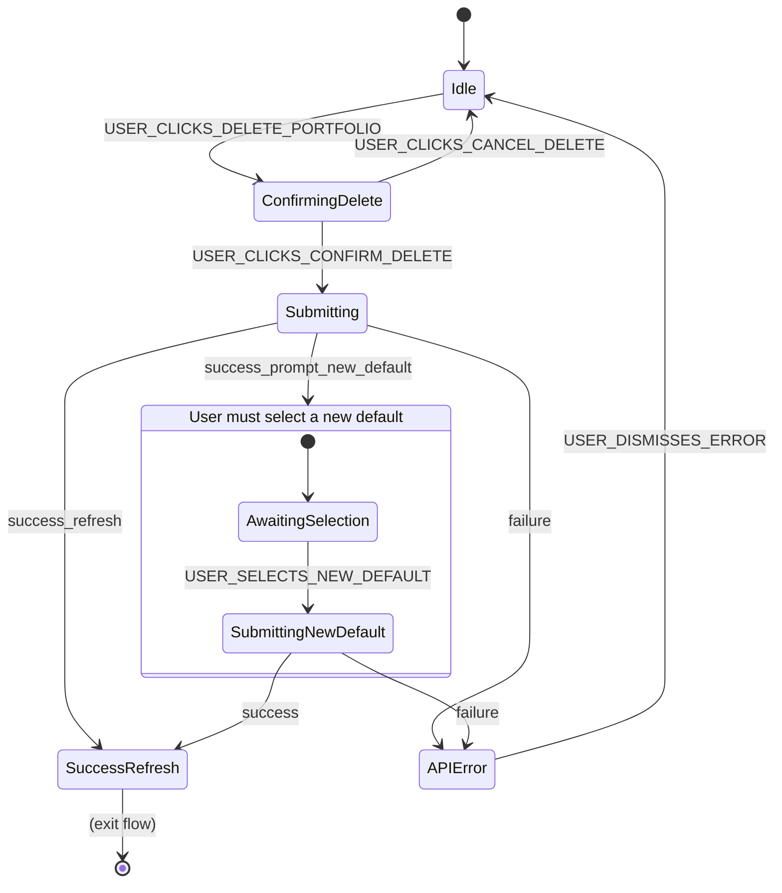
```mermaid
stateDiagram-v2
    [*] --> Idle
    Idle --> ConfirmingDelete : USER_CLICKS_DELETE_PORTFOLIO
    ConfirmingDelete --> Idle : USER_CLICKS_CANCEL_DELETE
    ConfirmingDelete --> Submitting : USER_CLICKS_CONFIRM_DELETE

    Submitting --> SuccessRefresh : success_refresh
    Submitting --> SelectingNewDefault : success_prompt_new_default
    Submitting --> APIError : failure

    state "User must select a new default" as SelectingNewDefault {
        [*] --> AwaitingSelection
        AwaitingSelection --> SubmittingNewDefault : USER_SELECTS_NEW_DEFAULT
    }

    SubmittingNewDefault --> SuccessRefresh : success
    SubmittingNewDefault --> APIError : failure

    APIError --> Idle : USER_DISMISSES_ERROR
    SuccessRefresh --> [*] : (exit flow)
```

##### 3.1.4.2. State Machine for Manual Portfolio Deletion
```yaml
flowId: FLOW_DELETE_PORTFOLIO_MANUAL
initialState: Idle
states:
  - name: Idle
    description: "The user is viewing the details of a specific portfolio or the list of portfolios."
    events:
      USER_CLICKS_DELETE_PORTFOLIO: ConfirmingDelete

  - name: ConfirmingDelete
    description: "A modal or confirmation dialog appears, asking the user to confirm the deletion of the selected portfolio."
    events:
      USER_CLICKS_CONFIRM_DELETE: Submitting
      USER_CLICKS_CANCEL_DELETE: Idle

  - name: Submitting
    description: "The system is submitting the delete request to the backend."
    entryAction:
      service: "DELETE /api/users/me/portfolios/{portfolioId}"
      transitions:
        success_refresh: SuccessRefresh
        success_prompt_new_default: SelectingNewDefault
        failure: APIError

  - name: SelectingNewDefault
    description: "The user is prompted to select a new default portfolio from a list of their remaining portfolios."
    events:
      USER_SELECTS_NEW_DEFAULT: SubmittingNewDefault

  - name: SubmittingNewDefault
    description: "The system is submitting the user's choice for the new default portfolio."
    entryAction:
      service: "PUT /api/users/me/settings (setting new defaultPortfolioId)"
      transitions:
        success: SuccessRefresh
        failure: APIError # Or could return to SelectingNewDefault with an error

  - name: SuccessRefresh
    description: "The operation was successful. The view will now be refreshed."
    exitAction:
      action: REFRESH_VIEW
      target: VIEW_DASHBOARD

  - name: APIError
    description: "The user is shown a generic error message that the operation could not be completed."
    events:
      USER_DISMISSES_ERROR: Idle
```

#### 3.1.5. Unified Transaction Import

This feature allows an authenticated user to upload a file (e.g., a CSV from their broker) to bulk-import transactions into a specific portfolio. The system uses an AI-powered service to parse the file, then intelligently annotates each discovered transaction as either a `CREATE` (for a new holding) or an `UPDATE` (for an existing holding). The user is then presented with this annotated list for review and correction before confirming the import.

##### 3.1.5.1. Visual Representation

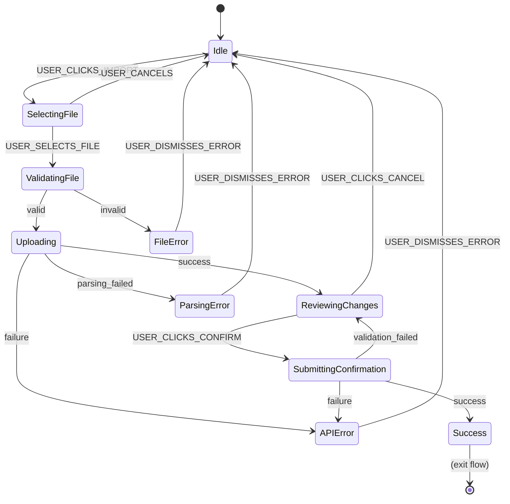
```mermaid
stateDiagram-v2
    [*] --> Idle
    Idle --> SelectingFile : USER_CLICKS_IMPORT
    SelectingFile --> Idle : USER_CANCELS
    SelectingFile --> ValidatingFile : USER_SELECTS_FILE

    ValidatingFile --> Uploading : valid
    ValidatingFile --> FileError : invalid

    Uploading --> ReviewingChanges : success
    Uploading --> ParsingError : parsing_failed
    Uploading --> APIError : failure

    ReviewingChanges --> SubmittingConfirmation : USER_CLICKS_CONFIRM
    ReviewingChanges --> Idle : USER_CLICKS_CANCEL

    SubmittingConfirmation --> Success : success
    SubmittingConfirmation --> ReviewingChanges : validation_failed
    SubmittingConfirmation --> APIError : failure

    FileError --> Idle : USER_DISMISSES_ERROR
    ParsingError --> Idle : USER_DISMISSES_ERROR
    APIError --> Idle : USER_DISMISSES_ERROR
    Success --> [*] : (exit flow)
```

##### 3.1.5.2. State Machine for Unified Transaction Import

```yaml
flowId: FLOW_IMPORT_TRANSACTIONS
initialState: Idle
states:
  - name: Idle
    description: "The user is in a view where they can initiate a transaction import for a portfolio."
    events:
      USER_CLICKS_IMPORT: SelectingFile

  - name: SelectingFile
    description: "The user is prompted by the system to select a transaction file from their local device."
    events:
      USER_SELECTS_FILE: ValidatingFile
      USER_CANCELS: Idle

  - name: ValidatingFile
    description: "The system performs client-side validation on the selected file (e.g., checking file type and size)."
    entryAction:
      service: "FileValidationService.validate(file)"
      transitions:
        valid: Uploading
        invalid: FileError

  - name: Uploading
    description: "The file is being uploaded to the backend, which then parses and annotates the transactions. The UI shows a loading indicator."
    entryAction:
      service: "POST /api/users/me/portfolios/{portfolioId}/transactions/import"
      transitions:
        success: ReviewingChanges
        parsing_failed: ParsingError
        failure: APIError

  - name: ReviewingChanges
    description: "The user is shown the parsed and annotated list of transactions. They can review, correct, and approve the changes."
    events:
      USER_CLICKS_CONFIRM: SubmittingConfirmation
      USER_CLICKS_CANCEL: Idle

  - name: SubmittingConfirmation
    description: "The system is submitting the user-reviewed and confirmed transaction data to the backend."
    entryAction:
      service: "POST /api/users/me/portfolios/{portfolioId}/transactions/import/confirm"
      transitions:
        success: Success
        validation_failed: ReviewingChanges # Returns to review with error messages
        failure: APIError

  - name: Success
    description: "The import was successful and the portfolio has been updated."
    exitAction:
      action: REFRESH_VIEW
      target: VIEW_PORTFOLIO_HOLDINGS

  - name: FileError
    description: "The user is shown an error message indicating the selected file is invalid."
    events:
      USER_DISMISSES_ERROR: Idle

  - name: ParsingError
    description: "The user is shown an error message indicating the file could not be automatically parsed."
    events:
      USER_DISMISSES_ERROR: Idle

  - name: APIError
    description: "The user is shown a generic error message that the operation could not be completed."
    events:
      USER_DISMISSES_ERROR: Idle
``` 

### 3.2. Portfolio and Cash Data Model

#### 3.2.1. Stored Data Models

- **`Portfolio` (Firestore Document):**
  - `portfolioId`: String (Unique UUID, the document ID).
  - `userId`: String (Firebase Auth UID, links the portfolio to its owner).
  - `name`: String (User-defined, e.g., "My Real Portfolio", "Tech Speculation").
  - `description`: String (Optional, user-defined description for the portfolio).
  - `defaultCurrency`: Enum (`EUR`, `USD`, `GBP`, default: `EUR`).
  - `cashReserve`: Object containing:
    - `totalAmount`: Number (in `defaultCurrency`).
    - `warChestAmount`: Number (in `defaultCurrency`, portion for opportunistic buying).
  - `taxSettings`: Object containing:
    - `capitalGainTaxRate`: Number (percentage, e.g., 26.4).
    - `taxFreeAllowance`: Number (in the portfolio's `defaultCurrency`, e.g., 1000).
  - `createdAt`: ISODateTime.
  - `modifiedAt`: ISODateTime.

#### 3.2.2. Computed Data Models

The information in this section is calculated on-the-fly by the backend API and embedded into the main data object (`Portfolio`) in the API response. It is not stored in the database.

- **`ComputedInfoPortfolio` (Object embedded in `Portfolio`):**
  - `totalCost`: Number (in the portfolio's `defaultCurrency`).
  - `currentValue`: Number (in the portfolio's `defaultCurrency`).
  - `preTaxGainLoss`: Number (in the portfolio's `defaultCurrency`).
  - `afterTaxGainLoss`: Number (in the portfolio's `defaultCurrency`).
  - `gainLossPercentage`: Number (%).

### 3.3. Portfolio and Cash Rules

#### 3.3.1. P_1000: Portfolio Creation

- **Sequence Diagram for Portfolio Creation**

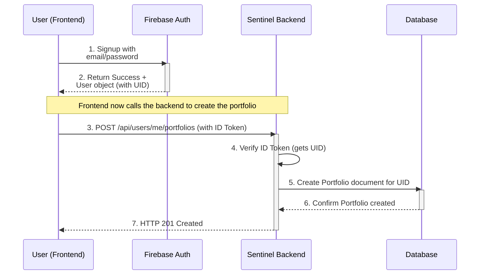
```mermaid
sequenceDiagram
    participant User as User (Frontend)
    participant Firebase as Firebase Auth
    participant Sentinel as Sentinel Backend
    participant DB as Database

    User->>Firebase: 1. Signup with<br> email/password
    activate Firebase
    Firebase-->>User: 2. Return Success +<br> User object (with UID)
    deactivate Firebase

    Note over User, Sentinel: Frontend now calls the backend to create the portfolio
    
    User->>Sentinel: 3. POST /api/users/me/portfolios (with ID Token)
    activate Sentinel
    Sentinel->>Sentinel: 4. Verify ID Token (gets UID)
    Sentinel->>DB: 5. Create Portfolio document for UID
    activate DB
    DB-->>Sentinel: 6. Confirm Portfolio created
    deactivate DB
    Sentinel-->>User: 7. HTTP 201 Created
    deactivate Sentinel
```
- **Description**: Creates a new portfolio for the authenticated user. A default portfolio is created automatically on signup; this rule also covers user-initiated creation of additional portfolios. When a portfolio is created, a `defaultCurrency` is assigned (defaulting to EUR if not specified).
- **Examples**:
    - **Example**: A user wants to start a new "Paper Trading" portfolio with USD as its base currency. She specifies the name and currency of the portfolio. A new portfolio document is created in Firestore, linked to their `userId`.
- **Success Response**: A new `Portfolio` document is created in Firestore.
- **Sub-Rules**:

| Rule ID | Rule Name | Condition | Check Point | Success Outcome | Message Keys |
|:---|:---|:---|:---|:---|:---|
| P_I_1001 | Creation succeeds | User is authenticated, portfolio name is valid and unique for the user. | Response Sentinel to User | New portfolio created. | P_I_1001 |
| P_I_1002 | Idempotency key is replayed | `Idempotency-Key` matches a previous successful creation request. | Request User to Sentinel | The response from the original successful request is returned; no new portfolio is created. | N/A |
| P_E_1101 | User unauthorized | User is not authenticated. | Request User to Sentinel | Creation rejected. | P_E_1101 |
| P_E_1102 | Name missing or invalid | Portfolio name is empty or too long. | Request User to Sentinel | Creation rejected. | P_E_1102 |
| P_E_1103 | Name not unique | User already has a portfolio with the same name. | Sentinel internal | Creation rejected. | P_E_1103 |
| P_E_1104 | Invalid default currency | The `defaultCurrency` provided is not one of the supported values (EUR, USD, GBP). | Request User to Sentinel | Creation rejected. | P_E_1104 |
| P_E_1105 | Idempotency key missing/invalid | `Idempotency-Key` header is missing or not a valid UUID. | Request User to Sentinel | Creation rejected. | P_E_1105 |

**Messages**:

- **P_I_1001**: "Portfolio '{name}' created successfully with ID {portfolioId}."
- **P_E_1101**: "User is not authenticated."
- **P_E_1102**: "Portfolio name is invalid."
- **P_E_1103**: "A portfolio with the name '{name}' already exists."
- **P_E_1104**: "Invalid default currency. Must be one of: EUR, USD, GBP."
- **P_E_1105**: "A valid Idempotency-Key header is required for this operation."

#### 3.3.2. Portfolio Retrieval

##### 3.3.2.1. P_2000: Single Portfolio Retrieval

- **Sequence Diagram for Single Portfolio Retrieval**

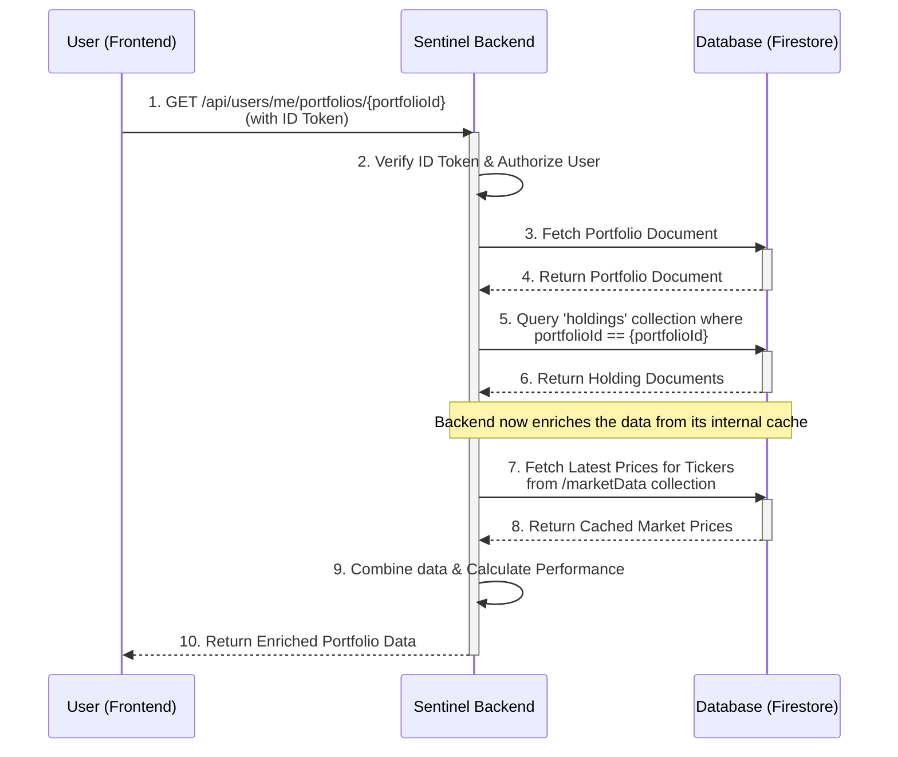
```mermaid
sequenceDiagram
    participant User as User (Frontend)
    participant Sentinel as Sentinel Backend
    participant DB as Database (Firestore)

    User->>Sentinel: 1. GET /api/users/me/portfolios/{portfolioId}<br> (with ID Token)
    activate Sentinel
    Sentinel->>Sentinel: 2. Verify ID Token & Authorize User
    Sentinel->>DB: 3. Fetch Portfolio Document
    activate DB
    DB-->>Sentinel: 4. Return Portfolio Document
    deactivate DB

    Sentinel->>DB: 5. Query 'holdings' collection where<br> portfolioId == {portfolioId}
    activate DB
    DB-->>Sentinel: 6. Return Holding Documents
    deactivate DB

    Note over Sentinel, DB: Backend now enriches the data from its internal cache
    Sentinel->>DB: 7. Fetch Latest Prices for Tickers<br> from /marketData collection
    activate DB
    DB-->>Sentinel: 8. Return Cached Market Prices
    deactivate DB

    Sentinel->>Sentinel: 9. Combine data & Calculate Performance
    Sentinel-->>User: 10. Return Enriched Portfolio Data
    deactivate Sentinel
```
- **Description**: Retrieves the full, detailed content of a single portfolio for the authenticated user. The backend first fetches the `Portfolio` document, then queries the `holdings` collection to find all associated holdings. The combined data is enriched by reading from the internal `marketData` cache to calculate performance metrics (e.g., percentage gain) and tax information.
- **Examples**:
    - **Example**:
        - A user, who owns a portfolio containing two holdings (10 shares of "VOO" and 5 shares of "AAPL"), requests the details of that specific portfolio.
        - The backend returns the complete portfolio object. This response is enriched at multiple levels:
            - **Each `Lot`** has its `ComputedInfo` with tax calculations based on the latest market price from the internal cache.
            - The **`Holding` for "VOO"** is enriched with its aggregated `ComputedInfo`: `{ totalCost: 4000, currentValue: 4500, preTaxGainLoss: 500, gainLossPercentage: 12.5 }`.
            - The **`Holding` for "AAPL"** is enriched with its aggregated `ComputedInfo`: `{ totalCost: 750, currentValue: 900, preTaxGainLoss: 150, gainLossPercentage: 20.0 }`.
            - The top-level **`Portfolio`** object is enriched with the overall aggregated `ComputedInfo`: `{ totalCost: 4750, currentValue: 5400, preTaxGainLoss: 650, gainLossPercentage: 13.68 }`.
- **Success Response**: The user's complete, enriched `Portfolio` data is returned.
- **Sub-Rules**:

| Rule ID | Rule Name | Condition | Check Point | Success Outcome | Message Keys |
|:---|:---|:---|:---|:---|:---|
| P_I_2001 | Single retrieval succeeds | Portfolio exists and the authenticated user is the owner. | Response Sentinel to User | Full, enriched portfolio data is returned. | P_I_2001 |
| P_E_2101 | User unauthorized | User is not authenticated or is not the owner of the requested portfolio. | Request User to Sentinel | Retrieval rejected with HTTP 401/403. | P_E_2101 |
| P_E_2102 | Portfolio not found | The specified `portfolioId` does not exist. | Sentinel internal | Retrieval rejected with HTTP 404 Not Found. | P_E_2102 |

**Messages**:
- **P_I_2001**: "Portfolio {portfolioId} retrieved successfully."
- **P_E_2101**: "User is not authorized to access portfolio {portfolioId}."
- **P_E_2102**: "Portfolio with ID {portfolioId} not found."

##### 3.3.2.2. P_2200: Portfolio List Retrieval

- **Sequence Diagram for Portfolio List Retrieval**

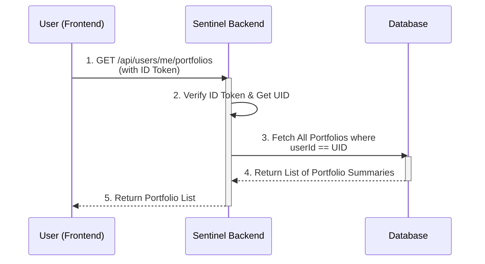
```mermaid
sequenceDiagram
    participant User as User (Frontend)
    participant Sentinel as Sentinel Backend
    participant DB as Database

    User->>Sentinel: 1. GET /api/users/me/portfolios<br> (with ID Token)
    activate Sentinel
    Sentinel->>Sentinel: 2. Verify ID Token & Get UID
    Sentinel->>DB: 3. Fetch All Portfolios where<br> userId == UID
    activate DB
    DB-->>Sentinel: 4. Return List of Portfolio Summaries
    deactivate DB
    Sentinel-->>User: 5. Return Portfolio List
    deactivate Sentinel
```
- **Description**: Retrieves a summary list of all portfolios owned by the authenticated user. The data for each portfolio in the list is a summary and does not contain the full, enriched holdings details.
- **Examples**:
    - **Example**: A user who owns three portfolios ("Real Money", "Paper Trading", "Crypto") requests their list of portfolios.
    - The backend returns a list of three objects, each containing the `portfolioId`, `name`, and perhaps a summary `currentValue`.
- **Success Response**: A list of all portfolios owned by the user is returned. The list may be empty if the user has not created any portfolios besides the default.
- **Sub-Rules**:

| Rule ID | Rule Name | Condition | Check Point | Success Outcome | Message Keys |
|:---|:---|:---|:---|:---|:---|
| P_I_2201 | List retrieval succeeds | User is authenticated. | Response Sentinel to User | A list of the user's portfolios is returned. | P_I_2201 |
| P_E_2301 | User unauthorized | User is not authenticated. | Request User to Sentinel | Retrieval rejected with HTTP 401 Unauthorized. | P_E_2301 |

**Messages**:
- **P_I_2201**: "Portfolio list retrieved successfully for user {userId}."
- **P_E_2301**: "User is not authenticated."

#### 3.3.3. Portfolio Update

##### 3.3.3.1. P_3000: Portfolio Update (Manual)

- **Sequence Diagram for Portfolio Update (Manual)**

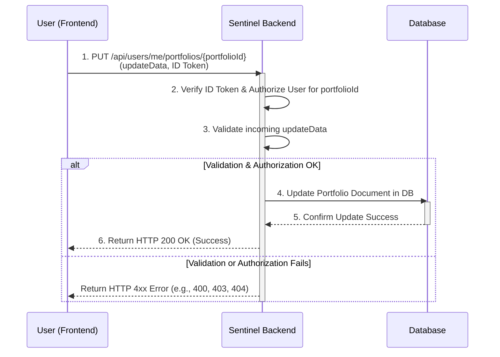
```mermaid
sequenceDiagram
    participant User as User (Frontend)
    participant Sentinel as Sentinel Backend
    participant DB as Database

    User->>Sentinel: 1. PUT /api/users/me/portfolios/{portfolioId}<br> (updateData, ID Token)
    activate Sentinel
    Sentinel->>Sentinel: 2. Verify ID Token & Authorize User for portfolioId
    Sentinel->>Sentinel: 3. Validate incoming updateData
    
    alt Validation & Authorization OK
        Sentinel->>DB: 4. Update Portfolio Document in DB
        activate DB
        DB-->>Sentinel: 5. Confirm Update Success
        deactivate DB
        Sentinel-->>User: 6. Return HTTP 200 OK (Success)
    else Validation or Authorization Fails
        Sentinel-->>User: Return HTTP 4xx Error (e.g., 400, 403, 404)
    end
    deactivate Sentinel
```

- **Description**: Updates a specific portfolio's settings (like name, description, or `defaultCurrency`), cash reserves, or tax settings. The target portfolio is identified by its `portfolioId`.
- **Success Response**: The specified `Portfolio` document is updated in Firestore with the new data and a new `modifiedAt` timestamp.
- **Sub-Rules**:

| Rule ID | Rule Name | Condition | Check Point | Success Outcome | Message Keys |
|:---|:---|:---|:---|:---|:---|
| P_I_3001 | Update succeeds | All provided data is valid, user is authenticated and owns the specified portfolio. | Response Sentinel to User | The specified portfolio is updated. | P_I_3001 |
| P_I_3002 | Idempotency key is replayed | `Idempotency-Key` matches a previous successful update request. | Request User to Sentinel | The response from the original successful request is returned; no new update is performed. | N/A |
| P_E_3101 | User unauthorized | User is not authenticated or the UID from the token does not own the specified portfolio. | Request User to Sentinel | Update rejected with HTTP 403 Forbidden. | P_E_3101 |
| P_E_3102 | Portfolio not found | The specified `portfolioId` does not exist. | Request User to Sentinel | Update rejected with HTTP 404 Not Found. | P_E_3102 |
| P_E_3103 | Invalid cash amounts | `totalAmount` or `warChestAmount` are negative, or `warChestAmount` > `totalAmount`. | Request User to Sentinel | Update rejected with HTTP 400 Bad Request. | P_E_3103 |
| P_E_3104 | Invalid portfolio settings | `capitalGainTaxRate` is not between 0-100, `taxFreeAllowance` is negative, portfolio `name` or `description` is invalid, or `defaultCurrency` is invalid. | Request User to Sentinel | Update rejected with HTTP 400 Bad Request. | P_E_3104 |
| P_E_3105 | Idempotency key missing/invalid | `Idempotency-Key` header is missing or not a valid UUID. | Request User to Sentinel | Update rejected. | P_E_3105 |

**Messages**:
- **P_I_3001**: "Portfolio {portfolioId} updated successfully."
- **P_E_3101**: "User is not authorized to modify portfolio {portfolioId}."
- **P_E_3102**: "Portfolio with ID {portfolioId} not found."
- **P_E_3103**: "Cash amounts are invalid. Ensure amounts are non-negative and war chest does not exceed total."
- **P_E_3104**: "Portfolio name, description, currency, or tax settings are invalid."
- **P_E_3105**: "A valid Idempotency-Key header is required for this operation."

##### 3.3.3.2. P_3400: Set Default Portfolio

- **Sequence Diagram for Setting Default Portfolio**

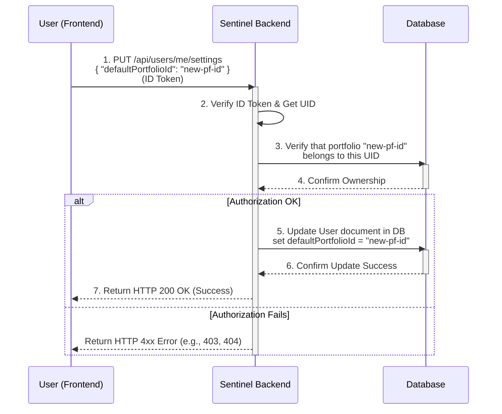
```mermaid
sequenceDiagram
    participant User as User (Frontend)
    participant Sentinel as Sentinel Backend
    participant DB as Database

    User->>Sentinel: 1. PUT /api/users/me/settings <br> { "defaultPortfolioId": "new-pf-id" } <br> (ID Token)
    activate Sentinel
    Sentinel->>Sentinel: 2. Verify ID Token & Get UID
    Sentinel->>DB: 3. Verify that portfolio "new-pf-id" <br> belongs to this UID
    activate DB
    DB-->>Sentinel: 4. Confirm Ownership
    deactivate DB
    
    alt Authorization OK
        Sentinel->>DB: 5. Update User document in DB <br> set defaultPortfolioId = "new-pf-id"
        activate DB
        DB-->>Sentinel: 6. Confirm Update Success
        deactivate DB
        Sentinel-->>User: 7. Return HTTP 200 OK (Success)
    else Authorization Fails
        Sentinel-->>User: Return HTTP 4xx Error (e.g., 403, 404)
    end
    deactivate Sentinel
```

- **Description**: Designates a specific portfolio as the user's default by updating the `defaultPortfolioId` field on the user's document in the `users` collection.
- **Examples**:
    - **Example**:
        - A user has two portfolios: "Real Money" and "Paper Trading".
        - They decide to make "Paper Trading" their new default.
        - The user sends a request to update their user settings, providing the `portfolioId` of the "Paper Trading" portfolio.
        - The backend verifies the user owns that portfolio and then updates the `defaultPortfolioId` field on their user document.
- **Success Response**: The user's `defaultPortfolioId` is updated.
- **Sub-Rules**:

| Rule ID | Rule Name | Condition | Check Point | Success Outcome | Message Keys |
|:---|:---|:---|:---|:---|:---|
| P_I_3401 | Set default succeeds | User is authenticated, owns the portfolio, and the portfolio exists. | Response Sentinel to User | The user's `defaultPortfolioId` is updated. | P_I_3401 |
| P_E_3501 | User unauthorized | User is not authenticated or does not own the specified portfolio. | Request User to Sentinel | Request rejected with HTTP 403 Forbidden. | P_E_3501 |
| P_E_3502 | Portfolio not found | The specified `portfolioId` does not exist. | Request User to Sentinel | Request rejected with HTTP 404 Not Found. | P_E_3502 |

**Messages**:
- **P_I_3401**: "Default portfolio updated successfully."
- **P_E_3501**: "User is not authorized to set this portfolio as default."
- **P_E_3502**: "Portfolio with the specified ID not found."

#### 3.3.4. Portfolio Deletion

##### 3.3.4.1. P_4000: Portfolio Deletion (Entire Portfolio)

- **Sequence Diagram for Portfolio Deletion (Entire Portfolio)**

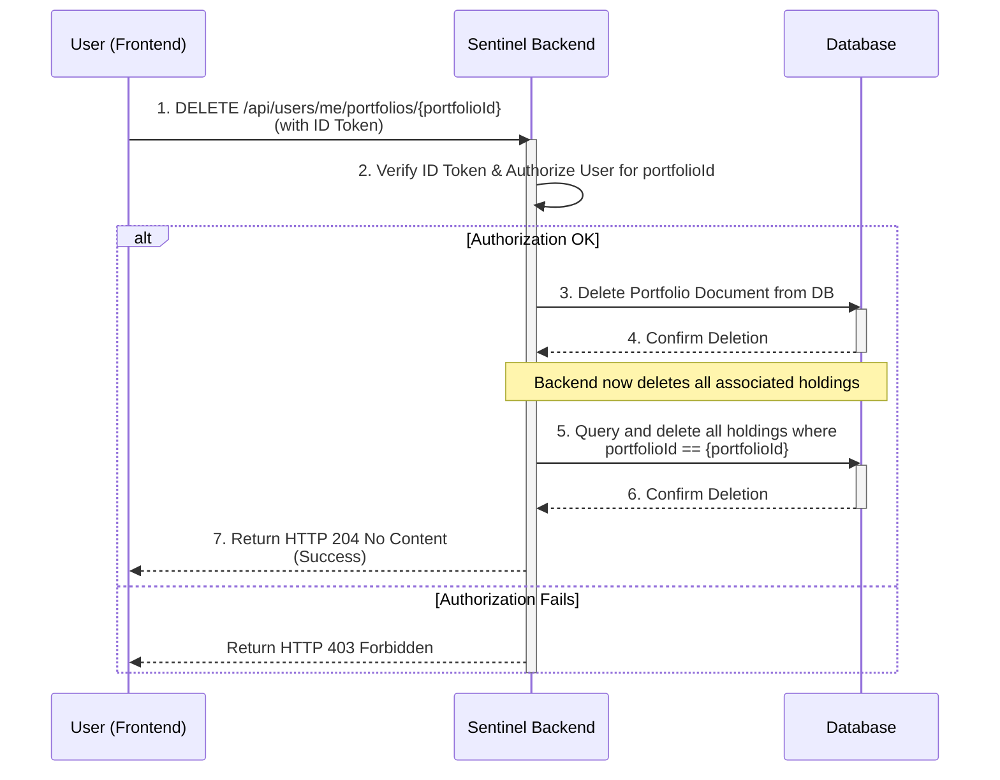
```mermaid
sequenceDiagram
    participant User as User (Frontend)
    participant Sentinel as Sentinel Backend
    participant DB as Database

    User->>Sentinel: 1. DELETE /api/users/me/portfolios/{portfolioId}<br> (with ID Token)
    activate Sentinel
    Sentinel->>Sentinel: 2. Verify ID Token & Authorize User for portfolioId
    
    alt Authorization OK
        Sentinel->>DB: 3. Delete Portfolio Document from DB
        activate DB
        DB-->>Sentinel: 4. Confirm Deletion
        deactivate DB

        Note over Sentinel, DB: Backend now deletes all associated holdings
        Sentinel->>DB: 5. Query and delete all holdings where<br> portfolioId == {portfolioId}
        activate DB
        DB-->>Sentinel: 6. Confirm Deletion
        deactivate DB

        Sentinel-->>User: 7. Return HTTP 204 No Content<br> (Success)
    else Authorization Fails
        Sentinel-->>User: Return HTTP 403 Forbidden
    end
    deactivate Sentinel
``` 

- **Description**: Deletes an entire portfolio and all of its associated holdings and data. This is a destructive and irreversible action. The backend first deletes the portfolio document, then deletes all `Holding` documents that were linked to it. If the deleted portfolio was the user's default, the system handles the default designation as follows:
    - If, after deletion, only one portfolio remains, that portfolio is automatically set as the new default.
    - If more than one portfolio remains, the application prompts the user to designate a new default.
- **Examples**:
    - **Example 1 (Auto-set new default)**:
        - A user has two portfolios: "Default A" (the default) and "Side B".
        - They delete "Default A".
        - The backend deletes the portfolio and, seeing only one portfolio remains, automatically designates "Side B" as the new default.
    - **Example 2 (Prompt for new default)**:
        - A user has three portfolios: "Default A" (the default), "Side B", and "Side C".
        - They delete "Default A".
        - The backend deletes the portfolio. The application then prompts the user to select either "Side B" or "Side C" as the new default.
- **Success Response**: The specified `Portfolio` document and all its associated `Holding` documents are deleted from Firestore.
- **Sub-Rules**:

| Rule ID | Rule Name | Condition | Check Point | Success Outcome | Message Keys |
|:---|:---|:---|:---|:---|:---|
| P_I_4001 | Portfolio deletion succeeds | User is authenticated and owns the specified portfolio. | Response Sentinel to User | Portfolio and its holdings successfully deleted. | P_I_4001 |
| P_I_4002 | Idempotency key is replayed | `Idempotency-Key` matches a previous successful deletion request. | Request User to Sentinel | The response from the original successful request is returned; no new deletion is performed. | N/A |
| P_I_4003 | Default deleted (auto-set) | The deleted portfolio was the default, and exactly one portfolio remains. | Response Sentinel to User | The remaining portfolio is automatically set as the new default. | P_I_4003 |
| P_I_4004 | Default deleted (prompt) | The deleted portfolio was the default, and more than one portfolio remains. | Response Sentinel to User | The user is prompted to select a new default portfolio. | P_I_4004 |
| P_E_4101 | User unauthorized | User is not authenticated or does not own the portfolio. | Request User to Sentinel | Deletion rejected with HTTP 403 Forbidden. | P_E_4101 |
| P_E_4102 | Portfolio not found | The specified `portfolioId` does not exist. | Sentinel internal | Deletion rejected with HTTP 404 Not Found. | P_E_4102 |
| P_E_4103 | Idempotency key missing/invalid | `Idempotency-Key` header is missing or not a valid UUID. | Request User to Sentinel | Deletion rejected. | P_E_4103 |

**Messages**:
- **P_I_4001**: "Portfolio {portfolioId} was successfully deleted."
- **P_I_4003**: "Default portfolio deleted. '{newDefaultPortfolioName}' has been automatically set as your new default."
- **P_I_4004**: "Default portfolio deleted. Please select a new default portfolio."
- **P_E_4101**: "User is not authorized to delete portfolio {portfolioId}."
- **P_E_4102**: "Portfolio with ID {portfolioId} not found."
- **P_E_4103**: "A valid Idempotency-Key header is required for this operation."

#### 3.3.5. P_5000: Unified Transaction Import

- **Sequence Diagram for Unified Transaction Import**

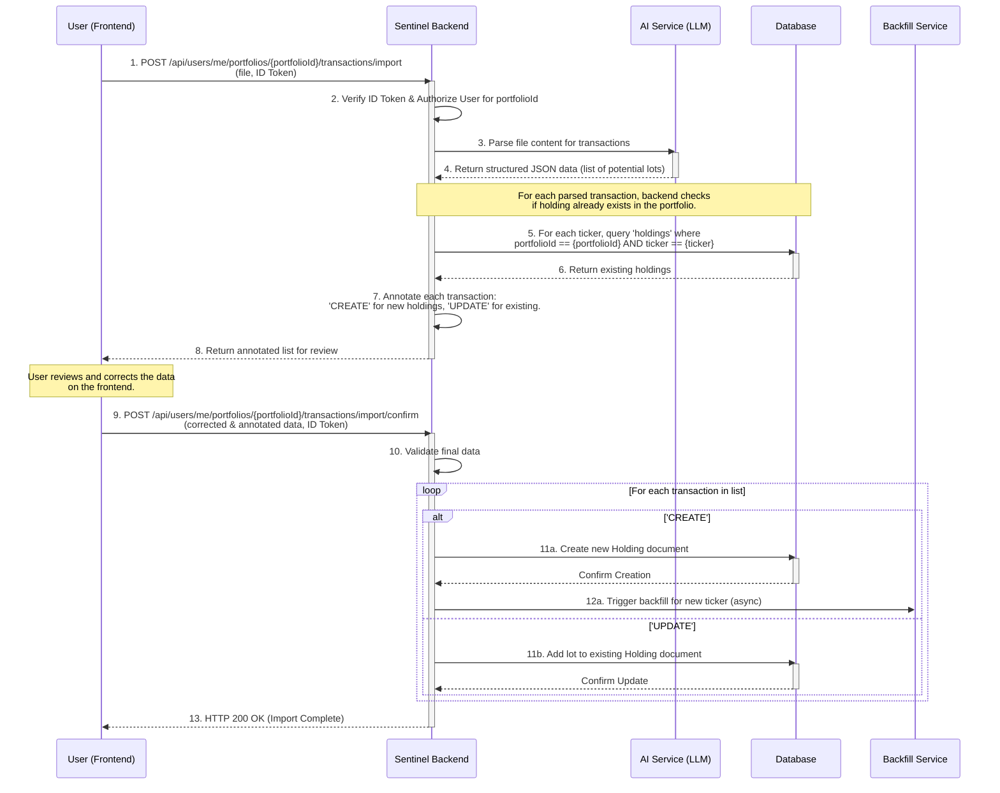
```mermaid
sequenceDiagram
    participant User as User (Frontend)
    participant Sentinel as Sentinel Backend
    participant AI as AI Service (LLM)
    participant DB as Database
    participant Backfill as Backfill Service

    User->>Sentinel: 1. POST /api/users/me/portfolios/{portfolioId}/transactions/import<br>(file, ID Token)
    activate Sentinel
    Sentinel->>Sentinel: 2. Verify ID Token & Authorize User for portfolioId
    Sentinel->>AI: 3. Parse file content for transactions
    activate AI
    AI-->>Sentinel: 4. Return structured JSON data (list of potential lots)
    deactivate AI

    Note over Sentinel, DB: For each parsed transaction, backend checks<br>if holding already exists in the portfolio.

    Sentinel->>DB: 5. For each ticker, query 'holdings' where<br> portfolioId == {portfolioId} AND ticker == {ticker}
    activate DB
    DB-->>Sentinel: 6. Return existing holdings
    deactivate DB

    Sentinel->>Sentinel: 7. Annotate each transaction:<br> 'CREATE' for new holdings, 'UPDATE' for existing.
    Sentinel-->>User: 8. Return annotated list for review
    deactivate Sentinel

    Note over User: User reviews and corrects the data<br> on the frontend.

    User->>Sentinel: 9. POST /api/users/me/portfolios/{portfolioId}/transactions/import/confirm<br> (corrected & annotated data, ID Token)
    activate Sentinel
    Sentinel->>Sentinel: 10. Validate final data
    
    loop For each transaction in list
        alt 'CREATE'
            Sentinel->>DB: 11a. Create new Holding document
            activate DB
            DB-->>Sentinel: Confirm Creation
            deactivate DB
            Sentinel->>Backfill: 12a. Trigger backfill for new ticker (async)
        else 'UPDATE'
            Sentinel->>DB: 11b. Add lot to existing Holding document
            activate DB
            DB-->>Sentinel: Confirm Update
            deactivate DB
        end
    end

    Sentinel-->>User: 13. HTTP 200 OK (Import Complete)
    deactivate Sentinel
```

- **Description**: Handles the unified, multi-step process of importing transactions from a user-uploaded file into a specific portfolio. The system intelligently determines whether each transaction should create a new holding or be added as a new lot to an existing holding.
- **Examples**:
    - **Example**:
        - A user uploads a CSV file to their "Real Money" portfolio. The file contains a purchase of "AAPL" (which they already own) and "GOOG" (which is new).
        - The backend calls the AI service, which parses both transactions.
        - The backend checks the portfolio and sees a holding for "AAPL" exists, but not for "GOOG".
        - It returns an annotated list to the frontend: `[{...data for AAPL, action: 'UPDATE'}, {...data for GOOG, action: 'CREATE'}]`.
        - The user reviews the list, confirms it's correct, and submits.
        - The backend adds a new lot to the existing "AAPL" holding and creates a brand new holding for "GOOG" with its first lot. The backfill process is triggered for "GOOG".
- **Success Response**: New `Holding` documents are created and/or existing ones are updated with new lots in the `holdings` collection.
- **Sub-Rules**:

| Rule ID | Rule Name | Condition | Check Point | Success Outcome | Message Keys |
|:---|:---|:---|:---|:---|:---|
| P_I_5001 | File upload succeeds | User is authenticated and owns the target portfolio, file is valid. | Request User to Sentinel | File is accepted for parsing. | P_I_5001 |
| P_I_5002 | AI parsing and annotation succeeds | The AI service successfully extracts structured transaction data, and the backend correctly annotates each transaction as 'CREATE' or 'UPDATE'. | Sentinel to AI Service & DB | Parsed and annotated JSON data is returned to the user for review. | P_I_5002 |
| P_I_5003 | Import confirmation succeeds | User submits reviewed data, data is valid, and is successfully used to create/update holdings and lots. | Request User to Sentinel | Holdings/lots are created/updated in the database. Any new tickers will trigger the asynchronous backfill process (H_5000). | P_I_5003 |
| P_I_5004 | Idempotency key is replayed | `Idempotency-Key` matches a previous successful confirmation request. | Request User to Sentinel | The response from the original successful request is returned; no new import is performed. | N/A |
| P_E_5101 | User unauthorized | User is not authenticated or does not own the target portfolio. | Request User to Sentinel | Request rejected with HTTP 401/403. | P_E_5101 |
| P_E_5102 | Invalid file type or size | File is not a supported type or exceeds the maximum size limit. | Request User to Sentinel | Upload rejected with HTTP 400 Bad Request. | P_E_5102 |
| P_E_5103 | AI parsing fails | The AI service cannot parse the file or returns an error. | Sentinel to AI Service | Error is returned to the user. | P_E_5103 |
| P_E_5104 | Confirmed data invalid | The data submitted by the user after review fails validation (e.g., invalid ticker, negative quantity). | Request User to Sentinel | Confirmation rejected with HTTP 400 Bad Request. | P_E_5104 |
| P_E_5105 | Idempotency key missing/invalid | `Idempotency-Key` header is missing or not a valid UUID for the confirmation step. | Request User to Sentinel | Confirmation rejected. | P_E_5105 |

**Messages**:
- **P_I_5001**: "File uploaded successfully for portfolio {portfolioId}. Parsing and processing in progress..."
- **P_I_5002**: "File processed successfully. Please review the proposed changes for your portfolio."
- **P_I_5003**: "Portfolio {portfolioId} successfully updated with imported transactions."
- **P_E_5101**: "User is not authorized to import data to portfolio {portfolioId}."
- **P_E_5102**: "Invalid file. Please upload a valid CSV or text file under 5MB."
- **P_E_5103**: "Could not automatically parse the transaction file. Please check the file content or try manual entry."
- **P_E_5104**: "The corrected data contains errors. Please check all fields and resubmit."
- **P_E_5105**: "A valid Idempotency-Key header is required for this operation."

---

## 4. Holding Management

This section details the management of individual holdings. A holding represents a specific financial instrument (like a stock or ETF) within a user's portfolio. Each holding can be composed of one or more purchase lots, which are detailed in Chapter 5. Holdings are top-level resources linked to a portfolio.

### 4.1. Business Process

The management of holdings follows the standard CRUD (Create, Retrieve, Update, Delete) operations, as well as specialized processes for moving holdings and backfilling data. All operations are authenticated and authorized.

#### 4.1.1. Holding Creation via Manual Input 

Holdings can be created in two ways: manually for a single holding, or in bulk via a file import. When a holding is created for a ticker that is new to the system (either manually or via import as descrtibed in (TODO: add section number here)), an asynchronous backfill process is automatically triggered to fetch and cache its historical market data.

An authenticated user can add a new holding to their portfolio from the dashboard's holding list view. The process first requires the user to find and select a financial instrument. Once the instrument is selected, the system creates the new holding, which is initially empty. The user is then immediately given the option to add one or more purchase lots to this new holding. A newly created holding can remain empty if the user chooses. After the user indicates they are finished, the view returns to the holding list.

##### 4.1.1.1. Visual Representation
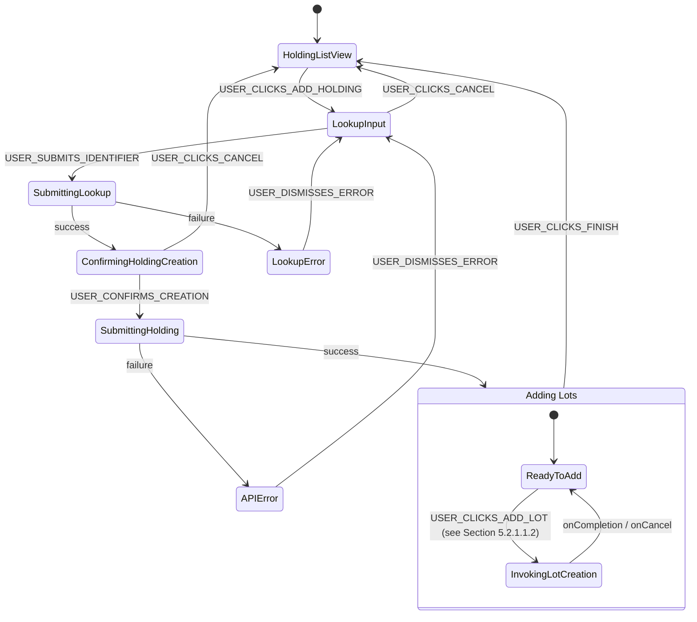
```mermaid
stateDiagram-v2
    [*] --> HoldingListView
    HoldingListView --> LookupInput : USER_CLICKS_ADD_HOLDING
    LookupInput --> HoldingListView : USER_CLICKS_CANCEL
    LookupInput --> SubmittingLookup : USER_SUBMITS_IDENTIFIER

    SubmittingLookup --> ConfirmingHoldingCreation : success
    SubmittingLookup --> LookupError : failure

    ConfirmingHoldingCreation --> SubmittingHolding : USER_CONFIRMS_CREATION
    ConfirmingHoldingCreation --> HoldingListView : USER_CLICKS_CANCEL

    SubmittingHolding --> AddingLots : success
    SubmittingHolding --> APIError : failure

    state "Adding Lots" as AddingLots {
        [*] --> ReadyToAdd
        ReadyToAdd --> InvokingLotCreation : USER_CLICKS_ADD_LOT (see Section 5.2.1.1.2)
        InvokingLotCreation --> ReadyToAdd : onCompletion / onCancel
    }
    
    AddingLots --> HoldingListView : USER_CLICKS_FINISH

    LookupError --> LookupInput : USER_DISMISSES_ERROR
    APIError --> LookupInput : USER_DISMISSES_ERROR
```

##### 4.1.1.2. State Machine for Manual Holding Creation
```yaml
flowId: FLOW_ADD_HOLDING_MANUAL
initialState: HoldingListView
states:
  - name: HoldingListView
    description: "The user is viewing the list of holdings in their default portfolio."
    events:
      USER_CLICKS_ADD_HOLDING: LookupInput

  - name: LookupInput
    description: "A modal appears prompting the user to enter a Ticker, ISIN, or WKN for the new holding."
    events:
      USER_SUBMITS_IDENTIFIER: SubmittingLookup
      USER_CLICKS_CANCEL: HoldingListView

  - name: SubmittingLookup
    description: "The system is searching for the financial instrument."
    entryAction:
      service: "FinancialInstrumentLookupService.search(identifier)"
      transitions:
        success: ConfirmingHoldingCreation
        failure: LookupError

  - name: ConfirmingHoldingCreation
    description: "The user is shown the details of the found instrument and asked to confirm its creation."
    events:
      USER_CONFIRMS_CREATION: SubmittingHolding
      USER_CLICKS_CANCEL: HoldingListView

  - name: SubmittingHolding
    description: "The system is creating the new, empty holding."
    entryAction:
      service: "POST /api/users/me/holdings"
      transitions:
        success: AddingLots
        failure: APIError

  - name: AddingLots
    description: "The user is viewing the newly created holding and can now optionally add one or more purchase lots."
    events:
      USER_CLICKS_ADD_LOT: AddingSingleLot
      USER_CLICKS_FINISH: HoldingListView
  
  - name: AddingSingleLot
    description: "The system is now invoking the lot creation subflow, specified in section 5.2.1.1."
    subflow:
      flowId: FLOW_CREATE_LOT_MANUAL
      onCompletion: AddingLots
      onCancel: AddingLots

  - name: LookupError
    description: "The user is shown an error message that the instrument could not be found."
    events:
      USER_DISMISSES_ERROR: LookupInput

  - name: APIError
    description: "The user is shown a generic error message that the holding could not be saved."
    events:
      USER_DISMISSES_ERROR: LookupInput
```

#### 4.1.2. Retrieval

Holdings are retrieved in two contexts: as a list summary within a portfolio, and as a single detailed entity.

##### 4.1.2.1. List Retrieval (Portfolio Holdings View)
When a user selects a portfolio (or upon login, when the default portfolio is loaded), the application navigates to the Portfolio Holdings View. This view displays a summary list of all holdings within that portfolio and serves as the primary dashboard. The view has two modes: a default "Read-Only Mode" and a "Manage Mode".

###### 4.1.2.1.1. Visual Representation
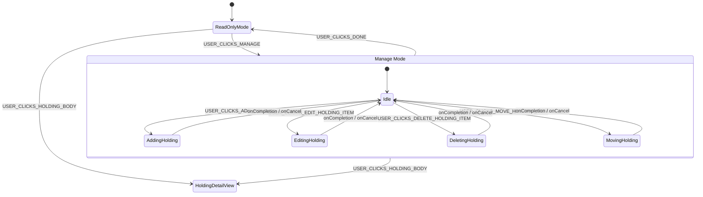
```mermaid
stateDiagram-v2
    [*] --> ReadOnlyMode
    ReadOnlyMode --> ManageMode : USER_CLICKS_MANAGE
    ManageMode --> ReadOnlyMode : USER_CLICKS_DONE

    ReadOnlyMode --> HoldingDetailView : USER_CLICKS_HOLDING_BODY
    ManageMode --> HoldingDetailView : USER_CLICKS_HOLDING_BODY

    state "Manage Mode" as ManageMode {
        [*] --> Idle
        Idle --> AddingHolding : USER_CLICKS_ADD_HOLDING
        Idle --> EditingHolding : USER_CLICKS_EDIT_HOLDING_ITEM
        Idle --> DeletingHolding : USER_CLICKS_DELETE_HOLDING_ITEM
        Idle --> MovingHolding : USER_CLICKS_MOVE_HOLDING_ITEM

        AddingHolding --> Idle : onCompletion / onCancel
        EditingHolding --> Idle : onCompletion / onCancel
        DeletingHolding --> Idle : onCompletion / onCancel
        MovingHolding --> Idle : onCompletion / onCancel
    }
```

###### 4.1.2.1.2. State Machine for Viewing Holding List
```yaml
flowId: FLOW_VIEW_HOLDING_LIST
initialState: ReadOnlyMode
states:
  - name: ReadOnlyMode
    description: "The user is viewing a read-only list of holdings. A 'Manage' button is visible."
    events:
      USER_CLICKS_MANAGE: ManageMode
      USER_CLICKS_HOLDING_BODY: HoldingDetailView

  - name: ManageMode
    description: "The user has entered manage mode. An 'Add Holding' button is visible, and each holding item shows 'Edit', 'Delete', and 'Move' buttons. A 'Done' button is visible."
    events:
      USER_CLICKS_DONE: ReadOnlyMode
      USER_CLICKS_HOLDING_BODY: HoldingDetailView
      USER_CLICKS_ADD_HOLDING: AddingHolding
      USER_CLICKS_EDIT_HOLDING_ITEM: EditingHolding
      USER_CLICKS_DELETE_HOLDING_ITEM: DeletingHolding
      USER_CLICKS_MOVE_HOLDING_ITEM: MovingHolding

  - name: HoldingDetailView
    description: "The user has clicked on the body of a holding and is navigating to its detailed view."
    exitAction:
      action: NAVIGATE_TO
      target: VIEW_HOLDING_DETAIL

  - name: AddingHolding
    description: "The user has clicked 'Add Holding' and is now in the holding creation subflow."
    subflow:
      # See section 4.1.1.2 for flow definition
      flowId: FLOW_ADD_HOLDING_MANUAL
      onCompletion: ManageMode
      onCancel: ManageMode

  - name: EditingHolding
    description: "The user has clicked the 'Edit' button on a holding item and is now in the holding update subflow."
    subflow:
      # See section 4.1.3.2 for flow definition
      flowId: FLOW_UPDATE_HOLDING_MANUAL
      onCompletion: ManageMode
      onCancel: ManageMode

  - name: DeletingHolding
    description: "The user has clicked the 'Delete' button on a holding item and is now in the holding deletion subflow."
    subflow:
      # See section 4.1.4.2 for flow definition
      flowId: FLOW_DELETE_HOLDING_MANUAL
      onCompletion: ManageMode
      onCancel: ManageMode
      
  - name: MovingHolding
    description: "The user has clicked the 'Move' button on a holding item and is now in the holding move subflow."
    subflow:
      # See section 4.1.5.2 for flow definition
      flowId: FLOW_MOVE_HOLDING_MANUAL
      onCompletion: ManageMode
      onCancel: ManageMode
```

##### 4.1.2.2. Single Retrieval (Holding Detail View)
From the holding list, a user can select a single holding to navigate to the Holding Detail View. This view displays the holding's complete computed data and a list of all its associated purchase lots. The view has two modes: a default "Read-Only Mode" and a "Manage Mode" for editing the holding and its lots.

###### 4.1.2.2.1. Visual Representation
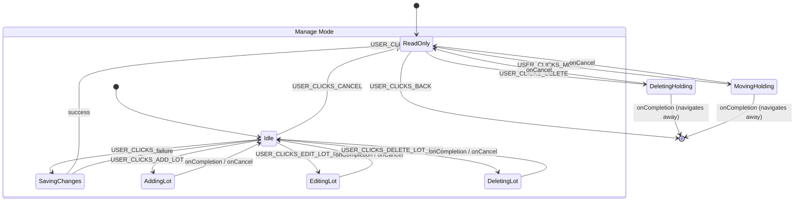
```mermaid
stateDiagram-v2
    [*] --> ReadOnly
    ReadOnly --> ManageMode : USER_CLICKS_EDIT
    ReadOnly --> DeletingHolding : USER_CLICKS_DELETE
    ReadOnly --> MovingHolding : USER_CLICKS_MOVE
    DeletingHolding --> ReadOnly : onCancel
    DeletingHolding --> [*] : onCompletion (navigates away)
    MovingHolding --> ReadOnly : onCancel
    MovingHolding --> [*] : onCompletion (navigates away)
    ReadOnly --> [*] : USER_CLICKS_BACK

    state "Manage Mode" as ManageMode {
        [*] --> Idle
        Idle --> ReadOnly : USER_CLICKS_CANCEL
        Idle --> SavingChanges : USER_CLICKS_SAVE
        SavingChanges --> ReadOnly : success
        SavingChanges --> Idle : failure

        Idle --> AddingLot : USER_CLICKS_ADD_LOT
        AddingLot --> Idle : onCompletion / onCancel

        Idle --> EditingLot : USER_CLICKS_EDIT_LOT_ITEM
        EditingLot --> Idle : onCompletion / onCancel

        Idle --> DeletingLot : USER_CLICKS_DELETE_LOT_ITEM
        DeletingLot --> Idle : onCompletion / onCancel
    }
```

###### 4.1.2.2.2. State Machine for Holding Detail View
```yaml
flowId: FLOW_VIEW_HOLDING_DETAIL
initialState: ReadOnly
states:
  - name: ReadOnly
    description: "The user is viewing the holding's details. 'Edit', 'Delete', 'Move', and 'Back' buttons are visible."
    events:
      USER_CLICKS_EDIT: ManageMode
      USER_CLICKS_DELETE: DeletingHolding
      USER_CLICKS_MOVE: MovingHolding
      USER_CLICKS_BACK: (exit flow)

  - name: DeletingHolding
    description: "The user has clicked the top-level 'Delete' button for the entire holding."
    subflow:
      # See section 4.1.4.2 for flow definition
      flowId: FLOW_DELETE_HOLDING_MANUAL
      onCompletion: (exit flow)
      onCancel: ReadOnly

  - name: MovingHolding
    description: "The user has clicked the 'Move' button and is now in the holding move subflow."
    subflow:
      # See section 4.1.5.2 for flow definition
      flowId: FLOW_MOVE_HOLDING_MANUAL
      onCompletion: (exit flow)
      onCancel: ReadOnly

  - name: ManageMode
    description: "The user is editing the holding. Its metadata fields are editable, and each lot has 'Edit'/'Delete' buttons. 'Add Lot', 'Save', and 'Cancel' buttons are visible at the holding level."
    events:
      USER_CLICKS_SAVE: SavingChanges
      USER_CLICKS_CANCEL: ReadOnly
      USER_CLICKS_ADD_LOT: AddingLot
      USER_CLICKS_EDIT_LOT_ITEM: EditingLot
      USER_CLICKS_DELETE_LOT_ITEM: DeletingLot

  - name: SavingChanges
    description: "The system is submitting all changes to the holding's metadata."
    entryAction:
      service: "PUT /api/users/me/holdings/{holdingId}"
      transitions:
        success: ReadOnly
        failure: ManageMode # Stays in edit mode, shows error

  - name: AddingLot
    description: "The user is invoking the subflow to add a new lot to the holding."
    subflow:
      # See section 5.1.1.2 for flow definition
      flowId: FLOW_CREATE_LOT_MANUAL
      onCompletion: ManageMode # Returns to edit mode
      onCancel: ManageMode

  - name: EditingLot
    description: "The user is invoking the subflow to edit an existing lot."
    subflow:
      # See section 5.1.3.2 for flow definition
      flowId: FLOW_UPDATE_LOT_MANUAL
      onCompletion: ManageMode # Returns to edit mode
      onCancel: ManageMode

  - name: DeletingLot
    description: "The user is invoking the subflow to delete an existing lot."
    subflow:
      # See section 5.1.4.2 for flow definition
      flowId: FLOW_DELETE_LOT_MANUAL
      onCompletion: ManageMode # Returns to edit mode
      onCancel: ManageMode
```

#### 4.1.3. Update
A holding can be updated in two primary ways: by directly modifying its metadata, or by adding new transactions to it via file import as described in section (TODO: add section number here).

Here is the description of the manual update of holding metadata. An authenticated user can modify the metadata of a specific holding they own, such as its `annualCosts`. This operation does not affect the purchase lots within the holding. The user interaction for this process is defined by the state machine below.

##### 4.1.3.1. Visual Representation

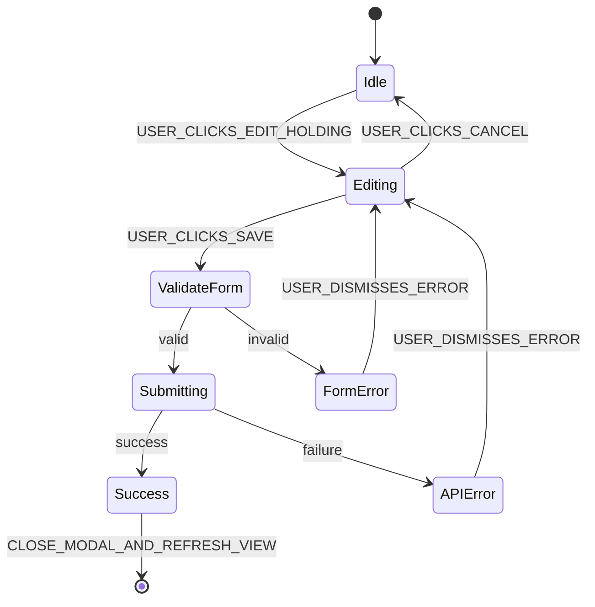
```mermaid
stateDiagram-v2
    [*] --> Idle
    Idle --> Editing : USER_CLICKS_EDIT_HOLDING
    Editing --> Idle : USER_CLICKS_CANCEL
    Editing --> ValidateForm : USER_CLICKS_SAVE
    ValidateForm --> Submitting : valid
    ValidateForm --> FormError : invalid
    Submitting --> Success : success
    Submitting --> APIError : failure
    FormError --> Editing : USER_DISMISSES_ERROR
    APIError --> Editing : USER_DISMISSES_ERROR
    Success --> [*] : CLOSE_MODAL_AND_REFRESH_VIEW
```

###### 4.1.3.2. State Machine for Manual Holding Update

```yaml
  flowId: FLOW_UPDATE_HOLDING_MANUAL
  initialState: Idle
  states:
     - name: Idle
      description: "The user is viewing the details of a specific holding."
      events:
        USER_CLICKS_EDIT_HOLDING: Editing

     - name: Editing
      description: "A modal or form appears, pre-filled with the selected holding's metadata (e.g.,
  annualCosts), ready for editing."
      events:
        USER_CLICKS_SAVE: ValidateForm
        USER_CLICKS_CANCEL: Idle

     - name: ValidateForm
      description: "The system is performing client-side validation on the updated form inputs."
      entryAction:
        service: "ValidationService.validate(form)"
        transitions:
          valid: Submitting
          invalid: FormError

     - name: Submitting
      description: "The system is submitting the updated holding data to the backend."
      entryAction:
        service: "PUT /api/users/me/holdings/{holdingId}"
        transitions:
          success: Success
          failure: APIError

     - name: Success
      description: "The user is shown a success message confirming the holding was updated."
      exitAction:
        action: CLOSE_MODAL_AND_REFRESH_VIEW
        target: VIEW_HOLDING_DETAIL

     - name: FormError
      description: "The user is shown an error message indicating which form fields are invalid."
      events:
        USER_DISMISSES_ERROR: Editing

     - name: APIError
      description: "The user is shown a generic error message that the holding could not be
  updated."
      events:
        USER_DISMISSES_ERROR: Editing
```


#### 4.1.4. Deletion
An authenticated user can delete an entire holding. This is a destructive action that permanently removes the holding, all of its associated purchase lots, and any strategy rules linked to it.

##### 4.1.4.1. Visual Representation
The following diagram visualizes the state machine flow for manually deleting a holding.

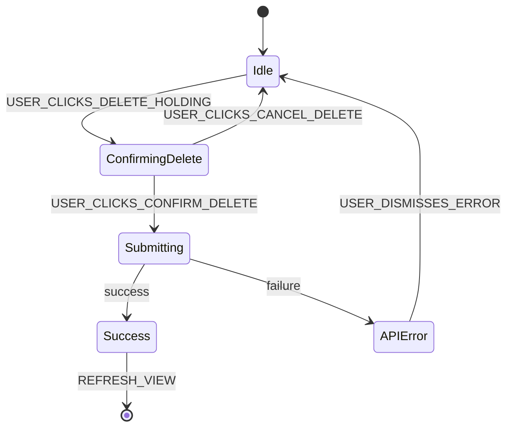
```mermaid
stateDiagram-v2
    [*] --> Idle
    Idle --> ConfirmingDelete : USER_CLICKS_DELETE_HOLDING
    ConfirmingDelete --> Idle : USER_CLICKS_CANCEL_DELETE
    ConfirmingDelete --> Submitting : USER_CLICKS_CONFIRM_DELETE
    Submitting --> Success : success
    Submitting --> APIError : failure
    APIError --> Idle : USER_DISMISSES_ERROR
    Success --> [*] : REFRESH_VIEW
```

##### 4.1.4.2. State Machine for Manual Holding Deletion
```yaml
flowId: FLOW_DELETE_HOLDING_MANUAL
initialState: Idle
states:
  - name: Idle
    description: "The user is viewing the details of a specific holding or the list of holdings."
    events:
      USER_CLICKS_DELETE_HOLDING: ConfirmingDelete

  - name: ConfirmingDelete
    description: "A modal or confirmation dialog appears, asking the user to confirm the deletion of the selected holding."
    events:
      USER_CLICKS_CONFIRM_DELETE: Submitting
      USER_CLICKS_CANCEL_DELETE: Idle

  - name: Submitting
    description: "The system is submitting the delete request to the backend."
    entryAction:
      service: "DELETE /api/users/me/holdings/{holdingId}"
      transitions:
        success: Success
        failure: APIError

  - name: Success
    description: "The holding is successfully deleted from the backend."
    exitAction:
      action: REFRESH_VIEW
      target: VIEW_PORTFOLIO_HOLDINGS

  - name: APIError
    description: "The user is shown a generic error message that the holding could not be deleted."
    events:
      USER_DISMISSES_ERROR: Idle
```

#### 4.1.5. Move
An authenticated user can move a holding from one of their portfolios to another. This action transfers the holding itself, along with all its associated lots and rules, to the destination portfolio.

##### 4.1.5.1. Visual Representation
The following diagram visualizes the state machine flow for moving a holding.

```mermaid
stateDiagram-v2
    [*] --> Idle
    Idle --> SelectingDestination : USER_CLICKS_MOVE_HOLDING
    SelectingDestination --> Idle : USER_CLICKS_CANCEL
    SelectingDestination --> ConfirmingMove : USER_SELECTS_DESTINATION
    ConfirmingMove --> SelectingDestination : USER_CLICKS_BACK
    ConfirmingMove --> Submitting : USER_CLICKS_CONFIRM_MOVE
    Submitting --> Success : success
    Submitting --> APIError : failure
    APIError --> Idle : USER_DISMISSES_ERROR
    Success --> [*] : NAVIGATE_TO_NEW_PORTFOLIO
```

##### 4.1.5.2. State Machine for Moving a Holding
```yaml
flowId: FLOW_MOVE_HOLDING_MANUAL
initialState: Idle
states:
  - name: Idle
    description: "The user is viewing the details of a specific holding."
    events:
      USER_CLICKS_MOVE_HOLDING: SelectingDestination

  - name: SelectingDestination
    description: "A modal appears, prompting the user to select a destination portfolio from a list of their other available portfolios."
    events:
      USER_SELECTS_DESTINATION: ConfirmingMove
      USER_CLICKS_CANCEL: Idle

  - name: ConfirmingMove
    description: "The user is shown a confirmation message, e.g., 'Move {holdingName} to {destinationPortfolioName}?'."
    events:
      USER_CLICKS_CONFIRM_MOVE: Submitting
      USER_CLICKS_BACK: SelectingDestination

  - name: Submitting
    description: "The system is submitting the move request to the backend."
    entryAction:
      service: "POST /api/users/me/holdings/{holdingId}/move"
      transitions:
        success: Success
        failure: APIError

  - name: Success
    description: "The holding is successfully moved."
    exitAction:
      action: NAVIGATE_TO
      target: VIEW_PORTFOLIO_HOLDINGS (of the destination portfolio)

  - name: APIError
    description: "The user is shown a generic error message that the holding could not be moved."
    events:
      USER_DISMISSES_ERROR: Idle
```

### 4.2. Holding Data Model

#### 4.2.1. Stored Data Models

- **`Holding` (Firestore Document):**
  - A new top-level collection (`holdings`) will be created.
  - The document ID for each holding will be a unique `holdingId`.
  - `holdingId`: String (Unique UUID, the document ID).
  - `portfolioId`: String (UUID of the parent portfolio).
  - `userId`: String (Firebase Auth UID, links the holding to its owner).
  - `ticker`: String (e.g., "VOO", "QQQ.DE").
  - `ISIN`: String (Optional, e.g., "IE00B5BMR087").
  - `WKN`: String (Optional, e.g., "A0YEDG").
  - `securityType`: Enum (e.g., `STOCK`, `ETF`, `FUND`).
  - `assetClass`: Enum (e.g., `EQUITY`, `CRYPTO`, `COMMODITY`).
  - `currency`: Enum (`EUR`, `USD`, `GBP`).
  - `annualCosts`: Number (Optional, percentage, e.g., 0.07 for a 0.07% TER).
  - `createdAt`: ISODateTime.
  - `modifiedAt`: ISODateTime.
  - `lots`: Array of `Lot` objects. The `Lot` data model is defined below. See Chapter 5 for lot management details.

- **`Lot` (Object within Holding):**
  - `lotId`: String (Unique UUID generated on creation).
  - `purchaseDate`: ISODateTime.
  - `quantity`: Number (of shares, positive).
  - `purchasePrice`: Number (per share, positive, in the currency of the holding).
  - `createdAt`: ISODateTime.
  - `modifiedAt`: ISODateTime.

- **`MarketData` (Firestore Document):**
  - A separate top-level collection (`marketData`) used as an internal cache for historical price and indicator data. This data is shared by all users.
  - The structure is `/marketData/{ticker}/daily/{YYYY-MM-DD}`.
  - Each document contains:
    - `date`: ISODateTime.
    - `ticker`: String.
    - `open`: Number (EUR).
    - `high`: Number (EUR).
    - `low`: Number (EUR).
    - `close`: Number (EUR).
    - `volume`: Integer.
    - `sma200`: Optional<Number> (200-day simple moving average).
    - `sma50`: Optional<Number> (50-day simple moving average).
    - `sma20`: Optional<Number> (20-day simple moving average).
    - `sma7`: Optional<Number> (7-day simple moving average).
    - `vwma200`: Optional<Number> (200-day volume weighted moving average).
    - `vwma50`: Optional<Number> (50-day volume weighted moving average).
    - `vwma20`: Optional<Number> (20-day volume weighted moving average).
    - `vwma7`: Optional<Number> (7-day volume weighted moving average).
    - `rsi14`: Optional<Number> (14-day Relative Strength Index).
    - `atr14`: Optional<Number> (14-day Average True Range).
    - `macd`: Optional<Object> (Moving Average Convergence/Divergence, containing `value`, `signal`, and `histogram` fields).
  - **Note on Technical Indicators**: All technical indicators (SMA, VWMA, RSI, ATR, MACD, etc.) are calculated internally by the Sentinel backend using the historical price and volume data. Only the raw OHLCV data is fetched from the external provider.

#### 4.2.2. Computed Data Models

The information in this section is calculated on-the-fly by the backend API and embedded into each `Holding` object in the API response. It is not stored in the database.

- **`ComputedInfoHolding` (Object embedded in `Holding`):**
  - `totalCost`: Number (can be in holding's currency or portfolio's default currency).
  - `currentValue`: Number (can be in holding's currency or portfolio's default currency).
  - `preTaxGainLoss`: Number (can be in holding's currency or portfolio's default currency).
  - `afterTaxGainLoss`: Number (can be in holding's currency or portfolio's default currency).
  - `gainLossPercentage`: Number (%).

- **`ComputedInfoLot` (Object embedded in `Lot`):**
  - `currentPrice`: Number (can be in holding's currency or portfolio's default currency, depending on view context).
  - `currentValue`: Number (can be in holding's currency or portfolio's default currency, depending on view context).
  - `preTaxProfit`: Number (can be in holding's currency or portfolio's default currency, depending on view context).
  - `capitalGainTax`: Number (can be in holding's currency or portfolio's default currency, depending on view context).
  - `afterTaxProfit`: Number (can be in holding's currency or portfolio's default currency, depending on view context).

### 4.3. Holding Management Rules

This section will detail the specific rules for creating, updating, and deleting holdings.

#### 4.3.1. Holding Creation (Manual, Interactive)

The manual creation of a holding is a two-step process that directly maps to the `FLOW_ADD_HOLDING_MANUAL` state machine:
1.  **Instrument Lookup (`H_1000`)**: The user searches for a financial instrument.
2.  **Holding Creation (`H_1200`)**: After the instrument is confirmed, the system creates the empty holding.

##### 4.3.1.1. H_1000: Financial Instrument Lookup

- **Sequence Diagram for Instrument Lookup**

```mermaid
sequenceDiagram
    participant User as User (Frontend)
    participant Sentinel as Sentinel Backend
    participant Lookup as Financial Instrument<br>Lookup Service

    User->>Sentinel: 1. POST /api/users/me/holdings/lookup<br> { identifier: "AAPL" }
    activate Sentinel
    Sentinel->>Lookup: 2. Search for "AAPL"
    activate Lookup
    Lookup-->>Sentinel: 3. Return Instrument(s)
    deactivate Lookup
    
    alt Unique Instrument Found
        Sentinel-->>User: 4a. Return single instrument details<br> (Ticker, ISIN, WKN)
    else Multiple Instruments Found
        Sentinel-->>User: 4b. Return list of instruments for selection
    else Instrument Not Found
        Sentinel-->>User: 4c. Return HTTP 404 Not Found
    end
    deactivate Sentinel
```

- **Description**: The first step in manually adding a holding. The user provides an identifier (Ticker, ISIN, or WKN), and the backend searches for a matching financial instrument. This corresponds to the `SubmittingLookup` state in the flow.
- **Success Response**: A single instrument or a list of instruments is returned for the user to confirm.
- **Sub-Rules**:

| Rule ID | Rule Name | Condition | Check Point | Success Outcome | Message Keys |
|:---|:---|:---|:---|:---|:---|
| H_I_1001 | Lookup succeeds (unique) | A single, unique instrument is found for the provided identifier. | Response Sentinel to User | The instrument's details are returned to the user for confirmation. | H_I_1001 |
| H_I_1002 | Lookup succeeds (multiple) | Multiple instruments are found for the provided identifier. | Response Sentinel to User | A list of possible instruments is returned to the user for selection. | H_I_1002 |
| H_E_1051 | User unauthorized | User is not authenticated. | Request User to Sentinel | Lookup rejected with HTTP 401 Unauthorized. | H_E_1051 |
| H_E_1052 | Instrument not found | No instrument can be found for the provided identifier. | Sentinel to Lookup Service | An error is returned to the user. | H_E_1052 |

**Messages**:
- **H_I_1001**: "Instrument found. Please confirm to create the holding."
- **H_I_1002**: "Multiple instruments found. Please select one to continue."
- **H_E_1051**: "User is not authenticated."
- **H_E_1052**: "No instrument could be found for the identifier '{identifier}'."

##### 4.3.1.2. H_1200: Holding Creation

- **Sequence Diagram for Holding Creation**

```mermaid
sequenceDiagram
    participant User as User (Frontend)
    participant Sentinel as Sentinel Backend
    participant DB as Database
    participant Backfill as Backfill Service

    Note over User, Sentinel: User has confirmed the instrument to add.
    User->>Sentinel: 1. POST /api/users/me/holdings<br> { portfolioId, confirmedInstrument }
    activate Sentinel
    Sentinel->>Sentinel: 2. Validate Request Data
    Sentinel->>DB: 3. Create Holding document in 'holdings' collection
    activate DB
    DB-->>Sentinel: 4. Confirm Creation
    deactivate DB
    
    alt Ticker is new to the system
        Sentinel->>Backfill: 5. Trigger backfill for new ticker (async)
    end

    Sentinel-->>User: 6. HTTP 201 Created (returns new holding)
    deactivate Sentinel
```

- **Description**: After a financial instrument has been looked up and confirmed by the user, the frontend sends a request to create the actual holding. This rule covers the creation of an empty holding shell, ready for lots to be added. This corresponds to the `SubmittingHolding` state in the flow.
- **Success Response**: A new, empty `Holding` document is created in the top-level `holdings` collection.
- **Sub-Rules**:

| Rule ID | Rule Name | Condition | Check Point | Success Outcome | Message Keys |
|:---|:---|:---|:---|:---|:---|
| H_I_1201 | Creation succeeds | All provided holding data is valid and the user is authorized. | Response Sentinel to User | A new `Holding` document is created. If the ticker is new to the system, the backfill process (H_5000) is triggered asynchronously. | H_I_1201 |
| H_I_1202 | Idempotency key is replayed | `Idempotency-Key` matches a previous successful creation request. | Request User to Sentinel | The response from the original successful request is returned; no new item is created. | N/A |
| H_E_1301 | User unauthorized | User is not authenticated or the UID from the token does not own the specified portfolio. | Request User to Sentinel | Creation rejected with HTTP 403 Forbidden. | H_E_1301 |
| H_E_1302 | Portfolio not found | The specified `portfolioId` does not exist. | Request User to Sentinel | Creation rejected with HTTP 404 Not Found. | H_E_1302 |
| H_E_1303 | Invalid holding data | `currency`, `securityType`, or `assetClass` are not valid enum values in the final creation step. | Request User to Sentinel | Creation rejected with HTTP 400 Bad Request. | H_E_1303 |
| H_E_1304 | Idempotency key missing/invalid | `Idempotency-Key` header is missing or not a valid UUID. | Request User to Sentinel | Creation rejected. | H_E_1304 |

**Messages**:
- **H_I_1201**: "Holding added successfully to portfolio {portfolioId}."
- **H_E_1301**: "User is not authorized to modify portfolio {portfolioId}."
- **H_E_1302**: "Portfolio with ID {portfolioId} not found."
- **H_E_1303**: "Holding data is invalid. Please provide a valid currency, security type, and asset class."
- **H_E_1304**: "A valid Idempotency-Key header is required for this operation."

#### 4.3.2. H_1200: Holding Creation (Import from File)

> **Note:** This process has been deprecated and merged into the unified transaction import feature. Please see **Section 3.3.5, Rule P_5000** for the current specification.

#### 4.3.3. Holding Retrieval

##### 4.3.3.1. H_2000: Holding List Retrieval (Portfolio Details View)

- **Sequence Diagram for Holding List Retrieval**

```mermaid
sequenceDiagram
    participant User as User (Frontend)
    participant Sentinel as Sentinel Backend
    participant DB as Database

    User->>Sentinel: 1. GET /api/users/me/portfolios/{portfolioId}/holdings<br> (with ID Token)
    activate Sentinel
    Sentinel->>Sentinel: 2. Verify ID Token & Authorize User for portfolioId
    Sentinel->>DB: 3. Query 'holdings' collection where<br> portfolioId == {portfolioId}
    activate DB
    DB-->>Sentinel: 4. Return Holding Documents
    deactivate DB

    Note over Sentinel, DB: Backend enriches each holding with<br>computed values from the market data cache.

    Sentinel-->>User: 5. Return List of Enriched Holdings
    deactivate Sentinel
```

- **Description**: When a user selects a portfolio, the application navigates to the "Portfolio Details View". This view immediately triggers a request to fetch a list of all holdings belonging to that portfolio. The response contains a list of holding objects, each enriched with computed performance data but without the detailed list of individual lots. Each holding in the list is clickable, allowing the user to navigate to the "Holding Details View".
- **Examples**:
    - **Example**: A user clicks on their "Real Money" portfolio. The application calls `GET /api/users/me/portfolios/{real-money-portfolio-id}/holdings`. The backend returns a list of all holdings in that portfolio, each with its `ComputedInfoHolding` data. The UI then displays this list.
- **Success Response**: A list of enriched `Holding` summary objects for the specified portfolio is returned.
- **Sub-Rules**:

| Rule ID | Rule Name | Condition | Check Point | Success Outcome | Message Keys |
|:---|:---|:---|:---|:---|:---|
| H_I_2001 | List retrieval succeeds | User is authenticated and owns the portfolio. | Response Sentinel to User | A list of enriched holdings for the portfolio is returned. | H_I_2001 |
| H_E_2101 | User unauthorized | User is not authenticated or is not the owner of the requested portfolio. | Request User to Sentinel | Retrieval rejected with HTTP 401/403. | H_E_2101 |
| H_E_2102 | Portfolio not found | The specified `portfolioId` does not exist. | Sentinel internal | Retrieval rejected with HTTP 404 Not Found. | H_E_2102 |

**Messages**:
- **H_I_2001**: "Holdings for portfolio {portfolioId} retrieved successfully."
- **H_E_2101**: "User is not authorized to access this resource."
- **H_E_2102**: "The requested portfolio was not found."

##### 4.3.3.2. H_2200: Single Holding Retrieval (Holding Details View)

- **Sequence Diagram for Single Holding Retrieval**

```mermaid
sequenceDiagram
    participant User as User (Frontend)
    participant Sentinel as Sentinel Backend
    participant DB as Database

    User->>Sentinel: 1. GET /api/users/me/holdings/{holdingId}<br> (with ID Token)
    activate Sentinel
    Sentinel->>Sentinel: 2. Verify ID Token & Authorize User for holdingId
    Sentinel->>DB: 3. Fetch Holding Document from 'holdings' collection
    activate DB
    DB-->>Sentinel: 4. Return Holding Document with 'lots' array
    deactivate DB

    Note over Sentinel, DB: Backend enriches the holding and each lot<br>with computed values from market data cache.

    Sentinel-->>User: 5. Return Fully Enriched Holding with all Lots
    deactivate Sentinel
```

- **Description**: When a user clicks on a specific holding from the list in the "Portfolio Details View", the application navigates to the "Holding Details View". This triggers a request to get the full details of that single holding, identified by its `holdingId`. The response for this request is a single, fully enriched `Holding` object that includes the complete list of all its `Lot` objects, with each lot also being fully enriched with its own computed data.
- **Success Response**: A single, fully enriched `Holding` object is returned, including all its enriched lots.
- **Sub-Rules**:

| Rule ID | Rule Name | Condition | Check Point | Success Outcome | Message Keys |
|:---|:---|:---|:---|:---|:---|
| H_I_2201 | Single retrieval succeeds | User is authenticated and owns the holding. | Response Sentinel to User | Full, enriched holding data is returned, including all lots. | H_I_2201 |
| H_E_2301 | User unauthorized | User is not authenticated or is not the owner of the requested holding. | Request User to Sentinel | Retrieval rejected with HTTP 401/403. | H_E_2301 |
| H_E_2302 | Holding not found | The specified `holdingId` does not exist. | Sentinel internal | Retrieval rejected with HTTP 404 Not Found. | H_E_2302 |

**Messages**:
- **H_I_2201**: "Holding {holdingId} retrieved successfully."
- **H_E_2301**: "User is not authorized to access this resource."
- **H_E_2302**: "The requested holding was not found."

#### 4.3.4. Holding Update

##### 4.3.4.1. H_3000: Manual Holding Update

- **Description**: Manually modifies the metadata of an existing holding (e.g., its `annualCosts`). This does not modify the lots within the holding. For lot modifications, see Chapter 5. The endpoint is `PUT /api/users/me/holdings/{holdingId}`.
- **Success Response**: The `Holding` document is updated in Firestore.
- **Sub-Rules**:

| Rule ID | Rule Name | Condition | Check Point | Success Outcome | Message Keys |
|:---|:---|:---|:---|:---|:---|
| H_I_3001 | Update succeeds | Valid data, user authorized for the holding. | Response Sentinel to User | Holding metadata updated. | H_I_3001 |
| H_I_3002 | Idempotency key is replayed | `Idempotency-Key` matches a previous successful update request. | Request User to Sentinel | The response from the original successful request is returned; no new update is performed. | N/A |
| H_E_3101 | User unauthorized | User not authorized. | Request User to Sentinel | Update rejected. | H_E_3101 |
| H_E_3102 | Holding not found | `holdingId` invalid. | Sentinel internal | Update rejected. | H_E_3102 |
| H_E_3103 | Idempotency key missing/invalid | `Idempotency-Key` header is missing or not a valid UUID. | Request User to Sentinel | Update rejected. | H_E_3103 |

**Messages**:
- **H_I_3001**: "Holding {holdingId} updated successfully."
- **H_E_3101**: "User is not authorized to update holding {holdingId}."
- **H_E_3102**: "Holding {holdingId} not found."
- **H_E_3103**: "A valid Idempotency-Key header is required for this operation."

##### 4.3.4.2. H_3200: Holding Update via File Import

> **Note:** This process has been deprecated and merged into the unified transaction import feature. Please see **Section 3.3.5, Rule P_5000** for the current specification.

#### 4.3.5. H_4000: Holding Deletion

- **Sequence Diagram for Holding Deletion**

```mermaid
sequenceDiagram
    participant User as User (Frontend)
    participant Sentinel as Sentinel Backend
    participant DB as Database

    User->>Sentinel: 1. DELETE /api/users/me/holdings/{holdingId}<br> (with ID Token)
    activate Sentinel
    Sentinel->>Sentinel: 2. Verify ID Token & Authorize User for holdingId
    
    alt Authorization OK & Item Found
        Sentinel->>DB: 3. Delete Holding Document from DB
        activate DB
        DB-->>Sentinel: 4. Confirm Deletion
        deactivate DB
        
        Sentinel-->>User: 5. Return HTTP 200 OK (Success)
    else Authorization Fails or Item Not Found
        Sentinel-->>User: Return HTTP 4xx Error (e.g., 403, 404)
    end
    deactivate Sentinel
```

- **Description**: Deletes an entire holding, including all its lots and associated rules.
- **Success Response**: The specified `Holding` document is deleted from Firestore.
- **Sub-Rules**:

| Rule ID | Rule Name | Condition | Check Point | Success Outcome | Message Keys |
|:---|:---|:---|:---|:---|:---|
| H_I_4001 | Holding deletion succeeds | User is authenticated, owns the holding. | Response Sentinel to User | Holding successfully deleted. | H_I_4001 |
| H_I_4002 | Idempotency key is replayed | `Idempotency-Key` matches a previous successful deletion request. | Request User to Sentinel | The response from the original successful request is returned; no new deletion is performed. | N/A |
| H_E_4101 | User unauthorized | User is not authenticated or does not own the holding. | Request User to Sentinel | Deletion rejected with HTTP 403 Forbidden. | H_E_4101 |
| H_E_4102 | Item not found | The specified `holdingId` does not exist. | Sentinel internal | Deletion rejected with HTTP 404 Not Found. | H_E_4102 |
| H_E_4103 | Idempotency key missing/invalid | `Idempotency-Key` header is missing or not a valid UUID. | Request User to Sentinel | Deletion rejected. | H_E_4103 |

**Messages**:
- **H_I_4001**: "Holding successfully deleted."
- **H_E_4101**: "User is not authorized to delete this item."
- **H_E_4102**: "The specified holding could not be found."
- **H_E_4103**: "A valid Idempotency-Key header is required for this operation."

#### 4.3.6. H_5000: Backfill for New Security

- **Sequence Diagram for Asynchronous Backfill**

```mermaid
sequenceDiagram
    participant Trigger as Holding Creation Process
    participant Backfill as Backfill Service
    participant DB as Database
    participant API as Market Data API
    participant Notify as User Interfact

    Trigger->>Backfill: 1. Trigger backfill for new ticker<br> (async)
    activate Backfill
    Backfill->>DB: 2. Check if data for ticker exists
    activate DB
    DB-->>Backfill: 3. Data does not exist
    deactivate DB

    Backfill->>API: 4. Fetch full historical data
    activate API
    API-->>Backfill: 5. Return historical data
    deactivate API

    Backfill->>DB: 6. Save all fetched data
    activate DB
    DB-->>Backfill: 7. Confirm data saved
    deactivate DB

    alt History is shorter than 366 days
        Backfill->>Notify: 8. Send 'Short History' message to user
    end
    deactivate Backfill
```

- **Description**: This process is triggered automatically by the backend whenever a new holding is created (either manually via H_1000 or via import with H_1200) for a ticker that does not yet have any data in the `marketData` collection. The process runs asynchronously to avoid blocking the user's request and ensures that historical data is available for charting and rule evaluation.
- **Success Response**: Historical data for the new ticker is fetched from the external provider and stored in the `marketData` collection in Firestore.
- **Sub-Rules**:

| Rule ID | Rule Name | Condition | Check Point | Success Outcome | Message Keys |
|:---|:---|:---|:---|:---|:---|
| H_I_5001 | Backfill Triggered | A new holding is created with a ticker that has no existing data in the `marketData` collection. | Sentinel Internal | An asynchronous job is initiated to fetch historical data for the new ticker. | N/A |
| H_I_5002 | Full History Backfill | The external data provider has more than 366 days of historical data for the ticker. | Sentinel to Data Provider | The most recent 366 days of data are fetched and stored in the `marketData` collection. | N/A |
| H_I_5003 | Partial History Backfill | The external data provider has less than 366 days of historical data for the ticker (i.e., it is a new security). | Sentinel to Data Provider | All available historical data is fetched and stored. A notification is returned to the user. | H_I_5003 |
| H_E_5101 | Backfill Fails | The external data provider API returns an error or is unavailable. | Sentinel to Data Provider | The error is logged. The system will retry the backfill at a later time. No data is stored. | H_E_5101 |

**Messages**:
- **H_I_5003**: "Note: The security '{ticker}' is new. Only {days} days of historical data were available and have been backfilled."
- **H_E_5101**: "Could not fetch historical data for ticker {ticker}. The operation will be retried later."

#### 4.3.7. H_6000: Move Holding

- **Sequence Diagram for Moving a Holding**

```mermaid
sequenceDiagram
    participant User as User (Frontend)
    participant Sentinel as Sentinel Backend
    participant DB as Database

    User->>Sentinel: 1. POST /api/users/me/holdings/{holdingId}/move<br>{ "destinationPortfolioId": "dest-pf-id" }<br>(with ID Token)
    activate Sentinel
    Sentinel->>Sentinel: 2. Verify ID Token & Authorize User for holding and destination portfolio
    
    alt Authorization OK & Holding Found
        Sentinel->>DB: 3. Update Holding Document in DB<br> set portfolioId = "dest-pf-id"
        activate DB
        DB-->>Sentinel: 4. Confirm Update
        deactivate DB
        
        Sentinel-->>User: 5. Return HTTP 200 OK (Success)
    else Authorization Fails or Item Not Found
        Sentinel-->>User: Return HTTP 4xx Error (e.g., 400, 403, 404)
    end
    deactivate Sentinel
```

- **Description**: Moves an entire holding (including all its lots and associated rules) from one portfolio to another by updating its `portfolioId` field.
- **Examples**:
    - **Example**:
        - A user has a holding of "AAPL" in their "Paper Trading" portfolio and wants to move it to their "Real Money" portfolio.
        - The user sends a `POST` request to `/api/users/me/holdings/{aaplHoldingId}/move` with the body `{ "destinationPortfolioId": "realMoneyPortfolioId" }`.
        - The backend verifies the user owns the holding and the destination portfolio, then updates the `portfolioId` on the "AAPL" holding document.
- **Success Response**: The holding's `portfolioId` is successfully updated in Firestore.
- **Sub-Rules**:

| Rule ID | Rule Name | Condition | Check Point | Success Outcome | Message Keys |
|:---|:---|:---|:---|:---|:---|
| H_I_6001 | Holding move succeeds | User is authenticated, owns the holding and the destination portfolio. | Response Sentinel to User | Holding successfully moved. | H_I_6001 |
| H_I_6002 | Idempotency key is replayed | `Idempotency-Key` matches a previous successful move request. | Request User to Sentinel | The response from the original successful request is returned; no new move is performed. | N/A |
| H_E_6101 | User unauthorized | User is not authenticated or does not own the holding or the destination portfolio. | Request User to Sentinel | Move rejected with HTTP 403 Forbidden. | H_E_6101 |
| H_E_6102 | Holding not found | The specified `holdingId` does not exist. | Sentinel internal | Move rejected with HTTP 404 Not Found. | H_E_6102 |
| H_E_6103 | Portfolio not found | The destination `portfolioId` does not exist. | Sentinel internal | Move rejected with HTTP 404 Not Found. | H_E_6103 |
| H_E_6104 | Invalid move request | The holding is already in the destination portfolio. | Request User to Sentinel | Move rejected with HTTP 400 Bad Request. | H_E_6104 |
| H_E_6105 | Idempotency key missing/invalid | `Idempotency-Key` header is missing or not a valid UUID. | Request User to Sentinel | Move rejected. | H_E_6105 |

**Messages**:
- **H_I_6001**: "Holding successfully moved to portfolio {destinationPortfolioName}."
- **H_E_6101**: "User is not authorized to perform this action."
- **H_E_6102**: "The specified holding could not be found."
- **H_E_6103**: "The destination portfolio could not be found."
- **H_E_6104**: "The holding is already in the destination portfolio."
- **H_E_6105**: "A valid Idempotency-Key header is required for this operation."

--- 

## 5. Lot Management

This section details the management of individual purchase lots. Lots represent a specific purchase of a quantity of a security at a certain price and date. They always exist as part of a `Holding` (see Chapter 4).

### 5.1. Business Process

The management of lots follows the standard CRUD (Create, Retrieve, Update, Delete) operations. All operations are authenticated, authorized, and performed in the context of a parent holding.

#### 5.1.1. Lot Creation Methods

Lots can be created in two ways: manually for a single transaction, or in bulk via the unified file import process described in **Section 3.3.5, Rule P_5000**.

An authenticated user can add a single new purchase lot to one of their existing holdings. This is used to record additional purchases of a security they already own, thereby increasing the total quantity of the holding. The user interaction for this process is defined by the state machine below.

##### 5.1.1.1. Visual Representation
The following diagram visualizes the state machine flow for manually creating a lot.

```mermaid
stateDiagram-v2
    [*] --> Idle
    Idle --> FormInput : USER_CLICKS_ADD_LOT
    FormInput --> Idle : USER_CLICKS_CANCEL
    FormInput --> ValidateForm : USER_CLICKS_SAVE
    ValidateForm --> Submitting : valid
    ValidateForm --> FormError : invalid
    Submitting --> Success : success
    Submitting --> APIError : failure
    FormError --> FormInput : USER_DISMISSES_ERROR
    APIError --> FormInput : USER_DISMISSES_ERROR
    Success --> [*] : CLOSE_MODAL_AND_REFRESH_VIEW
```

##### 5.1.1.2. State Machine for Manual Lot Creation
```yaml
flowId: FLOW_CREATE_LOT_MANUAL
initialState: Idle
states:
  - name: Idle
    description: "The user is viewing the details of a specific holding."
    events:
      USER_CLICKS_ADD_LOT: FormInput

  - name: FormInput
    description: "A modal or form appears, prompting the user to enter the new lot's details (purchase date, quantity, price)."
    events:
      USER_CLICKS_SAVE: ValidateForm
      USER_CLICKS_CANCEL: Idle

  - name: ValidateForm
    description: "The system is performing client-side validation on the form inputs."
    entryAction:
      service: "ValidationService.validate(form)"
      transitions:
        valid: Submitting
        invalid: FormError

  - name: Submitting
    description: "The system is submitting the new lot data to the backend."
    entryAction:
      service: "POST /api/users/me/holdings/{holdingId}/lots"
      transitions:
        success: Success
        failure: APIError

  - name: Success
    description: "The user is shown a success message confirming the lot was added."
    exitAction:
      action: CLOSE_MODAL_AND_REFRESH_VIEW
      target: VIEW_HOLDING_DETAIL

  - name: FormError
    description: "The user is shown an error message indicating which form fields are invalid."
    events:
      USER_DISMISSES_ERROR: FormInput

  - name: APIError
    description: "The user is shown a generic error message that the lot could not be saved."
    events:
      USER_DISMISSES_ERROR: FormInput
```

#### 5.1.2. Retrieval and Management

Lots are not retrieved as independent entities. Instead, they are retrieved as part of their parent `Holding` object when the user navigates to the Holding Detail View. The user interaction for viewing and managing the list of lots is defined entirely within the state machine for the parent holding's detail view, which provides a unified interface for managing a holding and its constituent lots.

The flow begins when a user is viewing the details of a holding. In the default read-only mode, they see a simple list of lots. By entering the holding's "Manage Mode", they gain access to controls for adding a new lot, or editing and deleting existing lots in the list.

##### 5.1.2.1. Visual Representation

The following diagram illustrates the user flow for managing a list of lots within the context of the parent Holding Detail View.

```mermaid
stateDiagram-v2
    [*] --> ReadOnly
    ReadOnly --> ManageMode : USER_CLICKS_EDIT_HOLDING

    state "Manage Mode" as ManageMode {
        [*] --> Idle
        Idle --> ReadOnly : USER_CLICKS_CANCEL_OR_SAVE
        
        Idle --> AddingLot : USER_CLICKS_ADD_LOT
        AddingLot --> Idle : onCompletion / onCancel

        Idle --> EditingLot : USER_CLICKS_EDIT_LOT_ITEM
        EditingLot --> Idle : onCompletion / onCancel

        Idle --> DeletingLot : USER_CLICKS_DELETE_LOT_ITEM
        DeletingLot --> Idle : onCompletion / onCancel
    }
```

##### 5.1.2.2. State Machine for Lot List Management

The following state machine describes the process from the perspective of managing the lots list. Note that this flow is a conceptual subset of the complete `FLOW_VIEW_HOLDING_DETAIL` state machine defined in Section 4.1.2.2.2.

```yaml
flowId: FLOW_MANAGE_LOTS_LIST
initialState: ReadOnly
states:
  - name: ReadOnly
    description: "The user is viewing the holding's details, which includes a read-only list of its lots. An 'Edit' button for the holding is visible."
    events:
      USER_CLICKS_EDIT_HOLDING: ManageMode

  - name: ManageMode
    description: "The user is in the holding's manage mode. An 'Add Lot' button is visible, and each lot in the list now has 'Edit' and 'Delete' buttons."
    events:
      USER_CLICKS_SAVE_HOLDING: ReadOnly
      USER_CLICKS_CANCEL_HOLDING: ReadOnly
      USER_CLICKS_ADD_LOT: AddingLot
      USER_CLICKS_EDIT_LOT_ITEM: EditingLot
      USER_CLICKS_DELETE_LOT_ITEM: DeletingLot

  - name: AddingLot
    description: "The user has clicked 'Add Lot' and is now in the lot creation subflow."
    subflow:
      # See section 5.1.1.2 for flow definition
      flowId: FLOW_CREATE_LOT_MANUAL
      onCompletion: ManageMode
      onCancel: ManageMode

  - name: EditingLot
    description: "The user has clicked the 'Edit' button on a lot item and is now in the lot update subflow."
    subflow:
      # See section 5.1.3.2 for flow definition
      flowId: FLOW_UPDATE_LOT_MANUAL
      onCompletion: ManageMode
      onCancel: ManageMode

  - name: DeletingLot
    description: "The user has clicked the 'Delete' button on a lot item and is now in the lot deletion subflow."
    subflow:
      # See section 5.1.4.2 for flow definition
      flowId: FLOW_DELETE_LOT_MANUAL
      onCompletion: ManageMode
      onCancel: ManageMode
```

#### 5.1.3. Manual Update of a Single Lot

An authenticated user can modify the details of a specific purchase lot they own, such as correcting the `purchasePrice`, `quantity`, or `purchaseDate`. This is a manual-only operation performed through the user interface; updating lots via file import is not supported.

##### 5.1.3.1. Visual Representation
The following diagram visualizes the state machine flow for manually updating a lot.

```mermaid
stateDiagram-v2
    [*] --> Idle
    Idle --> Editing : USER_CLICKS_EDIT_LOT
    Editing --> Idle : USER_CLICKS_CANCEL
    Editing --> ValidateForm : USER_CLICKS_SAVE
    ValidateForm --> Submitting : valid
    ValidateForm --> FormError : invalid
    Submitting --> Success : success
    Submitting --> APIError : failure
    FormError --> Editing : USER_DISMISSES_ERROR
    APIError --> Editing : USER_DISMISSES_ERROR
    Success --> [*] : CLOSE_MODAL_AND_REFRESH_VIEW
```

##### 5.1.3.2. State Machine for Manual Lot Update
```yaml
flowId: FLOW_UPDATE_LOT_MANUAL
initialState: Idle
states:
  - name: Idle
    description: "The user is viewing the details of a specific holding, including its list of lots."
    events:
      USER_CLICKS_EDIT_LOT: Editing

  - name: Editing
    description: "A modal or form appears, pre-filled with the selected lot's details, ready for editing."
    events:
      USER_CLICKS_SAVE: ValidateForm
      USER_CLICKS_CANCEL: Idle

  - name: ValidateForm
    description: "The system is performing client-side validation on the updated form inputs."
    entryAction:
      service: "ValidationService.validate(form)"
      transitions:
        valid: Submitting
        invalid: FormError

  - name: Submitting
    description: "The system is submitting the updated lot data to the backend."
    entryAction:
      service: "PUT /api/users/me/holdings/{holdingId}/lots/{lotId}"
      transitions:
        success: Success
        failure: APIError

  - name: Success
    description: "The user is shown a success message confirming the lot was updated."
    exitAction:
      action: CLOSE_MODAL_AND_REFRESH_VIEW
      target: VIEW_HOLDING_DETAIL

  - name: FormError
    description: "The user is shown an error message indicating which form fields are invalid."
    events:
      USER_DISMISSES_ERROR: Editing

  - name: APIError
    description: "The user is shown a generic error message that the lot could not be updated."
    events:
      USER_DISMISSES_ERROR: Editing
```

#### 5.1.4. Deletion
An authenticated user can delete a specific purchase lot from a holding. This is typically done to correct an error. If the deleted lot is the last one in a holding, the parent holding will remain but will have a quantity of zero. The holding persists with a quantity of zero, allowing new lots to be added to it in the future; the system does not prompt the user to delete the empty holding.

##### 5.1.4.1. Visual Representation
The following diagram visualizes the state machine flow for manually deleting a lot.

```mermaid
stateDiagram-v2
    [*] --> Idle
    Idle --> ConfirmingDelete : USER_CLICKS_DELETE_LOT
    ConfirmingDelete --> Idle : USER_CLICKS_CANCEL_DELETE
    ConfirmingDelete --> Submitting : USER_CLICKS_CONFIRM_DELETE
    Submitting --> Success : success
    Submitting --> APIError : failure
    APIError --> Idle : USER_DISMISSES_ERROR
    Success --> [*] : REFRESH_VIEW
```

##### 5.1.4.2. State Machine for Manual Lot Deletion
```yaml
flowId: FLOW_DELETE_LOT_MANUAL
initialState: Idle
states:
  - name: Idle
    description: "The user is viewing the details of a specific holding, including its list of lots."
    events:
      USER_CLICKS_DELETE_LOT: ConfirmingDelete

  - name: ConfirmingDelete
    description: "A modal or confirmation dialog appears, asking the user to confirm the deletion of the selected lot."
    events:
      USER_CLICKS_CONFIRM_DELETE: Submitting
      USER_CLICKS_CANCEL_DELETE: Idle

  - name: Submitting
    description: "The system is submitting the delete request to the backend."
    entryAction:
      service: "DELETE /api/users/me/holdings/{holdingId}/lots/{lotId}"
      transitions:
        success: Success
        failure: APIError

  - name: Success
    description: "The lot is successfully deleted from the backend."
    exitAction:
      action: REFRESH_VIEW
      target: VIEW_HOLDING_DETAIL

  - name: APIError
    description: "The user is shown a generic error message that the lot could not be deleted."
    events:
      USER_DISMISSES_ERROR: Idle
```

### 5.2. Lot Data Model

> **Note:** The `Lot` data model is defined in **Section 4.2.1** and **Section 4.2.2** alongside the `Holding` data model to which it belongs.

### 5.3. Lot Management Rules

This section will detail the specific rules for creating, updating, and deleting lots.

#### 5.3.1. Lot Creation

##### 5.3.1.1. L_1000: Manual Creation

- **Sequence Diagram for Manual Lot Creation**

```mermaid
sequenceDiagram
    participant User as User (Frontend)
    participant Sentinel as Sentinel Backend
    participant DB as Database

    User->>Sentinel: 1. POST /api/users/me/holdings/{holdingId}/lots<br> (lotDetails, ID Token)
    activate Sentinel
    Sentinel->>Sentinel: 2. Verify ID Token & Authorize User for holdingId
    Sentinel->>Sentinel: 3. Validate incoming lotDetails
    
    alt Validation & Authorization OK
        Sentinel->>DB: 4. Fetch Holding Document
        activate DB
        DB-->>Sentinel: 5. Return Holding Data
        deactivate DB
        Sentinel->>Sentinel: 6. Add new lot to holding's 'lots' array
        Sentinel->>DB: 7. Update Holding Document in DB
        activate DB
        DB-->>Sentinel: 8. Confirm Update Success
        deactivate DB
        Sentinel-->>User: 9. Return HTTP 201 Created (Success)
    else Validation or Authorization Fails
        Sentinel-->>User: Return HTTP 4xx Error (e.g., 400, 403, 404)
    end
    deactivate Sentinel
```
- **Description**: Manually adds a new purchase lot to an existing holding.
- **Success Response**: The new lot is added to the `lots` array within the specified `Holding` document.
- **Sub-Rules**:

| Rule ID | Rule Name | Condition | Check Point | Success Outcome | Message Keys |
|:---|:---|:---|:---|:---|:---|
| L_I_1001 | Creation succeeds | All provided lot data is valid, and the user is authorized for the parent holding. | Response Sentinel to User | A new lot is added to the holding. | L_I_1001 |
| L_I_1002 | Idempotency key is replayed | `Idempotency-Key` matches a previous successful creation request. | Request User to Sentinel | The response from the original successful request is returned; no new item is created. | N/A |
| L_E_1101 | User unauthorized | User is not authenticated or the UID from the token does not own the specified holding. | Request User to Sentinel | Creation rejected with HTTP 403 Forbidden. | L_E_1101 |
| L_E_1102 | Holding not found | The specified `holdingId` does not exist. | Request User to Sentinel | Creation rejected with HTTP 404 Not Found. | L_E_1102 |
| L_E_1103 | Invalid lot data | `quantity` or `purchasePrice` are not positive numbers, or `purchaseDate` is an invalid format or in the future. | Request User to Sentinel | Creation rejected with HTTP 400 Bad Request. | L_E_1103 |
| L_E_1104 | Idempotency key missing/invalid | `Idempotency-Key` header is missing or not a valid UUID. | Request User to Sentinel | Creation rejected. | L_E_1104 |

**Messages**:
- **L_I_1001**: "Lot added successfully to holding {holdingId}."
- **L_E_1101**: "User is not authorized to modify holding {holdingId}."
- **L_E_1102**: "Holding with ID {holdingId} not found."
- **L_E_1103**: "Lot data is invalid. Ensure quantity and price are positive and the date is valid."
- **L_E_1104**: "A valid Idempotency-Key header is required for this operation."

##### 5.3.1.2. L_1200: Import from File

> **Note:** This process has been deprecated and merged into the unified transaction import feature. Please see **Section 3.3.5, Rule P_5000** for the current specification.

#### 5.3.2. Lot Retrieval

This section describes how lot information is retrieved and displayed. Unlike portfolios or holdings, lots are not independent top-level entities. They are always retrieved as part of their parent `Holding` object. The distinction between a "list" and "single" view is handled entirely on the client-side based on the data fetched via a single API call for the parent holding.

##### 5.3.2.1. L_2000: Lot List Display (within Holding View)
- **Sequence Diagram for Lot List Display**

```mermaid
sequenceDiagram
    participant User as User (Frontend)
    participant Sentinel as Sentinel Backend
    participant DB as Database

    User->>Sentinel: 1. GET /api/users/me/holdings/{holdingId}<br> (triggers H_2000)
    activate Sentinel
    Sentinel->>DB: 2. Fetch Holding Document, including<br> its 'lots' array and market data
    activate DB
    DB-->>Sentinel: 3. Return Enriched Holding Data
    deactivate DB
    Sentinel-->>User: 4. Return Holding with all enriched Lots
    deactivate Sentinel

    Note over User: Frontend receives the full holding data.<br>It then renders the "Holding Details View",<br>displaying a list of lots.
```
- **Description**: When a user navigates to the "Holding Details View" for a specific holding, the frontend makes a single API call to retrieve the holding's data. The response from this call (as defined in rule H_2000) includes a complete list of all associated lots, with each lot object already enriched with its computed information (`ComputedInfoLot`). The frontend then displays these lots in a list format, showing only the `purchaseDate`, `quantity`, and `purchasePrice` for each lot. Each item in the list is clickable.
- **Examples**:
    - **Example**: A user clicks on their "VOO" holding. The application calls `GET /api/users/me/holdings/{voo-holding-id}`. The response contains the "VOO" holding object, which has a `lots` array with two purchase lots. The UI then renders a list showing the two lots. For each lot, it displays only the `purchaseDate`, `quantity`, and `purchasePrice`.
- **Success Response**: The UI displays a clickable list of lots.
- **Sub-Rules**:

| Rule ID | Rule Name | Condition | Check Point | Success Outcome | Message Keys |
|:---|:---|:---|:---|:---|:---|
| L_I_2001 | Lot list display succeeds | The parent holding is retrieved successfully (see H_I_2001). | Response Sentinel to User | The frontend receives the data needed to render the list of lots. | N/A |
| L_E_2101 | Holding not found | The parent holding cannot be retrieved (see H_E_2102). | Response Sentinel to User | An error is displayed instead of the holding view. | H_E_2102 |

**Messages**:
- (Messages are handled by the parent Holding retrieval process, see H_2000).

##### 5.3.2.2. L_2200: Single Lot Detail Display
- **Sequence Diagram for Single Lot Detail Display**

```mermaid
sequenceDiagram
    participant User as User (Frontend)

    Note over User: User is viewing the list of lots for a holding.
    User->>User: 1. Clicks on a specific lot in the list.
    Note over User: No new API call is made.<br>The frontend uses the data it already has.
    User->>User: 2. Frontend displays a detailed view (e.g., a modal or separate section)<br> for the selected lot.
```
- **Description**: When a user clicks on a single lot from the list within the "Holding Details View", the application displays a more detailed view for that specific lot. **No new API call is required for this action.** The frontend uses the data that was already fetched when the parent holding was loaded. This detailed view shows the basic fields (`purchaseDate`, `quantity`, `purchasePrice`) plus all the fields from the `ComputedInfoLot` object (e.g., `currentValue`, `preTaxProfit`, `afterTaxProfit`).
- **Examples**:
    - **Example**: Continuing the previous example, the user clicks on the first lot in the "VOO" holding list. A modal window appears. This modal displays the lot's `purchaseDate`, `quantity`, `purchasePrice`, and also its `currentPrice`, `currentValue`, `preTaxProfit`, `capitalGainTax`, and `afterTaxProfit`.
- **Success Response**: The UI displays a detailed view of the selected lot.
- **Sub-Rules**: This is a client-side UI interaction, so there are no backend sub-rules. The success of this step is contingent on the success of L_I_2001.

#### 5.3.3. L_3000: Manual Lot Update

- **Sequence Diagram for Manual Lot Update**

```mermaid
sequenceDiagram
    participant User as User (Frontend)
    participant Sentinel as Sentinel Backend
    participant DB as Database

    User->>Sentinel: 1. PUT /api/users/me/holdings/{holdingId}/lots/{lotId}<br> (updatedData, ID Token)
    activate Sentinel
    Sentinel->>Sentinel: 2. Verify ID Token & Authorize User for holdingId
    
    alt Authorization OK & Item Found
        Sentinel->>DB: 3. Fetch Holding Document
        activate DB
        DB-->>Sentinel: 4. Return Holding Data
        deactivate DB
        Sentinel->>Sentinel: 5. Find lot by lotId and update its data
        Sentinel->>DB: 6. Update Holding Document in DB
        activate DB
        DB-->>Sentinel: 7. Confirm Update
        deactivate DB
        Sentinel-->>User: 8. Return HTTP 200 OK (Success)
    else Authorization Fails or Item Not Found
        Sentinel-->>User: Return HTTP 4xx Error (e.g., 403, 404)
    end
    deactivate Sentinel
```

- **Description**: Manually modifies the details of an existing lot within a holding (e.g., to correct a typo in the purchase price). The endpoint is `PUT /api/users/me/holdings/{holdingId}/lots/{lotId}`.
- **Success Response**: The specified lot is updated within the `Holding` document.
- **Sub-Rules**:

| Rule ID | Rule Name | Condition | Check Point | Success Outcome | Message Keys |
|:---|:---|:---|:---|:---|:---|
| L_I_3001 | Update succeeds | Valid data, user authorized for the holding. | Response Sentinel to User | Lot updated. | L_I_3001 |
| L_I_3002 | Idempotency key is replayed | `Idempotency-Key` matches a previous successful update request. | Request User to Sentinel | The response from the original successful request is returned; no new update is performed. | N/A |
| L_E_3101 | User unauthorized | User not authorized. | Request User to Sentinel | Update rejected. | L_E_3101 |
| L_E_3102 | Holding or Lot not found | `holdingId` or `lotId` invalid. | Sentinel internal | Update rejected. | L_E_3102 |
| L_E_3103 | Idempotency key missing/invalid | `Idempotency-Key` header is missing or not a valid UUID. | Request User to Sentinel | Update rejected. | L_E_3103 |

**Messages**:
- **L_I_3001**: "Lot {lotId} updated successfully."
- **L_E_3101**: "User is not authorized to update this lot."
- **L_E_3102**: "Holding {holdingId} or Lot {lotId} not found."
- **L_E_3103**: "A valid Idempotency-Key header is required for this operation."

#### 5.3.4. L_4000: Lot Deletion
- **Description**: Deletes a specific purchase lot from a holding. The endpoint is `DELETE /api/users/me/holdings/{holdingId}/lots/{lotId}`.
- **Sequence Diagram for Lot Deletion**

```mermaid
sequenceDiagram
    participant User as User (Frontend)
    participant Sentinel as Sentinel Backend
    participant DB as Database

    User->>Sentinel: 1. DELETE /api/users/me/holdings/{holdingId}/lots/{lotId}<br> (with ID Token)
    activate Sentinel
    Sentinel->>Sentinel: 2. Verify ID Token & Authorize User for holdingId
    
    alt Authorization OK & Item Found
        Sentinel->>DB: 3. Fetch Holding Document
        activate DB
        DB-->>Sentinel: 4. Return Holding Data
        deactivate DB
        Sentinel->>Sentinel: 5. Remove specific lot from 'lots' array
        Sentinel->>DB: 6. Update Holding Document in DB
        activate DB
        DB-->>Sentinel: 7. Confirm Update
        deactivate DB
        Sentinel-->>User: 8. Return HTTP 200 OK (Success)
    else Authorization Fails or Item Not Found
        Sentinel-->>User: Return HTTP 4xx Error (e.g., 403, 404)
    end
    deactivate Sentinel
```
- **Success Response**: The specified lot is removed from the `Holding` document.
- **Sub-Rules**:

| Rule ID | Rule Name | Condition | Check Point | Success Outcome | Message Keys |
|:---|:---|:---|:---|:---|:---|
| L_I_4001 | Lot deletion succeeds | User is authenticated, owns the holding, and the specified lot ID exists. | Response Sentinel to User | Lot successfully deleted. | L_I_4001 |
| L_I_4002 | Idempotency key is replayed | `Idempotency-Key` matches a previous successful deletion request. | Request User to Sentinel | The response from the original successful request is returned; no new deletion is performed. | N/A |
| L_E_4101 | User unauthorized | User is not authenticated or does not own the holding. | Request User to Sentinel | Deletion rejected with HTTP 403 Forbidden. | L_E_4101 |
| L_E_4102 | Item not found | The specified `holdingId` or `lotId` does not exist. | Sentinel internal | Deletion rejected with HTTP 404 Not Found. | L_E_4102 |
| L_E_4103 | Idempotency key missing/invalid | `Idempotency-Key` header is missing or not a valid UUID. | Request User to Sentinel | Deletion rejected. | L_E_4103 |

**Messages**:
- **L_I_4001**: "Lot successfully deleted."
- **L_E_4101**: "User is not authorized to delete this item."
- **L_E_4102**: "The specified holding or lot could not be found."
- **L_E_4103**: "A valid Idempotency-Key header is required for this operation."

--- 

## 6. Strategy Rule Management

This section details the management of buy and sell rules that encode the user’s investment strategy for a specific holding.

### 6.1. Rule Data Model and Business Process

**Associated Data Models**:
- `Rule` (Firestore sub-collection under a Holding):
  - `ruleId`: Unique UUID.
  - `holdingId`: UUID linking to the parent holding.
  - `ruleType`: Enum (`BUY`, `SELL`).
  - `conditions`: Array of `Condition` objects.
  - `status`: Enum (`ENABLED`, `PAUSED`).
  - `createdAt`, `modifiedAt`: ISODateTime.
- `Condition`:
  - `conditionId`: Unique UUID.
  - `type`: Enum (`DRAWDOWN`, `SMA`, `VWMA`, `RSI`, `VIX`, `PROFIT_TARGET`, `TRAILING_DRAWDOWN`, `AFTER_TAX_PROFIT`, `MACD`).
  - `parameters`: Object (e.g., `{percentage: 15}` for DRAWDOWN, `{period: 200, operator: 'cross_below'}` for SMA).
- `Alert` (generated, see Section 7):
  - `alertId`: Unique UUID.
  - `ruleId`: UUID linking to rule.
  - `holdingId`: UUID linking to the holding.
  - `triggeredAt`: ISODateTime.
  - `marketData`: Object with relevant data (e.g., current price, RSI).
  - `taxInfo`: Object (for SELL rules, includes preTaxProfit, capitalGainTax, afterTaxProfit).

**Supported Conditions**:
- **BUY**:
  - `DRAWDOWN`: Index/ticker falls X% from 52-week high.
  - `SMA`: Price crosses below a simple moving average (e.g., SMA200).
  - `VWMA`: Price crosses below a volume weighted moving average (e.g., VWMA200).
  - `RSI`: 14-day RSI < 30.
  - `VIX`: VIX closes > Y.
  - `MACD`: MACD line crosses above the signal line.
- **SELL**:
  - `PROFIT_TARGET`: Holding gain ≥ X%.
  - `TRAILING_DRAWDOWN`: Holding falls Y% from peak since purchase.
  - `RSI`: 14-day RSI > 70.
  - `SMA`: Price > Z% above a simple moving average (e.g., SMA200).
  - `VWMA`: Price > Z% above a volume weighted moving average (e.g., VWMA200).
  - `AFTER_TAX_PROFIT`: After-tax gain ≥ W%.
  - `MACD`: MACD line crosses below the signal line.

**Business Process**:
1. **Creation**: User creates a rule for a specific holding by specifying `ruleType` and `conditions`. The rule is set to `ENABLED`.
2. **Update**: User modifies a rule's conditions or status (`ENABLED`/`PAUSED`).
3. **Deletion**: User removes a rule from a holding.
4. **Retrieval**: User retrieves all rules for a specific holding.
5. **Validation**: Ensures valid condition parameters and user authorization.

**Sequence Diagram for Rule Creation**

```mermaid
sequenceDiagram
    participant User as User (Frontend)
    participant Sentinel as Sentinel Backend
    participant DB as Database
    User->>Sentinel: POST /api/users/me/holdings/{holdingId}/rules <br> {ruleType, conditions}
    activate Sentinel
    Sentinel->>Sentinel: Validate Request (Auth, Conditions)
    Sentinel->>DB: Create Rule document in sub-collection of Holding
    activate DB
    DB-->>Sentinel: Confirm Creation
    deactivate DB
    Sentinel-->>User: HTTP 201 (Rule Details)
    deactivate Sentinel
```

**Example**:
- A user has a holding of "QQQ.DE". They create a BUY rule for it with `conditions: [{type: "DRAWDOWN", parameters: {percentage: 15}}, {type: "RSI", parameters: {threshold: 30}}]`.
- The rule is created and linked to the "QQQ.DE" holding.
- If the conditions are met, an alert is triggered (see Chapter 7).

### 6.2. Rule Management Rules

#### 6.2.1. R_1000: Rule Creation

- **Description**: Creates a new buy or sell rule for a specific holding.
- **Success Response**: Rule created with `ENABLED` status.
- **Sub-Rules**:

| Rule ID | Rule Name | Condition | Check Point | Success Outcome | Message Keys |
|:---|:---|:---|:---|:---|:---|
| R_I_1001 | Rule creation succeeds | Valid data, user authorized for the holding. | Response Sentinel to User | Rule created. | R_I_1001 |
| R_I_1002 | Idempotency key valid | `Idempotency-Key` provided, valid UUID. | Request User to Sentinel | Request proceeds. | N/A |
| R_E_1101 | User unauthorized | User not authenticated or not owner of the holding. | Request User to Sentinel | Creation rejected. | R_E_1101 |
| R_E_1102 | Invalid conditions | Unknown condition type or invalid parameters. | Request User to Sentinel | Creation rejected. | R_E_1102 |
| R_E_1103 | Holding not found | `holdingId` invalid. | Sentinel internal | Creation rejected. | R_E_1103 |

**Messages**:
- **R_I_1001**: "Rule {ruleId} created successfully for holding {holdingId}."
- **R_E_1101**: "User is not authorized to create a rule for this holding."
- **R_E_1102**: "Conditions invalid: Unknown type or invalid parameters."
- **R_E_1103**: "Holding {holdingId} not found."

#### 6.2.2. R_2000: Rule Update

- **Description**: Modifies an existing rule’s conditions or status. The endpoint is `/api/users/me/holdings/{holdingId}/rules/{ruleId}`.
- **Success Response**: Rule updated.
- **Sub-Rules**:

| Rule ID | Rule Name | Condition | Check Point | Success Outcome | Message Keys |
|:---|:---|:---|:---|:---|:---|
| R_I_2001 | Update succeeds | Valid data, user authorized. | Response Sentinel to User | Rule updated. | R_I_2001 |
| R_E_2101 | User unauthorized | User not authorized. | Request User to Sentinel | Update rejected. | R_E_2101 |
| R_E_2102 | Rule not found | `ruleId` invalid. | Sentinel internal | Update rejected. | R_E_2102 |

**Messages**:
- **R_I_2001**: "Rule {ruleId} updated successfully."
- **R_E_2101**: "User is not authorized to update rule {ruleId}."
- **R_E_2102**: "Rule {ruleId} not found."

#### 6.2.3. R_3000: Rule Retrieval

- **Description**: Retrieves rule(s) for a specific holding. The endpoint is `/api/users/me/holdings/{holdingId}/rules`.
- **Success Response**: Rule(s) returned.
- **Sub-Rules**:

| Rule ID | Rule Name | Condition | Check Point | Success Outcome | Message Keys |
|:---|:---|:---|:---|:---|:---|
| R_I_3001 | Retrieval succeeds | Rules exist, user authorized. | Response Sentinel to User | Rules returned. | R_I_3001 |
| R_E_3101 | User unauthorized | User not authorized. | Request User to Sentinel | Retrieval rejected. | R_E_3101 |

**Messages**:
- **R_I_3001**: "Rules retrieved successfully for holding {holdingId}."
- **R_E_3101**: "User is not authorized to retrieve rules for this holding."

## 7. Market Monitoring and Notification

This section details the automated monitoring of market data and generation of notifications when rules are triggered.

### 7.1. Monitoring and Notification Data Model and Business Process

**Associated Data Models**:
- `MarketData` (fetched daily):
  - `ticker`: String.
  - `closePrice`: EUR.
  - `highPrice`: EUR (52-week high for DRAWDOWN).
  - `sma200`: EUR (200-day simple moving average).
  - `vwma200`: EUR (200-day volume weighted moving average).
  - `rsi14`: Number (14-day RSI).
  - `vixClose`: Number (VIX closing value).
- `Alert`:
  - `alertId`: Unique UUID.
  - `ruleId`: UUID.
  - `holdingId`: UUID.
  - `triggeredAt`: ISODateTime.
  - `marketData`: Relevant data at trigger time.
  - `taxInfo`: For SELL rules, includes lot-specific tax calculations.
  - `notificationStatus`: Enum (`PENDING`, `SENT`, `FAILED`).

**Business Process**:
1. **Monitoring**:
   - Daily, after European market close, the Monitoring Engine fetches the latest raw price data (OHLCV) for all unique tickers across all user holdings.
   - The engine then calculates all required technical indicators (SMA, RSI, MACD, etc.).
   - For each holding with `ENABLED` rules, its rules are evaluated against the newly calculated `MarketData` and the user's portfolio data.
2. **Alert Generation**:
   - If all conditions for a rule are met, an `Alert` is created with relevant `marketData` and `taxInfo` (for SELL rules, computed using FIFO).
   - Alert is queued for notification.
3. **Notification**:
   - Notification Service sends alerts via email and/or push notification.
   - `notificationStatus` updated to `SENT` or `FAILED`.

**Sequence Diagram for Monitoring and Notification**

```mermaid
sequenceDiagram
    participant Scheduler as Cloud Scheduler
    participant Engine as Monitoring Engine
    participant DB as Database
    participant API as Market Data API
    participant Notify as Notification Service
    Scheduler->>Engine: Trigger Daily Job
    activate Engine
    Engine->>DB: Query 'holdings' collection for all holdings
    activate DB
    DB-->>Engine: Return Holdings and their Rules
    deactivate DB
    Engine->>API: Fetch Market Data for all relevant Tickers
    activate API
    API-->>Engine: Return Market Data
    deactivate API
    Engine->>Engine: Evaluate Rules against Holdings
    alt Rule Triggered
        Engine->>DB: Create Alert
        activate DB
        DB-->>Engine: Confirm Alert Creation
        deactivate DB
        Engine->>Notify: Send Notification
        activate Notify
        Notify-->>Engine: Confirm Sent
        deactivate Notify
    end
    deactivate Engine
```

**Example**:
- A user has a holding of "QQQ.DE" with a rule to BUY when it drops 15% from its peak and RSI < 30.
- Market Data: "QQQ.DE" 52-week high 400 EUR, close 340 EUR (15% drop), RSI 28.
- Alert created: `holdingId: "holding-001"`, `marketData: {closePrice: 340, rsi14: 28}`, `notificationStatus: PENDING`.
- Email sent: “Buy Opportunity: QQQ.DE dropped 15%, RSI 28.”

### 7.2. Monitoring and Notification Rules

#### 7.2.1. M_1000: Rule Evaluation and Alert Generation

- **Description**: Evaluates rules and generates alerts.
- **Success Response**: Alerts created for triggered rules.
- **Sub-Rules**:

| Rule ID | Rule Name | Condition | Check Point | Success Outcome | Message Keys |
|:---|:---|:---|:---|:---|:---|
| M_I_1001 | Evaluation succeeds | Rules evaluated, alerts generated. | Engine Internal | Alerts queued. | M_I_1001 |
| M_I_1002 | SELL Tax calculation | For SELL rules, FIFO-based tax info computed. | Engine Internal | `taxInfo` included in alert. | N/A |
| M_E_1101 | Market data unavailable | API call fails for a ticker. | Engine to API | Rule evaluation for that holding is skipped, error logged. | M_E_1101 |

**Messages**:
- **M_I_1001**: "Daily evaluation completed, {numAlerts} alerts generated."
- **M_E_1101**: "Market data unavailable for ticker {ticker}, evaluation skipped."

#### 7.2.2. M_2000: Notification Delivery

- **Description**: Sends alerts to users.
- **Success Response**: Notifications delivered.
- **Sub-Rules**:

| Rule ID | Rule Name | Condition | Check Point | Success Outcome | Message Keys |
|:---|:---|:---|:---|:---|:---|
| N_I_2001 | Delivery succeeds | Notification sent via email/push. | Notify Service | `notificationStatus: SENT`. | N_I_2001 |
| N_E_2101 | Delivery fails | Service unavailable or invalid recipient. | Notify Service | `notificationStatus: FAILED`. | N_E_2101 |

**Messages**:
- **N_I_2001**: "Notification for alert {alertId} sent successfully."
- **N_E_2101**: "Notification for alert {alertId} failed: {error_reason}."

---

### 7.3. System-Required Market Data

#### 7.3.1. M_3000: System Ticker Management
- **Description**: To support rules based on broad market indicators (e.g., market volatility via the VIX), the system maintains a list of "system-required" proxy tickers. The data for these tickers is treated as essential global context and is not tied to any single user's portfolio. The primary proxy ticker for the MVP is `VIXY` (or a similar VIX-tracking ETF), which serves as the data source for the `VIX` rule condition.
- **Process**: The daily Monitoring Engine (as described in section 7.1) is responsible for fetching and caching the latest market data for all system-required tickers, in addition to the tickers found in user holdings. If historical data for a system ticker is missing, the engine will backfill it.
- **Configuration**: The list of system-required tickers will be maintained in the backend configuration to allow for future expansion.

## 8. User Authentication and Authorization

This section details the processes for user registration, login, logout, and the authorization mechanism for securing backend API endpoints. The system uses a decoupled authentication model where the frontend communicates directly with Firebase Authentication for identity management, and the Sentinel backend is only responsible for validating the resulting tokens.

### 8.1. User Authentication Data Model and Business Process

#### 8.1.1. Associated Data Models

- **`User` (Firestore Document):**
  - A new top-level collection (`users`) will be created to store application-specific user data.
  - The document ID for each user will be their Firebase `uid`.
  - `uid`: String (Firebase Auth UID).
  - `username`: String (User-defined, for display purposes).
  - `email`: String (Copied from Firebase Auth for convenience).
  - `defaultPortfolioId`: String (The `portfolioId` of the user's default portfolio).
  - `subscriptionStatus`: String (e.g., "FREE", "PREMIUM", default: "FREE").
  - `notificationPreferences`: Object (e.g., `{ "email": true, "push": false }`).
  - `createdAt`: ISODateTime.
  - `modifiedAt`: ISODateTime.

- **`Firebase User` (Managed by Firebase Authentication Service):**
  - `uid`: Unique user identifier provided by Firebase. This is the primary key linking the user to their data in Firestore.
  - `email`: The user's email address.
  - `metadata`: Includes `creationTime` and `lastSignInTime`.
- **`Client-Side Auth State` (Managed by Frontend in Pinia store):**
  - `user`: Object containing user info like `uid`, `username` and `email`.
  - `token`: String, the Firebase ID Token (JWT) used for API calls.
  - `status`: Enum (`AUTHENTICATED`, `ANONYMOUS`).
- **`ID Token` (JWT - JSON Web Token):**
  - A short-lived, signed token generated by the Firebase client-side SDK upon successful login or signup.
  - The frontend sends this token in the `Authorization` header of every API request to prove the user's identity.

#### 8.1.2. Business Process

1. **Signup/Login (Frontend ↔ Firebase)**: The user interacts with the frontend UI. The Vue.js application communicates **directly and exclusively with the Firebase Authentication service** to handle user creation and password verification. The Sentinel backend is **not involved** in this process.
2. **Token Issuance (Firebase → Frontend)**: Upon successful authentication, Firebase issues a secure ID Token (JWT) to the frontend. The frontend stores this token and the user's state.
3. **Logout (Frontend → Firebase)**: The user initiates a logout. The frontend communicates with the Firebase client SDK to sign the user out and clears its local state.
4. **Authorization (Frontend → Sentinel Backend)**: For every request to a protected Sentinel API endpoint (e.g., retrieving a portfolio), the frontend includes the user's ID Token in the `Authorization: Bearer <ID_TOKEN>` header.
5. **Token Validation (Sentinel Backend → Firebase)**: The Sentinel backend receives the request, extracts the ID Token, and uses the Firebase Admin SDK to verify its signature and integrity with Firebase's servers. If the token is valid, the backend decodes it to get the user's `uid` and proceeds. If invalid, the request is rejected.

**Security Note**: The user's `uid` is **never** passed as a URL parameter or in the request body. It is always derived on the backend from the verified ID Token. This prevents one user from attempting to access another user's data by tampering with API requests.

**Note on User Deletion:** The functionality for a user to delete their own account is a planned feature for a future release and is out of scope for the MVP.

#### 8.1.3. Sequence Diagram for an Authenticated API Call

```mermaid
sequenceDiagram
    participant User as User (Frontend)
    participant Firebase as Firebase Auth
    participant Sentinel as Sentinel Backend

    Note over User, Firebase: Step 1: Login is between Frontend and Firebase ONLY
    User->>Firebase: Login with email/password
    activate Firebase
    Firebase-->>User: Return ID Token (JWT)
    deactivate Firebase

    Note over User, Sentinel: Step 2: API call uses the token
    User->>Sentinel: GET /api/users/me <br> Authorization: Bearer <ID_TOKEN>
    activate Sentinel
    Sentinel->>Firebase: Verify ID Token
    activate Firebase
    Firebase-->>Sentinel: Confirm Token is Valid (returns decoded UID)
    deactivate Firebase
    Sentinel-->>User: HTTP 200 (User Profile Data)
    deactivate Sentinel
```

### 8.2. User Authentication and Authorization Rules

#### 8.2.1. U_1000: User Signup

- **Sequence Diagram for User Signup**
```mermaid
sequenceDiagram
    participant User as User (Frontend)
    participant Firebase as Firebase Auth
    participant Sentinel as Sentinel Backend
    participant DB as Database (Firestore)

    User->>Firebase: 1. Signup with email/password
    activate Firebase
    Firebase-->>User: 2. Return Success + ID Token
    deactivate Firebase

    Note over User, Sentinel: Frontend now calls the backend to initialize user data

    User->>Sentinel: 3. POST /api/users (with ID Token and username)
    activate Sentinel
    Sentinel->>Firebase: 4. Verify ID Token (gets UID)
    activate Firebase
    Firebase-->>Sentinel: 5. Confirm Token is Valid
    deactivate Firebase

    Sentinel->>DB: 6. Create User document<br> (with username and email)
    activate DB
    DB-->>Sentinel: 7. Confirm User created
    deactivate DB

    Sentinel->>DB: 8. Create default Portfolio document for UID
    activate DB
    DB-->>Sentinel: 9. Confirm Portfolio created
    deactivate DB

    Sentinel->>Sentinel: 10. Link Portfolio to User (set defaultPortfolioId)

    Sentinel->>DB: 11. Update User document with defaultPortfolioId
    activate DB
    DB-->>Sentinel: 12. Confirm User updated
    deactivate DB

    Sentinel-->>User: 13. HTTP 201 Created
    deactivate Sentinel
```

- **Description**: Creates a new user account in Firebase Authentication and initializes their corresponding application data. After the frontend completes the Firebase signup, it immediately calls the Sentinel backend's `POST /api/users` endpoint. This backend endpoint is responsible for creating the `User` document in Firestore (including the user-provided `username`), creating a default `Portfolio`, and linking the two.
> **Note**: For security reasons, the public `POST /api/users` endpoint has been disabled in the current deployment. The app author uses a backend script (`util/create_user.py`) to provision new users.
- **Success Response**: User account is created in Firebase. The backend creates a corresponding `User` document in Firestore, creates a default `Portfolio`, and links the two.
- **Sub-Rules**:

| Rule ID | Rule Name | Condition | Check Point | Success Outcome | Message Keys |
|:---|:---|:---|:---|:---|:---|
| U_I_1001 | Signup succeeds | Email is valid, password meets complexity requirements, email is not already in use, and username is valid. | Response Firebase to User, then User to Sentinel | Firebase user created. Sentinel backend creates a `User` document with the provided `username`, a default `Portfolio` document, and sets the `defaultPortfolioId` on the user document. The UI redirects to the login view. | U_I_1001 |
| U_I_1002 | Idempotency key is replayed | `Idempotency-Key` matches a previous successful creation request. | Request User to Sentinel | The response from the original successful request is returned; no new user is created. | N/A |
| U_E_1101 | Email already in use | User attempts to sign up with an email that already exists. | Response Firebase to User | Signup rejected by Firebase. | U_E_1101 |
| U_E_1102 | Invalid email format | Email address provided is not in a valid format. | Response Firebase to User | Signup rejected by Firebase. | U_E_1102 |
| U_E_1103 | Weak password | Password does not meet Firebase's minimum security requirements (e.g., less than 6 characters). | Response Firebase to User | Signup rejected by Firebase. | U_E_1103 |
| U_E_1104 | Username missing | The `username` field is missing from the initialization request. | Request User to Sentinel | Backend user creation rejected. | U_E_1104 |
| U_E_1105 | Username invalid | The `username` is less than 3 characters long. | Request User to Sentinel | Backend user creation rejected. | U_E_1105 |
| U_E_1106 | Idempotency key missing/invalid | `Idempotency-Key` header is missing or not a valid UUID. | Request User to Sentinel | Backend user creation rejected. | U_E_1106 |

**Messages**:
- **U_I_1001**: "Welcome {username}, your account and a default portfolio have been created for you. Please log in to continue."
- **U_E_1101**: "This email address is already in use by another account."
- **U_E_1102**: "The email address is improperly formatted."
- **U_E_1103**: "The password must be at least 6 characters long."
- **U_E_1104**: "Username is required."
- **U_E_1105**: "Username must be at least 3 characters long."
- **U_E_1106**: "A valid Idempotency-Key header is required for this operation."

#### 8.2.2. U_2000: User Login

- **Sequence Diagram for User Login**
```mermaid
sequenceDiagram
    participant User as User (Frontend)
    participant Firebase as Firebase Auth

    User->>Firebase: 1. Login with email/password
    activate Firebase
    Firebase-->>User: 2. Return Success + ID Token
    deactivate Firebase
```

- **Description**: Authenticates a user via the frontend and provides an ID Token for API sessions.
- **Success Response**: User is successfully authenticated, and the frontend receives a valid ID Token.
- **Sub-Rules**:

| Rule ID | Rule Name | Condition | Check Point | Success Outcome | Message Keys |
|:---|:---|:---|:---|:---|:---|
| U_I_2001 | Login succeeds | Correct email and password provided for an existing user. | Response Firebase to User | User logged in. Frontend receives ID Token to use for API calls. After successful login, the UI redirects the user to their default portfolio view. | U_I_2001 |
| U_E_2101 | Invalid credentials | Incorrect password or email address does not exist. | Response Firebase to User | Login rejected by Firebase. | U_E_2101 |

**Messages**:
- **U_I_2001**: "User {username} logged in successfully."
- **U_E_2101**: "Invalid login credentials. Please check your email and password."

#### 8.2.3. U_3000: API Request Authorization

- **Sequence Diagram for API Request Authorization**
```mermaid
sequenceDiagram
    participant User as User (Frontend)
    participant Sentinel as Sentinel Backend
    participant Firebase as Firebase Auth

    User->>Sentinel: 1. API Request with<br>Authorization: Bearer <ID_TOKEN>
    activate Sentinel
    Sentinel->>Firebase: 2. Verify ID Token
    activate Firebase
    Firebase-->>Sentinel: 3. Confirm Token is Valid (returns UID)
    deactivate Firebase
    Sentinel->>Sentinel: 4. Process Request
    Sentinel-->>User: 5. Return API Response
    deactivate Sentinel
```

- **Description**: Verifies the ID Token for every incoming request to a protected backend endpoint. This is a server-side process.
- **Success Response**: The token is validated, and the request is allowed to proceed to the business logic.
- **Sub-Rules**:

| Rule ID | Rule Name | Condition | Check Point | Success Outcome | Message Keys |
|:---|:---|:---|:---|:---|:---|
| U_I_3001 | Authorization succeeds | A valid, unexpired ID Token is provided in the `Authorization` header. | Request User to Sentinel | Request is processed. The user's UID is available to the endpoint. | N/A |
| U_E_3101 | Authorization header missing | No `Authorization` header is present in the request. | Request User to Sentinel | Request rejected with HTTP 401 Unauthorized. | U_E_3101 |
| U_E_3102 | Token malformed or invalid | The token provided in the header is not a valid JWT or cannot be verified by Firebase. | Sentinel internal | Request rejected with HTTP 401 Unauthorized. | U_E_3102 |
| U_E_3103 | Token expired | The token provided is valid but has expired. | Sentinel internal | Request rejected with HTTP 401 Unauthorized. | U_E_3103 |

**Messages**:
- **U_E_3101**: "Authorization header is missing."
- **U_E_3102**: "The provided ID token is invalid."
- **U_E_3103**: "The provided ID token has expired. Please log in again."


## 9. Technical Specifications

### 9.1. Security

- **Encryption**: TLS for data in transit, Firestore encryption at rest.
- **Authentication**: Google Cloud Identity Platform (OAuth2, MFA).
- **Authorization**: User-specific data access enforced. No direct, unauthenticated access to the shared `marketData` collection is possible via the API.
- **Privacy**: Minimal PII (email only), clear privacy policy.
- **Idempotency Handling**:
    - **Mechanism**: To prevent duplicate operations (e.g., from network retries), all state-changing requests (`POST`, `PUT`, `DELETE`) require a client-generated `Idempotency-Key` header containing a valid **UUID version 4**.
    - **Technical Implementation**: The backend will use a dedicated Firestore collection named `idempotencyKeys`.
        - The `Idempotency-Key` from the request will be used as the document ID in this collection.
        - Upon receiving a request, the backend will first check if a document with this ID exists.
        - If it exists, the stored response will be returned immediately without re-processing the request.
        - If it does not exist, the backend will create a new document, process the business logic, store the result (status code and response body) in the document, and then return the response.
    - **Data Model (`idempotencyKeys` document):**
        ```json
        {
          "userId": "string",
          "createdAt": "timestamp",
          "expireAt": "timestamp",
          "response": {
            "statusCode": "number",
            "body": "string"
          }
        }
        ```
    - **Cleanup**: A Time-to-Live (TTL) policy will be enabled on this collection in Firestore to automatically delete keys after 24 hours, using the `expireAt` field.

### 9.2. Data Sources

- **Market Data Provider**: Alpha Vantage.
- **Instrument Identifier Lookup**: An external service is required to resolve financial instrument identifiers (e.g., search for an ISIN to find all corresponding Tickers). A potential provider for this is **OpenFIGI**.
- **Frequency**: Data is fetched from the provider under two conditions:
    1.  **Daily Sync**: A scheduled job runs once per day to fetch the latest closing prices for all unique tickers currently held by users.
    2.  **On-Demand Backfill**: When a user adds a ticker that is new to the system, a one-time job fetches at least one year (366 days) of historical data for that ticker.
- **Data Points**: The system fetches raw daily OHLCV (Open, High, Low, Close, Volume) data from the provider. All technical indicators required for rule evaluation—including but not limited to SMA, VWMA, RSI, ATR, and MACD—are calculated internally by the Sentinel backend.

### 9.3. Non-Functional Requirements

- **Performance**: API response time < 500ms, daily monitoring completes in < 10 min.
- **Scalability**: Cloud Run/Firestore scale automatically.
- **Availability**: 99.9% uptime via GCP.