# Product Specification for Sentinel v0.1 (MVP)

[[_TOC_]]

## 0. Introduction

### 0.1. Purpose and Audience

This document defines the product specification for the Minimum Viable Product (MVP) of **Sentinel**, a personal investment strategy automation tool for disciplined, long-term retail investors. It serves as the single source of truth for the system's functionality, data models, business processes, and technical requirements, ensuring alignment across business, development, and testing teams.

The primary purpose is to provide:
- **Business Teams**: A human-readable, concise reference to validate the system's alignment with the investment philosophy.
- **Developers**: A detailed, systematic guide to implement the business logic, data structures, and technical components.
- **Testing Teams**: A comprehensive reference for validating system behavior, including success and error conditions.

This specification is inspired by the rigorous structure of financial system specifications (e.g., DESP for digital euro), adapted for a consumer-facing investment tool. It avoids agile artifacts like user stories, focusing instead on business processes, data models, and rule-based logic.

### 0.2. Core Problem and Vision

Sentinel addresses three challenges faced by retail investors:
1. **Time Constraints**: Investors lack the time to monitor markets continuously.
2. **Cost Barriers**: Professional wealth management is prohibitively expensive.
3. **Behavioral Gap**: Emotional decisions lead to suboptimal returns compared to market indices.

**Vision**: Sentinel empowers users to encode their long-term investment philosophy into automated rules, acting as an unemotional guardrail. It monitors markets and delivers timely, actionable notifications based on user-defined conditions, keeping users in control of their capital while automating market surveillance.

### 0.3. Structure and User Guide

The specification is organized as follows:
- **Section 1: Common Notes**: Defines global rules and conventions that apply across the entire system.
- **Section 2: Portfolio and Cash Management**: Details the management of user portfolios and cash reserves, including data models and processes for creation, updates, and retrieval.
- **Section 3: Strategy Rule Management**: Describes the creation, modification, and retrieval of buy and sell rules, including rule evaluation logic.
- **Section 4: Market Monitoring and Notification**: Outlines the automated monitoring process, rule triggering, and notification delivery.
- **Section 5: User Authentication and Authorization**: Covers user identity and access control.
- **Section 6: Technical Specifications**: Specifies the architecture, security, data sources.

Each section includes:
1. **Data Model and Business Process**:
   - Data schemas for the entity/process.
   - A high-level description of the process, with examples and sequence diagrams.
2. **Business Rules**:
   - Detailed operational logic with unique Rule IDs (e.g., P_1000 for portfolio, R_1000 for rules).
   - Success (Informational, I_XXXX), Warning (E_XXXX), and Error conditions (E_E_XXXX).
   - Tables listing conditions, checkpoints, outcomes, and message keys.
   - Messages with placeholders (e.g., `{amount}`) for clarity.

---

## 1. Common Notes

### 1.1. General Data and Business Process Notes

- **Tax Calculations**: All tax-related calculations are informational, based on user-provided rates (e.g., capital gains tax, tax-free allowances).
- **Market Data**: Sourced daily from Alpha Vantage, using closing prices for calculations unless specified.

### 1.2. General User Interface/User Experience (UI/UX) Notes    

- **Mobile-First Responsive Design**: The application's interface will be designed primarily for mobile phones. This means the layout will be clean, easy to navigate with a thumb, and optimized for smaller screens. When viewed on a larger screen, like a tablet or desktop computer, the application will automatically adapt its layout to make good use of the extra space, ensuring a comfortable and effective user experience on any device.


### 1.3. General API and Technical Notes

- **Idempotency-Key**: Required for `POST`/`PUT`/`DELETE` operations, a client-side UUID v4 to ensure idempotent behavior. Keys expire after 24 hours.

---

## 2. Portfolio and Cash Management

This section details the management of user portfolios. A user can create and manage multiple distinct portfolios (e.g., a "real money" portfolio and a "paper trading" portfolio). Each portfolio contains its own set of holdings, cash reserves, and tax settings, forming the foundation for rule evaluation.

### 2.1. Portfolio and Cash Data Model and Business Process

#### 2.1.1. Associated Data Models

- **`Portfolio` (Firestore Document):**
  - `portfolioId`: String (Unique UUID, the document ID).
  - `userId`: String (Firebase Auth UID, links the portfolio to its owner).
  - `name`: String (User-defined, e.g., "My Real Portfolio", "Tech Speculation").
  - `isDefault`: Boolean (Indicates if this is the user's default portfolio for display after login. Only one portfolio per user can be the default).
  - `holdings`: Array of `Holding` objects.
  - `cashReserve`: Object containing:
    - `totalAmount`: Number (EUR).
    - `warChestAmount`: Number (EUR, portion for opportunistic buying).
  - `taxSettings`: Object containing:
    - `capitalGainTaxRate`: Number (percentage, e.g., 26.4).
    - `taxFreeAllowance`: Number (EUR, e.g., 1000).
  - `createdAt`: ISODateTime.
  - `modifiedAt`: ISODateTime.

- **`Holding` (Object within Portfolio):**
  - `holdingId`: String (Unique UUID generated on creation).
  - `ticker`: String (e.g., "VOO", "QQQ.DE").
  - `lots`: Array of `Lot` objects.

- **`Lot` (Object within Holding):**
  - `lotId`: String (Unique UUID generated on creation).
  - `purchaseDate`: ISODateTime.
  - `quantity`: Number (of shares, positive).
  - `purchasePrice`: Number (EUR per share, positive).

- **`MarketData` (Firestore Document):**
  - A separate top-level collection (`marketData`) used as an internal cache for historical price and indicator data. This data is shared by all users.
  - The structure is `/marketData/{ticker}/dailyPrices/{YYYY-MM-DD}`.
  - Each document contains:
    - `date`: ISODateTime.
    - `ticker`: String.
    - `open`: Number (EUR).
    - `high`: Number (EUR).
    - `low`: Number (EUR).
    - `close`: Number (EUR).
    - `volume`: Integer.
    - `ma200`: Optional<Number> (200-day simple moving average).
    - `rsi_weekly`: Optional<Number> (14-day weekly Relative Strength Index).
    - `atr`: Optional<Number> (14-day Average True Range).
  - **Note on VIX**: The VIX index itself is not fetched directly. Instead, data for a VIX-tracking ETF (e.g., `VIXY`) is fetched and stored under its own ticker in this same collection.

- **`ComputedInfo` (Calculated on retrieval, not stored):**
  - This information is calculated by reading from the internal `MarketData` cache and added to the `Portfolio`, `Holding`, and `Lot` objects in the API response.
  - **At the `Lot` level:**
    - `currentPrice`: Number (EUR).
    - `currentValue`: Number (EUR).
    - `preTaxProfit`: Number (EUR).
    - `capitalGainTax`: Number (EUR).
    - `afterTaxProfit`: Number (EUR).
  - **At the `Holding` level (aggregated from its lots):**
    - `totalCost`: Number (EUR).
    - `currentValue`: Number (EUR).
    - `preTaxGainLoss`: Number (EUR).
    - `afterTaxGainLoss`: Number (EUR).
    - `gainLossPercentage`: Number (%).
  - **At the `Portfolio` level (aggregated from all holdings):**
    - `totalCost`: Number (EUR).
    - `currentValue`: Number (EUR).
    - `preTaxGainLoss`: Number (EUR).
    - `afterTaxGainLoss`: Number (EUR).
    - `gainLossPercentage`: Number (%).

#### 2.1.2. Business Process

The management of portfolios follows the standard CRUD (Create, Retrieve, Update, Delete) operations. All operations are authenticated and authorized.

##### 2.1.2.1. Creation

-   **Initial Portfolio:** Upon successful user signup, the Sentinel backend automatically creates a default portfolio for the user (e.g., named "My First Portfolio"). This portfolio is marked as the default (`isDefault: true`).
-   **Additional Portfolios:** The user can create additional portfolios, each with a unique name. These are created with `isDefault: false`.
-   **User-Selectable Default:** If a user has multiple portfolios, they can designate one as their "default" portfolio. This portfolio will be the one displayed by default after login. When a portfolio is set as the default, any other portfolio previously marked as default for that user will be unset.
-   **Adding Holdings:** Users can populate any of their portfolios by adding new holdings. When a holding is added for a ticker that the system has not seen before, the backend automatically triggers a background job to fetch and cache the last 200 days of historical market data for that ticker.

##### 2.1.2.2. Retrieval

-   An authenticated user can retrieve a list of all portfolios they own.
-   An authenticated user can retrieve the detailed contents of a single, specific portfolio. The backend reads from its internal market data cache to enrich the response with calculated performance metrics.

##### 2.1.2.3. Update

-   An authenticated user can modify any aspect of a specific portfolio they own, including renaming it, updating cash reserves, changing tax settings, or modifying its holdings.

##### 2.1.2.4. Deletion

-   An authenticated user can delete an entire portfolio, or individual holdings/lots within a portfolio.

### 2.2. Portfolio and Cash Rules

#### 2.2.1. P_1000: Portfolio Creation

- **Sequence Diagram for Portfolio Creation**


- **Description**: Creates a new portfolio for the authenticated user. A default portfolio is created automatically on signup; this rule also covers user-initiated creation of additional portfolios.
- **Examples**:
    - **Example**: A user wants to start a new "Paper Trading" portfolio. She specifies the name of the portfolio. A new portfolio document is created in Firestore, linked to their `userId`.
- **Success Response**: A new `Portfolio` document is created in Firestore.
- **Sub-Rules**:

| Rule ID | Rule Name | Condition | Check Point | Success Outcome | Message Keys |
|:---|:---|:---|:---|:---|:---|
| P_I_1001 | Creation succeeds | User is authenticated, portfolio name is valid and unique for the user. | Response Sentinel to User | New portfolio created. | P_I_1001 |
| P_I_1002 | Idempotency key is replayed | `Idempotency-Key` matches a previous successful creation request. | Request User to Sentinel | The response from the original successful request is returned; no new portfolio is created. | N/A |
| P_E_1101 | User unauthorized | User is not authenticated. | Request User to Sentinel | Creation rejected. | P_E_1101 |
| P_E_1102 | Name missing or invalid | Portfolio name is empty or too long. | Request User to Sentinel | Creation rejected. | P_E_1102 |
| P_E_1103 | Name not unique | User already has a portfolio with the same name. | Sentinel internal | Creation rejected. | P_E_1103 |
| P_E_1104 | Idempotency key missing/invalid | `Idempotency-Key` header is missing or not a valid UUID. | Request User to Sentinel | Creation rejected. | P_E_1104 |

**Messages**:

- **P_I_1001**: "Portfolio '{name}' created successfully with ID {portfolioId}."
- **P_E_1101**: "User is not authenticated."
- **P_E_1102**: "Portfolio name is invalid."
- **P_E_1103**: "A portfolio with the name '{name}' already exists."
- **P_E_1104**: "A valid Idempotency-Key header is required for this operation."

#### 2.2.2. Portfolio Retrieval

##### 2.2.2.1. P_2000: Single Portfolio Retrieval

- **Sequence Diagram for Single Portfolio Retrieval**

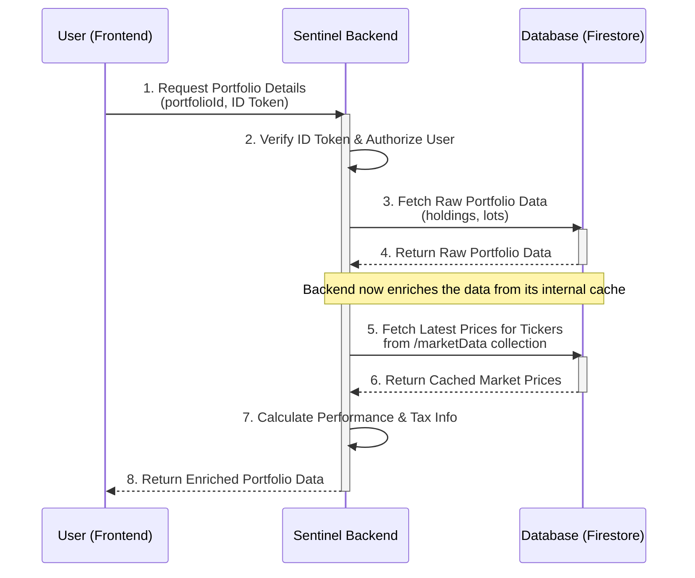
- **Description**: Retrieves the full, detailed content of a single portfolio for the authenticated user. The backend enriches the response by reading from its internal `marketData` cache to calculate performance metrics (e.g., percentage gain) and tax information.
- **Examples**:
    - **Example**:
        - A user, who owns a portfolio containing two holdings (10 shares of "VOO" and 5 shares of "AAPL"), requests the details of that specific portfolio.
        - The backend returns the complete portfolio object. This response is enriched at multiple levels:
            - **Each `Lot`** has its `ComputedInfo` with tax calculations based on the latest market price from the internal cache.
            - The **`Holding` for "VOO"** is enriched with its aggregated `ComputedInfo`: `{ totalCost: 4000, currentValue: 4500, preTaxGainLoss: 500, gainLossPercentage: 12.5 }`.
            - The **`Holding` for "AAPL"** is enriched with its aggregated `ComputedInfo`: `{ totalCost: 750, currentValue: 900, preTaxGainLoss: 150, gainLossPercentage: 20.0 }`.
            - The top-level **`Portfolio`** object is enriched with the overall aggregated `ComputedInfo`: `{ totalCost: 4750, currentValue: 5400, preTaxGainLoss: 650, gainLossPercentage: 13.68 }`.
- **Success Response**: The user's complete, enriched `Portfolio` data is returned.
- **Sub-Rules**:

| Rule ID | Rule Name | Condition | Check Point | Success Outcome | Message Keys |
|:---|:---|:---|:---|:---|:---|
| P_I_2001 | Single retrieval succeeds | Portfolio exists and the authenticated user is the owner. | Response Sentinel to User | Full, enriched portfolio data is returned. | P_I_2001 |
| P_E_2101 | User unauthorized | User is not authenticated or is not the owner of the requested portfolio. | Request User to Sentinel | Retrieval rejected with HTTP 401/403. | P_E_2101 |
| P_E_2102 | Portfolio not found | The specified `portfolioId` does not exist. | Sentinel internal | Retrieval rejected with HTTP 404 Not Found. | P_E_2102 |

**Messages**:
- **P_I_2001**: "Portfolio {portfolioId} retrieved successfully."
- **P_E_2101**: "User is not authorized to access portfolio {portfolioId}."
- **P_E_2102**: "Portfolio with ID {portfolioId} not found."

##### 2.2.2.2. P_2200: Portfolio List Retrieval

- **Sequence Diagram for Portfolio List Retrieval**

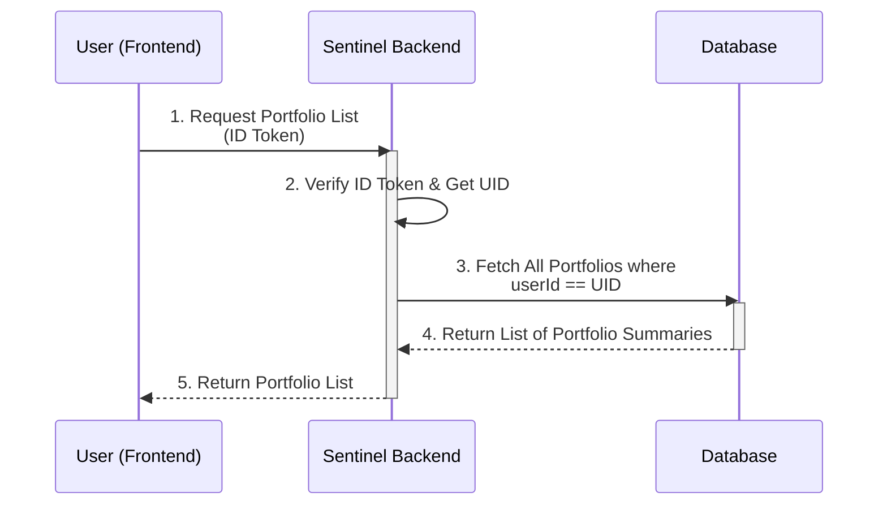
- **Description**: Retrieves a summary list of all portfolios owned by the authenticated user. The data for each portfolio in the list is a summary and does not contain the full, enriched holdings details.
- **Examples**:
    - **Example**: A user who owns three portfolios ("Real Money", "Paper Trading", "Crypto") requests their list of portfolios.
    - The backend returns a list of three objects, each containing the `portfolioId`, `name`, and perhaps a summary `currentValue`.
- **Success Response**: A list of all portfolios owned by the user is returned. The list may be empty if the user has not created any portfolios besides the default.
- **Sub-Rules**:

| Rule ID | Rule Name | Condition | Check Point | Success Outcome | Message Keys |
|:---|:---|:---|:---|:---|:---|
| P_I_2201 | List retrieval succeeds | User is authenticated. | Response Sentinel to User | A list of the user's portfolios is returned. | P_I_2201 |
| P_E_2301 | User unauthorized | User is not authenticated. | Request User to Sentinel | Retrieval rejected with HTTP 401 Unauthorized. | P_E_2301 |

**Messages**:
- **P_I_2201**: "Portfolio list retrieved successfully for user {userId}."
- **P_E_2301**: "User is not authenticated."

#### 2.2.3. Portfolio Update

##### 2.2.3.1. P_3000: Portfolio Update (Manual)

- **Sequence Diagram for Portfolio Update (Manual)**

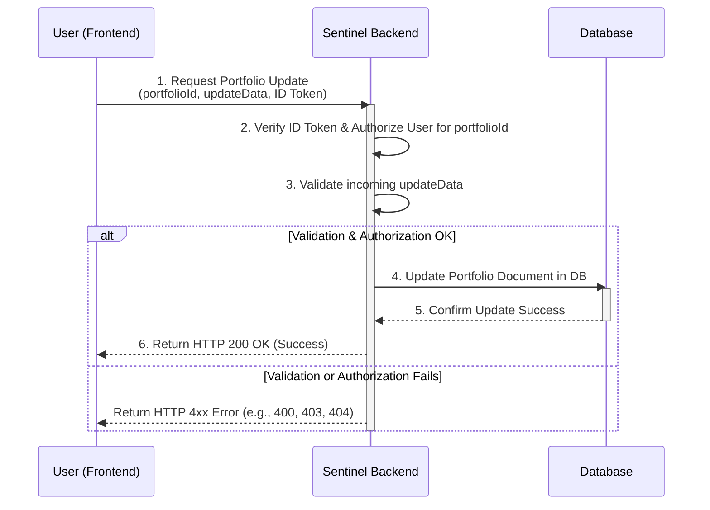

- **Description**: Updates a specific portfolio's holdings, cash reserves, name, or tax settings via various API endpoints based on direct user input. The target portfolio is identified by its `portfolioId`. When a new holding is added, a background task is triggered to backfill historical data for the ticker if it's new to the system.
- **Examples**:
    - **Example**:
        - A user wants to add 10 shares of "VOO" to their "Real Money" portfolio (ID: `xyz-123`).
        - They make a request to add a holding to portfolio `xyz-123`.
        - The portfolio is updated in the database with the new holding, and the API responds immediately. In the background, the system checks if it has historical data for "VOO" and fetches it if needed.
- **Success Response**: The specified `Portfolio` document is updated in Firestore with the new data and a new `modifiedAt` timestamp.
- **Sub-Rules**:

| Rule ID | Rule Name | Condition | Check Point | Success Outcome | Message Keys |
|:---|:---|:---|:---|:---|:---|
| P_I_3001 | Update succeeds | All provided data is valid, user is authenticated and owns the specified portfolio. | Response Sentinel to User | The specified portfolio is updated. | P_I_3001 |
| P_I_3002 | Idempotency key is replayed | `Idempotency-Key` matches a previous successful update request. | Request User to Sentinel | The response from the original successful request is returned; no new update is performed. | N/A |
| **P_I_3003** | **New Ticker Backfill** | A holding is added with a ticker that does not exist in the `marketData` collection. | Sentinel internal | A background task is triggered to fetch and store the last 200 days of historical data for the new ticker. The user's API request is not blocked. | N/A |
| P_E_3101 | User unauthorized | User is not authenticated or the UID from the token does not own the specified portfolio. | Request User to Sentinel | Update rejected with HTTP 403 Forbidden. | P_E_3101 |
| P_E_3102 | Portfolio not found | The specified `portfolioId` does not exist. | Request User to Sentinel | Update rejected with HTTP 404 Not Found. | P_E_3102 |
| P_E_3103 | Invalid ticker | Ticker is not a valid format or is not recognized by the market data API. | Request User to Sentinel | Update rejected with HTTP 400 Bad Request. | P_E_3103 |
| P_E_3104 | Invalid lot data | `quantity` or `purchasePrice` are not positive numbers, or `purchaseDate` is an invalid format or in the future. | Request User to Sentinel | Update rejected with HTTP 400 Bad Request. | P_E_3104 |
| P_E_3105 | Invalid cash amounts | `totalAmount` or `warChestAmount` are negative, or `warChestAmount` > `totalAmount`. | Request User to Sentinel | Update rejected with HTTP 400 Bad Request. | P_E_3105 |
| P_E_3106 | Invalid tax/name settings | `capitalGainTaxRate` is not between 0-100, `taxFreeAllowance` is negative, or portfolio `name` is invalid. | Request User to Sentinel | Update rejected with HTTP 400 Bad Request. | P_E_3106 |
| P_E_3107 | Idempotency key missing/invalid | `Idempotency-Key` header is missing or not a valid UUID. | Request User to Sentinel | Update rejected. | P_E_3107 |

**Messages**:
- **P_I_3001**: "Portfolio {portfolioId} updated successfully."
- **P_E_3101**: "User is not authorized to modify portfolio {portfolioId}."
- **P_E_3102**: "Portfolio with ID {portfolioId} not found."
- **P_E_3103**: "Ticker '{ticker}' is invalid or not supported."
- **P_E_3104**: "Lot data is invalid. Ensure quantity and price are positive and the date is valid."
- **P_E_3105**: "Cash amounts are invalid. Ensure amounts are non-negative and war chest does not exceed total."
- **P_E_3106**: "Portfolio name or tax settings are invalid."
- **P_E_3107**: "A valid Idempotency-Key header is required for this operation."

##### 2.2.3.2. P_3400: Set Default Portfolio

- **Sequence Diagram for Setting Default Portfolio**

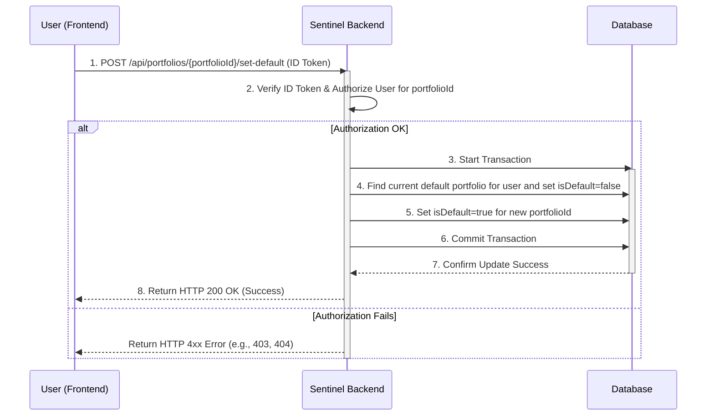

- **Description**: Designates a specific portfolio as the user's default. This operation ensures that only one portfolio per user can be the default at any given time. When a new portfolio is set as default, the backend transactionally unsets the `isDefault` flag on the previous default portfolio.
- **Examples**:
    - **Example**:
        - A user has two portfolios: "Real Money" (current default) and "Paper Trading".
        - They decide to make "Paper Trading" their new default.
        - The user sends a request to set the "Paper Trading" portfolio as default.
        - The backend updates the "Paper Trading" portfolio to `isDefault: true` and simultaneously updates the "Real Money" portfolio to `isDefault: false`.
- **Success Response**: The specified portfolio is marked as the default, and the previous default is unmarked.
- **Sub-Rules**:

| Rule ID | Rule Name | Condition | Check Point | Success Outcome | Message Keys |
|:---|:---|:---|:---|:---|:---|
| P_I_3401 | Set default succeeds | User is authenticated, owns the portfolio, and the portfolio exists. | Response Sentinel to User | The specified portfolio is set as the new default. | P_I_3401 |
| P_E_3501 | User unauthorized | User is not authenticated or does not own the specified portfolio. | Request User to Sentinel | Request rejected with HTTP 403 Forbidden. | P_E_3501 |
| P_E_3502 | Portfolio not found | The specified `portfolioId` does not exist. | Request User to Sentinel | Request rejected with HTTP 404 Not Found. | P_E_3502 |

**Messages**:
- **P_I_3401**: "Portfolio {portfolioId} is now the default."
- **P_E_3501**: "User is not authorized to modify portfolio {portfolioId}."
- **P_E_3502**: "Portfolio with ID {portfolioId} not found."

##### 2.2.3.3. P_3600: Portfolio Update (Import from File)

- **Sequence Diagram for Portfolio Update (Add Holding)**

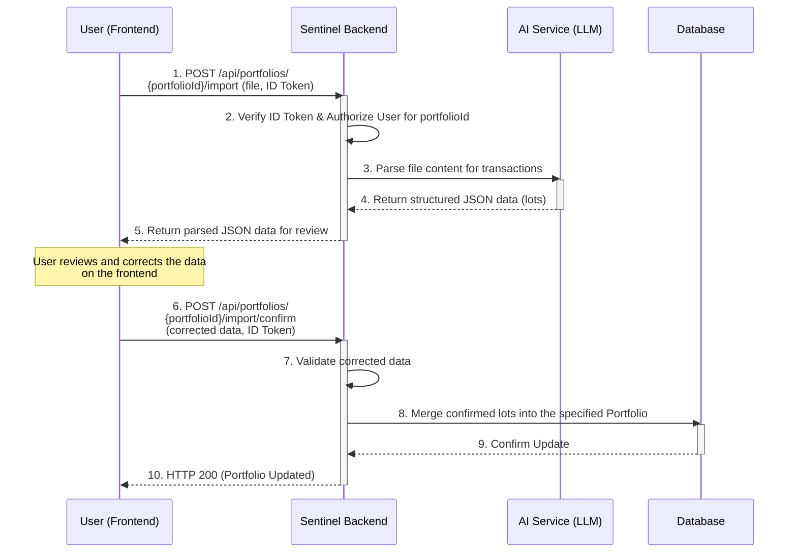

- **Description**: Handles the multi-step process of adding transaction history to a specific portfolio from a user-uploaded file.
- **Examples**:
    - **Example**:
        - A user uploads a CSV file to import transactions into their "Paper Trading" portfolio.
        - The backend calls the AI service and returns a JSON array with three parsed lot objects to the frontend.
        - The user sees the three transactions in an editable table, corrects a typo in one of the purchase prices, and clicks "Confirm".
        - The corrected data is sent to the backend and merged into the "Paper Trading" portfolio.
- **Success Response**: The specified portfolio is successfully updated with the confirmed transaction lots from the file.
- **Sub-Rules**:

| Rule ID | Rule Name | Condition | Check Point | Success Outcome | Message Keys |
|:---|:---|:---|:---|:---|:---|
| P_I_3601 | File upload succeeds | User is authenticated and owns the target portfolio, file is valid. | Request User to Sentinel | File is accepted for parsing. | P_I_3601 |
| P_I_3602 | AI parsing succeeds | The AI service successfully extracts structured transaction data from the file content. | Sentinel to AI Service | Parsed JSON data is returned to the user for review. | P_I_3602 |
| P_I_3603 | Import confirmation succeeds | User submits reviewed data, data is valid, and is successfully merged into the specified portfolio. | Request User to Sentinel | Portfolio is updated in the database. | P_I_3603 |
| P_I_3604 | Idempotency key is replayed | `Idempotency-Key` matches a previous successful confirmation request. | Request User to Sentinel | The response from the original successful request is returned; no new import is performed. | N/A |
| P_E_3701 | User unauthorized | User is not authenticated or does not own the target portfolio. | Request User to Sentinel | Request rejected with HTTP 401/403. | P_E_3701 |
| P_E_3702 | Invalid file type or size | File is not a supported type or exceeds the maximum size limit. | Request User to Sentinel | Upload rejected with HTTP 400 Bad Request. | P_E_3702 |
| P_E_3703 | AI parsing fails | The AI service cannot parse the file or returns an error. | Sentinel to AI Service | Error is returned to the user. | P_E_3703 |
| P_E_3704 | Confirmed data invalid | The data submitted by the user after review fails validation (e.g., invalid ticker, negative quantity). | Request User to Sentinel | Confirmation rejected with HTTP 400 Bad Request. | P_E_3704 |
| P_E_3705 | Idempotency key missing/invalid | `Idempotency-Key` header is missing or not a valid UUID for the confirmation step. | Request User to Sentinel | Confirmation rejected. | P_E_3705 |

**Messages**:
- **P_I_3601**: "File uploaded successfully for portfolio {portfolioId}. Parsing in progress..."
- **P_I_3602**: "File parsed successfully. Please review the extracted transactions."
- **P_I_3603**: "Portfolio {portfolioId} successfully updated with imported transactions."
- **P_E_3701**: "User is not authorized to import data to portfolio {portfolioId}."
- **P_E_3702**: "Invalid file. Please upload a valid CSV or text file under 5MB."
- **P_E_3703**: "Could not automatically parse the transaction file. Please check the file content or try manual entry."
- **P_E_3704**: "The corrected data contains errors. Please check all fields and resubmit."
- **P_E_3705**: "A valid Idempotency-Key header is required for this operation."

#### 2.2.4. Portfolio Deletion

##### 2.2.4.1. P_4000: Portfolio Deletion (Entire Portfolio)

- **Sequence Diagram for Portfolio Deletion (Entire Portfolio)**

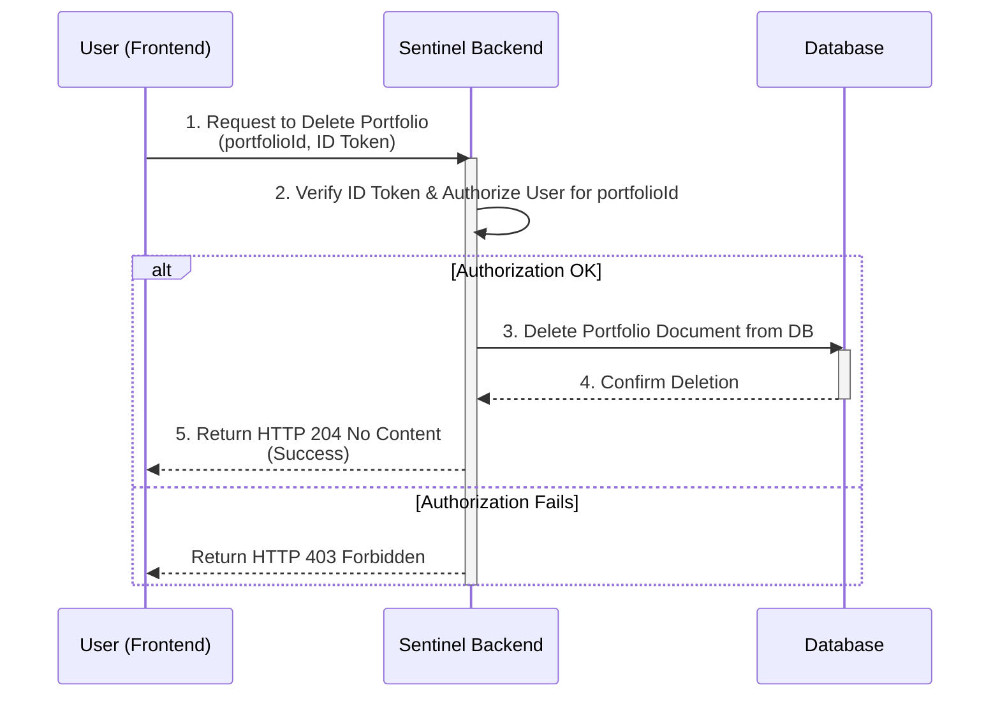

- **Description**: Deletes an entire portfolio and all of its associated holdings and data. This is a destructive and irreversible action. If the deleted portfolio was the user's default, no other portfolio is automatically selected as the new default. The user must manually designate a new default portfolio.
- **Examples**:
    - **Example**:
        - A user decides they no longer need their "Paper Trading" portfolio (ID: `abc-456`).
        - They initiate a delete request for portfolio `abc-456`.
        - The backend verifies ownership and permanently deletes the entire portfolio document from Firestore.
- **Success Response**: The specified `Portfolio` document is deleted from Firestore.
- **Sub-Rules**:

| Rule ID | Rule Name | Condition | Check Point | Success Outcome | Message Keys |
|:---|:---|:---|:---|:---|:---|
| P_I_4001 | Portfolio deletion succeeds | User is authenticated and owns the specified portfolio. | Response Sentinel to User | Portfolio successfully deleted. | P_I_4001 |
| P_I_4002 | Idempotency key is replayed | `Idempotency-Key` matches a previous successful deletion request. | Request User to Sentinel | The response from the original successful request is returned; no new deletion is performed. | N/A |
| P_E_4101 | User unauthorized | User is not authenticated or does not own the portfolio. | Request User to Sentinel | Deletion rejected with HTTP 403 Forbidden. | P_E_4101 |
| P_E_4102 | Portfolio not found | The specified `portfolioId` does not exist. | Sentinel internal | Deletion rejected with HTTP 404 Not Found. | P_E_4102 |
| P_E_4103 | Idempotency key missing/invalid | `Idempotency-Key` header is missing or not a valid UUID. | Request User to Sentinel | Deletion rejected. | P_E_4103 |

**Messages**:
- **P_I_4001**: "Portfolio {portfolioId} was successfully deleted."
- **P_E_4101**: "User is not authorized to delete portfolio {portfolioId}."
- **P_E_4102**: "Portfolio with ID {portfolioId} not found."
- **P_E_4103**: "A valid Idempotency-Key header is required for this operation."

##### 2.2.4.2. P_4200: Portfolio Deletion (Holdings/Lots)

- **Sequence Diagram for Portfolio Deletion (Holdings/Lots)**

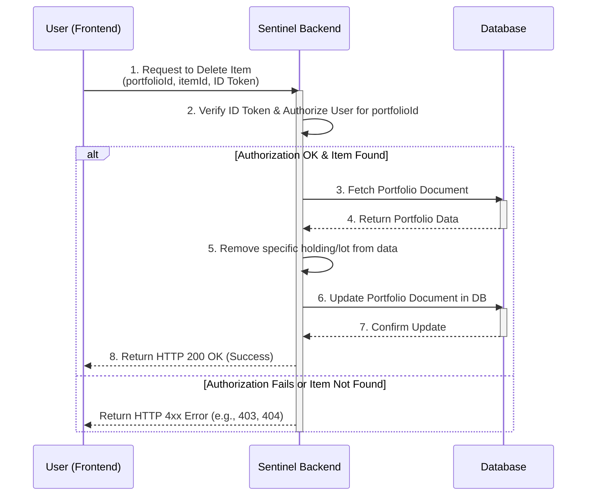

- **Description**: Deletes a specific purchase lot or an entire holding from within a user's portfolio.
- **Examples**:
    - **Example**:
        - A user has a holding of "AAPL" with two purchase lots in their "Real Money" portfolio. They realize they entered one lot incorrectly.
        - The user sends a `DELETE` request with the specific `lotId` of the incorrect lot to the endpoint for their "Real Money" portfolio.
        - The backend removes only that specific lot from the holding's `lots` array, leaving the other lot intact.
- **Success Response**: The specified item is removed from the `Portfolio` document in Firestore, and the `modifiedAt` timestamp is updated.
- **Sub-Rules**:

| Rule ID | Rule Name | Condition | Check Point | Success Outcome | Message Keys |
|:---|:---|:---|:---|:---|:---|
| P_I_4201 | Item deletion succeeds | User is authenticated, owns the portfolio, and the specified holding/lot ID exists within it. | Response Sentinel to User | Item successfully deleted. | P_I_4201 |
| P_I_4202 | Idempotency key is replayed | `Idempotency-Key` matches a previous successful deletion request. | Request User to Sentinel | The response from the original successful request is returned; no new deletion is performed. | N/A |
| P_E_4301 | User unauthorized | User is not authenticated or does not own the portfolio. | Request User to Sentinel | Deletion rejected with HTTP 403 Forbidden. | P_E_4301 |
| P_E_4302 | Item not found | The specified `holdingId` or `lotId` does not exist in the user's portfolio. | Sentinel internal | Deletion rejected with HTTP 404 Not Found. | P_E_4302 |
| P_E_4303 | Idempotency key missing/invalid | `Idempotency-Key` header is missing or not a valid UUID. | Request User to Sentinel | Deletion rejected. | P_E_4303 |

**Messages**:
- **P_I_4201**: "Item successfully deleted from portfolio {portfolioId}."
- **P_E_4301**: "User is not authorized to delete items from this portfolio."
- **P_E_4302**: "The specified holding or lot could not be found in this portfolio."
- **P_E_4303**: "A valid Idempotency-Key header is required for this operation."

--- 

## 3. Strategy Rule Management

This section details the management of buy and sell rules that encode the user’s investment strategy.

### 3.1. Rule Data Model and Business Process

**Associated Data Models**:
- `Rule`:
  - `ruleId`: Unique UUID.
  - `portfolioId`: UUID linking to portfolio.
  - `ruleType`: Enum (`BUY`, `SELL`).
  - `ticker`: String (target asset, e.g., "QQQ.DE").
  - `conditions`: Array of `Condition` objects.
  - `status`: Enum (`ENABLED`, `PAUSED`).
  - `createdAt`, `modifiedAt`: ISODateTime.
- `Condition`:
  - `conditionId`: Unique UUID.
  - `type`: Enum (`DRAWDOWN`, `MA200`, `RSI`, `VIX`, `PROFIT_TARGET`, `TRAILING_DRAWDOWN`, `AFTER_TAX_PROFIT`).
  - `parameters`: Object (e.g., `{percentage: 15}` for DRAWDOWN).
- `Alert` (generated, see Section 3):
  - `alertId`: Unique UUID.
  - `ruleId`: UUID linking to rule.
  - `triggeredAt`: ISODateTime.
  - `marketData`: Object with relevant data (e.g., current price, RSI).
  - `taxInfo`: Object (for SELL rules, includes preTaxProfit, capitalGainTax, afterTaxProfit).

**Supported Conditions**:
- **BUY**:
  - `DRAWDOWN`: Index/ticker falls X% from 52-week high.
  - `MA200`: Price crosses below 200-day moving average.
  - `RSI`: Weekly RSI < 30.
  - `VIX`: VIX closes > Y.
- **SELL**:
  - `PROFIT_TARGET`: Holding gain ≥ X%.
  - `TRAILING_DRAWDOWN`: Holding falls Y% from peak since purchase.
  - `RSI`: Weekly RSI > 70.
  - `MA200`: Price > Z% above MA200.
  - `AFTER_TAX_PROFIT`: After-tax gain ≥ W%.

**Business Process**:
1. **Creation**: User creates a rule by specifying `ruleType`, `ticker`, and `conditions`. Rule is set to `ENABLED`.
2. **Update**: User modifies conditions or status (`ENABLED`/`PAUSED`).
3. **Deletion**: User removes a rule.
4. **Retrieval**: User retrieves all rules or a specific rule.
5. **Validation**: Ensures valid tickers, condition parameters, and user authorization.

**Sequence Diagram for Rule Creation**

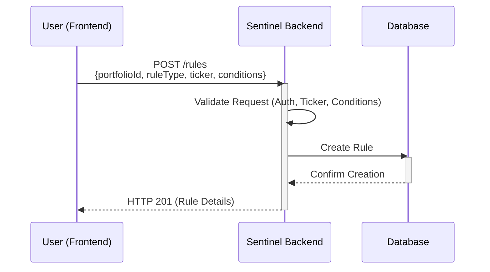

**Example**:
- User creates a BUY rule for "QQQ.DE": `conditions: [{type: "DRAWDOWN", parameters: {percentage: 15}}, {type: "RSI", parameters: {threshold: 30}}]`.
- Rule created with `ruleId: "rule-001"`, `status: "ENABLED"`.
- If NASDAQ-100 drops 15% from peak and RSI < 30, an alert is triggered (Section 3).

### 3.2. Rule Management Rules

#### 3.2.1. R_1000: Rule Creation

- **Description**: Creates a new buy or sell rule.
- **Success Response**: Rule created with `ENABLED` status.
- **Sub-Rules**:

| Rule ID | Rule Name | Condition | Check Point | Success Outcome | Message Keys |
|:---|:---|:---|:---|:---|:---|
| R_I_1001 | Rule creation succeeds | Valid data, user authorized. | Response Sentinel to User | Rule created. | R_I_1001 |
| R_I_1002 | Idempotency key valid | `Idempotency-Key` provided, valid UUID. | Request User to Sentinel | Request proceeds. | N/A |
| R_E_1101 | User unauthorized | User not authenticated or not portfolio owner. | Request User to Sentinel | Creation rejected. | R_E_1101 |
| R_E_1102 | Invalid ticker | Ticker not supported by Alpha Vantage. | Request User to Sentinel | Creation rejected. | R_E_1102 |
| R_E_1103 | Invalid conditions | Unknown condition type or invalid parameters. | Request User to Sentinel | Creation rejected. | R_E_1103 |
| R_E_1104 | Portfolio not found | `portfolioId` invalid. | Sentinel internal | Creation rejected. | R_E_1104 |

**Messages**:
- **R_I_1001**: "Rule {ruleId} created successfully for portfolio {portfolioId}."
- **R_E_1101**: "User is not authorized to create rule for portfolio {portfolioId}."
- **R_E_1102**: "Ticker '{ticker}' is invalid or not supported."
- **R_E_1103**: "Conditions invalid: Unknown type or invalid parameters."
- **R_E_1104**: "Portfolio {portfolioId} not found."

#### 3.2.2. R_2000: Rule Update

- **Description**: Modifies an existing rule’s conditions or status.
- **Success Response**: Rule updated.
- **Sub-Rules**:

| Rule ID | Rule Name | Condition | Check Point | Success Outcome | Message Keys |
|:---|:---|:---|:---|:---|:---|
| R_I_2001 | Update succeeds | Valid data, user authorized. | Response Sentinel to User | Rule updated. | R_I_2001 |
| R_E_2101 | User unauthorized | User not authorized. | Request User to Sentinel | Update rejected. | R_E_2101 |
| R_E_2102 | Rule not found | `ruleId` invalid. | Sentinel internal | Update rejected. | R_E_2102 |

**Messages**:
- **R_I_2001**: "Rule {ruleId} updated successfully."
- **R_E_2101**: "User is not authorized to update rule {ruleId}."
- **R_E_2102**: "Rule {ruleId} not found."

#### 3.2.3. R_3000: Rule Retrieval

- **Description**: Retrieves rule(s) for a portfolio.
- **Success Response**: Rule(s) returned.
- **Sub-Rules**:

| Rule ID | Rule Name | Condition | Check Point | Success Outcome | Message Keys |
|:---|:---|:---|:---|:---|:---|
| R_I_3001 | Retrieval succeeds | Rules exist, user authorized. | Response Sentinel to User | Rules returned. | R_I_3001 |
| R_E_3101 | User unauthorized | User not authorized. | Request User to Sentinel | Retrieval rejected. | R_E_3101 |

**Messages**:
- **R_I_3001**: "Rules retrieved successfully for portfolio {portfolioId}."
- **R_E_3101**: "User is not authorized to retrieve rules for portfolio {portfolioId}."

## 4. Market Monitoring and Notification

This section details the automated monitoring of market data and generation of notifications when rules are triggered.

### 4.1. Monitoring and Notification Data Model and Business Process

**Associated Data Models**:
- `MarketData` (fetched daily):
  - `ticker`: String.
  - `closePrice`: EUR.
  - `highPrice`: EUR (52-week high for DRAWDOWN).
  - `ma200`: EUR (200-day moving average).
  - `rsiWeekly`: Number (weekly RSI).
  - `vixClose`: Number (VIX closing value).
- `Alert`:
  - `alertId`: Unique UUID.
  - `ruleId`: UUID.
  - `triggeredAt`: ISODateTime.
  - `marketData`: Relevant data at trigger time.
  - `taxInfo`: For SELL rules, includes lot-specific tax calculations.
  - `notificationStatus`: Enum (`PENDING`, `SENT`, `FAILED`).

**Business Process**:
1. **Monitoring**:
   - Daily, after European market close, the Monitoring Engine fetches `MarketData` for all tickers in active rules.
   - For each `ENABLED` rule, conditions are evaluated against `MarketData` and portfolio data.
2. **Alert Generation**:
   - If all conditions are met, an `Alert` is created with relevant `marketData` and `taxInfo` (for SELL rules, computed using FIFO).
   - Alert is queued for notification.
3. **Notification**:
   - Notification Service sends alerts via email and/or push notification.
   - `notificationStatus` updated to `SENT` or `FAILED`.

**Sequence Diagram for Monitoring and Notification**

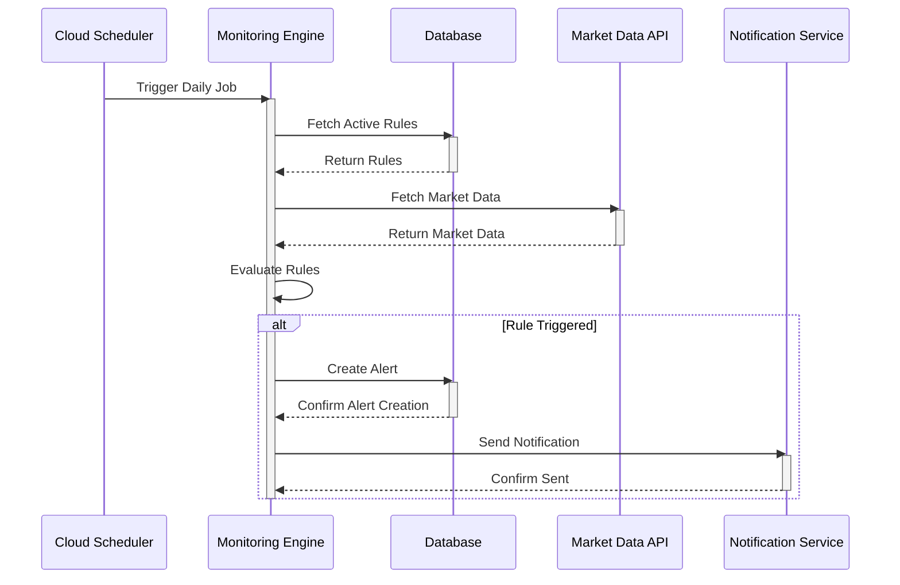

**Example**:
- Rule: BUY "QQQ.DE" when NASDAQ-100 drops 15% from peak and RSI < 30.
- Market Data: NASDAQ-100 52-week high 12,000 EUR, close 10,200 EUR (15% drop), RSI 28.
- Alert created: `marketData: {closePrice: 10200, rsiWeekly: 28}`, `notificationStatus: PENDING`.
- Email sent: “Buy Opportunity: QQQ.DE dropped 15%, RSI 28.”

### 4.2. Monitoring and Notification Rules

#### 4.2.1. M_1000: Rule Evaluation and Alert Generation

- **Description**: Evaluates rules and generates alerts.
- **Success Response**: Alerts created for triggered rules.
- **Sub-Rules**:

| Rule ID | Rule Name | Condition | Check Point | Success Outcome | Message Keys |
|:---|:---|:---|:---|:---|:---|
| M_I_1001 | Evaluation succeeds | Rules evaluated, alerts generated. | Engine Internal | Alerts queued. | M_I_1001 |
| M_I_1002 | SELL Tax calculation | For SELL rules, FIFO-based tax info computed. | Engine Internal | `taxInfo` included in alert. | N/A |
| M_E_1101 | Market data unavailable | API call fails for a ticker. | Engine to API | Rule evaluation skipped, error logged. | M_E_1101 |

**Messages**:
- **M_I_1001**: "Daily evaluation completed, {numAlerts} alerts generated."
- **M_E_1101**: "Market data unavailable for ticker {ticker}, evaluation skipped."

#### 4.2.2. M_2000: Notification Delivery

- **Description**: Sends alerts to users.
- **Success Response**: Notifications delivered.
- **Sub-Rules**:

| Rule ID | Rule Name | Condition | Check Point | Success Outcome | Message Keys |
|:---|:---|:---|:---|:---|:---|
| N_I_2001 | Delivery succeeds | Notification sent via email/push. | Notify Service | `notificationStatus: SENT`. | N_I_2001 |
| N_E_2101 | Delivery fails | Service unavailable or invalid recipient. | Notify Service | `notificationStatus: FAILED`. | N_E_2101 |

**Messages**:
- **N_I_2001**: "Notification for alert {alertId} sent successfully."
- **N_E_2101**: "Notification for alert {alertId} failed: {error_reason}."

## 5. User Authentication and Authorization

This section details the processes for user registration, login, logout, and the authorization mechanism for securing backend API endpoints. The system uses a decoupled authentication model where the frontend communicates directly with Firebase Authentication for identity management, and the Sentinel backend is only responsible for validating the resulting tokens.

### 5.1. User Authentication Data Model and Business Process

#### 5.1.1. Associated Data Models

- **`Firebase User` (Managed by Firebase Authentication Service):**
  - `uid`: Unique user identifier provided by Firebase. This is the primary key linking the user to their data in Firestore.
  - `email`: The user's email address.
  - `metadata`: Includes `creationTime` and `lastSignInTime`.
- **`Client-Side Auth State` (Managed by Frontend in Pinia store):**
  - `user`: Object containing user info like `uid` and `email`.
  - `token`: String, the Firebase ID Token (JWT) used for API calls.
  - `status`: Enum (`AUTHENTICATED`, `ANONYMOUS`).
- **`ID Token` (JWT - JSON Web Token):**
  - A short-lived, signed token generated by the Firebase client-side SDK upon successful login or signup.
  - The frontend sends this token in the `Authorization` header of every API request to prove the user's identity.

#### 5.1.2. Business Process

1. **Signup/Login (Frontend ↔ Firebase)**: The user interacts with the frontend UI. The Vue.js application communicates **directly and exclusively with the Firebase Authentication service** to handle user creation and password verification. The Sentinel backend is **not involved** in this process.
2. **Token Issuance (Firebase → Frontend)**: Upon successful authentication, Firebase issues a secure ID Token (JWT) to the frontend. The frontend stores this token and the user's state.
3. **Logout (Frontend → Firebase)**: The user initiates a logout. The frontend communicates with the Firebase client SDK to sign the user out and clears its local state.
4. **Authorization (Frontend → Sentinel Backend)**: For every request to a protected Sentinel API endpoint (e.g., retrieving a portfolio), the frontend includes the user's ID Token in the `Authorization: Bearer <ID_TOKEN>` header.
5. **Token Validation (Sentinel Backend → Firebase)**: The Sentinel backend receives the request, extracts the ID Token, and uses the Firebase Admin SDK to verify its signature and integrity with Firebase's servers. If the token is valid, the backend decodes it to get the user's `uid` and proceeds. If invalid, the request is rejected.

**Security Note**: The user's `uid` is **never** passed as a URL parameter or in the request body. It is always derived on the backend from the verified ID Token. This prevents one user from attempting to access another user's data by tampering with API requests.

**Note on User Deletion:** The functionality for a user to delete their own account is a planned feature for a future release and is out of scope for the MVP.

#### 5.1.3. Sequence Diagram for an Authenticated API Call

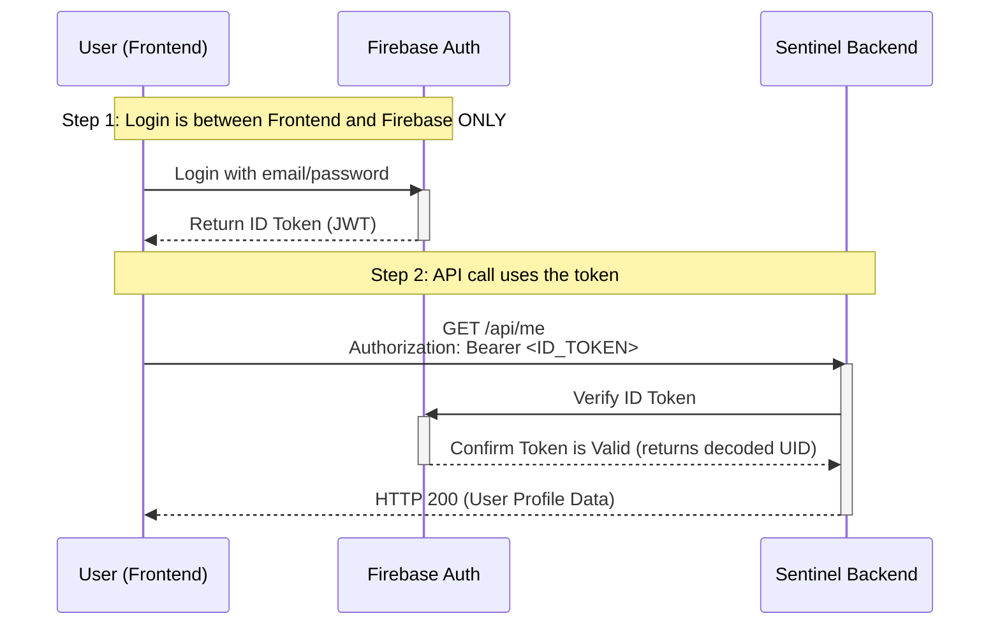

### 5.2. User Authentication and Authorization Rules

#### 5.2.1. U_1000: User Signup

- **Description**: Creates a new user account in Firebase Authentication and initializes their corresponding application data (e.g., portfolio). This process is initiated from the frontend.
- **Success Response**: User account is created in Firebase, and a new, empty portfolio is created in Firestore linked to the user's UID.
- **Sub-Rules**:

| Rule ID | Rule Name | Condition | Check Point | Success Outcome | Message Keys |
|:---|:---|:---|:---|:---|:---|
| U_I_1001 | Signup succeeds | Email is valid, password meets complexity requirements, email is not already in use. | Response Firebase to User, then User to Sentinel | Firebase user created. Sentinel backend creates associated portfolio (triggers P_1000). | U_I_1001 |
| U_E_1101 | Email already in use | User attempts to sign up with an email that already exists. | Response Firebase to User | Signup rejected by Firebase. | U_E_1101 |
| U_E_1102 | Invalid email format | Email address provided is not in a valid format. | Response Firebase to User | Signup rejected by Firebase. | U_E_1102 |
| U_E_1103 | Weak password | Password does not meet Firebase's minimum security requirements (e.g., less than 6 characters). | Response Firebase to User | Signup rejected by Firebase. | U_E_1103 |

**Messages**:
- **U_I_1001**: "User account created successfully for {email}."
- **U_E_1101**: "This email address is already in use by another account."
- **U_E_1102**: "The email address is improperly formatted."
- **U_E_1103**: "The password must be at least 6 characters long."

#### 5.2.2. U_2000: User Login

- **Description**: Authenticates a user via the frontend and provides an ID Token for API sessions.
- **Success Response**: User is successfully authenticated, and the frontend receives a valid ID Token.
- **Sub-Rules**:

| Rule ID | Rule Name | Condition | Check Point | Success Outcome | Message Keys |
|:---|:---|:---|:---|:---|:---|
| U_I_2001 | Login succeeds | Correct email and password provided for an existing user. | Response Firebase to User | User logged in. Frontend receives ID Token to use for API calls. | U_I_2001 |
| U_E_2101 | Invalid credentials | Incorrect password or email address does not exist. | Response Firebase to User | Login rejected by Firebase. | U_E_2101 |

**Messages**:
- **U_I_2001**: "User {email} logged in successfully."
- **U_E_2101**: "Invalid login credentials. Please check your email and password."

#### 5.2.3. U_3000: API Request Authorization

- **Description**: Verifies the ID Token for every incoming request to a protected backend endpoint. This is a server-side process.
- **Success Response**: The token is validated, and the request is allowed to proceed to the business logic.
- **Sub-Rules**:

| Rule ID | Rule Name | Condition | Check Point | Success Outcome | Message Keys |
|:---|:---|:---|:---|:---|:---|
| U_I_3001 | Authorization succeeds | A valid, unexpired ID Token is provided in the `Authorization` header. | Request User to Sentinel | Request is processed. The user's UID is available to the endpoint. | N/A |
| U_E_3101 | Authorization header missing | No `Authorization` header is present in the request. | Request User to Sentinel | Request rejected with HTTP 401 Unauthorized. | U_E_3101 |
| U_E_3102 | Token malformed or invalid | The token provided in the header is not a valid JWT or cannot be verified by Firebase. | Sentinel internal | Request rejected with HTTP 401 Unauthorized. | U_E_3102 |
| U_E_3103 | Token expired | The token provided is valid but has expired. | Sentinel internal | Request rejected with HTTP 401 Unauthorized. | U_E_3103 |

**Messages**:
- **U_E_3101**: "Authorization header is missing."
- **U_E_3102**: "The provided ID token is invalid."
- **U_E_3103**: "The provided ID token has expired. Please log in again."


## 6. Technical Specifications

### 6.1. Architecture

#### 6.1.1. Architectural Principles

- **Stateless Backend**: The backend API is designed to be completely stateless. User authentication is handled via short-lived, self-contained JWTs (Firebase ID Tokens) sent with each request. This eliminates the need for server-side sessions, enhances security, and allows for seamless horizontal scalability on platforms like Google Cloud Run.
- **Monolith for MVP**: The backend is a "Self-Contained System" (a well-structured monolith) for the MVP to prioritize development speed and simplicity. It can be refactored into microservices in the future if required by scale.

#### 6.1.2. Components
- **Frontend**: Vue.js v3 (TypeScript), hosted on Firebase Hosting.
- **Backend API**: Python FastAPI, deployed on Google Cloud Run.
- **Database**: Google Cloud Firestore (NoSQL), containing user portfolios and a shared market data cache.
- **Notification Service**: SendGrid (email), Firebase Cloud Messaging (push).
- **Market Data**: Alpha Vantage API.
- **Scheduler**: Google Cloud Scheduler (for triggering daily data sync).

#### 6.1.3. Architectural Diagram

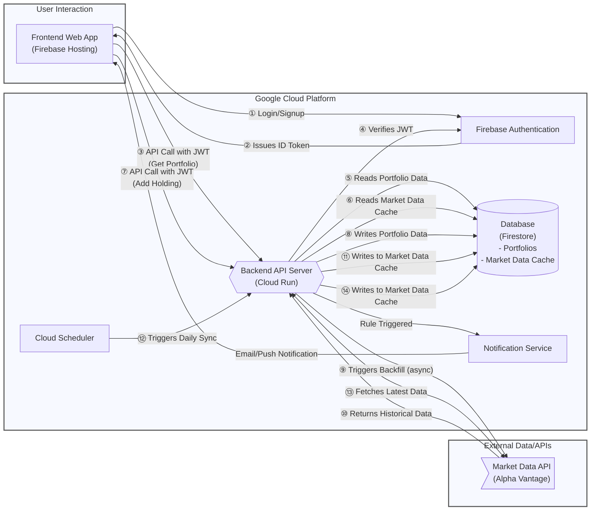

### 6.2. Security

- **Encryption**: TLS for data in transit, Firestore encryption at rest.
- **Authentication**: Google Cloud Identity Platform (OAuth2, MFA).
- **Authorization**: User-specific data access enforced. No direct, unauthenticated access to the shared `marketData` collection is possible via the API.
- **Privacy**: Minimal PII (email only), clear privacy policy.
- **Idempotency Handling**:
    - **Mechanism**: To prevent duplicate operations (e.g., from network retries), all state-changing requests (`POST`, `PUT`, `DELETE`) require a client-generated `Idempotency-Key` header containing a valid **UUID version 4**.
    - **Technical Implementation**: The backend will use a dedicated Firestore collection named `idempotencyKeys`.
        - The `Idempotency-Key` from the request will be used as the document ID in this collection.
        - Upon receiving a request, the backend will first check if a document with this ID exists.
        - If it exists, the stored response will be returned immediately without re-processing the request.
        - If it does not exist, the backend will create a new document, process the business logic, store the result (status code and response body) in the document, and then return the response.
    - **Data Model (`idempotencyKeys` document):**
        ```json
        {
          "userId": "string",
          "createdAt": "timestamp",
          "response": {
            "statusCode": "number",
            "body": "string"
          }
        }
        ```
    - **Cleanup**: A Time-to-Live (TTL) policy will be enabled on this collection in Firestore to automatically delete keys after 24 hours, matching the key expiry rule.

### 6.3. Data Sources

- **Provider**: Alpha Vantage.
- **Frequency**: Data is fetched from the provider under two conditions:
    1.  **Daily Sync**: A scheduled job runs once per day to fetch the latest closing prices for all unique tickers currently held by users.
    2.  **On-Demand Backfill**: When a user adds a ticker that is new to the system, a one-time job fetches the last 200 days of historical data for that ticker.
- **Data Points**: OHLC prices, MA200, weekly RSI, VIX close, ATR.

### 6.4. Non-Functional Requirements

- **Performance**: API response time < 500ms, daily monitoring completes in < 10 min.
- **Scalability**: Cloud Run/Firestore scale automatically.
- **Availability**: 99.9% uptime via GCP.