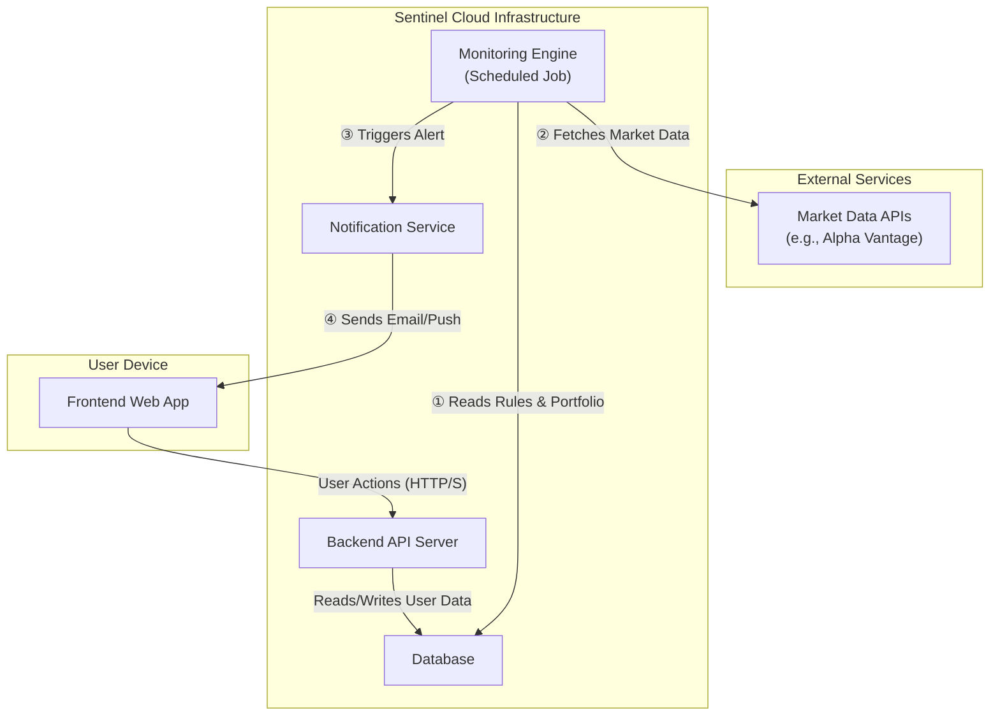

# Product Specification for Sentinel v0.1 (MVP)

## 0. Introduction

### 0.1. Purpose and Audience

Sentinel is a personal investment strategy automation tool designed for disciplined, long-term retail investors. This document outlines the product specifications for the Minimum Viable Product (MVP) of Sentinel, serving as the foundational agreement for the initial development cycle.

The primary purpose of this document is to establish a single source of truth that eliminates ambiguity and ensures a shared, precise understanding of the MVP's scope, functionality, and underlying logic.

This document is written for the following audience:

- The Product Owner/Lead Developer: To provide a clear and structured vision of the end product, ensuring all development efforts are aligned with the core objectives.
- Future Development & Testing Teams: To serve as a systematic guide for implementation and a comprehensive reference for validation and quality assurance.

### 0.2. Core Problem and Vision

The modern retail investor faces several core challenges:

1. **Time & Energy Deficit:** A lack of time and energy to constantly monitor markets.
2. **Cost Barrier:** The high cost of professional wealth management services.
3. **The Behavioral Gap:** The well-documented gap between a market index's theoretical return (Beta) and the average investor's actual, lower return. This gap is caused almost entirely by emotional decision-making (e.g., panic selling during crashes, euphoric buying at peaks) that derails even the simplest long-term strategies.

Sentinel is envisioned to solve these problems by empowering users to encode their own long-term investment philosophy into a set of clear, automated rules. The app will act as a tireless, unemotional **behavioral guardrail**, providing timely, actionable notifications based on the user's own strategy. This allows the user to remain in complete control of their capital and decisions, while delegating the tedious task of market-watching and opportunity-spotting to the tool.

### 0.3. Document Structure

This document is organized to provide a systematic overview of the product, from high-level strategy to detailed functional requirements.

- Chapter 0: Introduction: This section.
- Chapter 1: Core Investment Strategies: A concise description of the investment philosophies that the Sentinel MVP will be built to support. This is the "Why" behind the features.
- Chapter 2: Functional Requirements: A detailed breakdown of the app's features and user-facing components for the MVP.
- Chapter 3: Non-Functional Requirements: Specifications regarding data sources, security, and performance.

### 0.4. Competitive Landscape & Market Positioning

While the investment application market is mature, Sentinel occupies a distinct and underserved niche by focusing on strategic automation rather than execution or passive management.

- **Robo-Advisors (e.g., Betterment, Wealthfront):**
    - **What they do:** These platforms provide a fully managed, passive investment *service*. They build and automatically rebalance a portfolio for the user based on a risk profile.
    - **Sentinel's Difference:** Sentinel is a *tool*, not a service. It does not manage money. It empowers the user by automating *their own* strategy, keeping them in full control of their decisions and capital. Sentinel helps execute a user-defined plan, whereas robo-advisors execute a firm-defined plan.

- **Brokerage Platforms (e.g., Interactive Brokers, Fidelity):**
    - **What they do:** These are complex platforms for trade *execution*. They offer a vast array of features, including basic price alerts.
    - **Sentinel's Difference:** Sentinel prioritizes strategic simplicity over feature complexity. Instead of offering a disconnected toolbox of alerts, Sentinel is built around an integrated investment philosophy. It makes setting a few powerful, long-term strategic rules (e.g., "Notify me when the market is down 20% from its peak and RSI is below 30") incredibly simple, a task that is often complex or impossible on brokerage platforms.

- **Portfolio Trackers (e.g., Empower Personal Dashboard):**
    - **What they do:** These tools aggregate a user's financial data to provide an analytical overview of past performance and current holdings.
    - **Sentinel's Difference:** Sentinel is fundamentally *action-oriented* and *forward-looking*. Its purpose is not to analyze the past, but to trigger a future, pre-planned action based on live market conditions.

In summary, Sentinel is not another way to trade or a hands-off management service. It is a **strategic automation layer** that sits between the investor's philosophy and their brokerage account, designed to enforce discipline and turn market volatility from a source of fear into a source of opportunity.

---

## 1. Core Investment Strategies

Sentinel is not a tool for day trading or market speculation. It is built upon a hybrid "Core-Satellite" investment model designed for patient capital accumulation and risk management. The MVP will support the following two interconnected strategies.

### 1.1. Core Strategy: Systematic Accumulation

This strategy forms the stable foundation of the user's portfolio. It is a non-emotional, automated approach to building wealth over the long term by consistently investing in broad market index funds (ETFs).

- **Allocation Mechanism:** The user allocates a fixed portion of their monthly disposable income to a Systematic Regular Investment plan.
- **Objective:** To achieve market-average returns (Beta) through dollar-cost averaging, thereby smoothing out market volatility and ensuring the user is always participating in the market's long-term upward trend.

### 1.2. Satellite Strategy: Opportunistic Rebalancing

This strategy is designed to enhance returns (Alpha) by making disciplined, rule-based decisions during periods of extreme market sentiment. It consists of two sides of the same coin: buying during market panic and selling during market euphoria. The funds for this strategy are sourced from the other portion of the user's monthly disposable income, which is accumulated as a cash "war chest."

#### 1.2.1. Buy Triggers (Buying the Dip)

This is the process of deploying the accumulated cash reserve when market downturns present attractive entry points. The objective is to acquire quality assets at a significant discount to their recent highs. The MVP will support triggers based on a user-defined combination of the following rules:

- **Market Drawdown:** Trigger a notification when a target index (e.g., NASDAQ-100) falls by a user-defined percentage (e.g., 15%) from its 52-week high.
- **Technical Indicators:**
    - Trigger when a target index's price crosses below its 200-day moving average (MA200).
    - Trigger when a target index's weekly Relative Strength Index (RSI) falls below 30.
- **Volatility Index (VIX):** Trigger when the VIX index closes above a user-defined level (e.g., 35).

#### 1.2.2. Sell Triggers (Locking in Profits)

This is a risk-management process designed to systematically secure paper profits and rebalance the portfolio when the market becomes over-extended and euphoric. The objective is to reduce risk exposure and replenish the cash "war chest" for future buying opportunities. The MVP will support triggers based on a user-defined combination of the following rules:

- **Position-Based Rules:**
    - **Fixed Profit Target:** Trigger when a specific holding achieves a user-defined percentage gain (e.g., +100%).
    - **Trailing Drawdown:** Trigger when a specific holding falls by a user-defined percentage (e.g., 20%) from its highest price since purchase.
- **Market-Based Rules:**
    - Trigger when a target index's weekly RSI rises above 70.
    - Trigger when a target index's price is more than a user-defined percentage (e.g., 25%) above its MA200.

Furthermore, a core principle that enhances all of the above rules is **Tax-Aware Decision Making**. Sentinel recognizes that a sell decision is only "good" if the **after-tax return** is acceptable. Therefore, sell alerts will be enriched with tax context, allowing the user to create more intelligent, compound rules. This includes concepts such as:

- **Profit Buffering:** Combining a market signal with a condition that the after-tax gain must exceed a user-defined minimum percentage.
- **Tax Allowance Harvesting:** Proactively identifying opportunities to realize gains to utilize the user's annual tax-free allowance.
- **FIFO-Aware Context:** Providing detailed tax implications based on the specific lots that would be sold (First-In, First-Out) when a rule is triggered, allowing for a fully informed decision.

---

## 2. Functional Requirements (User Epics & Stories)

This chapter defines the functionality of the Sentinel MVP from the user's perspective. It is structured around "Epics," which represent high-level user goals. Each epic is then broken down into more specific "User Stories" that describe a particular piece of functionality.

### 2.1. Epic 1: Portfolio & Cash Management

### 2.1. Epic 1: Portfolio & Cash Management

This epic covers the user's need to provide Sentinel with a complete and accurate picture of their financial state, which is the foundation for all monitoring activities.

- **User Goal:** As a user, I want to easily log and maintain my investment portfolio and cash reserves so that Sentinel has the correct data to apply my strategic rules.

- **MVP User Stories:**
    - **Story 1.1 (Initial Portfolio Setup):** As a new user, I want to manually input my current investment holdings, including the **individual purchase lots (date, quantity, and price per share)**, so that Sentinel can accurately track my cost basis for tax calculations.
    - **Story 1.2 (Cash Reserve Management):** As a user, I want to input my total cash available for investment and designate a specific amount as my "war chest" for opportunistic buying, so that Sentinel knows how much capital can be deployed when a 'buy' trigger is met.
    - **Story 1.3 (Logging Transactions):** As a user, after I make a trade or add my monthly savings, I want to be able to quickly log the transaction (e.g., "Bought 10 shares of VOO," "Added $500 to war chest") so that my portfolio data and cost basis remains up-to-date.
    - **Story 1.4 (Tax Configuration):** As a user, I want to configure basic tax parameters, such as my country's capital gains tax rate (e.g., ~26.4% for Germany) and my annual tax-free allowance (`Sparer-Pauschbetrag`), so that Sentinel can provide personalized after-tax estimations.
    
### 2.2. Epic 2: Strategy Rule Management

This epic represents the core interactive feature of Sentinel. It is where the user translates their investment philosophy (from Chapter 1) into concrete, machine-readable rules.

- **User Goal:** As a user, I want to create, view, and manage a set of personalized buy and sell rules so that the app can automatically monitor the market on my behalf.

- **MVP User Stories:**
    - **Story 2.1 (Create a Buy Rule):** As a user, I want to create a "Buy Trigger" by selecting a market condition (e.g., "NASDAQ-100 drops X% from peak," "VIX is above Y") and linking it to a target asset (e.g., QQQ), so that Sentinel can notify me of a buying opportunity I defined.
    - **Story 2.2 (Create a Tax-Aware Sell Rule):** As a user, I want to create a "Sell Trigger" by combining a market condition (e.g., "trailing drawdown of X%") with a personal financial condition (e.g., "only if my after-tax profit is greater than Y%"), so that Sentinel only alerts me to opportunities that are genuinely profitable for my situation.
    - **Story 2.3 (View Active Rules):** As a user, I want to see a clear, consolidated list of all my active buy and sell rules so that I can easily review my overall strategy at a glance.
    - **Story 2.4 (Manage Rules):** As a user, I want to be able to pause, edit, or delete an existing rule so that I can adapt my strategy over time without having to start from scratch.

### 2.3. Epic 3: Automated Monitoring & Notification

This epic describes the core, non-interactive service that Sentinel provides. It is the "engine" that works in the background to execute the user's strategy.

- **User Goal:** As a user, I want Sentinel to tirelessly watch the markets for me and alert me the moment my conditions are met, so that I am freed from the need to constantly check prices and charts.

- **MVP User Stories:**
    - **Story 3.1 (Receive Timely Alert):** As a user, when one of my predefined rules is triggered, I want to receive an immediate and reliable notification via email and/or a mobile push notification.
    - **Story 3.2 (Understand the Alert):** As a user, I want the notification to be clear, concise, and context-rich.
        - For a **Buy Alert**, it should state which rule was triggered and the relevant market data.
        - For a **Sell Alert**, it must provide a detailed breakdown, including: the market signal that was triggered, the specific share lots that would be sold (FIFO), the pre-tax gain, the estimated capital gains tax, and the final estimated after-tax profit.
    - **Story 3.3 (Alert History):** As a user, I want to view a history of all triggered alerts in the app, so that I can review past opportunities and decisions.

---

## 3. Technical & Non-Functional Specifications

This chapter outlines the high-level technical architecture, data sources, and other non-functional requirements for the Sentinel MVP. It serves as a guide for development, ensuring the system is built on a robust and scalable foundation.

### 3.1. High-Level Conceptual Architecture

The Sentinel system is designed as a modern web application with a decoupled architecture. This ensures that the user-facing components are separate from the core data processing and monitoring logic, allowing for greater stability and scalability.

The system consists of four main logical areas: the User's device, the Sentinel Cloud Infrastructure, and External Services.

#### 3.1.1. Component Descriptions

- **Frontend Web App:**
    - This is the user interface that runs in the browser on the user's computer or mobile device.
    - It is responsible for all user interactions defined in Chapter 2, such as logging portfolio data (Story 1.x) and managing strategy rules (Story 2.x).
    - It communicates with the Backend API Server to send and retrieve user data.

- **Backend API Server:**
    - This is the central brain of the application.
    - It handles user authentication and security.
    - It exposes a set of API endpoints for the Frontend to consume.
    - It is responsible for all business logic related to creating, reading, updating, and deleting user data (portfolio, rules, etc.) in the database.

- **Database:**
    - A persistent storage solution (e.g., a SQL or NoSQL database).
    - It securely stores all user-specific information, including their portfolio holdings, cash reserves, defined strategy rules, and the history of triggered alerts.

- **Monitoring Engine (Scheduled Job):**
    - This is the core automated service of Sentinel. It operates in the background, independent of the user being logged in.
    - It runs on a predefined schedule (e.g., once per hour, or once daily after market close).
    - Its sole responsibilities are to:
        1. Read all active user rules from the Database.
        2. Fetch the latest required market data from External Market Data APIs.
        3. Evaluate each rule against the new data.
        4. If a rule's conditions are met, it sends a trigger command to the Notification Service.

- **Notification Service:**
    - This component is responsible for sending alerts to the user.
    - Upon receiving a trigger from the Monitoring Engine, it formats the alert message (as per Story 3.2) and dispatches it via the specified channels (e.g., email, push notification).

- **External Market Data APIs:**
    - Third-party services that provide all necessary financial data.
    - This includes daily stock/ETF prices, historical data for calculating moving averages and drawdowns, and values for indicators like RSI and VIX.

### 3.2. Technology Stack

This section outlines the chosen technology stack for the Sentinel MVP. The selection is based on the functional requirements, with a focus on leveraging the Google Cloud Platform ecosystem for rapid development, scalability, security, and operational efficiency.

- **Cloud Platform:** **Google Cloud Platform (GCP)**
    - **Justification:** GCP offers a comprehensive suite of managed, serverless products that are ideal for an MVP, minimizing infrastructure management overhead and providing a generous free tier to keep initial costs low.

- **Source Code Management:** **GitHub**
    - **Justification:** GitHub is the industry standard and provides excellent CI/CD integration through GitHub Actions.

- **Frontend Web App:** **Vue.js (v3) with TypeScript**
    - **Justification:** Vue is a modern, progressive framework known for its excellent developer experience and approachability. Its official, first-party libraries for core needs like routing (Vue Router) and state management (Pinia) provide a cohesive and maintainable foundation. The Composition API offers a powerful and flexible way to organize logic, which is ideal for the long-term maintainability of a project like Sentinel.

- **Backend API Server:** **Node.js with TypeScript & Express.js**
    - **Justification:** This stack is highly efficient for building REST APIs. TypeScript ensures type safety on the backend, and the vast Node.js ecosystem allows for rapid development. It is framework-agnostic and pairs perfectly with a Vue frontend. The entire backend will be designed to run as a stateless container.

- **Database:** **Google Cloud Firestore**
    - **Justification:** Firestore is a serverless, NoSQL document database that is incredibly fast to set up and scale. Its flexible schema is perfect for an MVP where data models may evolve. It integrates seamlessly with other GCP services.

- **Identity & Access Management (IAM):** **Google Cloud Identity Platform (GCIP) / Firebase Authentication**
    - **Justification:** GCIP is a powerful, managed IAM solution native to the GCP ecosystem. It provides all the necessary security primitives (OAuth 2.0, OIDC, MFA, secure token handling) required to build a flow that can align with the FAPI 2.0 standard. While full FAPI 2.0 certification is a complex process often requiring specialized providers, GCIP offers the easiest-to-use and most integrated starting point for building a highly secure authentication system for the MVP.

- **Hosting & Infrastructure:**
    - **Frontend:** **Firebase Hosting**
        - **Justification:** Provides one-command deployments, a global CDN for fast load times, and automatic SSL certificates, all with a generous free tier.
    - **Backend:** **Google Cloud Run**
        - **Justification:** A serverless platform to run our backend container. It automatically scales up or down (even to zero), so we only pay when the API is actively being used. This is extremely cost-effective for an MVP.
    - **Monitoring Engine:** **Google Cloud Functions** triggered by **Google Cloud Scheduler**
        - **Justification:** This is the perfect serverless combination for our background job. Cloud Scheduler acts as a reliable cron service to trigger a Cloud Function on a schedule (e.g., daily). The function will execute our monitoring logic without needing a dedicated server.

- **Notification Service:**
    - **Email:** **SendGrid API**
        - **Justification:** A reliable third-party service with a simple API and a large free tier, specialized for transactional email delivery.
    - **Push Notifications:** **Firebase Cloud Messaging (FCM)**
        - **Justification:** The native, free, and most effective solution for sending push notifications to web and mobile applications within the Google ecosystem.

- **Continuous Integration & Deployment (CI/CD):** **GitHub Actions**
    - **Justification:** Natively integrated with our source code repository. We can create simple workflows to automatically test and deploy the frontend to Firebase Hosting and the backend to Cloud Run upon every push to the main branch.

### 3.3. Data Sources & APIs

This section specifies the external data sources required to power the Sentinel Monitoring Engine.

- **Primary API Provider (MVP):** **Alpha Vantage**
    - **Justification:** Alpha Vantage has been selected for the MVP due to its comprehensive free tier, which is well-suited to the project's initial needs. It provides global market coverage, including critical support for German exchanges (e.g., XETRA, Frankfurt) via ticker suffixes (e.g., `.DE`). The free plan's limitations (25 API calls per day) align perfectly with the strategic decision to perform checks once daily.

- **Data Update Frequency:** **Once per day**
    - **Justification:** The Monitoring Engine will be scheduled to run once daily after the close of European markets. This frequency is strategically aligned with the long-term nature of the investment rules, filtering out intra-day market noise and focusing on the most significant daily closing data. This also ensures that the app's usage remains comfortably within the free tier limits of the chosen API provider.

- **Required Data Points:**
    To implement the strategies defined in Chapter 1, the Monitoring Engine will need to fetch the following data points from the API for each relevant ticker:
    - **Daily OHLC Time Series (Open, High, Low, Close):** The API call will retrieve the full daily OHLC data. The **High** price will be used to accurately calculate peaks (e.g., 52-week high, trailing drawdown peak). The **Close** price will be used as the standard input for calculating all technical indicators.
    - **Simple Moving Average (SMA):** Specifically, the 200-day moving average (MA200) for the "Technical Indicators" rule.
    - **Relative Strength Index (RSI):** Specifically, the weekly RSI for the "Technical Indicators" rule.
    - **Volatility Index (VIX):** The latest closing value of the VIX index for the "Volatility Index" rule. Note: The VIX is a US market indicator but is used here as a proxy for global market fear.

### 3.4. Security & Privacy

Security and user privacy are paramount and will be treated as a core feature, not an afterthought. While the MVP does not link to bank or brokerage accounts, it still handles sensitive personal financial information.

- **Data Encryption:**
    - **In Transit:** All communication between the frontend web app and the backend API server will be encrypted using industry-standard TLS (HTTPS).
    - **At Rest:** All user data stored in the database (Google Cloud Firestore) will be encrypted at rest, leveraging Google Cloud's native encryption capabilities.

- **Authentication & Authorization:**
    - User authentication will be handled by Google Cloud Identity Platform (GCIP). This outsources the complexity of password storage and token management to a secure, battle-tested service.
    - The system will enforce strict authorization rules, ensuring a user can only ever access their own data.

- **Principle of Least Privilege:**
    - The application will only request and store the absolute minimum amount of data required for its functionality. It will not store personal identifiable information (PII) beyond the login email address required for authentication.

- **Privacy Policy:**
    - A clear and simple privacy policy will be made available to all users, stating that their personal portfolio data will not be shared, sold, or analyzed for any purpose other than providing the Sentinel service to them.

### 3.5. MVP Scope & Future Considerations

This section explicitly defines the boundaries of the Minimum Viable Product to ensure a focused and achievable initial development cycle.

#### 3.5.1. In Scope for MVP (v0.1)

- **Manual Data Entry:** All portfolio and cash data will be entered and maintained manually by the user.
- **Web Application:** The primary interface will be a web application accessible via desktop and mobile browsers.
- **Limited Rule Set:** The rule engine will support the specific buy/sell triggers defined in Chapter 1 (Drawdown, MA200, RSI, VIX, Profit Target, Trailing Drawdown).
- **Daily Monitoring:** The monitoring engine will run once per day after market close.
- **Email & Push Notifications:** Notifications will be delivered via email and web push notifications.
- **Tax-Aware Calculations:** Sell alerts will include estimated after-tax profit calculations based on user-configured tax rates and FIFO cost basis.

#### 3.5.2. Out of Scope for MVP (Future Considerations)

The following features are explicitly **excluded** from the MVP but are potential candidates for future versions:

- **Direct Brokerage Integration:** The app will not connect directly to brokerage accounts to import portfolios or execute trades.
- **Automated Trading:** Sentinel will only send notifications; it will not perform any automated trading actions.
- **Real-time Data:** The system will not use real-time, intra-day market data.
- **Native Mobile Apps:** There will be no dedicated iOS or Android app for the MVP.
- **Advanced Technical Indicators:** The MVP will be limited to the core indicators listed; more complex indicators (e.g., Bollinger Bands, MACD) are out of scope.
- **Advanced Tax Harvesting:** The "Tax Allowance Harvesting" feature is postponed for a future release.