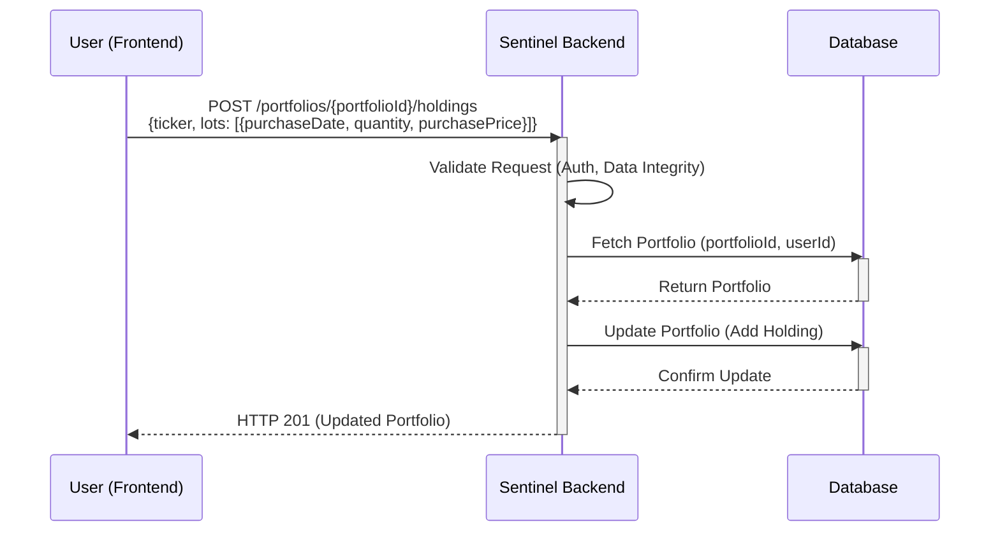
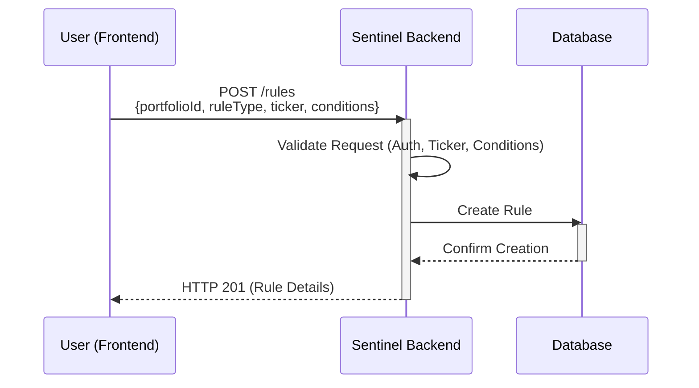
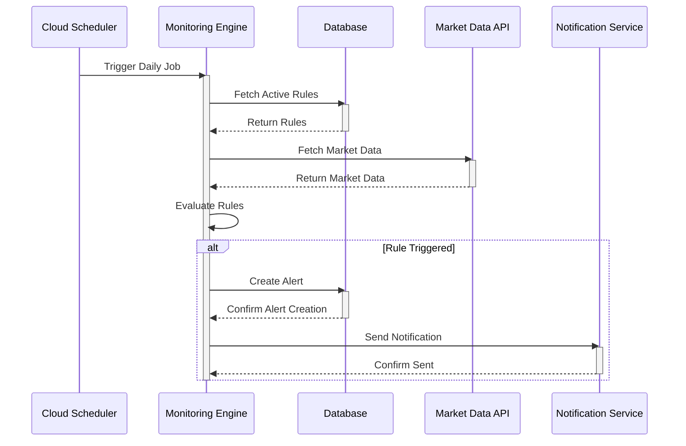
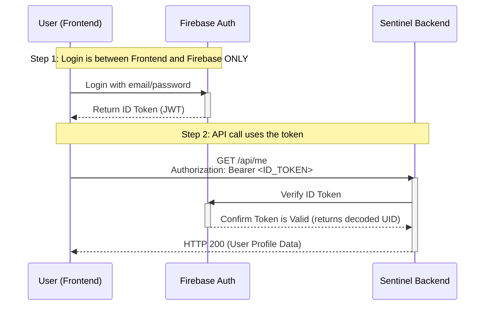
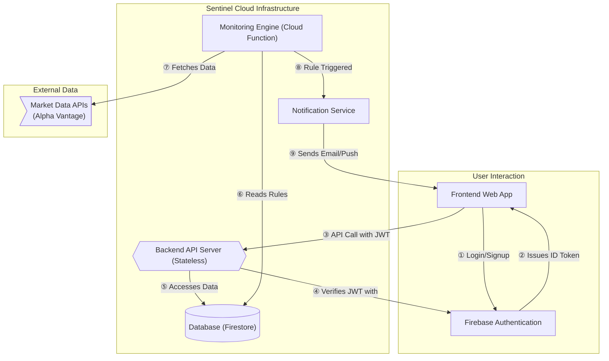

# Product Specification for Sentinel v0.1 (MVP)

[[_TOC_]]

## 0. Introduction

### 0.1. Purpose and Audience

This document defines the product specification for the Minimum Viable Product (MVP) of **Sentinel**, a personal investment strategy automation tool for disciplined, long-term retail investors. It serves as the single source of truth for the system's functionality, data models, business processes, and technical requirements, ensuring alignment across business, development, and testing teams.

The primary purpose is to provide:
- **Business Teams**: A human-readable, concise reference to validate the system's alignment with the investment philosophy.
- **Developers**: A detailed, systematic guide to implement the business logic, data structures, and technical components.
- **Testing Teams**: A comprehensive reference for validating system behavior, including success and error conditions.

This specification is inspired by the rigorous structure of financial system specifications (e.g., DESP for digital euro), adapted for a consumer-facing investment tool. It avoids agile artifacts like user stories, focusing instead on business processes, data models, and rule-based logic.

### 0.2. Core Problem and Vision

Sentinel addresses three challenges faced by retail investors:
1. **Time Constraints**: Investors lack the time to monitor markets continuously.
2. **Cost Barriers**: Professional wealth management is prohibitively expensive.
3. **Behavioral Gap**: Emotional decisions lead to suboptimal returns compared to market indices.

**Vision**: Sentinel empowers users to encode their long-term investment philosophy into automated rules, acting as an unemotional guardrail. It monitors markets and delivers timely, actionable notifications based on user-defined conditions, keeping users in control of their capital while automating market surveillance.

### 0.3. Structure and User Guide

The specification is organized as follows:
- **Section 1: Portfolio and Cash Management**: Details the management of user portfolios and cash reserves, including data models and processes for creation, updates, and retrieval.
- **Section 2: Strategy Rule Management**: Describes the creation, modification, and retrieval of buy and sell rules, including rule evaluation logic.
- **Section 3: Market Monitoring and Notification**: Outlines the automated monitoring process, rule triggering, and notification delivery.
- **Section 4: Technical Specifications**: Specifies the architecture, security, data sources.

Each section includes:
1. **Data Model and Business Process**:
   - Data schemas for the entity/process.
   - A high-level description of the process, with examples and sequence diagrams.
2. **Business Rules**:
   - Detailed operational logic with unique Rule IDs (e.g., P_1000 for portfolio, R_1000 for rules).
   - Success (Informational, I_XXXX), Warning (E_XXXX), and Error conditions (E_E_XXXX).
   - Tables listing conditions, checkpoints, outcomes, and message keys.
   - Messages with placeholders (e.g., `{amount}`) for clarity.

### 0.4. Common Notes

- **Idempotency-Key**: Required for `POST`/`PUT` operations, a client-side UUID v4 to ensure idempotent behavior. Keys expire after 24 hours.
- **Tax Calculations**: All tax-related calculations are informational, based on user-provided rates (e.g., capital gains tax, tax-free allowances).
- **Market Data**: Sourced daily from Alpha Vantage, using closing prices for calculations unless specified.

## 1. Portfolio and Cash Management

This section details the management of user portfolios (holdings) and cash reserves, which form the foundation for rule evaluation and notifications.

### 1.1. Portfolio and Cash Data Model and Business Process

**Associated Data Models**:
- `Portfolio`:
  - `portfolioId`: Unique system-generated UUID.
  - `userId`: UUID linking to the authenticated user.
  - `holdings`: Array of `Holding` objects.
  - `cashReserve`: Object with `totalAmount` (EUR), `warChestAmount` (EUR, portion for opportunistic buying).
  - `taxSettings`: Object with `capitalGainTaxRate` (percentage, e.g., 26.4), `taxFreeAllowance` (EUR, e.g., 1000).
- `Holding`:
  - `holdingId`: Unique UUID within portfolio.
  - `ticker`: String (e.g., "VOO", "QQQ.DE").
  - `lots`: Array of `Lot` objects.
- `Lot`:
  - `lotId`: Unique UUID.
  - `purchaseDate`: ISODateTime.
  - `quantity`: Number of shares (positive, decimal precision).
  - `purchasePrice`: EUR per share (decimal).
- `TaxInfo` (computed, not stored):
  - `preTaxProfit`: EUR (current price - purchase price × quantity).
  - `capitalGainTax`: EUR (taxable profit × capitalGainTaxRate).
  - `afterTaxProfit`: EUR (preTaxProfit - capitalGainTax).

**Business Process**:
1. **Creation**: Upon user signup, a portfolio is initialized with empty holdings and zero cash reserves. Users provide tax settings.
2. **Updates**:
   - Users add/edit holdings by specifying ticker and lot details (purchase date, quantity, price).
   - Users update cash reserves, designating a war chest portion.
   - Users modify tax settings.
3. **Retrieval**: Users retrieve portfolio details, including computed tax info for holdings based on latest market prices.
4. **Validation**: Updates are validated for data integrity (e.g., positive quantities, valid tickers) and user authorization.

**Sequence Diagram for Portfolio Update (Add Holding)**

**Example**:
- User adds 10 shares of "VOO" bought on 2025-01-01 at 400 EUR/share to their portfolio.
- Portfolio updated: `holdings` includes new `Holding` with `ticker: "VOO"`, `lots: [{lotId: "lot-001", purchaseDate: "2025-01-01T00:00:00Z", quantity: 10, purchasePrice: 400.00}]`.
- Retrieval shows `TaxInfo` (if current price is 450 EUR): `preTaxProfit: 500 EUR`, `capitalGainTax: 132 EUR` (26.4%), `afterTaxProfit: 368 EUR`.

### 1.2. Portfolio and Cash Rules

#### P_1000: Portfolio Creation

- **Description**: Initializes a new portfolio for a user upon signup.
- **Success Response**: Portfolio created with empty holdings, zero cash, and default tax settings.
- **Sub-Rules**:

| Rule ID | Rule Name | Condition | Check Point | Success Outcome | Message Keys |
|:---|:---|:---|:---|:---|:---|
| P_I_1001 | Portfolio creation succeeds | User authenticated, no existing portfolio. | Response Sentinel to User | Portfolio created with `portfolioId`, empty `holdings`, `cashReserve: {totalAmount: 0, warChestAmount: 0}`. | P_I_1001 |
| P_E_1101 | User unauthorized | User not authenticated. | Request User to Sentinel | Creation rejected. | P_E_1101 |
| P_E_1102 | Portfolio already exists | User already has a portfolio. | Sentinel internal | Creation rejected. | P_E_1102 |

**Messages**:
- **P_I_1001**: "Portfolio {portfolioId} created successfully for user {userId}."
- **P_E_1101**: "User is not authenticated."
- **P_E_1102**: "Portfolio already exists for user {userId}."

#### P_2000: Portfolio Update (Holdings/Cash/Tax)

- **Description**: Updates portfolio holdings, cash reserves, or tax settings.
- **Success Response**: Portfolio updated with new data.
- **Sub-Rules**:

| Rule ID | Rule Name | Condition | Check Point | Success Outcome | Message Keys |
|:---|:---|:---|:---|:---|:---|
| P_I_2001 | Update succeeds | Valid data, user authorized. | Response Sentinel to User | Portfolio updated. | P_I_2001 |
| P_I_2002 | Idempotency key valid | `Idempotency-Key` provided, valid UUID. | Request User to Sentinel | Request proceeds. | N/A |
| P_E_2101 | User unauthorized | User not authenticated or not portfolio owner. | Request User to Sentinel | Update rejected. | P_E_2101 |
| P_E_2102 | Invalid ticker | Ticker not recognized by Alpha Vantage. | Request User to Sentinel | Update rejected. | P_E_2102 |
| P_E_2103 | Invalid lot data | Quantity ≤ 0, price ≤ 0, or invalid date. | Request User to Sentinel | Update rejected. | P_E_2103 |
| P_E_2104 | Invalid cash amounts | `totalAmount` or `warChestAmount` < 0, or `warChestAmount` > `totalAmount`. | Request User to Sentinel | Update rejected. | P_E_2104 |
| P_E_2105 | Invalid tax settings | `capitalGainTaxRate` < 0 or > 100, `taxFreeAllowance` < 0. | Request User to Sentinel | Update rejected. | P_E_2105 |

**Messages**:
- **P_I_2001**: "Portfolio {portfolioId} updated successfully."
- **P_E_2101**: "User is not authorized to update portfolio {portfolioId}."
- **P_E_2102**: "Ticker '{ticker}' is invalid or not supported."
- **P_E_2103**: "Lot data invalid: Quantity and price must be positive, date must be valid."
- **P_E_2104**: "Cash amounts invalid: Total and war chest must be non-negative, war chest cannot exceed total."
- **P_E_2105**: "Tax settings invalid: Tax rate must be between 0-100%, allowance non-negative."

#### P_3000: Portfolio Retrieval

- **Description**: Retrieves portfolio details, including computed tax info.
- **Success Response**: Portfolio data returned with current market prices and tax calculations.
- **Sub-Rules**:

| Rule ID | Rule Name | Condition | Check Point | Success Outcome | Message Keys |
|:---|:---|:---|:---|:---|:---|
| P_I_3001 | Retrieval succeeds | Portfolio exists, user authorized. | Response Sentinel to User | Portfolio data returned. | P_I_3001 |
| P_E_3101 | User unauthorized | User not authenticated or not owner. | Request User to Sentinel | Retrieval rejected. | P_E_3101 |
| P_E_3102 | Portfolio not found | No portfolio for user. | Sentinel internal | Retrieval rejected. | P_E_3102 |

**Messages**:
- **P_I_3001**: "Portfolio {portfolioId} retrieved successfully."
- **P_E_3101**: "User is not authorized to retrieve portfolio {portfolioId}."
- **P_E_3102**: "Portfolio not found for user {userId}."

## 2. Strategy Rule Management

This section details the management of buy and sell rules that encode the user’s investment strategy.

### 2.1. Rule Data Model and Business Process

**Associated Data Models**:
- `Rule`:
  - `ruleId`: Unique UUID.
  - `portfolioId`: UUID linking to portfolio.
  - `ruleType`: Enum (`BUY`, `SELL`).
  - `ticker`: String (target asset, e.g., "QQQ.DE").
  - `conditions`: Array of `Condition` objects.
  - `status`: Enum (`ENABLED`, `PAUSED`).
  - `createdAt`, `modifiedAt`: ISODateTime.
- `Condition`:
  - `conditionId`: Unique UUID.
  - `type`: Enum (`DRAWDOWN`, `MA200`, `RSI`, `VIX`, `PROFIT_TARGET`, `TRAILING_DRAWDOWN`, `AFTER_TAX_PROFIT`).
  - `parameters`: Object (e.g., `{percentage: 15}` for DRAWDOWN).
- `Alert` (generated, see Section 3):
  - `alertId`: Unique UUID.
  - `ruleId`: UUID linking to rule.
  - `triggeredAt`: ISODateTime.
  - `marketData`: Object with relevant data (e.g., current price, RSI).
  - `taxInfo`: Object (for SELL rules, includes preTaxProfit, capitalGainTax, afterTaxProfit).

**Supported Conditions**:
- **BUY**:
  - `DRAWDOWN`: Index/ticker falls X% from 52-week high.
  - `MA200`: Price crosses below 200-day moving average.
  - `RSI`: Weekly RSI < 30.
  - `VIX`: VIX closes > Y.
- **SELL**:
  - `PROFIT_TARGET`: Holding gain ≥ X%.
  - `TRAILING_DRAWDOWN`: Holding falls Y% from peak since purchase.
  - `RSI`: Weekly RSI > 70.
  - `MA200`: Price > Z% above MA200.
  - `AFTER_TAX_PROFIT`: After-tax gain ≥ W%.

**Business Process**:
1. **Creation**: User creates a rule by specifying `ruleType`, `ticker`, and `conditions`. Rule is set to `ENABLED`.
2. **Update**: User modifies conditions or status (`ENABLED`/`PAUSED`).
3. **Deletion**: User removes a rule.
4. **Retrieval**: User retrieves all rules or a specific rule.
5. **Validation**: Ensures valid tickers, condition parameters, and user authorization.

**Sequence Diagram for Rule Creation**

**Example**:
- User creates a BUY rule for "QQQ.DE": `conditions: [{type: "DRAWDOWN", parameters: {percentage: 15}}, {type: "RSI", parameters: {threshold: 30}}]`.
- Rule created with `ruleId: "rule-001"`, `status: "ENABLED"`.
- If NASDAQ-100 drops 15% from peak and RSI < 30, an alert is triggered (Section 3).

### 2.2. Rule Management Rules

#### R_1000: Rule Creation

- **Description**: Creates a new buy or sell rule.
- **Success Response**: Rule created with `ENABLED` status.
- **Sub-Rules**:

| Rule ID | Rule Name | Condition | Check Point | Success Outcome | Message Keys |
|:---|:---|:---|:---|:---|:---|
| R_I_1001 | Rule creation succeeds | Valid data, user authorized. | Response Sentinel to User | Rule created. | R_I_1001 |
| R_I_1002 | Idempotency key valid | `Idempotency-Key` provided, valid UUID. | Request User to Sentinel | Request proceeds. | N/A |
| R_E_1101 | User unauthorized | User not authenticated or not portfolio owner. | Request User to Sentinel | Creation rejected. | R_E_1101 |
| R_E_1102 | Invalid ticker | Ticker not supported by Alpha Vantage. | Request User to Sentinel | Creation rejected. | R_E_1102 |
| R_E_1103 | Invalid conditions | Unknown condition type or invalid parameters. | Request User to Sentinel | Creation rejected. | R_E_1103 |
| R_E_1104 | Portfolio not found | `portfolioId` invalid. | Sentinel internal | Creation rejected. | R_E_1104 |

**Messages**:
- **R_I_1001**: "Rule {ruleId} created successfully for portfolio {portfolioId}."
- **R_E_1101**: "User is not authorized to create rule for portfolio {portfolioId}."
- **R_E_1102**: "Ticker '{ticker}' is invalid or not supported."
- **R_E_1103**: "Conditions invalid: Unknown type or invalid parameters."
- **R_E_1104**: "Portfolio {portfolioId} not found."

#### R_2000: Rule Update

- **Description**: Modifies an existing rule’s conditions or status.
- **Success Response**: Rule updated.
- **Sub-Rules**:

| Rule ID | Rule Name | Condition | Check Point | Success Outcome | Message Keys |
|:---|:---|:---|:---|:---|:---|
| R_I_2001 | Update succeeds | Valid data, user authorized. | Response Sentinel to User | Rule updated. | R_I_2001 |
| R_E_2101 | User unauthorized | User not authorized. | Request User to Sentinel | Update rejected. | R_E_2101 |
| R_E_2102 | Rule not found | `ruleId` invalid. | Sentinel internal | Update rejected. | R_E_2102 |

**Messages**:
- **R_I_2001**: "Rule {ruleId} updated successfully."
- **R_E_2101**: "User is not authorized to update rule {ruleId}."
- **R_E_2102**: "Rule {ruleId} not found."

#### R_3000: Rule Retrieval

- **Description**: Retrieves rule(s) for a portfolio.
- **Success Response**: Rule(s) returned.
- **Sub-Rules**:

| Rule ID | Rule Name | Condition | Check Point | Success Outcome | Message Keys |
|:---|:---|:---|:---|:---|:---|
| R_I_3001 | Retrieval succeeds | Rules exist, user authorized. | Response Sentinel to User | Rules returned. | R_I_3001 |
| R_E_3101 | User unauthorized | User not authorized. | Request User to Sentinel | Retrieval rejected. | R_E_3101 |

**Messages**:
- **R_I_3001**: "Rules retrieved successfully for portfolio {portfolioId}."
- **R_E_3101**: "User is not authorized to retrieve rules for portfolio {portfolioId}."

## 3. Market Monitoring and Notification

This section details the automated monitoring of market data and generation of notifications when rules are triggered.

### 3.1. Monitoring and Notification Data Model and Business Process

**Associated Data Models**:
- `MarketData` (fetched daily):
  - `ticker`: String.
  - `closePrice`: EUR.
  - `highPrice`: EUR (52-week high for DRAWDOWN).
  - `ma200`: EUR (200-day moving average).
  - `rsiWeekly`: Number (weekly RSI).
  - `vixClose`: Number (VIX closing value).
- `Alert`:
  - `alertId`: Unique UUID.
  - `ruleId`: UUID.
  - `triggeredAt`: ISODateTime.
  - `marketData`: Relevant data at trigger time.
  - `taxInfo`: For SELL rules, includes lot-specific tax calculations.
  - `notificationStatus`: Enum (`PENDING`, `SENT`, `FAILED`).

**Business Process**:
1. **Monitoring**:
   - Daily, after European market close, the Monitoring Engine fetches `MarketData` for all tickers in active rules.
   - For each `ENABLED` rule, conditions are evaluated against `MarketData` and portfolio data.
2. **Alert Generation**:
   - If all conditions are met, an `Alert` is created with relevant `marketData` and `taxInfo` (for SELL rules, computed using FIFO).
   - Alert is queued for notification.
3. **Notification**:
   - Notification Service sends alerts via email and/or push notification.
   - `notificationStatus` updated to `SENT` or `FAILED`.

**Sequence Diagram for Monitoring and Notification**

**Example**:
- Rule: BUY "QQQ.DE" when NASDAQ-100 drops 15% from peak and RSI < 30.
- Market Data: NASDAQ-100 52-week high 12,000 EUR, close 10,200 EUR (15% drop), RSI 28.
- Alert created: `marketData: {closePrice: 10200, rsiWeekly: 28}`, `notificationStatus: PENDING`.
- Email sent: “Buy Opportunity: QQQ.DE dropped 15%, RSI 28.”

### 3.2. Monitoring and Notification Rules

#### M_1000: Rule Evaluation and Alert Generation

- **Description**: Evaluates rules and generates alerts.
- **Success Response**: Alerts created for triggered rules.
- **Sub-Rules**:

| Rule ID | Rule Name | Condition | Check Point | Success Outcome | Message Keys |
|:---|:---|:---|:---|:---|:---|
| M_I_1001 | Evaluation succeeds | Rules evaluated, alerts generated. | Engine Internal | Alerts queued. | M_I_1001 |
| M_I_1002 | SELL Tax calculation | For SELL rules, FIFO-based tax info computed. | Engine Internal | `taxInfo` included in alert. | N/A |
| M_E_1101 | Market data unavailable | API call fails for a ticker. | Engine to API | Rule evaluation skipped, error logged. | M_E_1101 |

**Messages**:
- **M_I_1001**: "Daily evaluation completed, {numAlerts} alerts generated."
- **M_E_1101**: "Market data unavailable for ticker {ticker}, evaluation skipped."

#### M_2000: Notification Delivery

- **Description**: Sends alerts to users.
- **Success Response**: Notifications delivered.
- **Sub-Rules**:

| Rule ID | Rule Name | Condition | Check Point | Success Outcome | Message Keys |
|:---|:---|:---|:---|:---|:---|
| N_I_2001 | Delivery succeeds | Notification sent via email/push. | Notify Service | `notificationStatus: SENT`. | N_I_2001 |
| N_E_2101 | Delivery fails | Service unavailable or invalid recipient. | Notify Service | `notificationStatus: FAILED`. | N_E_2101 |

**Messages**:
- **N_I_2001**: "Notification for alert {alertId} sent successfully."
- **N_E_2101**: "Notification for alert {alertId} failed: {error_reason}."

## 4. User Authentication and Authorization

This section details the processes for user registration, login, logout, and the authorization mechanism for securing backend API endpoints. The system uses a decoupled authentication model where the frontend communicates directly with Firebase Authentication for identity management, and the Sentinel backend is only responsible for validating the resulting tokens.

### 4.1. User Authentication Data Model and Business Process

#### 4.1.1. Associated Data Models

- **`Firebase User` (Managed by Firebase Authentication Service):**
  - `uid`: Unique user identifier provided by Firebase. This is the primary key linking the user to their data in Firestore.
  - `email`: The user's email address.
  - `metadata`: Includes `creationTime` and `lastSignInTime`.
- **`Client-Side Auth State` (Managed by Frontend in Pinia store):**
  - `user`: Object containing user info like `uid` and `email`.
  - `token`: String, the Firebase ID Token (JWT) used for API calls.
  - `status`: Enum (`AUTHENTICATED`, `ANONYMOUS`).
- **`ID Token` (JWT - JSON Web Token):**
  - A short-lived, signed token generated by the Firebase client-side SDK upon successful login or signup.
  - The frontend sends this token in the `Authorization` header of every API request to prove the user's identity.

#### 4.1.2. Business Process

1. **Signup/Login (Frontend ↔ Firebase)**: The user interacts with the frontend UI. The Vue.js application communicates **directly and exclusively with the Firebase Authentication service** to handle user creation and password verification. The Sentinel backend is **not involved** in this process.
2. **Token Issuance (Firebase → Frontend)**: Upon successful authentication, Firebase issues a secure ID Token (JWT) to the frontend. The frontend stores this token and the user's state.
3. **Logout (Frontend → Firebase)**: The user initiates a logout. The frontend communicates with the Firebase client SDK to sign the user out and clears its local state.
4. **Authorization (Frontend → Sentinel Backend)**: For every request to a protected Sentinel API endpoint (e.g., retrieving a portfolio), the frontend includes the user's ID Token in the `Authorization: Bearer <ID_TOKEN>` header.
5. **Token Validation (Sentinel Backend → Firebase)**: The Sentinel backend receives the request, extracts the ID Token, and uses the Firebase Admin SDK to verify its signature and integrity with Firebase's servers. If the token is valid, the backend decodes it to get the user's `uid` and proceeds. If invalid, the request is rejected.

**Note on User Deletion:** The functionality for a user to delete their own account is a planned feature for a future release and is out of scope for the MVP.

#### 4.1.3. Sequence Diagram for an Authenticated API Call

### 4.2. User Authentication and Authorization Rules

#### U_1000: User Signup

- **Description**: Creates a new user account in Firebase Authentication and initializes their corresponding application data (e.g., portfolio). This process is initiated from the frontend.
- **Success Response**: User account is created in Firebase, and a new, empty portfolio is created in Firestore linked to the user's UID.
- **Sub-Rules**:

| Rule ID | Rule Name | Condition | Check Point | Success Outcome | Message Keys |
|:---|:---|:---|:---|:---|:---|
| U_I_1001 | Signup succeeds | Email is valid, password meets complexity requirements, email is not already in use. | Response Firebase to User, then User to Sentinel | Firebase user created. Sentinel backend creates associated portfolio (triggers P_1000). | U_I_1001 |
| U_E_1101 | Email already in use | User attempts to sign up with an email that already exists. | Response Firebase to User | Signup rejected by Firebase. | U_E_1101 |
| U_E_1102 | Invalid email format | Email address provided is not in a valid format. | Response Firebase to User | Signup rejected by Firebase. | U_E_1102 |
| U_E_1103 | Weak password | Password does not meet Firebase's minimum security requirements (e.g., less than 6 characters). | Response Firebase to User | Signup rejected by Firebase. | U_E_1103 |

**Messages**:
- **U_I_1001**: "User account created successfully for {email}."
- **U_E_1101**: "This email address is already in use by another account."
- **U_E_1102**: "The email address is improperly formatted."
- **U_E_1103**: "The password must be at least 6 characters long."

#### U_2000: User Login

- **Description**: Authenticates a user via the frontend and provides an ID Token for API sessions.
- **Success Response**: User is successfully authenticated, and the frontend receives a valid ID Token.
- **Sub-Rules**:

| Rule ID | Rule Name | Condition | Check Point | Success Outcome | Message Keys |
|:---|:---|:---|:---|:---|:---|
| U_I_2001 | Login succeeds | Correct email and password provided for an existing user. | Response Firebase to User | User logged in. Frontend receives ID Token to use for API calls. | U_I_2001 |
| U_E_2101 | Invalid credentials | Incorrect password or email address does not exist. | Response Firebase to User | Login rejected by Firebase. | U_E_2101 |

**Messages**:
- **U_I_2001**: "User {email} logged in successfully."
- **U_E_2101**: "Invalid login credentials. Please check your email and password."

#### U_3000: API Request Authorization

- **Description**: Verifies the ID Token for every incoming request to a protected backend endpoint. This is a server-side process.
- **Success Response**: The token is validated, and the request is allowed to proceed to the business logic.
- **Sub-Rules**:

| Rule ID | Rule Name | Condition | Check Point | Success Outcome | Message Keys |
|:---|:---|:---|:---|:---|:---|
| U_I_3001 | Authorization succeeds | A valid, unexpired ID Token is provided in the `Authorization` header. | Request User to Sentinel | Request is processed. The user's UID is available to the endpoint. | N/A |
| U_E_3101 | Authorization header missing | No `Authorization` header is present in the request. | Request User to Sentinel | Request rejected with HTTP 401 Unauthorized. | U_E_3101 |
| U_E_3102 | Token malformed or invalid | The token provided in the header is not a valid JWT or cannot be verified by Firebase. | Sentinel internal | Request rejected with HTTP 401 Unauthorized. | U_E_3102 |
| U_E_3103 | Token expired | The token provided is valid but has expired. | Sentinel internal | Request rejected with HTTP 401 Unauthorized. | U_E_3103 |

**Messages**:
- **U_E_3101**: "Authorization header is missing."
- **U_E_3102**: "The provided ID token is invalid."
- **U_E_3103**: "The provided ID token has expired. Please log in again."

## 5. Technical Specifications

### 5.1. Architecture

#### 5.1.1. Architectural Principles

- **Stateless Backend**: The backend API is designed to be completely stateless. User authentication is handled via short-lived, self-contained JWTs (Firebase ID Tokens) sent with each request. This eliminates the need for server-side sessions, enhances security, and allows for seamless horizontal scalability on platforms like Google Cloud Run.
- **Monolith for MVP**: The backend is a "Self-Contained System" (a well-structured monolith) for the MVP to prioritize development speed and simplicity. It can be refactored into microservices in the future if required by scale.

#### 5.1.2. Components
- **Frontend**: Vue.js v3 (TypeScript), hosted on Firebase Hosting.
- **Backend API**: Python FastAPI, deployed on Google Cloud Run.
- **Database**: Google Cloud Firestore (NoSQL).
- **Monitoring Engine**: Google Cloud Function (Python), triggered by Cloud Scheduler.
- **Notification Service**: SendGrid (email), Firebase Cloud Messaging (push).
- **Market Data**: Alpha Vantage API (daily updates).

#### 5.1.3. Architectural Diagram

### 5.2. Security

- **Encryption**: TLS for data in transit, Firestore encryption at rest.
- **Authentication**: Google Cloud Identity Platform (OAuth2, MFA).
- **Authorization**: User-specific data access enforced.
- **Privacy**: Minimal PII (email only), clear privacy policy.

### 5.3. Data Sources

- **Provider**: Alpha Vantage.
- **Frequency**: Daily, post-market close.
- **Data Points**: OHLC prices, MA200, weekly RSI, VIX close.

### 5.4. Non-Functional Requirements

- **Performance**: API response time < 500ms, daily monitoring completes in < 10 min.
- **Scalability**: Cloud Run/Firestore scale automatically.
- **Availability**: 99.9% uptime via GCP.

