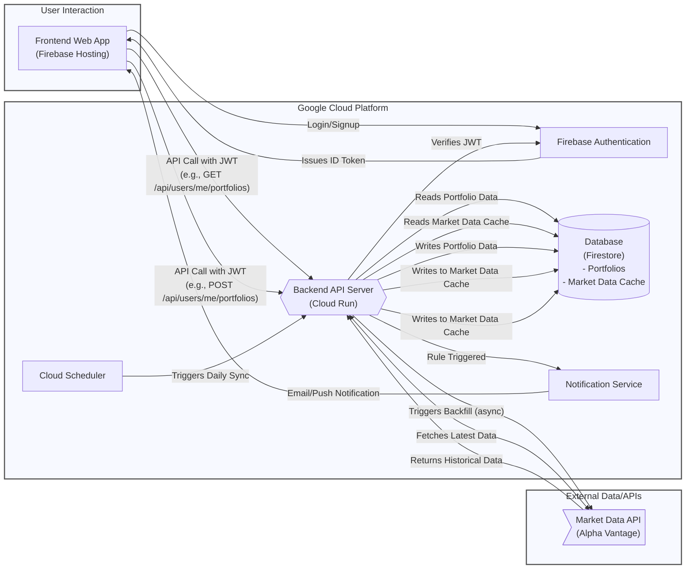

# Product Specification for Sentinel v0.1 (MVP)

[[_TOC_]]

## 0. Introduction

### 0.1. Purpose and Audience

This document defines the product specification for the Minimum Viable Product (MVP) of **Sentinel**, a personal investment strategy automation tool for disciplined, long-term retail investors. It serves as the single source of truth for the system's functionality, data models, business processes, and technical requirements, ensuring alignment across business, development, and testing teams.

The primary purpose is to provide:
- **Business Teams**: A human-readable, concise reference to validate the system's alignment with the investment philosophy.
- **Developers**: A detailed, systematic guide to implement the business logic, data structures, and technical components.
- **Testing Teams**: A comprehensive reference for validating system behavior, including success and error conditions.

This specification is inspired by the rigorous structure of financial system specifications (e.g., DESP for digital euro), adapted for a consumer-facing investment tool. It avoids agile artifacts like user stories, focusing instead on business processes, data models, and rule-based logic.

### 0.2. Core Problem and Vision

Sentinel addresses three challenges faced by retail investors:
1. **Time Constraints**: Investors lack the time to monitor markets continuously.
2. **Cost Barriers**: Professional wealth management is prohibitively expensive.
3. **Behavioral Gap**: Emotional decisions lead to suboptimal returns compared to market indices.

**Vision**: Sentinel empowers users to encode their long-term investment philosophy into automated rules, acting as an unemotional guardrail. It monitors markets and delivers timely, actionable notifications based on user-defined conditions, keeping users in control of their capital while automating market surveillance.

### 0.3. Structure and User Guide

The specification is organized as follows:
- **Section 1: Common Notes**: Defines global rules and conventions that apply across the entire system.
- **Section 2: Portfolio and Cash Management**: Details the management of user portfolios and cash reserves.
- **Section 3: Holding Management**: Details the management of individual holdings and their purchase lots within a portfolio.
- **Section 4: Strategy Rule Management**: Describes the creation, modification, and retrieval of buy and sell rules for a specific holding.
- **Section 5: Market Monitoring and Notification**: Outlines the automated monitoring process, rule triggering, and notification delivery.
- **Section 6: User Authentication and Authorization**: Covers user identity and access control.
- **Section 7: Technical Specifications**: Specifies the architecture, security, data sources.

Each section includes:
1. **Data Model and Business Process**:
   - Data schemas for the entity/process.
   - A high-level description of the process, with examples and sequence diagrams.
2. **Business Rules**:
   - Detailed operational logic with unique Rule IDs (e.g., P_1000 for portfolio, H_1000 for holdings, R_1000 for rules).
   - Success (Informational, I_XXXX), Warning (E_XXXX), and Error conditions (E_E_XXXX).
   - Tables listing conditions, checkpoints, outcomes, and message keys.
   - Messages with placeholders (e.g., `{amount}`) for clarity.

---

## 1. Common Notes

### 1.1. General Data and Business Process Notes

- **Tax Calculations**: All tax-related calculations are informational, based on user-provided rates (e.g., capital gains tax, tax-free allowances).
- **Market Data**: Sourced daily from Alpha Vantage, using closing prices for calculations unless specified.

### 1.2. General User Interface/User Experience (UI/UX) Notes

- **Mobile-First Responsive Design**: The application's interface will be designed primarily for mobile phones. This means the layout will be clean, easy to navigate with a thumb, and optimized for smaller screens. When viewed on a larger screen, like a tablet or desktop computer, the application will automatically adapt its layout to make good use of the extra space, ensuring a comfortable and effective user experience on any device.
- **Application Bar**: A persistent application bar is displayed at the top of the screen.
    - On mobile devices or narrow screens, the bar displays the application title and a menu icon that, when tapped, reveals navigation links.
    - On wider screens (tablets, desktops), the navigation links are displayed directly within the application bar for quick access.
    - For authenticated users, the bar also provides access to user-specific actions, such as logging out.


### 1.3. General API and Technical Notes

- **Idempotency-Key**: Required for `POST`/`PUT`/`DELETE` operations, a client-side UUID v4 to ensure idempotent behavior. Keys expire after 24 hours.
- **API Design**: All API endpoints that operate on a user's specific data are nested under the `/api/users/me/` path. This ensures that all operations are clearly scoped to the authenticated user, enhancing security and clarity. For example, to get a portfolio, the endpoint is `/api/users/me/portfolios/{portfolioId}`.

---

## 2. Portfolio and Cash Management

This section details the management of user portfolios. A user can create and manage multiple distinct portfolios (e.g., a "real money" portfolio and a "paper trading" portfolio). Each portfolio contains its own set of holdings, cash reserves, and tax settings, forming the foundation for rule evaluation.

### 2.1. Portfolio and Cash Data Model and Business Process

#### 2.1.1. Associated Data Models

- **`Portfolio` (Firestore Document):**
  - `portfolioId`: String (Unique UUID, the document ID).
  - `userId`: String (Firebase Auth UID, links the portfolio to its owner).
  - `name`: String (User-defined, e.g., "My Real Portfolio", "Tech Speculation").
  - `description`: String (Optional, user-defined description for the portfolio).
  - `defaultCurrency`: Enum (`EUR`, `USD`, `GBP`, default: `EUR`).
  - `cashReserve`: Object containing:
    - `totalAmount`: Number (in `defaultCurrency`).
    - `warChestAmount`: Number (in `defaultCurrency`, portion for opportunistic buying).
  - `taxSettings`: Object containing:
    - `capitalGainTaxRate`: Number (percentage, e.g., 26.4).
    - `taxFreeAllowance`: Number (EUR, e.g., 1000).
  - `createdAt`: ISODateTime.
  - `modifiedAt`: ISODateTime.

- **`MarketData` (Firestore Document):**
  - A separate top-level collection (`marketData`) used as an internal cache for historical price and indicator data. This data is shared by all users.
  - The structure is `/marketData/{ticker}/daily/{YYYY-MM-DD}`.
  - Each document contains:
    - `date`: ISODateTime.
    - `ticker`: String.
    - `open`: Number (EUR).
    - `high`: Number (EUR).
    - `low`: Number (EUR).
    - `close`: Number (EUR).
    - `volume`: Integer.
    - `sma200`: Optional<Number> (200-day simple moving average).
    - `sma50`: Optional<Number> (50-day simple moving average).
    - `sma20`: Optional<Number> (20-day simple moving average).
    - `sma7`: Optional<Number> (7-day simple moving average).
    - `vwma200`: Optional<Number> (200-day volume weighted moving average).
    - `vwma50`: Optional<Number> (50-day volume weighted moving average).
    - `vwma20`: Optional<Number> (20-day volume weighted moving average).
    - `vwma7`: Optional<Number> (7-day volume weighted moving average).
    - `rsi14`: Optional<Number> (14-day Relative Strength Index).
    - `atr14`: Optional<Number> (14-day Average True Range).
    - `macd`: Optional<Object> (Moving Average Convergence/Divergence, containing `value`, `signal`, and `histogram` fields).
  - **Note on VIX**: The VIX index itself is not fetched directly. Instead, data for a VIX-tracking ETF (e.g., `VIXY`) is fetched and stored under its own ticker in this same collection.
  - **Note on Technical Indicators**: All technical indicators (SMA, VWMA, RSI, ATR, MACD, etc.) are calculated internally by the Sentinel backend using the historical price and volume data. Only the raw OHLCV data is fetched from the external provider.

- **`ComputedInfo` (Calculated on retrieval, not stored):**
  - This information is calculated by reading from the internal `MarketData` cache and added to the `Portfolio`, `Holding`, and `Lot` objects in the API response.
  - **Note on Currency Conversion**:
    - For **portfolio-level** views and aggregations, all monetary values from holdings are converted to the portfolio's `defaultCurrency`. This requires a reliable, daily source for exchange rates.
    - For the detailed view of a **single holding**, performance metrics can be displayed in the holding's native currency without conversion.
  - **At the `Lot` level:**
    - `currentPrice`: Number (can be in holding's currency or portfolio's default currency, depending on view context).
    - `currentValue`: Number (can be in holding's currency or portfolio's default currency, depending on view context).
    - `preTaxProfit`: Number (can be in holding's currency or portfolio's default currency, depending on view context).
    - `capitalGainTax`: Number (can be in holding's currency or portfolio's default currency, depending on view context).
    - `afterTaxProfit`: Number (can be in holding's currency or portfolio's default currency, depending on view context).
  - **At the `Holding` level (aggregated from its lots):**
    - `totalCost`: Number (can be in holding's currency or portfolio's default currency).
    - `currentValue`: Number (can be in holding's currency or portfolio's default currency).
    - `preTaxGainLoss`: Number (can be in holding's currency or portfolio's default currency).
    - `afterTaxGainLoss`: Number (can be in holding's currency or portfolio's default currency).
    - `gainLossPercentage`: Number (%).
  - **At the `Portfolio` level (aggregated from all holdings, always in portfolio's `defaultCurrency`):**
    - `totalCost`: Number (in the portfolio's `defaultCurrency`).
    - `currentValue`: Number (in the portfolio's `defaultCurrency`).
    - `preTaxGainLoss`: Number (in the portfolio's `defaultCurrency`).
    - `afterTaxGainLoss`: Number (in the portfolio's `defaultCurrency`).
    - `gainLossPercentage`: Number (%).

#### 2.1.2. Business Process

The management of portfolios follows the standard CRUD (Create, Retrieve, Update, Delete) operations. All operations are authenticated and authorized.

##### 2.1.2.1. Creation

-   **Initial Portfolio:** Upon successful user signup, the Sentinel backend automatically creates a default portfolio for the user (e.g., named "My First Portfolio"). This portfolio is marked as the default (`isDefault: true`).
-   **Additional Portfolios:** The user can create additional portfolios, each with a unique name. These are created with `isDefault: false`.
-   **User-Selectable Default:** If a user has multiple portfolios, they can designate one as their "default" portfolio. This portfolio will be the one displayed by default after login. When a portfolio is set as the default, any other portfolio previously marked as default for that user will be unset.

##### 2.1.2.2. Retrieval

-   An authenticated user can retrieve a list of all portfolios they own.
-   An authenticated user can retrieve the detailed contents of a single, specific portfolio. The backend first fetches the `Portfolio` document, then queries the top-level `holdings` collection for all holdings where the `portfolioId` matches. The combined data is then enriched with calculated performance metrics from the `marketData` cache.

##### 2.1.2.3. Update

-   An authenticated user can modify any aspect of a specific portfolio they own, including its name, description, default currency, cash reserves, and tax settings.

##### 2.1.2.4. Deletion

-   An authenticated user can delete an entire portfolio. When a portfolio is deleted, all of its associated `Holding` documents must also be deleted.
-   If a user deletes their default portfolio:
    -   If only one portfolio remains after the deletion, it is automatically designated as the new default.
    -   If more than one portfolio remains, the application will prompt the user to select a new default.

### 2.2. Portfolio and Cash Rules

#### 2.2.1. P_1000: Portfolio Creation

- **Sequence Diagram for Portfolio Creation**


- **Description**: Creates a new portfolio for the authenticated user. A default portfolio is created automatically on signup; this rule also covers user-initiated creation of additional portfolios. When a portfolio is created, a `defaultCurrency` is assigned (defaulting to EUR if not specified).
- **Examples**:
    - **Example**: A user wants to start a new "Paper Trading" portfolio with USD as its base currency. She specifies the name and currency of the portfolio. A new portfolio document is created in Firestore, linked to their `userId`.
- **Success Response**: A new `Portfolio` document is created in Firestore.
- **Sub-Rules**:

| Rule ID | Rule Name | Condition | Check Point | Success Outcome | Message Keys |
|:---|:---|:---|:---|:---|:---|
| P_I_1001 | Creation succeeds | User is authenticated, portfolio name is valid and unique for the user. | Response Sentinel to User | New portfolio created. | P_I_1001 |
| P_I_1002 | Idempotency key is replayed | `Idempotency-Key` matches a previous successful creation request. | Request User to Sentinel | The response from the original successful request is returned; no new portfolio is created. | N/A |
| P_E_1101 | User unauthorized | User is not authenticated. | Request User to Sentinel | Creation rejected. | P_E_1101 |
| P_E_1102 | Name missing or invalid | Portfolio name is empty or too long. | Request User to Sentinel | Creation rejected. | P_E_1102 |
| P_E_1103 | Name not unique | User already has a portfolio with the same name. | Sentinel internal | Creation rejected. | P_E_1103 |
| P_E_1104 | Invalid default currency | The `defaultCurrency` provided is not one of the supported values (EUR, USD, GBP). | Request User to Sentinel | Creation rejected. | P_E_1104 |
| P_E_1105 | Idempotency key missing/invalid | `Idempotency-Key` header is missing or not a valid UUID. | Request User to Sentinel | Creation rejected. | P_E_1105 |

**Messages**:

- **P_I_1001**: "Portfolio '{name}' created successfully with ID {portfolioId}."
- **P_E_1101**: "User is not authenticated."
- **P_E_1102**: "Portfolio name is invalid."
- **P_E_1103**: "A portfolio with the name '{name}' already exists."
- **P_E_1104**: "Invalid default currency. Must be one of: EUR, USD, GBP."
- **P_E_1105**: "A valid Idempotency-Key header is required for this operation."

#### 2.2.2. Portfolio Retrieval

##### 2.2.2.1. P_2000: Single Portfolio Retrieval

- **Sequence Diagram for Single Portfolio Retrieval**


- **Description**: Retrieves the full, detailed content of a single portfolio for the authenticated user. The backend first fetches the `Portfolio` document, then queries the `holdings` collection to find all associated holdings. The combined data is enriched by reading from the internal `marketData` cache to calculate performance metrics (e.g., percentage gain) and tax information.
- **Examples**:
    - **Example**:
        - A user, who owns a portfolio containing two holdings (10 shares of "VOO" and 5 shares of "AAPL"), requests the details of that specific portfolio.
        - The backend returns the complete portfolio object. This response is enriched at multiple levels:
            - **Each `Lot`** has its `ComputedInfo` with tax calculations based on the latest market price from the internal cache.
            - The **`Holding` for "VOO"** is enriched with its aggregated `ComputedInfo`: `{ totalCost: 4000, currentValue: 4500, preTaxGainLoss: 500, gainLossPercentage: 12.5 }`.
            - The **`Holding` for "AAPL"** is enriched with its aggregated `ComputedInfo`: `{ totalCost: 750, currentValue: 900, preTaxGainLoss: 150, gainLossPercentage: 20.0 }`.
            - The top-level **`Portfolio`** object is enriched with the overall aggregated `ComputedInfo`: `{ totalCost: 4750, currentValue: 5400, preTaxGainLoss: 650, gainLossPercentage: 13.68 }`.
- **Success Response**: The user's complete, enriched `Portfolio` data is returned.
- **Sub-Rules**:

| Rule ID | Rule Name | Condition | Check Point | Success Outcome | Message Keys |
|:---|:---|:---|:---|:---|:---|
| P_I_2001 | Single retrieval succeeds | Portfolio exists and the authenticated user is the owner. | Response Sentinel to User | Full, enriched portfolio data is returned. | P_I_2001 |
| P_E_2101 | User unauthorized | User is not authenticated or is not the owner of the requested portfolio. | Request User to Sentinel | Retrieval rejected with HTTP 401/403. | P_E_2101 |
| P_E_2102 | Portfolio not found | The specified `portfolioId` does not exist. | Sentinel internal | Retrieval rejected with HTTP 404 Not Found. | P_E_2102 |

**Messages**:
- **P_I_2001**: "Portfolio {portfolioId} retrieved successfully."
- **P_E_2101**: "User is not authorized to access portfolio {portfolioId}."
- **P_E_2102**: "Portfolio with ID {portfolioId} not found."

##### 2.2.2.2. P_2200: Portfolio List Retrieval

- **Sequence Diagram for Portfolio List Retrieval**


- **Description**: Retrieves a summary list of all portfolios owned by the authenticated user. The data for each portfolio in the list is a summary and does not contain the full, enriched holdings details.
- **Examples**:
    - **Example**: A user who owns three portfolios ("Real Money", "Paper Trading", "Crypto") requests their list of portfolios.
    - The backend returns a list of three objects, each containing the `portfolioId`, `name`, and perhaps a summary `currentValue`.
- **Success Response**: A list of all portfolios owned by the user is returned. The list may be empty if the user has not created any portfolios besides the default.
- **Sub-Rules**:

| Rule ID | Rule Name | Condition | Check Point | Success Outcome | Message Keys |
|:---|:---|:---|:---|:---|:---|
| P_I_2201 | List retrieval succeeds | User is authenticated. | Response Sentinel to User | A list of the user's portfolios is returned. | P_I_2201 |
| P_E_2301 | User unauthorized | User is not authenticated. | Request User to Sentinel | Retrieval rejected with HTTP 401 Unauthorized. | P_E_2301 |

**Messages**:
- **P_I_2201**: "Portfolio list retrieved successfully for user {userId}."
- **P_E_2301**: "User is not authenticated."

#### 2.2.3. Portfolio Update

##### 2.2.3.1. P_3000: Portfolio Update (Manual)

- **Sequence Diagram for Portfolio Update (Manual)**


- **Description**: Updates a specific portfolio's settings (like name, description, or `defaultCurrency`), cash reserves, or tax settings. The target portfolio is identified by its `portfolioId`.
- **Success Response**: The specified `Portfolio` document is updated in Firestore with the new data and a new `modifiedAt` timestamp.
- **Sub-Rules**:

| Rule ID | Rule Name | Condition | Check Point | Success Outcome | Message Keys |
|:---|:---|:---|:---|:---|:---|
| P_I_3001 | Update succeeds | All provided data is valid, user is authenticated and owns the specified portfolio. | Response Sentinel to User | The specified portfolio is updated. | P_I_3001 |
| P_I_3002 | Idempotency key is replayed | `Idempotency-Key` matches a previous successful update request. | Request User to Sentinel | The response from the original successful request is returned; no new update is performed. | N/A |
| P_E_3101 | User unauthorized | User is not authenticated or the UID from the token does not own the specified portfolio. | Request User to Sentinel | Update rejected with HTTP 403 Forbidden. | P_E_3101 |
| P_E_3102 | Portfolio not found | The specified `portfolioId` does not exist. | Request User to Sentinel | Update rejected with HTTP 404 Not Found. | P_E_3102 |
| P_E_3103 | Invalid cash amounts | `totalAmount` or `warChestAmount` are negative, or `warChestAmount` > `totalAmount`. | Request User to Sentinel | Update rejected with HTTP 400 Bad Request. | P_E_3103 |
| P_E_3104 | Invalid portfolio settings | `capitalGainTaxRate` is not between 0-100, `taxFreeAllowance` is negative, portfolio `name` or `description` is invalid, or `defaultCurrency` is invalid. | Request User to Sentinel | Update rejected with HTTP 400 Bad Request. | P_E_3104 |
| P_E_3105 | Idempotency key missing/invalid | `Idempotency-Key` header is missing or not a valid UUID. | Request User to Sentinel | Update rejected. | P_E_3105 |

**Messages**:
- **P_I_3001**: "Portfolio {portfolioId} updated successfully."
- **P_E_3101**: "User is not authorized to modify portfolio {portfolioId}."
- **P_E_3102**: "Portfolio with ID {portfolioId} not found."
- **P_E_3103**: "Cash amounts are invalid. Ensure amounts are non-negative and war chest does not exceed total."
- **P_E_3104**: "Portfolio name, description, currency, or tax settings are invalid."
- **P_E_3105**: "A valid Idempotency-Key header is required for this operation."

##### 2.2.3.2. P_3400: Set Default Portfolio

- **Sequence Diagram for Setting Default Portfolio**


- **Description**: Designates a specific portfolio as the user's default by updating the `defaultPortfolioId` field on the user's document in the `users` collection.
- **Examples**:
    - **Example**:
        - A user has two portfolios: "Real Money" and "Paper Trading".
        - They decide to make "Paper Trading" their new default.
        - The user sends a request to update their user settings, providing the `portfolioId` of the "Paper Trading" portfolio.
        - The backend verifies the user owns that portfolio and then updates the `defaultPortfolioId` field on their user document.
- **Success Response**: The user's `defaultPortfolioId` is updated.
- **Sub-Rules**:

| Rule ID | Rule Name | Condition | Check Point | Success Outcome | Message Keys |
|:---|:---|:---|:---|:---|:---|
| P_I_3401 | Set default succeeds | User is authenticated, owns the portfolio, and the portfolio exists. | Response Sentinel to User | The user's `defaultPortfolioId` is updated. | P_I_3401 |
| P_E_3501 | User unauthorized | User is not authenticated or does not own the specified portfolio. | Request User to Sentinel | Request rejected with HTTP 403 Forbidden. | P_E_3501 |
| P_E_3502 | Portfolio not found | The specified `portfolioId` does not exist. | Request User to Sentinel | Request rejected with HTTP 404 Not Found. | P_E_3502 |

**Messages**:
- **P_I_3401**: "Default portfolio updated successfully."
- **P_E_3501**: "User is not authorized to set this portfolio as default."
- **P_E_3502**: "Portfolio with the specified ID not found."

#### 2.2.4. Portfolio Deletion

##### 2.2.4.1. P_4000: Portfolio Deletion (Entire Portfolio)

- **Sequence Diagram for Portfolio Deletion (Entire Portfolio)**


- **Description**: Deletes an entire portfolio and all of its associated holdings and data. This is a destructive and irreversible action. The backend first deletes the portfolio document, then deletes all `Holding` documents that were linked to it. If the deleted portfolio was the user's default, the system handles the default designation as follows:
    - If, after deletion, only one portfolio remains, that portfolio is automatically set as the new default.
    - If more than one portfolio remains, the application prompts the user to designate a new default.
- **Examples**:
    - **Example 1 (Auto-set new default)**:
        - A user has two portfolios: "Default A" (the default) and "Side B".
        - They delete "Default A".
        - The backend deletes the portfolio and, seeing only one portfolio remains, automatically designates "Side B" as the new default.
    - **Example 2 (Prompt for new default)**:
        - A user has three portfolios: "Default A" (the default), "Side B", and "Side C".
        - They delete "Default A".
        - The backend deletes the portfolio. The application then prompts the user to select either "Side B" or "Side C" as the new default.
- **Success Response**: The specified `Portfolio` document and all its associated `Holding` documents are deleted from Firestore.
- **Sub-Rules**:

| Rule ID | Rule Name | Condition | Check Point | Success Outcome | Message Keys |
|:---|:---|:---|:---|:---|:---|
| P_I_4001 | Portfolio deletion succeeds | User is authenticated and owns the specified portfolio. | Response Sentinel to User | Portfolio and its holdings successfully deleted. | P_I_4001 |
| P_I_4002 | Idempotency key is replayed | `Idempotency-Key` matches a previous successful deletion request. | Request User to Sentinel | The response from the original successful request is returned; no new deletion is performed. | N/A |
| P_I_4003 | Default deleted (auto-set) | The deleted portfolio was the default, and exactly one portfolio remains. | Response Sentinel to User | The remaining portfolio is automatically set as the new default. | P_I_4003 |
| P_I_4004 | Default deleted (prompt) | The deleted portfolio was the default, and more than one portfolio remains. | Response Sentinel to User | The user is prompted to select a new default portfolio. | P_I_4004 |
| P_E_4101 | User unauthorized | User is not authenticated or does not own the portfolio. | Request User to Sentinel | Deletion rejected with HTTP 403 Forbidden. | P_E_4101 |
| P_E_4102 | Portfolio not found | The specified `portfolioId` does not exist. | Sentinel internal | Deletion rejected with HTTP 404 Not Found. | P_E_4102 |
| P_E_4103 | Idempotency key missing/invalid | `Idempotency-Key` header is missing or not a valid UUID. | Request User to Sentinel | Deletion rejected. | P_E_4103 |

**Messages**:
- **P_I_4001**: "Portfolio {portfolioId} was successfully deleted."
- **P_I_4003**: "Default portfolio deleted. '{newDefaultPortfolioName}' has been automatically set as your new default."
- **P_I_4004**: "Default portfolio deleted. Please select a new default portfolio."
- **P_E_4101**: "User is not authorized to delete portfolio {portfolioId}."
- **P_E_4102**: "Portfolio with ID {portfolioId} not found."
- **P_E_4103**: "A valid Idempotency-Key header is required for this operation."

---

## 3. Holding Management

This section details the management of individual holdings and their purchase lots. Holdings are top-level resources linked to a portfolio.

### 3.1. Holding Data Model and Business Process

#### 3.1.1. Associated Data Models

- **`Holding` (Firestore Document):**
  - A new top-level collection (`holdings`) will be created.
  - The document ID for each holding will be a unique `holdingId`.
  - `holdingId`: String (Unique UUID, the document ID).
  - `portfolioId`: String (UUID of the parent portfolio).
  - `userId`: String (Firebase Auth UID, links the holding to its owner).
  - `ticker`: String (e.g., "VOO", "QQQ.DE").
  - `ISIN`: String (Optional, e.g., "IE00B5BMR087").
  - `WKN`: String (Optional, e.g., "A0YEDG").
  - `securityType`: Enum (e.g., `STOCK`, `ETF`, `FUND`).
  - `assetClass`: Enum (e.g., `EQUITY`, `CRYPTO`, `COMMODITY`).
  - `currency`: Enum (`EUR`, `USD`, `GBP`).
  - `annualCosts`: Number (Optional, percentage, e.g., 0.07 for a 0.07% TER).
  - `lots`: Array of `Lot` objects.

- **`Lot` (Object within Holding):**
  - `lotId`: String (Unique UUID generated on creation).
  - `purchaseDate`: ISODateTime.
  - `quantity`: Number (of shares, positive).
  - `purchasePrice`: Number (per share, positive, in the currency of the holding).

#### 3.1.2. Business Process

The management of holdings and lots follows standard CRUD operations. A user can add, view, modify, and delete holdings or individual lots.

- **Adding Holdings/Lots:** Users can add new holdings. The process is initiated by providing one of three identifiers: Ticker, ISIN, or WKN. The backend uses a financial instrument lookup service to find the matching security.
    - If a unique security is found, its identifiers (Ticker, ISIN, WKN) are automatically populated.
    - If multiple securities (e.g., a stock listed on different exchanges with different tickers) are found for a given ISIN/WKN, the user is prompted to select the correct one.
    - If a holding is added for a ticker that is new to the system, the backend triggers an asynchronous backfill process (see H_5000) to cache its historical data.
- **Adding Lots:** Users can add new purchase lots to an existing holding.
- **Importing Holdings/Lots:** Users can also add holdings and lots by importing them from a file (see H_1200). Any new tickers encountered during an import will also trigger the backfill process (H_5000).

### 3.2. Holding Management Rules

This section will detail the specific rules for creating, updating, and deleting holdings and lots.

#### 3.2.1. Holding/Lot Creation

##### 3.2.1.1. H_1000: Manual Creation (Interactive)

- **Sequence Diagram for Interactive Holding Creation**


- **Description**: Manually adds a new holding via an interactive, multi-step process. The user first provides an identifier (Ticker, ISIN, or WKN). The backend searches for the instrument. If multiple matches are found (e.g., for a given ISIN), the user is prompted to select the desired ticker/exchange. Once the instrument is finalized, the user provides the `portfolioId` and lot details to complete the creation.
- **Success Response**: A new `Holding` document is created in the top-level `holdings` collection.
- **Sub-Rules**:

| Rule ID | Rule Name | Condition | Check Point | Success Outcome | Message Keys |
|:---|:---|:---|:---|:---|:---|
| H_I_1001 | Lookup succeeds (unique) | A single, unique instrument is found for the provided identifier. | Response Sentinel to User | The instrument's details (Ticker, ISIN, WKN) are returned to the user to proceed with adding lot details. | H_I_1001 |
| H_I_1002 | Lookup succeeds (multiple) | Multiple instruments are found for the provided identifier. | Response Sentinel to User | A list of possible instruments is returned to the user for selection. | H_I_1002 |
| H_I_1003 | Creation succeeds | After instrument selection (if necessary), all provided lot and holding data is valid. | Response Sentinel to User | A new `Holding` document is created. If the ticker is new to the system, the backfill process (H_5000) is triggered asynchronously. | H_I_1003 |
| H_I_1004 | Idempotency key is replayed | `Idempotency-Key` matches a previous successful creation request. | Request User to Sentinel | The response from the original successful request is returned; no new item is created. | N/A |
| H_E_1101 | User unauthorized | User is not authenticated or the UID from the token does not own the specified portfolio. | Request User to Sentinel | Creation rejected with HTTP 403 Forbidden. | H_E_1101 |
| H_E_1102 | Portfolio not found | The specified `portfolioId` does not exist. | Request User to Sentinel | Creation rejected with HTTP 404 Not Found. | H_E_1102 |
| H_E_1103 | Instrument not found | No instrument can be found for the provided identifier. | Sentinel to Lookup Service | An error is returned to the user. | H_E_1103 |
| H_E_1104 | Invalid lot data | `quantity` or `purchasePrice` are not positive numbers, or `purchaseDate` is an invalid format or in the future. | Request User to Sentinel | Creation rejected with HTTP 400 Bad Request. | H_E_1104 |
| H_E_1105 | Invalid holding data | `currency`, `securityType`, or `assetClass` are not valid enum values in the final creation step. | Request User to Sentinel | Creation rejected with HTTP 400 Bad Request. | H_E_1105 |
| H_E_1106 | Idempotency key missing/invalid | `Idempotency-Key` header is missing or not a valid UUID. | Request User to Sentinel | Creation rejected. | H_E_1106 |

**Messages**:
- **H_I_1001**: "Instrument found. Please provide purchase details."
- **H_I_1002**: "Multiple instruments found. Please select one to continue."
- **H_I_1003**: "Holding added successfully to portfolio {portfolioId}."
- **H_E_1101**: "User is not authorized to modify portfolio {portfolioId}."
- **H_E_1102**: "Portfolio with ID {portfolioId} not found."
- **H_E_1103**: "No instrument could be found for the identifier '{identifier}'."
- **H_E_1104**: "Lot data is invalid. Ensure quantity and price are positive and the date is valid."
- **H_E_1105**: "Holding data is invalid. Please provide a valid currency, security type, and asset class."
- **H_E_1106**: "A valid Idempotency-Key header is required for this operation."

##### 3.2.1.2. H_1200: Import from File

- **Sequence Diagram for Holding Import**


- **Description**: Handles the multi-step process of adding holdings and lots to a specific portfolio from a user-uploaded file.
- **Examples**:
    - **Example**:
        - A user uploads a CSV file to import transactions into their "Paper Trading" portfolio.
        - The backend calls the AI service and returns a JSON array with three parsed lot objects to the frontend.
        - The user sees the three transactions in an editable table, corrects a typo in one of the purchase prices, and clicks "Confirm".
        - The corrected data is sent to the backend, which creates new `Holding` documents in the database.
- **Success Response**: New `Holding` documents are created in the `holdings` collection for the confirmed transactions.
- **Sub-Rules**:

| Rule ID | Rule Name | Condition | Check Point | Success Outcome | Message Keys |
|:---|:---|:---|:---|:---|:---|
| H_I_1201 | File upload succeeds | User is authenticated and owns the target portfolio, file is valid. | Request User to Sentinel | File is accepted for parsing. | H_I_1201 |
| H_I_1202 | AI parsing succeeds | The AI service successfully extracts structured transaction data from the file content. | Sentinel to AI Service | Parsed JSON data is returned to the user for review. | H_I_1202 |
| H_I_1203 | Import confirmation succeeds | User submits reviewed data, data is valid, and is successfully used to create new `Holding` documents. | Request User to Sentinel | New holdings are created in the database. Any new tickers will trigger the asynchronous backfill process (H_5000). | H_I_1203 |
| H_I_1204 | Idempotency key is replayed | `Idempotency-Key` matches a previous successful confirmation request. | Request User to Sentinel | The response from the original successful request is returned; no new import is performed. | N/A |
| H_E_1301 | User unauthorized | User is not authenticated or does not own the target portfolio. | Request User to Sentinel | Request rejected with HTTP 401/403. | H_E_1301 |
| H_E_1302 | Invalid file type or size | File is not a supported type or exceeds the maximum size limit. | Request User to Sentinel | Upload rejected with HTTP 400 Bad Request. | H_E_1302 |
| H_E_1303 | AI parsing fails | The AI service cannot parse the file or returns an error. | Sentinel to AI Service | Error is returned to the user. | H_E_1303 |
| H_E_1304 | Confirmed data invalid | The data submitted by the user after review fails validation (e.g., invalid ticker, negative quantity). | Request User to Sentinel | Confirmation rejected with HTTP 400 Bad Request. | H_E_1304 |
| H_E_1305 | Idempotency key missing/invalid | `Idempotency-Key` header is missing or not a valid UUID for the confirmation step. | Request User to Sentinel | Confirmation rejected. | H_E_1305 |

**Messages**:
- **H_I_1201**: "File uploaded successfully for portfolio {portfolioId}. Parsing in progress..."
- **H_I_1202**: "File parsed successfully. Please review the extracted transactions."
- **H_I_1203**: "Portfolio {portfolioId} successfully updated with imported transactions."
- **H_E_1301**: "User is not authorized to import data to portfolio {portfolioId}."
- **H_E_1302**: "Invalid file. Please upload a valid CSV or text file under 5MB."
- **H_E_1303**: "Could not automatically parse the transaction file. Please check the file content or try manual entry."
- **H_E_1304**: "The corrected data contains errors. Please check all fields and resubmit."
- **H_E_1305**: "A valid Idempotency-Key header is required for this operation."

#### 3.2.2. H_2000: Holding/Lot Retrieval

- **Description**: Retrieves the details of a specific holding or a list of holdings for a portfolio.
- **Sub-Rules**:

| Rule ID | Rule Name | Condition | Check Point | Success Outcome | Message Keys |
|:---|:---|:---|:---|:---|:---|
| H_I_2001 | Single retrieval succeeds | `GET /api/users/me/holdings/{holdingId}`. User is authenticated and owns the holding. | Response Sentinel to User | Full, enriched holding data is returned. | H_I_2001 |
| H_I_2002 | List retrieval succeeds | `GET /api/users/me/portfolios/{portfolioId}/holdings`. User is authenticated and owns the portfolio. | Response Sentinel to User | A list of enriched holdings for the portfolio is returned. | H_I_2002 |
| H_E_2101 | User unauthorized | User is not authenticated or is not the owner of the requested item. | Request User to Sentinel | Retrieval rejected with HTTP 401/403. | H_E_2101 |
| H_E_2102 | Item not found | The specified `holdingId` or `portfolioId` does not exist. | Sentinel internal | Retrieval rejected with HTTP 404 Not Found. | H_E_2102 |

**Messages**:
- **H_I_2001**: "Holding {holdingId} retrieved successfully."
- **H_I_2002**: "Holdings for portfolio {portfolioId} retrieved successfully."
- **H_E_2101**: "User is not authorized to access this resource."
- **H_E_2102**: "The requested item was not found."

#### 3.2.3. H_3000: Holding/Lot Update

- **Description**: Modifies the details of an existing holding or one of its lots. The endpoint is `PUT /api/users/me/holdings/{holdingId}`.
- **Success Response**: The `Holding` document is updated in Firestore.
- **Sub-Rules**:

| Rule ID | Rule Name | Condition | Check Point | Success Outcome | Message Keys |
|:---|:---|:---|:---|:---|:---|
| H_I_3001 | Update succeeds | Valid data, user authorized for the holding. | Response Sentinel to User | Holding updated. | H_I_3001 |
| H_I_3002 | Idempotency key is replayed | `Idempotency-Key` matches a previous successful update request. | Request User to Sentinel | The response from the original successful request is returned; no new update is performed. | N/A |
| H_E_3101 | User unauthorized | User not authorized. | Request User to Sentinel | Update rejected. | H_E_3101 |
| H_E_3102 | Holding not found | `holdingId` invalid. | Sentinel internal | Update rejected. | H_E_3102 |
| H_E_3103 | Idempotency key missing/invalid | `Idempotency-Key` header is missing or not a valid UUID. | Request User to Sentinel | Update rejected. | H_E_3103 |

**Messages**:
- **H_I_3001**: "Holding {holdingId} updated successfully."
- **H_E_3101**: "User is not authorized to update holding {holdingId}."
- **H_E_3102**: "Holding {holdingId} not found."
- **H_E_3103**: "A valid Idempotency-Key header is required for this operation."

#### 3.2.4. H_4000: Holding/Lot Deletion

- **Sequence Diagram for Holding/Lot Deletion**


- **Description**: Deletes a specific purchase lot from a holding, or an entire holding (including all its lots and rules).
- **Examples**:
    - **Example**:
        - A user has a holding of "AAPL" with two purchase lots. They realize they entered one lot incorrectly.
        - The user sends a `DELETE` request with the specific `lotId` to the endpoint `/api/users/me/holdings/{holdingId}/lots/{lotId}`.
        - The backend removes only that specific lot from the holding's `lots` array, leaving the other lot intact.
- **Success Response**: The specified item is removed from the `Holding` document or the entire document is deleted.
- **Sub-Rules**:

| Rule ID | Rule Name | Condition | Check Point | Success Outcome | Message Keys |
|:---|:---|:---|:---|:---|:---|
| H_I_4001 | Item deletion succeeds | User is authenticated, owns the holding, and the specified holding/lot ID exists. | Response Sentinel to User | Item successfully deleted. | H_I_4001 |
| H_I_4002 | Idempotency key is replayed | `Idempotency-Key` matches a previous successful deletion request. | Request User to Sentinel | The response from the original successful request is returned; no new deletion is performed. | N/A |
| H_E_4101 | User unauthorized | User is not authenticated or does not own the holding. | Request User to Sentinel | Deletion rejected with HTTP 403 Forbidden. | H_E_4101 |
| H_E_4102 | Item not found | The specified `holdingId` or `lotId` does not exist. | Sentinel internal | Deletion rejected with HTTP 404 Not Found. | H_E_4102 |
| H_E_4103 | Idempotency key missing/invalid | `Idempotency-Key` header is missing or not a valid UUID. | Request User to Sentinel | Deletion rejected. | H_E_4103 |

**Messages**:
- **H_I_4001**: "Item successfully deleted."
- **H_E_4101**: "User is not authorized to delete this item."
- **H_E_4102**: "The specified holding or lot could not be found."
- **H_E_4103**: "A valid Idempotency-Key header is required for this operation."

#### 3.2.5. H_5000: Backfill for New Security

- **Sequence Diagram for Asynchronous Backfill**


- **Description**: This process is triggered automatically by the backend whenever a new holding is created (either manually via H_1000 or via import with H_1200) for a ticker that does not yet have any data in the `marketData` collection. The process runs asynchronously to avoid blocking the user's request and ensures that historical data is available for charting and rule evaluation.
- **Success Response**: Historical data for the new ticker is fetched from the external provider and stored in the `marketData` collection in Firestore.
- **Sub-Rules**:

| Rule ID | Rule Name | Condition | Check Point | Success Outcome | Message Keys |
|:---|:---|:---|:---|:---|:---|
| H_I_5001 | Backfill Triggered | A new holding is created with a ticker that has no existing data in the `marketData` collection. | Sentinel Internal | An asynchronous job is initiated to fetch historical data for the new ticker. | N/A |
| H_I_5002 | Full History Backfill | The external data provider has more than 366 days of historical data for the ticker. | Sentinel to Data Provider | The most recent 366 days of data are fetched and stored in the `marketData` collection. | N/A |
| H_I_5003 | Partial History Backfill | The external data provider has less than 366 days of historical data for the ticker (i.e., it is a new security). | Sentinel to Data Provider | All available historical data is fetched and stored. A notification is returned to the user. | H_I_5003 |
| H_E_5101 | Backfill Fails | The external data provider API returns an error or is unavailable. | Sentinel to Data Provider | The error is logged. The system will retry the backfill at a later time. No data is stored. | H_E_5101 |

**Messages**:
- **H_I_5003**: "Note: The security '{ticker}' is new. Only {days} days of historical data were available and have been backfilled."
- **H_E_5101**: "Could not fetch historical data for ticker {ticker}. The operation will be retried later."

#### 3.2.6. H_6000: Move Holding

- **Sequence Diagram for Moving a Holding**


- **Description**: Moves an entire holding (including all its lots and associated rules) from one portfolio to another by updating its `portfolioId` field.
- **Examples**:
    - **Example**:
        - A user has a holding of "AAPL" in their "Paper Trading" portfolio and wants to move it to their "Real Money" portfolio.
        - The user sends a `POST` request to `/api/users/me/holdings/{aaplHoldingId}/move` with the body `{ "destinationPortfolioId": "realMoneyPortfolioId" }`.
        - The backend verifies the user owns the holding and the destination portfolio, then updates the `portfolioId` on the "AAPL" holding document.
- **Success Response**: The holding's `portfolioId` is successfully updated in Firestore.
- **Sub-Rules**:

| Rule ID | Rule Name | Condition | Check Point | Success Outcome | Message Keys |
|:---|:---|:---|:---|:---|:---|
| H_I_6001 | Holding move succeeds | User is authenticated, owns the holding and the destination portfolio. | Response Sentinel to User | Holding successfully moved. | H_I_6001 |
| H_I_6002 | Idempotency key is replayed | `Idempotency-Key` matches a previous successful move request. | Request User to Sentinel | The response from the original successful request is returned; no new move is performed. | N/A |
| H_E_6101 | User unauthorized | User is not authenticated or does not own the holding or the destination portfolio. | Request User to Sentinel | Move rejected with HTTP 403 Forbidden. | H_E_6101 |
| H_E_6102 | Holding not found | The specified `holdingId` does not exist. | Sentinel internal | Move rejected with HTTP 404 Not Found. | H_E_6102 |
| H_E_6103 | Portfolio not found | The destination `portfolioId` does not exist. | Sentinel internal | Move rejected with HTTP 404 Not Found. | H_E_6103 |
| H_E_6104 | Invalid move request | The holding is already in the destination portfolio. | Request User to Sentinel | Move rejected with HTTP 400 Bad Request. | H_E_6104 |
| H_E_6105 | Idempotency key missing/invalid | `Idempotency-Key` header is missing or not a valid UUID. | Request User to Sentinel | Move rejected. | H_E_6105 |

**Messages**:
- **H_I_6001**: "Holding successfully moved to portfolio {destinationPortfolioName}."
- **H_E_6101**: "User is not authorized to perform this action."
- **H_E_6102**: "The specified holding could not be found."
- **H_E_6103**: "The destination portfolio could not be found."
- **H_E_6104**: "The holding is already in the destination portfolio."
- **H_E_6105**: "A valid Idempotency-Key header is required for this operation."

--- 

## 4. Strategy Rule Management

This section details the management of buy and sell rules that encode the users investment strategy for a specific holding.

### 4.1. Rule Data Model and Business Process

**Associated Data Models**:
- `Rule` (Firestore sub-collection under a Holding):
  - `ruleId`: Unique UUID.
  - `holdingId`: UUID linking to the parent holding.
  - `ruleType`: Enum (`BUY`, `SELL`).
  - `conditions`: Array of `Condition` objects.
  - `status`: Enum (`ENABLED`, `PAUSED`).
  - `createdAt`, `modifiedAt`: ISODateTime.
- `Condition`:
  - `conditionId`: Unique UUID.
  - `type`: Enum (`DRAWDOWN`, `SMA`, `VWMA`, `RSI`, `VIX`, `PROFIT_TARGET`, `TRAILING_DRAWDOWN`, `AFTER_TAX_PROFIT`, `MACD`).
  - `parameters`: Object (e.g., `{percentage: 15}` for DRAWDOWN, `{period: 200, operator: 'cross_below'}` for SMA).
- `Alert` (generated, see Section 5):
  - `alertId`: Unique UUID.
  - `ruleId`: UUID linking to rule.
  - `holdingId`: UUID linking to the holding.
  - `triggeredAt`: ISODateTime.
  - `marketData`: Object with relevant data (e.g., current price, RSI).
  - `taxInfo`: Object (for SELL rules, includes preTaxProfit, capitalGainTax, afterTaxProfit).

**Supported Conditions**:
- **BUY**:
  - `DRAWDOWN`: Index/ticker falls X% from 52-week high.
  - `SMA`: Price crosses below a simple moving average (e.g., SMA200).
  - `VWMA`: Price crosses below a volume weighted moving average (e.g., VWMA200).
  - `RSI`: 14-day RSI < 30.
  - `VIX`: VIX closes > Y.
  - `MACD`: MACD line crosses above the signal line.
- **SELL**:
  - `PROFIT_TARGET`: Holding gain  X%.
  - `TRAILING_DRAWDOWN`: Holding falls Y% from peak since purchase.
  - `RSI`: 14-day RSI > 70.
  - `SMA`: Price > Z% above a simple moving average (e.g., SMA200).
  - `VWMA`: Price > Z% above a volume weighted moving average (e.g., VWMA200).
  - `AFTER_TAX_PROFIT`: After-tax gain  W%.
  - `MACD`: MACD line crosses below the signal line.

**Business Process**:
1. **Creation**: User creates a rule for a specific holding by specifying `ruleType` and `conditions`. The rule is set to `ENABLED`.
2. **Update**: User modifies a rule's conditions or status (`ENABLED`/`PAUSED`).
3. **Deletion**: User removes a rule from a holding.
4. **Retrieval**: User retrieves all rules for a specific holding.
5. **Validation**: Ensures valid condition parameters and user authorization.

**Sequence Diagram for Rule Creation**


**Example**:
- A user has a holding of "QQQ.DE". They create a BUY rule for it with `conditions: [{type: "DRAWDOWN", parameters: {percentage: 15}}, {type: "RSI", parameters: {threshold: 30}}]`.
- The rule is created and linked to the "QQQ.DE" holding.
- If the conditions are met, an alert is triggered (Section 5).

### 4.2. Rule Management Rules

#### 4.2.1. R_1000: Rule Creation

- **Description**: Creates a new buy or sell rule for a specific holding.
- **Success Response**: Rule created with `ENABLED` status.
- **Sub-Rules**:

| Rule ID | Rule Name | Condition | Check Point | Success Outcome | Message Keys |
|:---|:---|:---|:---|:---|:---|
| R_I_1001 | Rule creation succeeds | Valid data, user authorized for the holding. | Response Sentinel to User | Rule created. | R_I_1001 |
| R_I_1002 | Idempotency key valid | `Idempotency-Key` provided, valid UUID. | Request User to Sentinel | Request proceeds. | N/A |
| R_E_1101 | User unauthorized | User not authenticated or not owner of the holding. | Request User to Sentinel | Creation rejected. | R_E_1101 |
| R_E_1102 | Invalid conditions | Unknown condition type or invalid parameters. | Request User to Sentinel | Creation rejected. | R_E_1102 |
| R_E_1103 | Holding not found | `holdingId` invalid. | Sentinel internal | Creation rejected. | R_E_1103 |

**Messages**:
- **R_I_1001**: "Rule {ruleId} created successfully for holding {holdingId}."
- **R_E_1101**: "User is not authorized to create a rule for this holding."
- **R_E_1102**: "Conditions invalid: Unknown type or invalid parameters."
- **R_E_1103**: "Holding {holdingId} not found."

#### 4.2.2. R_2000: Rule Update

- **Description**: Modifies an existing rules conditions or status. The endpoint is `/api/users/me/holdings/{holdingId}/rules/{ruleId}`.
- **Success Response**: Rule updated.
- **Sub-Rules**:

| Rule ID | Rule Name | Condition | Check Point | Success Outcome | Message Keys |
|:---|:---|:---|:---|:---|:---|
| R_I_2001 | Update succeeds | Valid data, user authorized. | Response Sentinel to User | Rule updated. | R_I_2001 |
| R_E_2101 | User unauthorized | User not authorized. | Request User to Sentinel | Update rejected. | R_E_2101 |
| R_E_2102 | Rule not found | `ruleId` invalid. | Sentinel internal | Update rejected. | R_E_2102 |

**Messages**:
- **R_I_2001**: "Rule {ruleId} updated successfully."
- **R_E_2101**: "User is not authorized to update rule {ruleId}."
- **R_E_2102**: "Rule {ruleId} not found."

#### 4.2.3. R_3000: Rule Retrieval

- **Description**: Retrieves rule(s) for a specific holding. The endpoint is `/api/users/me/holdings/{holdingId}/rules`.
- **Success Response**: Rule(s) returned.
- **Sub-Rules**:

| Rule ID | Rule Name | Condition | Check Point | Success Outcome | Message Keys |
|:---|:---|:---|:---|:---|:---|
| R_I_3001 | Retrieval succeeds | Rules exist, user authorized. | Response Sentinel to User | Rules returned. | R_I_3001 |
| R_E_3101 | User unauthorized | User not authorized. | Request User to Sentinel | Retrieval rejected. | R_E_3101 |

**Messages**:
- **R_I_3001**: "Rules retrieved successfully for holding {holdingId}."
- **R_E_3101**: "User is not authorized to retrieve rules for this holding."

## 5. Market Monitoring and Notification

This section details the automated monitoring of market data and generation of notifications when rules are triggered.

### 5.1. Monitoring and Notification Data Model and Business Process

**Associated Data Models**:
- `MarketData` (fetched daily):
  - `ticker`: String.
  - `closePrice`: EUR.
  - `highPrice`: EUR (52-week high for DRAWDOWN).
  - `sma200`: EUR (200-day simple moving average).
  - `vwma200`: EUR (200-day volume weighted moving average).
  - `rsi14`: Number (14-day RSI).
  - `vixClose`: Number (VIX closing value).
- `Alert`:
  - `alertId`: Unique UUID.
  - `ruleId`: UUID.
  - `holdingId`: UUID.
  - `triggeredAt`: ISODateTime.
  - `marketData`: Relevant data at trigger time.
  - `taxInfo`: For SELL rules, includes lot-specific tax calculations.
  - `notificationStatus`: Enum (`PENDING`, `SENT`, `FAILED`).

**Business Process**:
1. **Monitoring**:
   - Daily, after European market close, the Monitoring Engine fetches the latest raw price data (OHLCV) for all unique tickers across all user holdings.
   - The engine then calculates all required technical indicators (SMA, RSI, MACD, etc.).
   - For each holding with `ENABLED` rules, its rules are evaluated against the newly calculated `MarketData` and the user's portfolio data.
2. **Alert Generation**:
   - If all conditions for a rule are met, an `Alert` is created with relevant `marketData` and `taxInfo` (for SELL rules, computed using FIFO).
   - Alert is queued for notification.
3. **Notification**:
   - Notification Service sends alerts via email and/or push notification.
   - `notificationStatus` updated to `SENT` or `FAILED`.

**Sequence Diagram for Monitoring and Notification**


**Example**:
- A user has a holding of "QQQ.DE" with a rule to BUY when it drops 15% from its peak and RSI < 30.
- Market Data: "QQQ.DE" 52-week high 400 EUR, close 340 EUR (15% drop), RSI 28.
- Alert created: `holdingId: "holding-001"`, `marketData: {closePrice: 340, rsi14: 28}`, `notificationStatus: PENDING`.
- Email sent: Buy Opportunity: QQQ.DE dropped 15%, RSI 28.

### 5.2. Monitoring and Notification Rules

#### 5.2.1. M_1000: Rule Evaluation and Alert Generation

- **Description**: Evaluates rules and generates alerts.
- **Success Response**: Alerts created for triggered rules.
- **Sub-Rules**:

| Rule ID | Rule Name | Condition | Check Point | Success Outcome | Message Keys |
|:---|:---|:---|:---|:---|:---|
| M_I_1001 | Evaluation succeeds | Rules evaluated, alerts generated. | Engine Internal | Alerts queued. | M_I_1001 |
| M_I_1002 | SELL Tax calculation | For SELL rules, FIFO-based tax info computed. | Engine Internal | `taxInfo` included in alert. | N/A |
| M_E_1101 | Market data unavailable | API call fails for a ticker. | Engine to API | Rule evaluation for that holding is skipped, error logged. | M_E_1101 |

**Messages**:
- **M_I_1001**: "Daily evaluation completed, {numAlerts} alerts generated."
- **M_E_1101**: "Market data unavailable for ticker {ticker}, evaluation skipped."

#### 5.2.2. M_2000: Notification Delivery

- **Description**: Sends alerts to users.
- **Success Response**: Notifications delivered.
- **Sub-Rules**:

| Rule ID | Rule Name | Condition | Check Point | Success Outcome | Message Keys |
|:---|:---|:---|:---|:---|:---|
| N_I_2001 | Delivery succeeds | Notification sent via email/push. | Notify Service | `notificationStatus: SENT`. | N_I_2001 |
| N_E_2101 | Delivery fails | Service unavailable or invalid recipient. | Notify Service | `notificationStatus: FAILED`. | N_E_2101 |

**Messages**:
- **N_I_2001**: "Notification for alert {alertId} sent successfully."
- **N_E_2101**: "Notification for alert {alertId} failed: {error_reason}."

## 6. User Authentication and Authorization

This section details the processes for user registration, login, logout, and the authorization mechanism for securing backend API endpoints. The system uses a decoupled authentication model where the frontend communicates directly with Firebase Authentication for identity management, and the Sentinel backend is only responsible for validating the resulting tokens.

### 6.1. User Authentication Data Model and Business Process

#### 6.1.1. Associated Data Models

- **`User` (Firestore Document):**
  - A new top-level collection (`users`) will be created to store application-specific user data.
  - The document ID for each user will be their Firebase `uid`.
  - `uid`: String (Firebase Auth UID).
  - `username`: String (User-defined, for display purposes).
  - `email`: String (Copied from Firebase Auth for convenience).
  - `defaultPortfolioId`: String (The `portfolioId` of the user's default portfolio).
  - `subscriptionStatus`: String (e.g., "FREE", "PREMIUM", default: "FREE").
  - `notificationPreferences`: Object (e.g., `{ "email": true, "push": false }`).
  - `createdAt`: ISODateTime.
  - `modifiedAt`: ISODateTime.

- **`Firebase User` (Managed by Firebase Authentication Service):**
  - `uid`: Unique user identifier provided by Firebase. This is the primary key linking the user to their data in Firestore.
  - `email`: The user's email address.
  - `metadata`: Includes `creationTime` and `lastSignInTime`.
- **`Client-Side Auth State` (Managed by Frontend in Pinia store):**
  - `user`: Object containing user info like `uid`, `username` and `email`.
  - `token`: String, the Firebase ID Token (JWT) used for API calls.
  - `status`: Enum (`AUTHENTICATED`, `ANONYMOUS`).
- **`ID Token` (JWT - JSON Web Token):**
  - A short-lived, signed token generated by the Firebase client-side SDK upon successful login or signup.
  - The frontend sends this token in the `Authorization` header of every API request to prove the user's identity.

#### 6.1.2. Business Process

1. **Signup/Login (Frontend  Firebase)**: The user interacts with the frontend UI. The Vue.js application communicates **directly and exclusively with the Firebase Authentication service** to handle user creation and password verification. The Sentinel backend is **not involved** in this process.
2. **Token Issuance (Firebase  Frontend)**: Upon successful authentication, Firebase issues a secure ID Token (JWT) to the frontend. The frontend stores this token and the user's state.
3. **Logout (Frontend  Firebase)**: The user initiates a logout. The frontend communicates with the Firebase client SDK to sign the user out and clears its local state.
4. **Authorization (Frontend  Sentinel Backend)**: For every request to a protected Sentinel API endpoint (e.g., retrieving a portfolio), the frontend includes the user's ID Token in the `Authorization: Bearer <ID_TOKEN>` header.
5. **Token Validation (Sentinel Backend  Firebase)**: The Sentinel backend receives the request, extracts the ID Token, and uses the Firebase Admin SDK to verify its signature and integrity with Firebase's servers. If the token is valid, the backend decodes it to get the user's `uid` and proceeds. If invalid, the request is rejected.

**Security Note**: The user's `uid` is **never** passed as a URL parameter or in the request body. It is always derived on the backend from the verified ID Token. This prevents one user from attempting to access another user's data by tampering with API requests.

**Note on User Deletion:** The functionality for a user to delete their own account is a planned feature for a future release and is out of scope for the MVP.

#### 6.1.3. Sequence Diagram for an Authenticated API Call


### 6.2. User Authentication and Authorization Rules

#### 6.2.1. U_1000: User Signup

- **Sequence Diagram for User Signup**


- **Description**: Creates a new user account in Firebase Authentication and initializes their corresponding application data. After the frontend completes the Firebase signup, it immediately calls the Sentinel backend's `POST /api/users` endpoint. This backend endpoint is responsible for creating the `User` document in Firestore (including the user-provided `username`), creating a default `Portfolio`, and linking the two.
> **Note**: For security reasons, the public `POST /api/users` endpoint has been disabled in the current deployment. The app author uses a backend script (`util/create_user.py`) to provision new users.
- **Success Response**: User account is created in Firebase. The backend creates a corresponding `User` document in Firestore, creates a default `Portfolio`, and links the two.
- **Sub-Rules**:

| Rule ID | Rule Name | Condition | Check Point | Success Outcome | Message Keys |
|:---|:---|:---|:---|:---|:---|
| U_I_1001 | Signup succeeds | Email is valid, password meets complexity requirements, email is not already in use, and username is valid. | Response Firebase to User, then User to Sentinel | Firebase user created. Sentinel backend creates a `User` document with the provided `username`, a default `Portfolio` document, and sets the `defaultPortfolioId` on the user document. The UI redirects to the login view. | U_I_1001 |
| U_I_1002 | Idempotency key is replayed | `Idempotency-Key` matches a previous successful creation request. | Request User to Sentinel | The response from the original successful request is returned; no new user is created. | N/A |
| U_E_1101 | Email already in use | User attempts to sign up with an email that already exists. | Response Firebase to User | Signup rejected by Firebase. | U_E_1101 |
| U_E_1102 | Invalid email format | Email address provided is not in a valid format. | Response Firebase to User | Signup rejected by Firebase. | U_E_1102 |
| U_E_1103 | Weak password | Password does not meet Firebase's minimum security requirements (e.g., less than 6 characters). | Response Firebase to User | Signup rejected by Firebase. | U_E_1103 |
| U_E_1104 | Username missing | The `username` field is missing from the initialization request. | Request User to Sentinel | Backend user creation rejected. | U_E_1104 |
| U_E_1105 | Username invalid | The `username` is less than 3 characters long. | Request User to Sentinel | Backend user creation rejected. | U_E_1105 |
| U_E_1106 | Idempotency key missing/invalid | `Idempotency-Key` header is missing or not a valid UUID. | Request User to Sentinel | Backend user creation rejected. | U_E_1106 |

**Messages**:
- **U_I_1001**: "Welcome {username}, your account and a default portfolio have been created for you. Please log in to continue."
- **U_E_1101**: "This email address is already in use by another account."
- **U_E_1102**: "The email address is improperly formatted."
- **U_E_1103**: "The password must be at least 6 characters long."
- **U_E_1104**: "Username is required."
- **U_E_1105**: "Username must be at least 3 characters long."
- **U_E_1106**: "A valid Idempotency-Key header is required for this operation."

#### 6.2.2. U_2000: User Login

- **Sequence Diagram for User Login**


- **Description**: Authenticates a user via the frontend and provides an ID Token for API sessions.
- **Success Response**: User is successfully authenticated, and the frontend receives a valid ID Token.
- **Sub-Rules**:

| Rule ID | Rule Name | Condition | Check Point | Success Outcome | Message Keys |
|:---|:---|:---|:---|:---|:---|
| U_I_2001 | Login succeeds | Correct email and password provided for an existing user. | Response Firebase to User | User logged in. Frontend receives ID Token to use for API calls. After successful login, the UI redirects the user to their default portfolio view. | U_I_2001 |
| U_E_2101 | Invalid credentials | Incorrect password or email address does not exist. | Response Firebase to User | Login rejected by Firebase. | U_E_2101 |

**Messages**:
- **U_I_2001**: "User {username} logged in successfully."
- **U_E_2101**: "Invalid login credentials. Please check your email and password."

#### 6.2.3. U_3000: API Request Authorization

- **Sequence Diagram for API Request Authorization**


- **Description**: Verifies the ID Token for every incoming request to a protected backend endpoint. This is a server-side process.
- **Success Response**: The token is validated, and the request is allowed to proceed to the business logic.
- **Sub-Rules**:

| Rule ID | Rule Name | Condition | Check Point | Success Outcome | Message Keys |
|:---|:---|:---|:---|:---|:---|
| U_I_3001 | Authorization succeeds | A valid, unexpired ID Token is provided in the `Authorization` header. | Request User to Sentinel | Request is processed. The user's UID is available to the endpoint. | N/A |
| U_E_3101 | Authorization header missing | No `Authorization` header is present in the request. | Request User to Sentinel | Request rejected with HTTP 401 Unauthorized. | U_E_3101 |
| U_E_3102 | Token malformed or invalid | The token provided in the header is not a valid JWT or cannot be verified by Firebase. | Sentinel internal | Request rejected with HTTP 401 Unauthorized. | U_E_3102 |
| U_E_3103 | Token expired | The token provided is valid but has expired. | Sentinel internal | Request rejected with HTTP 401 Unauthorized. | U_E_3103 |

**Messages**:
- **U_E_3101**: "Authorization header is missing."
- **U_E_3102**: "The provided ID token is invalid."
- **U_E_3103**: "The provided ID token has expired. Please log in again."


## 7. Technical Specifications

### 7.1. Architecture

#### 7.1.1. Architectural Principles

- **Stateless Backend**: The backend API is designed to be completely stateless. User authentication is handled via short-lived, self-contained JWTs (Firebase ID Tokens) sent with each request. This eliminates the need for server-side sessions, enhances security, and allows for seamless horizontal scalability on platforms like Google Cloud Run.
- **Monolith for MVP**: The backend is a "Self-Contained System" (a well-structured monolith) for the MVP to prioritize development speed and simplicity. It can be refactored into microservices in the future if required by scale.

#### 7.1.2. Components

- **Frontend**: Vue.js v3 (TypeScript), hosted on Firebase Hosting.
  - **UI Framework**: Vuetify (Material Design).
  - **State Management**: Pinia (Vuex alternative).
- **Authentication**: Firebase Authentication for user management, including email/password login and secure ID token issuance.
- **Backend API**: Python FastAPI, deployed on Google Cloud Run.
- **Database**: Google Cloud Firestore (NoSQL), containing user portfolios and a shared market data cache.
  - **idempotency keys** for state-changing requests, stored in a dedicated Firestore collection, TTL enabled on each document for automatic cleanup.
- **Notification Service**: SendGrid (email), Firebase Cloud Messaging (push).
- **Market Data**: Alpha Vantage API (for raw OHLCV price data).
- **Scheduler**: Google Cloud Scheduler (for triggering daily data sync).

#### 7.1.3. Architectural Diagram



### 7.2. Security

- **Encryption**: TLS for data in transit, Firestore encryption at rest.
- **Authentication**: Google Cloud Identity Platform (OAuth2, MFA).
- **Authorization**: User-specific data access enforced. No direct, unauthenticated access to the shared `marketData` collection is possible via the API.
- **Privacy**: Minimal PII (email only), clear privacy policy.
- **Idempotency Handling**:
    - **Mechanism**: To prevent duplicate operations (e.g., from network retries), all state-changing requests (`POST`, `PUT`, `DELETE`) require a client-generated `Idempotency-Key` header containing a valid **UUID version 4**.
    - **Technical Implementation**: The backend will use a dedicated Firestore collection named `idempotencyKeys`.
        - The `Idempotency-Key` from the request will be used as the document ID in this collection.
        - Upon receiving a request, the backend will first check if a document with this ID exists.
        - If it exists, the stored response will be returned immediately without re-processing the request.
        - If it does not exist, the backend will create a new document, process the business logic, store the result (status code and response body) in the document, and then return the response.
    - **Data Model (`idempotencyKeys` document):**
        ```json
        {
          "userId": "string",
          "createdAt": "timestamp",
          "expireAt": "timestamp",
          "response": {
            "statusCode": "number",
            "body": "string"
          }
        }
        ```
    - **Cleanup**: A Time-to-Live (TTL) policy will be enabled on this collection in Firestore to automatically delete keys after 24 hours, using the `expireAt` field.

### 7.3. Data Sources

- **Market Data Provider**: Alpha Vantage.
- **Instrument Identifier Lookup**: An external service is required to resolve financial instrument identifiers (e.g., search for an ISIN to find all corresponding Tickers). A potential provider for this is **OpenFIGI**.
- **Frequency**: Data is fetched from the provider under two conditions:
    1.  **Daily Sync**: A scheduled job runs once per day to fetch the latest closing prices for all unique tickers currently held by users.
    2.  **On-Demand Backfill**: When a user adds a ticker that is new to the system, a one-time job fetches at least one year (366 days) of historical data for that ticker.
- **Data Points**: The system fetches raw daily OHLCV (Open, High, Low, Close, Volume) data from the provider. All technical indicators required for rule evaluationincluding but not limited to SMA, VWMA, RSI, ATR, and MACDare calculated internally by the Sentinel backend.

### 7.4. Non-Functional Requirements

- **Performance**: API response time < 500ms, daily monitoring completes in < 10 min.
- **Scalability**: Cloud Run/Firestore scale automatically.
- **Availability**: 99.9% uptime via GCP.