# Product Specification for Sentinel v0.1 (MVP)

[[_TOC_]]

## 0. Introduction

### 0.1. Purpose and Audience

This document defines the product specification for the Minimum Viable Product (MVP) of **Sentinel**, a personal investment strategy automation tool for disciplined, long-term retail investors. It serves as the single source of truth for the system's functionality, data models, business processes, and technical requirements, ensuring alignment across business, development, and testing teams.

The primary purpose is to provide:
- **Business Teams**: A human-readable, concise reference to validate the system's alignment with the investment philosophy.
- **Developers**: A detailed, systematic guide to implement the business logic, data structures, and technical components.
- **Testing Teams**: A comprehensive reference for validating system behavior, including success and error conditions.

This specification is inspired by the rigorous structure of financial system specifications (e.g., DESP for digital euro), adapted for a consumer-facing investment tool. It avoids agile artifacts like user stories, focusing instead on business processes, data models, and rule-based logic.

### 0.2. Core Problem and Vision

Sentinel addresses three challenges faced by retail investors:
1. **Time Constraints**: Investors lack the time to monitor markets continuously.
2. **Cost Barriers**: Professional wealth management is prohibitively expensive.
3. **Behavioral Gap**: Emotional decisions lead to suboptimal returns compared to market indices.

**Vision**: Sentinel empowers users to encode their long-term investment philosophy into automated rules, acting as an unemotional guardrail. It monitors markets and delivers timely, actionable notifications based on user-defined conditions, keeping users in control of their capital while automating market surveillance.

### 0.3. Structure and User Guide

The specification is organized as follows:
- **Chapter 1: System Architecture and General Notes**: Defines the overall architecture and global conventions.
- **Chapter 2: Frontend UI and User Interaction**: Describes the application's user interface, page flows, and interaction scenarios.
- **Chapter 3: Portfolio and Cash Management**: Details the management of user portfolios and cash reserves.
- **Chapter 4: Holding Management**: Details the management of individual holdings and their purchase lots within a portfolio.
- **Chapter 5: Lot Management**: Details the management of individual purchase lots within a holding.
- **Chapter 6: Strategy Rule Management**: Describes the creation, modification, and retrieval of buy and sell rules for a specific holding.
- **Chapter 7: Market Monitoring and Notification**: Outlines the automated monitoring process, rule triggering, and notification delivery.
- **Chapter 8: User Authentication and Authorization**: Covers user identity and access control.
- **Chapter 9: Technical Specifications**: Specifies security, data sources, and other non-functional requirements.

Each functional chapter (3-8) is structured to provide a multi-layered view of the system, from high-level process to detailed implementation logic:

1. **Business Process (e.g., Section 3.1)**: Describes the "how" from a user's perspective for each major operation (e.g., Create, Update).
  - **Visual Representation**: A Mermaid state diagram illustrating the user flow.
  - **State Machine**: A formal definition of the flow using the project's DSL, detailing every state, user event, and system action.
2.  **Data Model (e.g., Section 3.2)**: Defines the data structures for the chapter's entities, separating primary data from performance-optimized and time-series data.
  - **Primary Stored Models**: The schema for core, authoritative data, typically created by direct user input.
  - **Time-Series Subcollections**: The schema for historical snapshot data (e.g., daily performance), stored in a separate subcollection for scalability.
  - **Denormalized & Computed Models**: Defines system-calculated data, distinguishing between fields that are pre-calculated and persisted for performance and those that are calculated on-the-fly for each API request.
3. **Business Rules (e.g., Section 3.3)**: Details the specific backend logic, constraints, and outcomes for each operation.
  - **Sequence Diagram**: A Mermaid diagram showing the interaction between system components (Frontend, Backend, Database).
  - **Sub-Rules Table**: A granular breakdown of conditions, checkpoints, and outcomes, each with a unique Rule ID (e.g., `P_I_1001`) and corresponding user-facing message key.

---

## 1. System Architecture and General Notes

### 1.1. Architectural Principles

- **Stateless Backend**: The backend API is designed to be completely stateless. User authentication is handled via short-lived, self-contained JWTs (Firebase ID Tokens) sent with each request. This eliminates the need for server-side sessions, enhances security, and allows for seamless horizontal scalability on platforms like Google Cloud Run.
- **Monolith for MVP**: The backend is a "Self-Contained System" (a well-structured monolith) for the MVP to prioritize development speed and simplicity. It can be refactored into microservices in the future if required by scale.

### 1.2. Components

- **Frontend**: Vue.js v3 (TypeScript), hosted on Firebase Hosting.
  - **UI Framework**: Vuetify (Material Design).
  - **State Management**: Pinia (Vuex alternative).
- **Authentication**: Firebase Authentication for user management, including email/password login and secure ID token issuance.
- **Backend API**: Python FastAPI, deployed on Google Cloud Run.
- **Database**: Google Cloud Firestore (NoSQL), containing user portfolios and a shared market data cache.
  - **idempotency keys** for state-changing requests, stored in a dedicated Firestore collection, TTL enabled on each document for automatic cleanup.
- **Notification Service**: SendGrid (email), Firebase Cloud Messaging (push).
- **Market Data**: Alpha Vantage API (for raw OHLCV price data).
- **Scheduler**: Google Cloud Scheduler (for triggering daily data sync).

### 1.3. Architectural Diagram

```mermaid
flowchart LR
    %% Define components with emojis
    A["🖥️ Frontend Web App (Firebase Hosting)"]
    G[["🔑 Firebase Authentication"]]
    B{{"⚙️ Backend API (Cloud Run)"}}
    C[("🗃️ Database (Firestore)")]
    Scheduler@{ shape: odd, label: "⏰ Cloud Scheduler"}
    E["📮 Notification Service"]
    F@{ shape: curv-trap, label: "📈 Market Data API (Alpha Vantage)"}

    %% Group components into zones
    subgraph User["User Interaction"]
        A
    end

    subgraph Platform["Google Cloud Platform"]
        G
        B
        C
        Scheduler
        E
    end

    subgraph Ext["External APIs"]
        F
    end

    %% Simplified connections
    A -- "① Authenticates" --> G
    A -- "② API Calls" --> B
    
    B -- "③ Verifies Tokens" --> G
    B -- "④ Reads/Writes Data" --> C
    B -- "⑤ Triggers Notifications" --> E
    
    Scheduler -- "⑥ Triggers Daily Sync" --> B
    B -- "⑦ Fetches Market Data" --> F
    
    E -- "⑧ Sends Notifications" --> A
```



### 1.4. General Data and Business Process Notes

- **Tax Calculations**: All tax-related calculations are informational, based on user-provided rates (e.g., capital gains tax, tax-free allowances).
- **Market Data**: Sourced daily from Alpha Vantage, using closing prices for calculations unless specified.

### 1.5. General User Interface/User Experience (UI/UX) Notes

- **Mobile-First Responsive Design**: The application's interface will be designed primarily for mobile phones. This means the layout will be clean, easy to navigate with a thumb, and optimized for smaller screens. When viewed on a larger screen, like a tablet or desktop computer, the application will automatically adapt its layout to make good use of the extra space, ensuring a comfortable and effective user experience on any device.
- **Application Bar**: A persistent application bar is displayed at the top of the screen.
    - On mobile devices or narrow screens, the bar displays the application title and a menu icon that, when tapped, reveals navigation links.
    - On wider screens (tablets, desktops), the navigation links are displayed directly in the application bar for quick access.
    - For authenticated users, the bar also provides access to user-specific actions, such as logging out, and includes an alert icon. A red dot will appear on this icon to indicate when new, unread alerts have been generated since the user's last session.


## 1.6. Key Process Overviews

This section provides high-level summaries of critical, cross-chapter business processes to clarify the end-to-end system behavior.

### 1.6.1. Initial Data Seeding

Upon the initial deployment of the Sentinel application to a new environment, a one-time data seeding script must be executed. This process is essential to bootstrap the `marketData` collection and ensure the system is operational before the first scheduled daily sync (`M_1000`) occurs.

**Process**: The seeding script will perform a historical data backfill (`H_5000`) for every ticker listed in the backend configuration for **system-required tickers (as defined in Section 9.2.1)**. This ensures that data required for context-aware rules (e.g., the `VIX_LEVEL` rule) is available from day one.

### 1.6.2. First-Time User Data Pull
The first pull of market data from Alpha Vantage for a new user is not triggered by their signup, but rather by their first action of adding a holding with a ticker that is new to the system's cache.

**Process**:
1.  A new user is provisioned with an empty default portfolio (see **Section 8.3.1**).
2.  The user manually adds their first holding (e.g., for ticker "VOO") (see **Section 4.1.1**).
3.  When this holding is created, the system checks if data for "VOO" exists in the `marketData` collection. If not, it triggers an asynchronous backfill job (see **Section 4.3.1.2**).
4.  This backfill job is the process that calls the Alpha Vantage API to fetch at least one year of historical data for the new ticker, which is then saved to the database (see **Section 4.3.6**).

## 1.7. General API and Technical Notes

- **Idempotency-Key**: Required for `POST`/`PUT`/`DELETE` operations, a client-side UUID v4 to ensure idempotent behavior. Keys expire after 24 hours.
- **API Design**: All API endpoints that operate on a user's specific data are nested under the `/api/users/me/` path. This ensures that all operations are clearly scoped to the authenticated user, enhancing security and clarity. For example, to get a portfolio, the endpoint is `/api/users/me/portfolios/{portfolioId}`.

---

## 2. Frontend UI and User Interaction

### 2.1 High Level Overview of User Interaction (View Transition)

This section provides a high-level overview of the application's user interface flow. Each distinct screen or modal is considered a "View" and will be assigned a unique View ID for easy reference in detailed specifications.

The diagram below illustrates the primary paths a user can take through the application. The typical journey begins with authentication. Once authenticated, the user is directed to their default portfolio's holding view, which serves as the main dashboard. From there, they can drill down into the details of a specific holding, manage strategy rules, or add new holdings to their portfolio.

```mermaid
stateDiagram-v2
    direction LR

    [*] --> Authentication
    Authentication --> PortfolioManagement : Successful Login

    state "💼 Portfolio Management" as PortfolioManagement
    note right of PortfolioManagement
        User manages portfolios, 
        holdings, and lots here.
    end note

    state "⚖️ Strategy Rule Management" as RuleManagement
    note right of RuleManagement
        User defines Buy/Sell 
        rules for their strategy.
    end note
    
    PortfolioManagement --> RuleManagement : Manages Rules
    RuleManagement --> PortfolioManagement : Saves or Cancels

    PortfolioManagement --> Alerts : Views Alerts
    state "🔔 Alerts" as Alerts
    
    Alerts --> PortfolioManagement : Navigates Back
    
    state "🔑 Authentication" as Authentication
    
    PortfolioManagement --> Authentication : User Logs Out

```



### 2.2. User Interaction Flows

All detailed user interaction flows of the Sentinel Invest App are formally specified using the Flow DSL defined in `docs/state_machine_dsl.md`. Each flow captures a specific user journey, detailing every state, user action, and system response.

The complete and definitive specifications for all user interaction flows are located in the following file:

- `docs/specs/ui_flows_spec.yaml`

Each flow in the document is identified by a unique `flowId`, which can be referenced from the business process descriptions in this document. This includes flows for core features like portfolio, holding and rules management, as well as for the user-facing alert and notification system.

### 2.3. View Specifications

All views (user interface screens) of the Sentinel Invest App are formally specified using the View DSL outlined in `docs/view_dsl.md`. Each view captures its layout, components, data requirements, and the events it can dispatch.

The complete and definitive specifications for all views are located in the following file:

- `docs/specs/views_spec.yaml`

Each view in the document is identified by a unique `viewId`, which is referenced by the state machine flows to explicitly link a state to the view it renders. This includes views for core features and for the user-facing alert and notification system.

---

## 3. Portfolio and Cash Management

This section details the management of user portfolios. A user can create and manage multiple distinct portfolios (e.g., a "real money" portfolio and a "paper trading" portfolio). Each portfolio contains its own set of holdings, cash reserves, and tax settings, forming the foundation for rule evaluation.

### 3.1. Business Process

The management of portfolios follows the standard CRUD (Create, Retrieve, Update, Delete) operations. All operations are authenticated and authorized.

#### 3.1.1. Creation

Portfolio creation can be initiated in two ways: automatically upon user signup, or manually by the user at any time.

-   **Initial Portfolio:** Upon successful user signup, the Sentinel backend automatically creates a default portfolio for the user (e.g., named "My First Portfolio"). The ID of this new portfolio is then stored in the `defaultPortfolioId` field of the user's profile, marking it as their default. This ensures a smooth onboarding experience.

-   **Manual Creation:** After login, the user lands on the dashboard view (the Portfolio Holdings View). From here, they can create additional portfolios.
    -   The user clicks an "Add Portfolio" button, which transitions them to the "Create a Portfolio" view.
    -   In this view, the user can fill in the portfolio's details (name, description, currency, etc.).
    -   The view also contains an "Add a Holding" button. Clicking this button invokes the manual holding creation subflow (see Section 4.1.1.2, `FLOW_ADD_HOLDING_MANUAL`), allowing the user to populate the new portfolio with holdings before it's even created.
    -   A new portfolio can be saved without any holdings. Once the user saves the portfolio, they are returned to the dashboard.

-   **User-Selectable Default:** If a user has multiple portfolios, they can designate one as their "default" portfolio by updating the `defaultPortfolioId` field on their user profile. This portfolio will be the one displayed by default after login.

##### 3.1.1.1. User Journey Spec and Visual Representation

The following diagram visualizes the state machine flow for manually creating a portfolio.

The complete and definitive specification for this user journey is defined in `docs/specs/ui_flows_spec.yaml` under the `flowId`: **`FLOW_CREATE_PORTFOLIO_MANUAL`**.

```mermaid
stateDiagram-v2
    %% Flow ID: FLOW_CREATE_PORTFOLIO_MANUAL
    [*] --> DashboardView
    state "📊 DashboardView<br/><font size="2"><i>(VIEW_DASHBOARD)</i></font>" as DashboardView
    DashboardView --> CreatePortfolioView : USER_CLICKS_ADD_PORTFOLIO
    state "👁️ CreatePortfolioView" as CreatePortfolioView {
            state "✏️ EditingPortfolio" as EditingPortfolio
            EditingPortfolio --> AddingHolding : USER_CLICKS_ADD_HOLDING
            EditingPortfolio --> ValidateForm : USER_CLICKS_SAVE
            EditingPortfolio --> DashboardView : USER_CLICKS_CANCEL
            state "➕ AddingHolding" as AddingHolding
            state "➡️ subflow: FLOW_ADD_HOLDING_MANUAL" as AddingHolding_subflow_node
            AddingHolding --> AddingHolding_subflow_node
            AddingHolding_subflow_node --> EditingPortfolio : ✅ onCompletion
            AddingHolding_subflow_node --> EditingPortfolio : 🛑 onCancel
    }
    state "📝 ValidateForm<br/><font size="2"><i>(VIEW_PORTFOLIO_FORM)</i></font>" as ValidateForm
    ValidateForm --> Submitting : valid
    ValidateForm --> FormError : invalid
    state "⏳ Submitting<br/><font size="2"><i>(VIEW_PORTFOLIO_FORM)</i></font>" as Submitting
    Submitting --> Success : success
    Submitting --> APIError : failure
    state "✅ Success" as Success
    state "➡️ VIEW_DASHBOARD" as Success_exit_action
    Success --> Success_exit_action
    Success_exit_action --> [*]
    state "📝 FormError<br/><font size="2"><i>(VIEW_PORTFOLIO_FORM)</i></font>" as FormError
    FormError --> CreatePortfolioView : USER_DISMISSES_ERROR
    state "❌ APIError<br/><font size="2"><i>(VIEW_PORTFOLIO_FORM)</i></font>" as APIError
    APIError --> CreatePortfolioView : USER_DISMISSES_ERROR
```



#### 3.1.2. Retrieval

Portfolios are retrieved and displayed in two main contexts: a summary list on the main dashboard, and a detailed view for a single portfolio.

##### 3.1.2.1. List Retrieval (Dashboard View)
Upon login, the user is presented with the Dashboard View, which lists all their portfolios. This view serves as the primary navigation hub for portfolio management. It has a "Read-Only Mode" for general viewing and a "Manage Mode" that enables CRUD operations on the portfolio list.

###### 3.1.2.1.1. User Journey Spec and Visual Representation

The following diagram visualizes the state machine for the portfolio list view, including the transition between read-only and manage modes. 

The complete and definitive specification for this user journey is defined in `docs/specs/ui_flows_spec.yaml` under the `flowId`: **`FLOW_VIEW_PORTFOLIOS_LIST`**.

```mermaid
stateDiagram-v2
    %% Flow ID: FLOW_VIEW_PORTFOLIOS_LIST
    [*] --> ReadOnlyMode
    state "ReadOnlyMode<br/><font size="2"><i>(VIEW_PORTFOLIOS_LIST)</i></font>" as ReadOnlyMode
    ReadOnlyMode --> ManageMode : USER_CLICKS_EDIT_PORTFOLIOS
    ReadOnlyMode --> PortfolioDetailView : USER_SELECTS_PORTFOLIO
    state "ManageMode<br/><font size="2"><i>(VIEW_PORTFOLIOS_LIST)</i></font>" as ManageMode
    ManageMode --> ReadOnlyMode : USER_CLICKS_DONE
    ManageMode --> PortfolioDetailView : USER_SELECTS_PORTFOLIO
    ManageMode --> AddingPortfolio : USER_CLICKS_ADD_PORTFOLIO
    ManageMode --> EditingPortfolio : USER_CLICKS_EDIT_PORTFOLIO_ITEM
    ManageMode --> DeletingPortfolio : USER_CLICKS_DELETE_PORTFOLIO_ITEM
    state "👁️ PortfolioDetailView" as PortfolioDetailView
    state "➡️ VIEW_PORTFOLIO_DETAIL" as PortfolioDetailView_exit_action
    PortfolioDetailView --> PortfolioDetailView_exit_action
    PortfolioDetailView_exit_action --> [*]
    state "➕ AddingPortfolio" as AddingPortfolio
    state "➡️ subflow: FLOW_CREATE_PORTFOLIO_MANUAL" as AddingPortfolio_subflow_node
    AddingPortfolio --> AddingPortfolio_subflow_node
    AddingPortfolio_subflow_node --> ManageMode : ✅ onCompletion
    AddingPortfolio_subflow_node --> ManageMode : 🛑 onCancel
    state "✏️ EditingPortfolio" as EditingPortfolio
    state "➡️ subflow: FLOW_UPDATE_PORTFOLIO_MANUAL" as EditingPortfolio_subflow_node
    EditingPortfolio --> EditingPortfolio_subflow_node
    EditingPortfolio_subflow_node --> ManageMode : ✅ onCompletion
    EditingPortfolio_subflow_node --> ManageMode : 🛑 onCancel
    state "DeletingPortfolio" as DeletingPortfolio
    state "➡️ subflow: FLOW_DELETE_PORTFOLIO_MANUAL" as DeletingPortfolio_subflow_node
    DeletingPortfolio --> DeletingPortfolio_subflow_node
    DeletingPortfolio_subflow_node --> ManageMode : ✅ onCompletion
    DeletingPortfolio_subflow_node --> ManageMode : 🛑 onCancel
```



##### 3.1.2.2. Single Retrieval (Portfolio Details View)

From the dashboard, a user can select a single portfolio to navigate to the Portfolio Details View. This view displays the portfolio's metadata and the list of its holdings. From here, the user can manage the portfolio's details, its holdings, or set it as their default portfolio.

###### 3.1.2.2.1. User Journey Spec and Visual Representation

The following diagram visualizes the state machine for the portfolio detail view. 

The complete and definitive specification for this user journey is defined in `docs/specs/ui_flows_spec.yaml` under the `flowId`: **`FLOW_VIEW_PORTFOLIO_DETAIL`**.


#### 3.1.3. Update

An authenticated user can modify a specific portfolio they own. This is done from the "Portfolio Details View", which shows the portfolio's atomic fields (name, description, etc.) and the list of holdings it contains.

The view has two modes: a "Read-Only Mode" and a "Manage Mode".

-   **Read-Only Mode**: This is the default state. The user can see all the portfolio details and a read-only view of the holdings list. A "Manage Portfolio" button is displayed.
-   **Manage Mode**: Clicking the "Manage Portfolio" button puts the entire view into an editable state:
    1.  The portfolio's atomic fields (name, description, cash reserves, tax settings) become editable input fields.
    2.  The embedded "Holdings List View" simultaneously switches to its own "Manage Mode", as defined in **Section 4.1.2.1**. This makes the "Add Holding", "Edit", "Delete", and "Move" buttons visible for the holdings.
    3.  "Save" and "Cancel" buttons appear for the portfolio. Clicking "Save" will commit any changes to the portfolio's atomic fields, while "Cancel" will discard them and return the view to "Read-Only Mode". Changes made to the holdings list (e.g., adding a new holding) are handled by that component's subflow and are independent of the portfolio's "Save" action.

##### 3.1.3.1. User Journey Spec and Visual Representation

The following diagram visualizes the state machine for manually updating a portfolio's details. 

The complete and definitive specification for this user journey is defined in `docs/specs/ui_flows_spec.yaml` under the `flowId`: **`FLOW_UPDATE_PORTFOLIO_MANUAL`**.


#### 3.1.4. Deletion

An authenticated user can delete an entire portfolio. This is a destructive action that also removes all associated holdings and rules. If the deleted portfolio was the user's designated default, the application will prompt the user to select a new default from their remaining portfolios, unless only one remains, in which case it will be set as the default automatically.

##### 3.1.4.1. User Journey Spec and Visual Representation

The following diagram visualizes the state machine flow for manually deleting a portfolio, including the conditional logic for handling a default portfolio. 

The complete and definitive specification for this user journey is defined in `docs/specs/ui_flows_spec.yaml` under the `flowId`: **`FLOW_DELETE_PORTFOLIO_MANUAL`**.


#### 3.1.5. Unified Transaction Import

This feature allows an authenticated user to upload a file (e.g., a CSV from their broker) to bulk-import transactions into a specific portfolio. The system uses an AI-powered service to parse the file, then intelligently annotates each discovered transaction as either a `CREATE` (for a new holding) or an `UPDATE` (for an existing holding). The user is then presented with this annotated list for review and correction before confirming the import.

##### 3.1.5.1. User Journey Spec and Visual Representation

The following diagram visualizes the multi-step state machine for the unified transaction import process. 

The complete and definitive specification for this user journey is defined in `docs/specs/ui_flows_spec.yaml` under the `flowId`: **`FLOW_IMPORT_TRANSACTIONS`**.

```mermaid
stateDiagram-v2
    %% Flow ID: FLOW_IMPORT_TRANSACTIONS
    [*] --> Idle
    state "💤 Idle<br/><font size="2"><i>(VIEW_PORTFOLIO_DETAIL)</i></font>" as Idle
    Idle --> SelectingFile : USER_CLICKS_IMPORT
    state "👆 SelectingFile" as SelectingFile
    SelectingFile --> ValidatingFile : USER_SELECTS_FILE
    SelectingFile --> Idle : USER_CANCELS
    state "ValidatingFile<br/><font size="2"><i>(VIEW_PORTFOLIO_DETAIL)</i></font>" as ValidatingFile
    ValidatingFile --> Uploading : valid
    ValidatingFile --> FileError : invalid
    state "⏳ Uploading<br/><font size="2"><i>(VIEW_PORTFOLIO_DETAIL)</i></font>" as Uploading
    Uploading --> ReviewingChanges : success
    Uploading --> ParsingError : parsing_failed
    Uploading --> APIError : failure
    state "👁️ ReviewingChanges<br/><font size="2"><i>(VIEW_IMPORT_REVIEW)</i></font>" as ReviewingChanges
    ReviewingChanges --> SubmittingConfirmation : USER_CLICKS_CONFIRM
    ReviewingChanges --> Idle : USER_CLICKS_CANCEL
    state "⏳ SubmittingConfirmation<br/><font size="2"><i>(VIEW_IMPORT_REVIEW)</i></font>" as SubmittingConfirmation
    SubmittingConfirmation --> Success : success
    SubmittingConfirmation --> ReviewingChanges : validation_failed
    SubmittingConfirmation --> APIError : failure
    state "✅ Success" as Success
    state "REFRESH_VIEW VIEW_PORTFOLIO_DETAIL" as Success_exit_action
    Success --> Success_exit_action
    Success_exit_action --> [*]
    state "❌ FileError<br/><font size="2"><i>(VIEW_PORTFOLIO_DETAIL)</i></font>" as FileError
    FileError --> Idle : USER_DISMISSES_ERROR
    state "❌ ParsingError<br/><font size="2"><i>(VIEW_PORTFOLIO_DETAIL)</i></font>" as ParsingError
    ParsingError --> Idle : USER_DISMISSES_ERROR
    state "❌ APIError<br/><font size="2"><i>(VIEW_PORTFOLIO_DETAIL)</i></font>" as APIError
    APIError --> Idle : USER_DISMISSES_ERROR
```



### 3.2. Portfolio and Cash Data Model

This section defines the data structures for the Portfolio entity. The model separates the core portfolio metadata from its time-series performance data, which is stored in a dedicated subcollection for scalability and performance.

#### 3.2.1. Primary Stored Models

- **`Portfolio` (Firestore Document):**
  - `portfolioId`: String (Unique UUID, the document ID).
  - `userId`: String (Firebase Auth UID, links the portfolio to its owner).
  - `name`: String (User-defined, e.g., "My Real Portfolio", "Tech Speculation").
  - `description`: String (Optional, user-defined description for the portfolio).
  - `defaultCurrency`: Enum (`EUR`, `USD`, `GBP`, default: `EUR`).
  - `cashReserve`: Object containing:
    - `totalAmount`: Number (in `defaultCurrency`).
    - `warChestAmount`: Number (in `defaultCurrency`, portion for opportunistic buying).
  - `ruleSetId`: String (Optional, UUID linking to a `RuleSet` document, for trading rules).
  - `createdAt`: ISODateTime.
  - `modifiedAt`: ISODateTime.

#### 3.2.2. Time-Series Subcollections

- **`dailySnapshots` (Firestore Subcollection):**
  - A subcollection under each `Portfolio` document, used to store historical performance data.
  - **Path**: `portfolios/{portfolioId}/dailySnapshots/{YYYY-MM-DD}`.
  - **Document ID**: The date of the snapshot in `YYYY-MM-DD` format for easy querying.
  - Each document in this subcollection is a `DailyPortfolioSnapshot` object.

- **`DailyPortfolioSnapshot` (Document in `dailySnapshots` subcollection):**
  - `date`: ISODateTime.
  - `totalCost`: Number.
  - `currentValue`: Number.
  - `preTaxGainLoss`: Number.
  - `afterTaxGainLoss`: Number.
  - `gainLossPercentage`: Number (%).
  - `sma7`: Number (Optional, 7-day simple moving average of `currentValue`).
  - `sma20`: Number (Optional, 20-day simple moving average of `currentValue`).
  - `sma50`: Number (Optional, 50-day simple moving average of `currentValue`).
  - `sma200`: Number (Optional, 200-day simple moving average of `currentValue`).


### 3.3. Portfolio and Cash Rules

#### 3.3.1. P_1000: Portfolio Creation

- **Sequence Diagram for Portfolio Creation**


- **Description**: Creates a new portfolio for the authenticated user. A default portfolio is created automatically on signup; this rule also covers user-initiated creation of additional portfolios. When a portfolio is created, a `defaultCurrency` is assigned (defaulting to EUR if not specified).
- **Examples**:
    - **Example**: A user wants to start a new "Paper Trading" portfolio with USD as its base currency. She specifies the name and currency of the portfolio. A new portfolio document is created in Firestore, linked to their `userId`.
- **Success Response**: A new `Portfolio` document is created in Firestore.
- **Sub-Rules**:

| Rule ID | Rule Name | Condition | Check Point | Success Outcome | Message Keys |
|:---|:---|:---|:---|:---|:---|
| P_I_1001 | Creation succeeds | User is authenticated, portfolio name is valid and unique for the user. | Response Sentinel to User | New portfolio created. | P_I_1001 |
| P_I_1002 | Idempotency key is replayed | `Idempotency-Key` matches a previous successful creation request. | Request User to Sentinel | The response from the original successful request is returned; no new portfolio is created. | N/A |
| P_E_1101 | User unauthorized | User is not authenticated. | Request User to Sentinel | Creation rejected. | P_E_1101 |
| P_E_1102 | Name missing or invalid | Portfolio name is empty or too long. | Request User to Sentinel | Creation rejected. | P_E_1102 |
| P_E_1103 | Name not unique | User already has a portfolio with the same name. | Sentinel internal | Creation rejected. | P_E_1103 |
| P_E_1104 | Invalid default currency | The `defaultCurrency` provided is not one of the supported values (EUR, USD, GBP). | Request User to Sentinel | Creation rejected. | P_E_1104 |
| P_E_1105 | Idempotency key missing/invalid | `Idempotency-Key` header is missing or not a valid UUID. | Request User to Sentinel | Creation rejected. | P_E_1105 |

**Messages**:

- **P_I_1001**: "Portfolio '{name}' created successfully with ID {portfolioId}."
- **P_E_1101**: "User is not authenticated."
- **P_E_1102**: "Portfolio name is invalid."
- **P_E_1103**: "A portfolio with the name '{name}' already exists."
- **P_E_1104**: "Invalid default currency. Must be one of: EUR, USD, GBP."
- **P_E_1105**: "A valid Idempotency-Key header is required for this operation."

#### 3.3.2. Portfolio Retrieval

##### 3.3.2.1. P_2000: Single Portfolio Retrieval

- **Sequence Diagram for Single Portfolio Retrieval**


- **Description**: Retrieves the full, detailed content of a single portfolio for the authenticated user. The backend first fetches the `Portfolio` document, then queries the `holdings` collection to find all associated holdings. The combined data is enriched by reading from the internal `marketData` cache to calculate performance metrics (e.g., percentage gain) and tax information.
- **Examples**:
    - **Example**:
        - A user, who owns a portfolio containing two holdings (10 shares of "VOO" and 5 shares of "AAPL"), requests the details of that specific portfolio.
        - The backend returns the complete portfolio object. This response is enriched at multiple levels:
            - **Each `Lot`** has its `ComputedInfo` with tax calculations based on the latest market price from the internal cache.
            - The **`Holding` for "VOO"** is enriched with its aggregated `ComputedInfo`: `{ totalCost: 4000, currentValue: 4500, preTaxGainLoss: 500, gainLossPercentage: 12.5 }`.
            - The **`Holding` for "AAPL"** is enriched with its aggregated `ComputedInfo`: `{ totalCost: 750, currentValue: 900, preTaxGainLoss: 150, gainLossPercentage: 20.0 }`.
            - The top-level **`Portfolio`** object is enriched with the overall aggregated `ComputedInfo`: `{ totalCost: 4750, currentValue: 5400, preTaxGainLoss: 650, gainLossPercentage: 13.68 }`.
- **Success Response**: The user's complete, enriched `Portfolio` data is returned.
- **Sub-Rules**:

| Rule ID | Rule Name | Condition | Check Point | Success Outcome | Message Keys |
|:---|:---|:---|:---|:---|:---|
| P_I_2001 | Single retrieval succeeds | Portfolio exists and the authenticated user is the owner. | Response Sentinel to User | Full, enriched portfolio data is returned. | P_I_2001 |
| P_E_2101 | User unauthorized | User is not authenticated or is not the owner of the requested portfolio. | Request User to Sentinel | Retrieval rejected with HTTP 401/403. | P_E_2101 |
| P_E_2102 | Portfolio not found | The specified `portfolioId` does not exist. | Sentinel internal | Retrieval rejected with HTTP 404 Not Found. | P_E_2102 |

**Messages**:
- **P_I_2001**: "Portfolio {portfolioId} retrieved successfully."
- **P_E_2101**: "User is not authorized to access portfolio {portfolioId}."
- **P_E_2102**: "Portfolio with ID {portfolioId} not found."

##### 3.3.2.2. P_2200: Portfolio List Retrieval

- **Sequence Diagram for Portfolio List Retrieval**


- **Description**: Retrieves a summary list of all portfolios owned by the authenticated user. The data for each portfolio in the list is a summary and does not contain the full, enriched holdings details.
- **Examples**:
    - **Example**: A user who owns three portfolios ("Real Money", "Paper Trading", "Crypto") requests their list of portfolios.
    - The backend returns a list of three objects, each containing the `portfolioId`, `name`, and perhaps a summary `currentValue`.
- **Success Response**: A list of all portfolios owned by the user is returned. The list may be empty if the user has not created any portfolios besides the default.
- **Sub-Rules**:

| Rule ID | Rule Name | Condition | Check Point | Success Outcome | Message Keys |
|:---|:---|:---|:---|:---|:---|
| P_I_2201 | List retrieval succeeds | User is authenticated. | Response Sentinel to User | A list of the user's portfolios is returned. | P_I_2201 |
| P_E_2301 | User unauthorized | User is not authenticated. | Request User to Sentinel | Retrieval rejected with HTTP 401 Unauthorized. | P_E_2301 |

**Messages**:
- **P_I_2201**: "Portfolio list retrieved successfully for user {userId}."
- **P_E_2301**: "User is not authenticated."

#### 3.3.3. Portfolio Update

##### 3.3.3.1. P_3000: Portfolio Update (Manual)

- **Sequence Diagram for Portfolio Update (Manual)**


- **Description**: Updates a specific portfolio's settings (like name, description, or `defaultCurrency`), cash reserves, or tax settings. The target portfolio is identified by its `portfolioId`.
- **Success Response**: The specified `Portfolio` document is updated in Firestore with the new data and a new `modifiedAt` timestamp.
- **Sub-Rules**:

| Rule ID | Rule Name | Condition | Check Point | Success Outcome | Message Keys |
|:---|:---|:---|:---|:---|:---|
| P_I_3001 | Update succeeds | All provided data is valid, user is authenticated and owns the specified portfolio. | Response Sentinel to User | The specified portfolio is updated. | P_I_3001 |
| P_I_3002 | Idempotency key is replayed | `Idempotency-Key` matches a previous successful update request. | Request User to Sentinel | The response from the original successful request is returned; no new update is performed. | N/A |
| P_E_3101 | User unauthorized | User is not authenticated or the UID from the token does not own the specified portfolio. | Request User to Sentinel | Update rejected with HTTP 403 Forbidden. | P_E_3101 |
| P_E_3102 | Portfolio not found | The specified `portfolioId` does not exist. | Request User to Sentinel | Update rejected with HTTP 404 Not Found. | P_E_3102 |
| P_E_3103 | Invalid cash amounts | `totalAmount` or `warChestAmount` are negative, or `warChestAmount` > `totalAmount`. | Request User to Sentinel | Update rejected with HTTP 400 Bad Request. | P_E_3103 |
| P_E_3104 | Invalid portfolio settings | Portfolio `name` or `description` is invalid, or `defaultCurrency` is invalid. | Request User to Sentinel | Update rejected with HTTP 400 Bad Request. | P_E_3104 |
| P_E_3105 | Idempotency key missing/invalid | `Idempotency-Key` header is missing or not a valid UUID. | Request User to Sentinel | Update rejected. | P_E_3105 |

**Messages**:
- **P_I_3001**: "Portfolio {portfolioId} updated successfully."
- **P_E_3101**: "User is not authorized to modify portfolio {portfolioId}."
- **P_E_3102**: "Portfolio with ID {portfolioId} not found."
- **P_E_3103**: "Cash amounts are invalid. Ensure amounts are non-negative and war chest does not exceed total."
- **P_E_3104**: "Portfolio name, description, or currency are invalid."
- **P_E_3105**: "A valid Idempotency-Key header is required for this operation."

##### 3.3.3.2. P_3400: Set Default Portfolio

- **Sequence Diagram for Setting Default Portfolio**


- **Description**: Designates a specific portfolio as the user's default by updating the `defaultPortfolioId` field on the user's document in the `users` collection.
- **Examples**:
    - **Example**:
        - A user has two portfolios: "Real Money" and "Paper Trading".
        - They decide to make "Paper Trading" their new default.
        - The user sends a request to update their user settings, providing the `portfolioId` of the "Paper Trading" portfolio.
        - The backend verifies the user owns that portfolio and then updates the `defaultPortfolioId` field on their user document.
- **Success Response**: The user's `defaultPortfolioId` is updated.
- **Sub-Rules**:

| Rule ID | Rule Name | Condition | Check Point | Success Outcome | Message Keys |
|:---|:---|:---|:---|:---|:---|
| P_I_3401 | Set default succeeds | User is authenticated, owns the portfolio, and the portfolio exists. | Response Sentinel to User | The user's `defaultPortfolioId` is updated. | P_I_3401 |
| P_E_3501 | User unauthorized | User is not authenticated or does not own the specified portfolio. | Request User to Sentinel | Request rejected with HTTP 403 Forbidden. | P_E_3501 |
| P_E_3502 | Portfolio not found | The specified `portfolioId` does not exist. | Request User to Sentinel | Request rejected with HTTP 404 Not Found. | P_E_3502 |

**Messages**:
- **P_I_3401**: "Default portfolio updated successfully."
- **P_E_3501**: "User is not authorized to set this portfolio as default."
- **P_E_3502**: "Portfolio with the specified ID not found."

#### 3.3.4. Portfolio Deletion

##### 3.3.4.1. P_4000: Portfolio Deletion (Entire Portfolio)

- **Sequence Diagram for Portfolio Deletion (Entire Portfolio)**


- **Description**: Deletes an entire portfolio and all of its associated holdings and data. This is a destructive and irreversible action. The backend first deletes the portfolio document, then deletes all `Holding` documents that were linked to it. If the deleted portfolio was the user's default, the system handles the default designation as follows:
    - If, after deletion, only one portfolio remains, that portfolio is automatically set as the new default.
    - If more than one portfolio remains, the application prompts the user to designate a new default.
- **Examples**:
    - **Example 1 (Auto-set new default)**:
        - A user has two portfolios: "Default A" (the default) and "Side B".
        - They delete "Default A".
        - The backend deletes the portfolio and, seeing only one portfolio remains, automatically designates "Side B" as the new default.
    - **Example 2 (Prompt for new default)**:
        - A user has three portfolios: "Default A" (the default), "Side B", and "Side C".
        - They delete "Default A".
        - The backend deletes the portfolio. The application then prompts the user to select either "Side B" or "Side C" as the new default.
- **Success Response**: The specified `Portfolio` document and all its associated `Holding` documents are deleted from Firestore.
- **Sub-Rules**:

| Rule ID | Rule Name | Condition | Check Point | Success Outcome | Message Keys |
|:---|:---|:---|:---|:---|:---|
| P_I_4001 | Portfolio deletion succeeds | User is authenticated and owns the specified portfolio. | Response Sentinel to User | Portfolio and its holdings successfully deleted. | P_I_4001 |
| P_I_4002 | Idempotency key is replayed | `Idempotency-Key` matches a previous successful deletion request. | Request User to Sentinel | The response from the original successful request is returned; no new deletion is performed. | N/A |
| P_I_4003 | Default deleted (auto-set) | The deleted portfolio was the default, and exactly one portfolio remains. | Response Sentinel to User | The remaining portfolio is automatically set as the new default. | P_I_4003 |
| P_I_4004 | Default deleted (prompt) | The deleted portfolio was the default, and more than one portfolio remains. | Response Sentinel to User | The user is prompted to select a new default portfolio. | P_I_4004 |
| P_E_4101 | User unauthorized | User is not authenticated or does not own the portfolio. | Request User to Sentinel | Deletion rejected with HTTP 403 Forbidden. | P_E_4101 |
| P_E_4102 | Portfolio not found | The specified `portfolioId` does not exist. | Sentinel internal | Deletion rejected with HTTP 404 Not Found. | P_E_4102 |
| P_E_4103 | Idempotency key missing/invalid | `Idempotency-Key` header is missing or not a valid UUID. | Request User to Sentinel | Deletion rejected. | P_E_4103 |

**Messages**:
- **P_I_4001**: "Portfolio {portfolioId} was successfully deleted."
- **P_I_4003**: "Default portfolio deleted. '{newDefaultPortfolioName}' has been automatically set as your new default."
- **P_I_4004**: "Default portfolio deleted. Please select a new default portfolio."
- **P_E_4101**: "User is not authorized to delete portfolio {portfolioId}."
- **P_E_4102**: "Portfolio with ID {portfolioId} not found."
- **P_E_4103**: "A valid Idempotency-Key header is required for this operation."

#### 3.3.5. P_5000: Unified Transaction Import

- **Sequence Diagram for Unified Transaction Import**


- **Description**: Handles the unified, multi-step process of importing transactions from a user-uploaded file into a specific portfolio. The system intelligently determines whether each transaction should create a new holding or be added as a new lot to an existing holding.
- **Examples**:
    - **Example**:
        - A user uploads a CSV file to their "Real Money" portfolio. The file contains a purchase of "AAPL" (which they already own) and "GOOG" (which is new).
        - The backend calls the AI service, which parses both transactions.
        - The backend checks the portfolio and sees a holding for "AAPL" exists, but not for "GOOG".
        - It returns an annotated list to the frontend: `[{...data for AAPL, action: 'UPDATE'}, {...data for GOOG, action: 'CREATE'}]`.
        - The user reviews the list, confirms it's correct, and submits.
        - The backend adds a new lot to the existing "AAPL" holding and creates a brand new holding for "GOOG" with its first lot. The backfill process is triggered for "GOOG".
- **Success Response**: New `Holding` documents are created and/or existing ones are updated with new lots in the `holdings` collection.
- **Sub-Rules**:

| Rule ID | Rule Name | Condition | Check Point | Success Outcome | Message Keys |
|:---|:---|:---|:---|:---|:---|
| P_I_5001 | File upload succeeds | User is authenticated and owns the target portfolio, file is valid. | Request User to Sentinel | File is accepted for parsing. | P_I_5001 |
| P_I_5002 | AI parsing and annotation succeeds | The AI service successfully extracts structured transaction data, and the backend correctly annotates each transaction as 'CREATE' or 'UPDATE'. | Sentinel to AI Service & DB | Parsed and annotated JSON data is returned to the user for review. | P_I_5002 |
| P_I_5003 | Import confirmation succeeds | User submits reviewed data, data is valid, and is successfully used to create/update holdings and lots. | Request User to Sentinel | Holdings/lots are created/updated in the database. Any new tickers will trigger the asynchronous backfill process (H_5000). | P_I_5003 |
| P_I_5004 | Idempotency key is replayed | `Idempotency-Key` matches a previous successful confirmation request. | Request User to Sentinel | The response from the original successful request is returned; no new import is performed. | N/A |
| P_E_5101 | User unauthorized | User is not authenticated or does not own the target portfolio. | Request User to Sentinel | Request rejected with HTTP 401/403. | P_E_5101 |
| P_E_5102 | Invalid file type or size | File is not a supported type or exceeds the maximum size limit. | Request User to Sentinel | Upload rejected with HTTP 400 Bad Request. | P_E_5102 |
| P_E_5103 | AI parsing fails | The AI service cannot parse the file or returns an error. | Sentinel to AI Service | Error is returned to the user. | P_E_5103 |
| P_E_5104 | Confirmed data invalid | The data submitted by the user after review fails validation (e.g., invalid ticker, negative quantity). | Request User to Sentinel | Confirmation rejected with HTTP 400 Bad Request. | P_E_5104 |
| P_E_5105 | Idempotency key missing/invalid | `Idempotency-Key` header is missing or not a valid UUID for the confirmation step. | Request User to Sentinel | Confirmation rejected. | P_E_5105 |

**Messages**:
- **P_I_5001**: "File uploaded successfully for portfolio {portfolioId}. Parsing and processing in progress..."
- **P_I_5002**: "File processed successfully. Please review the proposed changes for your portfolio."
- **P_I_5003**: "Portfolio {portfolioId} successfully updated with imported transactions."
- **P_E_5101**: "User is not authorized to import data to portfolio {portfolioId}."
- **P_E_5102**: "Invalid file. Please upload a valid CSV or text file under 5MB."
- **P_E_5103**: "Could not automatically parse the transaction file. Please check the file content or try manual entry."
- **P_E_5104**: "The corrected data contains errors. Please check all fields and resubmit."
- **P_E_5105**: "A valid Idempotency-Key header is required for this operation."

---

## 4. Holding Management

This section details the management of individual holdings. A holding represents a specific financial instrument (like a stock or ETF) within a user's portfolio. Each holding can be composed of one or more purchase lots, which are detailed in Chapter 5. Holdings are top-level resources linked to a portfolio.

### 4.1. Business Process

The management of holdings follows the standard CRUD (Create, Retrieve, Update, Delete) operations, as well as specialized processes for moving holdings and backfilling data. All operations are authenticated and authorized.

#### 4.1.1. Holding Creation via Manual Input 

Holdings can be created in two ways: manually for a single holding, or in bulk via a file import. When a holding is created for a ticker that is new to the system (either manually or via import as described in Section 3.1.5), an asynchronous backfill process is automatically triggered to fetch and cache its historical market data.

An authenticated user can add a new holding to their portfolio from the dashboard's holding list view. The process first requires the user to find and select a financial instrument. Once the instrument is selected, the system creates the new holding, which is initially empty. The user is then immediately given the option to add one or more purchase lots to this new holding. A newly created holding can remain empty if the user chooses. After the user indicates they are finished, the view returns to the holding list.

##### 4.1.1.1. User Journey Spec and Visual Representation

The following diagram visualizes the multi-step state machine for manually adding a new holding, from instrument lookup to optionally adding lots. 

The complete and definitive specification for this user journey is defined in `docs/specs/ui_flows_spec.yaml` under the `flowId`: **`FLOW_ADD_HOLDING_MANUAL`**.

```mermaid
stateDiagram-v2
    %% Flow ID: FLOW_ADD_HOLDING_MANUAL
    [*] --> HoldingListView
    state "👁️ HoldingListView<br/><font size="2"><i>(VIEW_PORTFOLIO_DETAIL)</i></font>" as HoldingListView
    HoldingListView --> LookupInput : USER_CLICKS_ADD_HOLDING
    state "⌨️ LookupInput<br/><font size="2"><i>(VIEW_INSTRUMENT_LOOKUP_MODAL)</i></font>" as LookupInput
    LookupInput --> SubmittingLookup : USER_SUBMITS_IDENTIFIER
    LookupInput --> HoldingListView : USER_CLICKS_CANCEL
    state "⏳ SubmittingLookup<br/><font size="2"><i>(VIEW_INSTRUMENT_LOOKUP_MODAL)</i></font>" as SubmittingLookup
    SubmittingLookup --> ConfirmingHoldingCreation : success
    SubmittingLookup --> LookupError : failure
    state "🤔 ConfirmingHoldingCreation<br/><font size="2"><i>(VIEW_INSTRUMENT_LOOKUP_MODAL)</i></font>" as ConfirmingHoldingCreation
    ConfirmingHoldingCreation --> SubmittingHolding : USER_CONFIRMS_CREATION
    ConfirmingHoldingCreation --> HoldingListView : USER_CLICKS_CANCEL
    state "⏳ SubmittingHolding<br/><font size="2"><i>(VIEW_INSTRUMENT_LOOKUP_MODAL)</i></font>" as SubmittingHolding
    SubmittingHolding --> AddingLots : success
    SubmittingHolding --> APIError : failure
    state "➕ AddingLots<br/><font size="2"><i>(VIEW_HOLDING_DETAIL)</i></font>" as AddingLots
    AddingLots --> AddingSingleLot : USER_CLICKS_ADD_LOT
    AddingLots --> HoldingListView : USER_CLICKS_FINISH
    state "➕ AddingSingleLot" as AddingSingleLot
    state "➡️ subflow: FLOW_CREATE_LOT_MANUAL" as AddingSingleLot_subflow_node
    AddingSingleLot --> AddingSingleLot_subflow_node
    AddingSingleLot_subflow_node --> AddingLots : ✅ onCompletion
    AddingSingleLot_subflow_node --> AddingLots : 🛑 onCancel
    state "❌ LookupError<br/><font size="2"><i>(VIEW_INSTRUMENT_LOOKUP_MODAL)</i></font>" as LookupError
    LookupError --> LookupInput : USER_DISMISSES_ERROR
    state "❌ APIError<br/><font size="2"><i>(VIEW_INSTRUMENT_LOOKUP_MODAL)</i></font>" as APIError
    APIError --> LookupInput : USER_DISMISSES_ERROR
```



#### 4.1.2. Retrieval

Holdings are retrieved in two contexts: as a list summary within a portfolio, and as a single detailed entity.

##### 4.1.2.1. List Retrieval (Portfolio Holdings View)
When a user selects a portfolio (or upon login, when the default portfolio is loaded), the application navigates to the Portfolio Holdings View. This view displays a summary list of all holdings within that portfolio and serves as the primary dashboard. The view has two modes: a default "Read-Only Mode" and a "Manage Mode".

###### 4.1.2.1.1. User Journey Spec and Visual Representation

The following diagram visualizes the state machine for the holding list view, including the transition between read-only and manage modes. 

The complete and definitive specification for this user journey is defined in `docs/specs/ui_flows_spec.yaml` under the `flowId`: **`FLOW_VIEW_HOLDINGS_LIST`**.

```mermaid
stateDiagram-v2
    %% Flow ID: FLOW_VIEW_HOLDINGS_LIST
    [*] --> ReadOnlyMode
    state "ReadOnlyMode<br/><font size="2"><i>(VIEW_HOLDINGS_LIST)</i></font>" as ReadOnlyMode
    ReadOnlyMode --> ManageMode : USER_CLICKS_MANAGE
    ReadOnlyMode --> HoldingDetailView : USER_CLICKS_HOLDING_BODY
    state "ManageMode<br/><font size="2"><i>(VIEW_HOLDINGS_LIST)</i></font>" as ManageMode
    ManageMode --> ReadOnlyMode : USER_CLICKS_DONE
    ManageMode --> HoldingDetailView : USER_CLICKS_HOLDING_BODY
    ManageMode --> AddingHolding : USER_CLICKS_ADD_HOLDING
    ManageMode --> EditingHolding : USER_CLICKS_EDIT_HOLDING_ITEM
    ManageMode --> DeletingHolding : USER_CLICKS_DELETE_HOLDING_ITEM
    ManageMode --> MovingHolding : USER_CLICKS_MOVE_HOLDING_ITEM
    state "👁️ HoldingDetailView" as HoldingDetailView
    state "➡️ VIEW_HOLDING_DETAIL" as HoldingDetailView_exit_action
    HoldingDetailView --> HoldingDetailView_exit_action
    HoldingDetailView_exit_action --> [*]
    state "➕ AddingHolding" as AddingHolding
    state "➡️ subflow: FLOW_ADD_HOLDING_MANUAL" as AddingHolding_subflow_node
    AddingHolding --> AddingHolding_subflow_node
    AddingHolding_subflow_node --> ManageMode : ✅ onCompletion
    AddingHolding_subflow_node --> ManageMode : 🛑 onCancel
    state "✏️ EditingHolding" as EditingHolding
    state "➡️ subflow: FLOW_UPDATE_HOLDING_MANUAL" as EditingHolding_subflow_node
    EditingHolding --> EditingHolding_subflow_node
    EditingHolding_subflow_node --> ManageMode : ✅ onCompletion
    EditingHolding_subflow_node --> ManageMode : 🛑 onCancel
    state "DeletingHolding" as DeletingHolding
    state "➡️ subflow: FLOW_DELETE_HOLDING_MANUAL" as DeletingHolding_subflow_node
    DeletingHolding --> DeletingHolding_subflow_node
    DeletingHolding_subflow_node --> ManageMode : ✅ onCompletion
    DeletingHolding_subflow_node --> ManageMode : 🛑 onCancel
    state "MovingHolding" as MovingHolding
    state "➡️ subflow: FLOW_MOVE_HOLDING_MANUAL" as MovingHolding_subflow_node
    MovingHolding --> MovingHolding_subflow_node
    MovingHolding_subflow_node --> ManageMode : ✅ onCompletion
    MovingHolding_subflow_node --> ManageMode : 🛑 onCancel
```



##### 4.1.2.2. Single Retrieval (Holding Detail View)

From the holding list, a user can select a single holding to navigate to the Holding Detail View. This view displays the holding's complete computed data and a list of all its associated purchase lots. The view has two modes: a default "Read-Only Mode" and a "Manage Mode" for editing the holding and its lots.

###### 4.1.2.2.1. User Journey Spec and Visual Representation

The following diagram visualizes the state machine for the holding detail view, which manages the display of a single holding and all of its constituent lots. 

The complete and definitive specification for this user journey is defined in `docs/specs/ui_flows_spec.yaml` under the `flowId`: **`FLOW_VIEW_HOLDING_DETAIL`**.

```mermaid
stateDiagram-v2
    %% Flow ID: FLOW_VIEW_HOLDING_DETAIL
    [*] --> ReadOnly
    state "ReadOnly<br/><font size="2"><i>(VIEW_HOLDING_DETAIL)</i></font>" as ReadOnly
    ReadOnly --> ManageMode : USER_CLICKS_EDIT
    ReadOnly --> DeletingHolding : USER_CLICKS_DELETE
    ReadOnly --> MovingHolding : USER_CLICKS_MOVE
    state "(exit)" as ReadOnly_exit_USER_CLICKS_BACK
    ReadOnly --> ReadOnly_exit_USER_CLICKS_BACK : USER_CLICKS_BACK
    ReadOnly_exit_USER_CLICKS_BACK --> [*]
    ReadOnly --> ManagingHoldingRules : USER_CLICKS_MANAGE_RULES
    state "⚖️ ManagingHoldingRules" as ManagingHoldingRules
    state "➡️ subflow: FLOW_MANAGE_HOLDING_RULES" as ManagingHoldingRules_subflow_node
    ManagingHoldingRules --> ManagingHoldingRules_subflow_node
    ManagingHoldingRules_subflow_node --> ReadOnly : ✅ onCompletion
    ManagingHoldingRules_subflow_node --> ReadOnly : 🛑 onCancel
    state "ManageMode<br/><font size="2"><i>(VIEW_HOLDING_DETAIL)</i></font>" as ManageMode
    ManageMode --> SavingChanges : USER_CLICKS_SAVE
    ManageMode --> ReadOnly : USER_CLICKS_CANCEL
    ManageMode --> AddingLot : USER_CLICKS_ADD_LOT
    ManageMode --> EditingLot : USER_CLICKS_EDIT_LOT_ITEM
    ManageMode --> DeletingLot : USER_CLICKS_DELETE_LOT_ITEM
    note right of ManageMode
        activates: ManageMode in FLOW_VIEW_LOTS_LIST
    end note
    state "SavingChanges<br/><font size="2"><i>(VIEW_HOLDING_DETAIL)</i></font>" as SavingChanges
    SavingChanges --> ReadOnly : success
    SavingChanges --> ManageMode : failure
    state "➕ AddingLot<br/><font size="2"><i>(VIEW_HOLDING_DETAIL)</i></font>" as AddingLot
    state "➡️ subflow: FLOW_CREATE_LOT_MANUAL" as AddingLot_subflow_node
    AddingLot --> AddingLot_subflow_node
    AddingLot_subflow_node --> ManageMode : ✅ onCompletion
    AddingLot_subflow_node --> ManageMode : 🛑 onCancel
    state "✏️ EditingLot<br/><font size="2"><i>(VIEW_HOLDING_DETAIL)</i></font>" as EditingLot
    state "➡️ subflow: FLOW_UPDATE_LOT_MANUAL" as EditingLot_subflow_node
    EditingLot --> EditingLot_subflow_node
    EditingLot_subflow_node --> ManageMode : ✅ onCompletion
    EditingLot_subflow_node --> ManageMode : 🛑 onCancel
    state "DeletingLot<br/><font size="2"><i>(VIEW_HOLDING_DETAIL)</i></font>" as DeletingLot
    state "➡️ subflow: FLOW_DELETE_LOT_MANUAL" as DeletingLot_subflow_node
    DeletingLot --> DeletingLot_subflow_node
    DeletingLot_subflow_node --> ManageMode : ✅ onCompletion
    DeletingLot_subflow_node --> ManageMode : 🛑 onCancel
    state "DeletingHolding<br/><font size="2"><i>(VIEW_HOLDING_DETAIL)</i></font>" as DeletingHolding
    state "➡️ subflow: FLOW_DELETE_HOLDING_MANUAL" as DeletingHolding_subflow_node
    DeletingHolding --> DeletingHolding_subflow_node
    DeletingHolding_subflow_node --> [*] : ✅ onCompletion
    DeletingHolding_subflow_node --> ReadOnly : 🛑 onCancel
    state "MovingHolding<br/><font size="2"><i>(VIEW_HOLDING_DETAIL)</i></font>" as MovingHolding
    state "➡️ subflow: FLOW_MOVE_HOLDING_MANUAL" as MovingHolding_subflow_node
    MovingHolding --> MovingHolding_subflow_node
    MovingHolding_subflow_node --> [*] : ✅ onCompletion
    MovingHolding_subflow_node --> ReadOnly : 🛑 onCancel
```



#### 4.1.3. Update

A holding can be updated in two primary ways: by directly modifying its metadata, or by adding new transactions to it via file import as described in section 3.1.5.

Here is the description of the manual update of holding metadata. An authenticated user can modify the metadata of a specific holding they own, such as its `annualCosts`. This operation does not affect the purchase lots within the holding. The user interaction for this process is defined by the state machine below.

##### 4.1.3.1. User Journey Spec and Visual Representation

The following diagram visualizes the state machine for manually updating a holding's metadata. 

The complete and definitive specification for this user journey is defined in `docs/specs/ui_flows_spec.yaml` under the `flowId`: **`FLOW_UPDATE_HOLDING_MANUAL`**.

```mermaid
stateDiagram-v2
    %% Flow ID: FLOW_UPDATE_HOLDING_MANUAL
    [*] --> Idle
    state "💤 Idle" as Idle
    Idle --> Editing : USER_CLICKS_EDIT_HOLDING
    state "✏️ Editing<br/><font size="2"><i>(VIEW_HOLDING_FORM)</i></font>" as Editing
    Editing --> ValidateForm : USER_CLICKS_SAVE
    Editing --> Idle : USER_CLICKS_CANCEL
    state "📝 ValidateForm<br/><font size="2"><i>(VIEW_HOLDING_FORM)</i></font>" as ValidateForm
    ValidateForm --> Submitting : valid
    ValidateForm --> FormError : invalid
    state "⏳ Submitting<br/><font size="2"><i>(VIEW_HOLDING_FORM)</i></font>" as Submitting
    Submitting --> Success : success
    Submitting --> APIError : failure
    state "✅ Success" as Success
    state "CLOSE_MODAL_AND_REFRESH_VIEW VIEW_HOLDING_DETAIL" as Success_exit_action
    Success --> Success_exit_action
    Success_exit_action --> [*]
    state "📝 FormError<br/><font size="2"><i>(VIEW_HOLDING_FORM)</i></font>" as FormError
    FormError --> Editing : USER_DISMISSES_ERROR
    state "❌ APIError<br/><font size="2"><i>(VIEW_HOLDING_FORM)</i></font>" as APIError
    APIError --> Editing : USER_DISMISSES_ERROR
```



#### 4.1.4. Deletion

An authenticated user can delete an entire holding. This is a destructive action that permanently removes the holding, all of its associated purchase lots, and any strategy rules linked to it.

##### 4.1.4.1. User Journey Spec and Visual Representation

The following diagram visualizes the state machine flow for manually deleting a holding. 

The complete and definitive specification for this user journey is defined in `docs/specs/ui_flows_spec.yaml` under the `flowId`: **`FLOW_DELETE_HOLDING_MANUAL`**.

```mermaid
stateDiagram-v2
    %% Flow ID: FLOW_DELETE_HOLDING_MANUAL
    [*] --> Idle
    state "💤 Idle" as Idle
    Idle --> ConfirmingDelete : USER_CLICKS_DELETE_HOLDING
    state "🤔 ConfirmingDelete<br/><font size="2"><i>(VIEW_CONFIRM_DELETE_HOLDING_MODAL)</i></font>" as ConfirmingDelete
    ConfirmingDelete --> Submitting : USER_CLICKS_CONFIRM_DELETE
    ConfirmingDelete --> Idle : USER_CLICKS_CANCEL_DELETE
    state "⏳ Submitting<br/><font size="2"><i>(VIEW_CONFIRM_DELETE_HOLDING_MODAL)</i></font>" as Submitting
    Submitting --> Success : success
    Submitting --> APIError : failure
    state "✅ Success" as Success
    state "REFRESH_VIEW VIEW_PORTFOLIO_DETAIL" as Success_exit_action
    Success --> Success_exit_action
    Success_exit_action --> [*]
    state "❌ APIError<br/><font size="2"><i>(VIEW_CONFIRM_DELETE_HOLDING_MODAL)</i></font>" as APIError
    APIError --> Idle : USER_DISMISSES_ERROR
```



#### 4.1.5. Move

An authenticated user can move a holding from one of their portfolios to another. This action transfers the holding itself, along with all its associated lots and rules, to the destination portfolio.

##### 4.1.5.1. User Journey Spec and Visual Representation

The following diagram visualizes the state machine flow for moving a holding. 

The complete and definitive specification for this user journey is defined in `docs/specs/ui_flows_spec.yaml` under the `flowId`: **`FLOW_MOVE_HOLDING_MANUAL`**.

```mermaid
stateDiagram-v2
    %% Flow ID: FLOW_MOVE_HOLDING_MANUAL
    [*] --> Idle
    state "💤 Idle" as Idle
    Idle --> SelectingDestination : USER_CLICKS_MOVE_HOLDING
    state "👆 SelectingDestination<br/><font size="2"><i>(VIEW_MOVE_HOLDING_MODAL)</i></font>" as SelectingDestination
    SelectingDestination --> ConfirmingMove : USER_SELECTS_DESTINATION
    SelectingDestination --> Idle : USER_CLICKS_CANCEL
    state "🤔 ConfirmingMove<br/><font size="2"><i>(VIEW_MOVE_HOLDING_MODAL)</i></font>" as ConfirmingMove
    ConfirmingMove --> Submitting : USER_CLICKS_CONFIRM_MOVE
    ConfirmingMove --> SelectingDestination : USER_CLICKS_BACK
    state "⏳ Submitting<br/><font size="2"><i>(VIEW_MOVE_HOLDING_MODAL)</i></font>" as Submitting
    Submitting --> Success : success
    Submitting --> APIError : failure
    state "✅ Success" as Success
    state "➡️ VIEW_PORTFOLIO_DETAIL" as Success_exit_action
    Success --> Success_exit_action
    Success_exit_action --> [*]
    state "❌ APIError<br/><font size="2"><i>(VIEW_MOVE_HOLDING_MODAL)</i></font>" as APIError
    APIError --> Idle : USER_DISMISSES_ERROR
```

### 4.2. Holding Data Model

This section defines the data structures for the Holding entity. The model separates the core holding metadata from its time-series performance data, which is stored in a dedicated subcollection for scalability and performance.

#### 4.2.1. Primary Stored Models

- **`Holding` (Firestore Document):**
  - A new top-level collection (`holdings`) will be created.
  - The document ID for each holding will be a unique `holdingId`.
  - `holdingId`: String (Unique UUID, the document ID).
  - `portfolioId`: String (UUID of the parent portfolio).
  - `userId`: String (Firebase Auth UID, links the holding to its owner).
  - `ticker`: String (e.g., "VOO", "QQQ.DE").
  - `ISIN`: String (Optional, e.g., "IE00B5BMR087").
  - `WKN`: String (Optional, e.g., "A0YEDG").
  - `securityType`: Enum (e.g., `STOCK`, `ETF`, `FUND`).
  - `assetClass`: Enum (Required. e.g., `EQUITY`, `CRYPTO`, `COMMODITY`).
  - `currency`: Enum (`EUR`, `USD`, `GBP`).
  - `annualCosts`: Number (Optional, percentage, e.g., 0.07 for a 0.07% TER).
  - `createdAt`: ISODateTime.
  - `modifiedAt`: ISODateTime.
  - `lots`: Array of `Lot` objects. The `Lot` data model is defined below. See Chapter 5 for lot management details.
  - `ruleSetId`: String (Optional, UUID linking to a `RuleSet` document, for trading rules).

#### 4.2.2. Time-Series Subcollections

- **`dailySnapshots` (Firestore Subcollection):**
  - A subcollection under each `Holding` document for storing historical performance and indicator data.
  - **Path**: `holdings/{holdingId}/dailySnapshots/{YYYY-MM-DD}`.
  - **Document ID**: The date of the snapshot in `YYYY-MM-DD` format.
  - Each document is a `DailyHoldingSnapshot` object.

- **`DailyHoldingSnapshot` (Document in `dailySnapshots` subcollection):**
  - `date`: ISODateTime.
  - `totalCost`: Number.
  - `currentValue`: Number.
  - `preTaxGainLoss`: Number.
  - `afterTaxGainLoss`: Number.
  - `gainLossPercentage`: Number (%).
  - `sma7`: Number (Optional).
  - `sma20`: Number (Optional).
  - `sma50`: Number (Optional).
  - `sma200`: Number (Optional).
  - `vwma7`: Number (Optional).
  - `vwma20`: Number (Optional).
  - `vwma50`: Number (Optional).
  - `vwma200`: Number (Optional).
  - `rsi14`: Number (Optional).
  - `macd`: Object (Optional).

### 4.3. Holding Management Rules

This section will detail the specific rules for creating, updating, and deleting holdings.

#### 4.3.1. Holding Creation (Manual, Interactive)

The manual creation of a holding is a two-step process that directly maps to the `FLOW_ADD_HOLDING_MANUAL` state machine:
1.  **Instrument Lookup (`H_1000`)**: The user searches for a financial instrument.
2.  **Holding Creation (`H_1200`)**: After the instrument is confirmed, the system creates the empty holding.

##### 4.3.1.1. H_1000: Financial Instrument Lookup

- **Sequence Diagram for Instrument Lookup**

```mermaid
sequenceDiagram
    participant User as User (Frontend)
    participant Sentinel as Sentinel Backend
    participant Lookup as Financial Instrument<br>Lookup Service

    User->>Sentinel: 1. POST /api/users/me/holdings/lookup<br> { identifier: "AAPL" }
    activate Sentinel
    Sentinel->>Lookup: 2. Search for "AAPL"
    activate Lookup
    Lookup-->>Sentinel: 3. Return Instrument(s)
    deactivate Lookup
    
    alt Unique Instrument Found
        Sentinel-->>User: 4a. Return single instrument details<br> (Ticker, ISIN, WKN)
    else Multiple Instruments Found
        Sentinel-->>User: 4b. Return list of instruments for selection
    else Instrument Not Found
        Sentinel-->>User: 4c. Return HTTP 404 Not Found
    end
    deactivate Sentinel
```

- **Description**: The first step in manually adding a holding. The user provides an identifier (Ticker, ISIN, or WKN), and the backend searches for a matching financial instrument. This corresponds to the `SubmittingLookup` state in the flow.
- **Success Response**: A single instrument or a list of instruments is returned for the user to confirm.
- **Sub-Rules**:

| Rule ID | Rule Name | Condition | Check Point | Success Outcome | Message Keys |
|:---|:---|:---|:---|:---|:---|
| H_I_1001 | Lookup succeeds (unique) | A single, unique instrument is found for the provided identifier. | Response Sentinel to User | The instrument's details are returned to the user for confirmation. | H_I_1001 |
| H_I_1002 | Lookup succeeds (multiple) | Multiple instruments are found for the provided identifier. | Response Sentinel to User | A list of possible instruments is returned to the user for selection. | H_I_1002 |
| H_E_1051 | User unauthorized | User is not authenticated. | Request User to Sentinel | Lookup rejected with HTTP 401 Unauthorized. | H_E_1051 |
| H_E_1052 | Instrument not found | No instrument can be found for the provided identifier. | Sentinel to Lookup Service | An error is returned to the user. | H_E_1052 |

**Messages**:
- **H_I_1001**: "Instrument found. Please confirm to create the holding."
- **H_I_1002**: "Multiple instruments found. Please select one to continue."
- **H_E_1051**: "User is not authenticated."
- **H_E_1052**: "No instrument could be found for the identifier '{identifier}'."

##### 4.3.1.2. H_1200: Holding Creation

- **Sequence Diagram for Holding Creation**

```mermaid
sequenceDiagram
    participant User as User (Frontend)
    participant Sentinel as Sentinel Backend
    participant DB as Database
    participant Backfill as Backfill Service

    Note over User, Sentinel: User has confirmed the instrument to add.
    User->>Sentinel: 1. POST /api/users/me/holdings<br> { portfolioId, confirmedInstrument }
    activate Sentinel
    Sentinel->>Sentinel: 2. Validate Request Data
    Sentinel->>DB: 3. Create Holding document in 'holdings' collection
    activate DB
    DB-->>Sentinel: 4. Confirm Creation
    deactivate DB
    
    alt Ticker is new to the system
        Sentinel->>Backfill: 5. Trigger backfill for new ticker (async)
    end

    Sentinel-->>User: 6. HTTP 201 Created (returns new holding)
    deactivate Sentinel
```

- **Description**: After a financial instrument has been looked up and confirmed by the user, the frontend sends a request to create the actual holding. This rule covers the creation of an empty holding shell, ready for lots to be added. This corresponds to the `SubmittingHolding` state in the flow.
- **Success Response**: A new, empty `Holding` document is created in the top-level `holdings` collection.
- **Sub-Rules**:

| Rule ID | Rule Name | Condition | Check Point | Success Outcome | Message Keys |
|:---|:---|:---|:---|:---|:---|
| H_I_1201 | Creation succeeds | All provided holding data is valid and the user is authorized. | Response Sentinel to User | A new `Holding` document is created. If the ticker is new to the system, the backfill process (H_5000) is triggered asynchronously. | H_I_1201 |
| H_I_1202 | Idempotency key is replayed | `Idempotency-Key` matches a previous successful creation request. | Request User to Sentinel | The response from the original successful request is returned; no new item is created. | N/A |
| H_E_1301 | User unauthorized | User is not authenticated or the UID from the token does not own the specified portfolio. | Request User to Sentinel | Creation rejected with HTTP 403 Forbidden. | H_E_1301 |
| H_E_1302 | Portfolio not found | The specified `portfolioId` does not exist. | Request User to Sentinel | Creation rejected with HTTP 404 Not Found. | H_E_1302 |
| H_E_1303 | Invalid holding data | `currency`, `securityType`, or `assetClass` are not valid enum values in the final creation step. | Request User to Sentinel | Creation rejected with HTTP 400 Bad Request. | H_E_1303 |
| H_E_1304 | Idempotency key missing/invalid | `Idempotency-Key` header is missing or not a valid UUID. | Request User to Sentinel | Creation rejected. | H_E_1304 |

**Messages**:
- **H_I_1201**: "Holding added successfully to portfolio {portfolioId}."
- **H_E_1301**: "User is not authorized to modify portfolio {portfolioId}."
- **H_E_1302**: "Portfolio with ID {portfolioId} not found."
- **H_E_1303**: "Holding data is invalid. Please provide a valid currency, security type, and asset class."
- **H_E_1304**: "A valid Idempotency-Key header is required for this operation."

#### 4.3.2. H_1200: Holding Creation (Import from File)

> **Note:** This process has been deprecated and merged into the unified transaction import feature. Please see **Section 3.3.5, Rule P_5000** for the current specification.

#### 4.3.3. Holding Retrieval

##### 4.3.3.1. H_2000: Holding List Retrieval (Portfolio Details View)

- **Sequence Diagram for Holding List Retrieval**

```mermaid
sequenceDiagram
    participant User as User (Frontend)
    participant Sentinel as Sentinel Backend
    participant DB as Database

    User->>Sentinel: 1. GET /api/users/me/portfolios/{portfolioId}/holdings<br> (with ID Token)
    activate Sentinel
    Sentinel->>Sentinel: 2. Verify ID Token & Authorize User for portfolioId
    Sentinel->>DB: 3. Query 'holdings' collection where<br> portfolioId == {portfolioId}
    activate DB
    DB-->>Sentinel: 4. Return Holding Documents
    deactivate DB

    Note over Sentinel, DB: Backend enriches each holding with<br>computed values from the market data cache.

    Sentinel-->>User: 5. Return List of Enriched Holdings
    deactivate Sentinel
```

- **Description**: When a user selects a portfolio, the application navigates to the "Portfolio Details View". This view immediately triggers a request to fetch a list of all holdings belonging to that portfolio. The response contains a list of holding objects, each enriched with computed performance data but without the detailed list of individual lots. Each holding in the list is clickable, allowing the user to navigate to the "Holding Details View".
- **Examples**:
    - **Example**: A user clicks on their "Real Money" portfolio. The application calls `GET /api/users/me/portfolios/{real-money-portfolio-id}/holdings`. The backend returns a list of all holdings in that portfolio, each with its `ComputedInfoHolding` data. The UI then displays this list.
- **Success Response**: A list of enriched `Holding` summary objects for the specified portfolio is returned.
- **Sub-Rules**:

| Rule ID | Rule Name | Condition | Check Point | Success Outcome | Message Keys |
|:---|:---|:---|:---|:---|:---|
| H_I_2001 | List retrieval succeeds | User is authenticated and owns the portfolio. | Response Sentinel to User | A list of enriched holdings for the portfolio is returned. | H_I_2001 |
| H_E_2101 | User unauthorized | User is not authenticated or is not the owner of the requested portfolio. | Request User to Sentinel | Retrieval rejected with HTTP 401/403. | H_E_2101 |
| H_E_2102 | Portfolio not found | The specified `portfolioId` does not exist. | Sentinel internal | Retrieval rejected with HTTP 404 Not Found. | H_E_2102 |

**Messages**:
- **H_I_2001**: "Holdings for portfolio {portfolioId} retrieved successfully."
- **H_E_2101**: "User is not authorized to access this resource."
- **H_E_2102**: "The requested portfolio was not found."

##### 4.3.3.2. H_2200: Single Holding Retrieval (Holding Details View)

- **Sequence Diagram for Single Holding Retrieval**

```mermaid
sequenceDiagram
    participant User as User (Frontend)
    participant Sentinel as Sentinel Backend
    participant DB as Database

    User->>Sentinel: 1. GET /api/users/me/holdings/{holdingId}<br> (with ID Token)
    activate Sentinel
    Sentinel->>Sentinel: 2. Verify ID Token & Authorize User for holdingId
    Sentinel->>DB: 3. Fetch Holding Document from 'holdings' collection
    activate DB
    DB-->>Sentinel: 4. Return Holding Document with 'lots' array
    deactivate DB

    Note over Sentinel, DB: Backend enriches the holding and each lot<br>with computed values from market data cache.

    Sentinel-->>User: 5. Return Fully Enriched Holding with all Lots
    deactivate Sentinel
```

- **Description**: When a user clicks on a specific holding from the list in the "Portfolio Details View", the application navigates to the "Holding Details View". This triggers a request to get the full details of that single holding, identified by its `holdingId`. The response for this request is a single, fully enriched `Holding` object that includes the complete list of all its `Lot` objects, with each lot also being fully enriched with its own computed data.
- **Success Response**: A single, fully enriched `Holding` object is returned, including all its enriched lots.
- **Sub-Rules**:

| Rule ID | Rule Name | Condition | Check Point | Success Outcome | Message Keys |
|:---|:---|:---|:---|:---|:---|
| H_I_2201 | Single retrieval succeeds | User is authenticated and owns the holding. | Response Sentinel to User | Full, enriched holding data is returned, including all lots. | H_I_2201 |
| H_E_2301 | User unauthorized | User is not authenticated or is not the owner of the requested holding. | Request User to Sentinel | Retrieval rejected with HTTP 401/403. | H_E_2301 |
| H_E_2302 | Holding not found | The specified `holdingId` does not exist. | Sentinel internal | Retrieval rejected with HTTP 404 Not Found. | H_E_2302 |

**Messages**:
- **H_I_2201**: "Holding {holdingId} retrieved successfully."
- **H_E_2301**: "User is not authorized to access this resource."
- **H_E_2302**: "The requested holding was not found."

#### 4.3.4. Holding Update

##### 4.3.4.1. H_3000: Manual Holding Update

- **Description**: Manually modifies the metadata of an existing holding (e.g., its `annualCosts`). This does not modify the lots within the holding. For lot modifications, see Chapter 5. The endpoint is `PUT /api/users/me/holdings/{holdingId}`.
- **Success Response**: The `Holding` document is updated in Firestore.
- **Sub-Rules**:

| Rule ID | Rule Name | Condition | Check Point | Success Outcome | Message Keys |
|:---|:---|:---|:---|:---|:---|
| H_I_3001 | Update succeeds | Valid data, user authorized for the holding. | Response Sentinel to User | Holding metadata updated. | H_I_3001 |
| H_I_3002 | Idempotency key is replayed | `Idempotency-Key` matches a previous successful update request. | Request User to Sentinel | The response from the original successful request is returned; no new update is performed. | N/A |
| H_E_3101 | User unauthorized | User not authorized. | Request User to Sentinel | Update rejected. | H_E_3101 |
| H_E_3102 | Holding not found | `holdingId` invalid. | Sentinel internal | Update rejected. | H_E_3102 |
| H_E_3103 | Idempotency key missing/invalid | `Idempotency-Key` header is missing or not a valid UUID. | Request User to Sentinel | Update rejected. | H_E_3103 |

**Messages**:
- **H_I_3001**: "Holding {holdingId} updated successfully."
- **H_E_3101**: "User is not authorized to update holding {holdingId}."
- **H_E_3102**: "Holding {holdingId} not found."
- **H_E_3103**: "A valid Idempotency-Key header is required for this operation."

##### 4.3.4.2. H_3200: Holding Update via File Import

> **Note:** This process has been deprecated and merged into the unified transaction import feature. Please see **Section 3.3.5, Rule P_5000** for the current specification.

#### 4.3.5. H_4000: Holding Deletion

- **Sequence Diagram for Holding Deletion**

```mermaid
sequenceDiagram
    participant User as User (Frontend)
    participant Sentinel as Sentinel Backend
    participant DB as Database

    User->>Sentinel: 1. DELETE /api/users/me/holdings/{holdingId}<br> (with ID Token)
    activate Sentinel
    Sentinel->>Sentinel: 2. Verify ID Token & Authorize User for holdingId
    
    alt Authorization OK & Item Found
        Sentinel->>DB: 3. Delete Holding Document from DB
        activate DB
        DB-->>Sentinel: 4. Confirm Deletion
        deactivate DB
        
        Sentinel-->>User: 5. Return HTTP 200 OK (Success)
    else Authorization Fails or Item Not Found
        Sentinel-->>User: Return HTTP 4xx Error (e.g., 403, 404)
    end
    deactivate Sentinel
```

- **Description**: Deletes an entire holding, including all its lots and associated rules.
- **Success Response**: The specified `Holding` document is deleted from Firestore.
- **Sub-Rules**:

| Rule ID | Rule Name | Condition | Check Point | Success Outcome | Message Keys |
|:---|:---|:---|:---|:---|:---|
| H_I_4001 | Holding deletion succeeds | User is authenticated, owns the holding. | Response Sentinel to User | Holding successfully deleted. | H_I_4001 |
| H_I_4002 | Idempotency key is replayed | `Idempotency-Key` matches a previous successful deletion request. | Request User to Sentinel | The response from the original successful request is returned; no new deletion is performed. | N/A |
| H_E_4101 | User unauthorized | User is not authenticated or does not own the holding. | Request User to Sentinel | Deletion rejected with HTTP 403 Forbidden. | H_E_4101 |
| H_E_4102 | Item not found | The specified `holdingId` does not exist. | Sentinel internal | Deletion rejected with HTTP 404 Not Found. | H_E_4102 |
| H_E_4103 | Idempotency key missing/invalid | `Idempotency-Key` header is missing or not a valid UUID. | Request User to Sentinel | Deletion rejected. | H_E_4103 |

**Messages**:
- **H_I_4001**: "Holding successfully deleted."
- **H_E_4101**: "User is not authorized to delete this item."
- **H_E_4102**: "The specified holding could not be found."
- **H_E_4103**: "A valid Idempotency-Key header is required for this operation."

#### 4.3.6. H_5000: Backfill for New Security

- **Sequence Diagram for Asynchronous Backfill**

```mermaid
sequenceDiagram
    participant Trigger as Holding Creation Process
    participant Backfill as Backfill Service
    participant DB as Database
    participant API as Market Data API
    participant Notify as User Interfact

    Trigger->>Backfill: 1. Trigger backfill for new ticker<br> (async)
    activate Backfill
    Backfill->>DB: 2. Check if data for ticker exists
    activate DB
    DB-->>Backfill: 3. Data does not exist
    deactivate DB

    Backfill->>API: 4. Fetch full historical data
    activate API
    API-->>Backfill: 5. Return historical data
    deactivate API

    Backfill->>DB: 6. Save all fetched data
    activate DB
    DB-->>Backfill: 7. Confirm data saved
    deactivate DB

    alt History is shorter than 366 days
        Backfill->>Notify: 8. Send 'Short History' message to user
    end
    deactivate Backfill
```

- **Description**: This process is triggered automatically by the backend whenever a new holding is created (either manually via H_1000 or via import with H_1200) for a ticker that does not yet have any data in the `marketData` collection. The process runs asynchronously to avoid blocking the user's request and ensures that historical data is available for charting and rule evaluation.
- **Success Response**: Historical data for the new ticker is fetched from the external provider and stored in the `marketData` collection in Firestore.
- **Sub-Rules**:

| Rule ID | Rule Name | Condition | Check Point | Success Outcome | Message Keys |
|:---|:---|:---|:---|:---|:---|
| H_I_5001 | Backfill Triggered | A new holding is created with a ticker that has no existing data in the `marketData` collection. | Sentinel Internal | An asynchronous job is initiated to fetch historical data for the new ticker. | N/A |
| H_I_5002 | Full History Backfill | The external data provider has more than 366 days of historical data for the ticker. | Sentinel to Data Provider | The most recent 366 days of data are fetched and stored in the `marketData` collection. | N/A |
| H_I_5003 | Partial History Backfill | The external data provider has less than 366 days of historical data for the ticker (i.e., it is a new security). | Sentinel to Data Provider | All available historical data is fetched and stored. A notification is returned to the user. | H_I_5003 |
| H_E_5101 | Backfill Fails | The external data provider API returns an error or is unavailable. | Sentinel to Data Provider | The error is logged. The system will retry the backfill at a later time. No data is stored. | H_E_5101 |

**Messages**:
- **H_I_5003**: "Note: The security '{ticker}' is new. Only {days} days of historical data were available and have been backfilled."
- **H_E_5101**: "Could not fetch historical data for ticker {ticker}. The operation will be retried later."

#### 4.3.7. H_6000: Move Holding

- **Sequence Diagram for Moving a Holding**

```mermaid
sequenceDiagram
    participant User as User (Frontend)
    participant Sentinel as Sentinel Backend
    participant DB as Database

    User->>Sentinel: 1. POST /api/users/me/holdings/{holdingId}/move<br>{ "destinationPortfolioId": "dest-pf-id" }<br>(with ID Token)
    activate Sentinel
    Sentinel->>Sentinel: 2. Verify ID Token & Authorize User for holding and destination portfolio
    
    alt Authorization OK & Holding Found
        Sentinel->>DB: 3. Update Holding Document in DB<br> set portfolioId = "dest-pf-id"
        activate DB
        DB-->>Sentinel: 4. Confirm Update
        deactivate DB
        
        Sentinel-->>User: 5. Return HTTP 200 OK (Success)
    else Authorization Fails or Item Not Found
        Sentinel-->>User: Return HTTP 4xx Error (e.g., 400, 403, 404)
    end
    deactivate Sentinel
```

- **Description**: Moves an entire holding (including all its lots and associated rules) from one portfolio to another by updating its `portfolioId` field.
- **Examples**:
    - **Example**:
        - A user has a holding of "AAPL" in their "Paper Trading" portfolio and wants to move it to their "Real Money" portfolio.
        - The user sends a `POST` request to `/api/users/me/holdings/{aaplHoldingId}/move` with the body `{ "destinationPortfolioId": "realMoneyPortfolioId" }`.
        - The backend verifies the user owns the holding and the destination portfolio, then updates the `portfolioId` on the "AAPL" holding document.
- **Success Response**: The holding's `portfolioId` is successfully updated in Firestore.
- **Sub-Rules**:

| Rule ID | Rule Name | Condition | Check Point | Success Outcome | Message Keys |
|:---|:---|:---|:---|:---|:---|
| H_I_6001 | Holding move succeeds | User is authenticated, owns the holding and the destination portfolio. | Response Sentinel to User | Holding successfully moved. | H_I_6001 |
| H_I_6002 | Idempotency key is replayed | `Idempotency-Key` matches a previous successful move request. | Request User to Sentinel | The response from the original successful request is returned; no new move is performed. | N/A |
| H_E_6101 | User unauthorized | User is not authenticated or does not own the holding or the destination portfolio. | Request User to Sentinel | Move rejected with HTTP 403 Forbidden. | H_E_6101 |
| H_E_6102 | Holding not found | The specified `holdingId` does not exist. | Sentinel internal | Move rejected with HTTP 404 Not Found. | H_E_6102 |
| H_E_6103 | Portfolio not found | The destination `portfolioId` does not exist. | Sentinel internal | Move rejected with HTTP 404 Not Found. | H_E_6103 |
| H_E_6104 | Invalid move request | The holding is already in the destination portfolio. | Request User to Sentinel | Move rejected with HTTP 400 Bad Request. | H_E_6104 |
| H_E_6105 | Idempotency key missing/invalid | `Idempotency-Key` header is missing or not a valid UUID. | Request User to Sentinel | Move rejected. | H_E_6105 |

**Messages**:
- **H_I_6001**: "Holding successfully moved to portfolio {destinationPortfolioName}."
- **H_E_6101**: "User is not authorized to perform this action."
- **H_E_6102**: "The specified holding could not be found."
- **H_E_6103**: "The destination portfolio could not be found."
- **H_E_6104**: "The holding is already in the destination portfolio."
- **H_E_6105**: "A valid Idempotency-Key header is required for this operation."

--- 

## 5. Lot Management

This section details the management of individual purchase lots. Lots represent a specific purchase of a quantity of a security at a certain price and date. They always exist as part of a `Holding` (see Chapter 4).

### 5.1. Business Process

The management of lots follows the standard CRUD (Create, Retrieve, Update, Delete) operations. All operations are authenticated, authorized, and performed in the context of a parent holding.

#### 5.1.1. Lot Creation Methods

Lots can be created in two ways: manually for a single transaction, or in bulk via the unified file import process described in **Section 3.3.5, Rule P_5000**.

An authenticated user can add a single new purchase lot to one of their existing holdings. This is used to record additional purchases of a security they already own, thereby increasing the total quantity of the holding. The user interaction for this process is defined by the state machine below.

##### 5.1.1.1. User Journey Spec and Visual Representation

The following diagram visualizes the state machine flow for manually creating a lot. 

The complete and definitive specification for this user journey is defined in `docs/specs/ui_flows_spec.yaml` under the `flowId`: **`FLOW_CREATE_LOT_MANUAL`**.

```mermaid
stateDiagram-v2
    %% Flow ID: FLOW_CREATE_LOT_MANUAL
    [*] --> Idle
    state "💤 Idle" as Idle
    Idle --> FormInput : USER_CLICKS_ADD_LOT
    state "📝 FormInput<br/><font size="2"><i>(VIEW_LOT_FORM)</i></font>" as FormInput
    FormInput --> ValidateForm : USER_CLICKS_SAVE
    FormInput --> Idle : USER_CLICKS_CANCEL
    state "📝 ValidateForm<br/><font size="2"><i>(VIEW_LOT_FORM)</i></font>" as ValidateForm
    ValidateForm --> Submitting : valid
    ValidateForm --> FormError : invalid
    state "⏳ Submitting<br/><font size="2"><i>(VIEW_LOT_FORM)</i></font>" as Submitting
    Submitting --> Success : success
    Submitting --> APIError : failure
    state "✅ Success" as Success
    state "CLOSE_MODAL_AND_REFRESH_VIEW VIEW_HOLDING_DETAIL" as Success_exit_action
    Success --> Success_exit_action
    Success_exit_action --> [*]
    state "📝 FormError<br/><font size="2"><i>(VIEW_LOT_FORM)</i></font>" as FormError
    FormError --> FormInput : USER_DISMISSES_ERROR
    state "❌ APIError<br/><font size="2"><i>(VIEW_LOT_FORM)</i></font>" as APIError
    APIError --> FormInput : USER_DISMISSES_ERROR
```

#### 5.1.2. Retrieval and Management

Lots are not retrieved as independent entities. Instead, they are retrieved as part of their parent `Holding` object when the user navigates to the Holding Detail View. The user interaction for viewing and managing the list of lots is defined entirely within the state machine for the parent holding's detail view, which provides a unified interface for managing a holding and its constituent lots.

The flow begins when a user is viewing the details of a holding. In the default read-only mode, they see a simple list of lots. By entering the holding's "Manage Mode", they gain access to controls for adding a new lot, or editing and deleting existing lots in the list.

##### 5.1.2.1. User Journey Spec and Visual Representation

The following diagram illustrates the user flow for managing a list of lots within the context of the parent Holding Detail View. 

The complete and definitive specification for this user journey is defined in `docs/specs/ui_flows_spec.yaml` under the `flowId`: **`FLOW_VIEW_LOTS_LIST`**.

```mermaid
stateDiagram-v2
    %% Flow ID: FLOW_VIEW_LOTS_LIST
    [*] --> ReadOnly
    state "ReadOnly<br/><font size="2"><i>(VIEW_LOTS_LIST)</i></font>" as ReadOnly
    ReadOnly --> ManageMode : USER_CLICKS_EDIT_HOLDING
    state "ManageMode<br/><font size="2"><i>(VIEW_LOTS_LIST)</i></font>" as ManageMode
    ManageMode --> ReadOnly : USER_CLICKS_SAVE_HOLDING
    ManageMode --> ReadOnly : USER_CLICKS_CANCEL_HOLDING
    ManageMode --> AddingLot : USER_CLICKS_ADD_LOT
    ManageMode --> EditingLot : USER_CLICKS_EDIT_LOT_ITEM
    ManageMode --> DeletingLot : USER_CLICKS_DELETE_LOT_ITEM
    state "➕ AddingLot" as AddingLot
    state "➡️ subflow: FLOW_CREATE_LOT_MANUAL" as AddingLot_subflow_node
    AddingLot --> AddingLot_subflow_node
    AddingLot_subflow_node --> ManageMode : ✅ onCompletion
    AddingLot_subflow_node --> ManageMode : 🛑 onCancel
    state "✏️ EditingLot" as EditingLot
    state "➡️ subflow: FLOW_UPDATE_LOT_MANUAL" as EditingLot_subflow_node
    EditingLot --> EditingLot_subflow_node
    EditingLot_subflow_node --> ManageMode : ✅ onCompletion
    EditingLot_subflow_node --> ManageMode : 🛑 onCancel
    state "DeletingLot" as DeletingLot
    state "➡️ subflow: FLOW_DELETE_LOT_MANUAL" as DeletingLot_subflow_node
    DeletingLot --> DeletingLot_subflow_node
    DeletingLot_subflow_node --> ManageMode : ✅ onCompletion
    DeletingLot_subflow_node --> ManageMode : 🛑 onCancel
```

#### 5.1.3. Manual Update of a Single Lot

An authenticated user can modify the details of a specific purchase lot they own, such as correcting the `purchasePrice`, `quantity`, or `purchaseDate`. This is a manual-only operation performed through the user interface; updating lots via file import is not supported.

##### 5.1.3.1. User Journey Spec and Visual Representation

The following diagram visualizes the state machine flow for manually updating a lot. 

The complete and definitive specification for this user journey is defined in `docs/specs/ui_flows_spec.yaml` under the `flowId`: **`FLOW_UPDATE_LOT_MANUAL`**.

```mermaid
stateDiagram-v2
    %% Flow ID: FLOW_UPDATE_LOT_MANUAL
    [*] --> Idle
    state "💤 Idle" as Idle
    Idle --> Editing : USER_CLICKS_EDIT_LOT
    state "✏️ Editing<br/><font size="2"><i>(VIEW_LOT_FORM)</i></font>" as Editing
    Editing --> ValidateForm : USER_CLICKS_SAVE
    Editing --> Idle : USER_CLICKS_CANCEL
    state "📝 ValidateForm<br/><font size="2"><i>(VIEW_LOT_FORM)</i></font>" as ValidateForm
    ValidateForm --> Submitting : valid
    ValidateForm --> FormError : invalid
    state "⏳ Submitting<br/><font size="2"><i>(VIEW_LOT_FORM)</i></font>" as Submitting
    Submitting --> Success : success
    Submitting --> APIError : failure
    state "✅ Success" as Success
    state "CLOSE_MODAL_AND_REFRESH_VIEW VIEW_HOLDING_DETAIL" as Success_exit_action
    Success --> Success_exit_action
    Success_exit_action --> [*]
    state "📝 FormError<br/><font size="2"><i>(VIEW_LOT_FORM)</i></font>" as FormError
    FormError --> Editing : USER_DISMISSES_ERROR
    state "❌ APIError<br/><font size="2"><i>(VIEW_LOT_FORM)</i></font>" as APIError
    APIError --> Editing : USER_DISMISSES_ERROR
```

#### 5.1.4. Deletion

An authenticated user can delete a specific purchase lot from a holding. This is typically done to correct an error. If the deleted lot is the last one in a holding, the parent holding will remain but will have a quantity of zero. The holding persists with a quantity of zero, allowing new lots to be added to it in the future; the system does not prompt the user to delete the empty holding.

##### 5.1.4.1. User Journey Spec and Visual Representation

The following diagram visualizes the state machine flow for manually deleting a lot.

The complete and definitive specification for this user journey is defined in `docs/specs/ui_flows_spec.yaml` under the `flowId`: **`FLOW_DELETE_LOT_MANUAL`**.

```mermaid
stateDiagram-v2
    %% Flow ID: FLOW_DELETE_LOT_MANUAL
    [*] --> Idle
    state "💤 Idle" as Idle
    Idle --> ConfirmingDelete : USER_CLICKS_DELETE_LOT
    state "🤔 ConfirmingDelete<br/><font size="2"><i>(VIEW_CONFIRM_DELETE_LOT_MODAL)</i></font>" as ConfirmingDelete
    ConfirmingDelete --> Submitting : USER_CLICKS_CONFIRM_DELETE
    ConfirmingDelete --> Idle : USER_CLICKS_CANCEL_DELETE
    state "⏳ Submitting<br/><font size="2"><i>(VIEW_CONFIRM_DELETE_LOT_MODAL)</i></font>" as Submitting
    Submitting --> Success : success
    Submitting --> APIError : failure
    state "✅ Success" as Success
    state "REFRESH_VIEW VIEW_HOLDING_DETAIL" as Success_exit_action
    Success --> Success_exit_action
    Success_exit_action --> [*]
    state "❌ APIError<br/><font size="2"><i>(VIEW_CONFIRM_DELETE_LOT_MODAL)</i></font>" as APIError
    APIError --> Idle : USER_DISMISSES_ERROR
```

### 5.2. Lot Data Model

This section defines the data structures for the Lot entity.

#### 5.2.1. Primary Stored Models

- **`Lot` (Object within `Holding.lots` array):**
  - `lotId`: String (Unique UUID generated on creation).
  - `purchaseDate`: ISODateTime.
  - `quantity`: Number (of shares, positive).
  - `purchasePrice`: Number (per share, positive, in the currency of the holding).
  - `createdAt`: ISODateTime.
  - `modifiedAt`: ISODateTime.

#### 5.2.2. On-the-Fly Computed Models

The following data is calculated "on-the-fly" by the API for each request, as its values depend on the absolute latest market price.

- **`ComputedInfoLot` (Object embedded in `Lot`):**
  - `currentPrice`: Number (can be in holding's currency or portfolio's default currency, depending on view context).
  - `currentValue`: Number (can be in holding's currency or portfolio's default currency, depending on view context).
  - `preTaxProfit`: Number (can be in holding's currency or portfolio's default currency, depending on view context).
  - `capitalGainTax`: Number. Calculated based on the tax rules defined in the system's tax configuration for the parent holding's `assetClass`. The calculation may depend on conditions such as the holding duration of the lot.
  - `afterTaxProfit`: Number (can be in holding's currency or portfolio's default currency, depending on view context).

### 5.3. Lot Management Rules

This section will detail the specific rules for creating, updating, and deleting lots.

#### 5.3.1. Lot Creation

##### 5.3.1.1. L_1000: Manual Creation

- **Sequence Diagram for Manual Lot Creation**

```mermaid
sequenceDiagram
    participant User as User (Frontend)
    participant Sentinel as Sentinel Backend
    participant DB as Database

    User->>Sentinel: 1. POST /api/users/me/holdings/{holdingId}/lots<br> (lotDetails, ID Token)
    activate Sentinel
    Sentinel->>Sentinel: 2. Verify ID Token & Authorize User for holdingId
    Sentinel->>Sentinel: 3. Validate incoming lotDetails
    
    alt Validation & Authorization OK
        Sentinel->>DB: 4. Fetch Holding Document
        activate DB
        DB-->>Sentinel: 5. Return Holding Data
        deactivate DB
        Sentinel->>Sentinel: 6. Add new lot to holding's 'lots' array
        Sentinel->>DB: 7. Update Holding Document in DB
        activate DB
        DB-->>Sentinel: 8. Confirm Update Success
        deactivate DB
        Sentinel-->>User: 9. Return HTTP 201 Created (Success)
    else Validation or Authorization Fails
        Sentinel-->>User: Return HTTP 4xx Error (e.g., 400, 403, 404)
    end
    deactivate Sentinel
```
- **Description**: Manually adds a new purchase lot to an existing holding.
- **Success Response**: The new lot is added to the `lots` array within the specified `Holding` document.
- **Sub-Rules**:

| Rule ID | Rule Name | Condition | Check Point | Success Outcome | Message Keys |
|:---|:---|:---|:---|:---|:---|
| L_I_1001 | Creation succeeds | All provided lot data is valid, and the user is authorized for the parent holding. | Response Sentinel to User | A new lot is added to the holding. | L_I_1001 |
| L_I_1002 | Idempotency key is replayed | `Idempotency-Key` matches a previous successful creation request. | Request User to Sentinel | The response from the original successful request is returned; no new item is created. | N/A |
| L_E_1101 | User unauthorized | User is not authenticated or the UID from the token does not own the specified holding. | Request User to Sentinel | Creation rejected with HTTP 403 Forbidden. | L_E_1101 |
| L_E_1102 | Holding not found | The specified `holdingId` does not exist. | Request User to Sentinel | Creation rejected with HTTP 404 Not Found. | L_E_1102 |
| L_E_1103 | Invalid lot data | `quantity` or `purchasePrice` are not positive numbers, or `purchaseDate` is an invalid format or in the future. | Request User to Sentinel | Creation rejected with HTTP 400 Bad Request. | L_E_1103 |
| L_E_1104 | Idempotency key missing/invalid | `Idempotency-Key` header is missing or not a valid UUID. | Request User to Sentinel | Creation rejected. | L_E_1104 |

**Messages**:
- **L_I_1001**: "Lot added successfully to holding {holdingId}."
- **L_E_1101**: "User is not authorized to modify holding {holdingId}."
- **L_E_1102**: "Holding with ID {holdingId} not found."
- **L_E_1103**: "Lot data is invalid. Ensure quantity and price are positive and the date is valid."
- **L_E_1104**: "A valid Idempotency-Key header is required for this operation."

##### 5.3.1.2. L_1200: Import from File

> **Note:** This process has been deprecated and merged into the unified transaction import feature. Please see **Section 3.3.5, Rule P_5000** for the current specification.

#### 5.3.2. Lot Retrieval

This section describes how lot information is retrieved and displayed. Unlike portfolios or holdings, lots are not independent top-level entities. They are always retrieved as part of their parent `Holding` object. The distinction between a "list" and "single" view is handled entirely on the client-side based on the data fetched via a single API call for the parent holding.

##### 5.3.2.1. L_2000: Lot List Display (within Holding View)
- **Sequence Diagram for Lot List Display**

```mermaid
sequenceDiagram
    participant User as User (Frontend)
    participant Sentinel as Sentinel Backend
    participant DB as Database

    User->>Sentinel: 1. GET /api/users/me/holdings/{holdingId}<br> (triggers H_2000)
    activate Sentinel
    Sentinel->>DB: 2. Fetch Holding Document, including<br> its 'lots' array and market data
    activate DB
    DB-->>Sentinel: 3. Return Enriched Holding Data
    deactivate DB
    Sentinel-->>User: 4. Return Holding with all enriched Lots
    deactivate Sentinel

    Note over User: Frontend receives the full holding data.<br>It then renders the "Holding Details View",<br>displaying a list of lots.
```
- **Description**: When a user navigates to the "Holding Details View" for a specific holding, the frontend makes a single API call to retrieve the holding's data. The response from this call (as defined in rule H_2000) includes a complete list of all associated lots, with each lot object already enriched with its computed information (`ComputedInfoLot`). The frontend then displays these lots in a list format, showing only the `purchaseDate`, `quantity`, and `purchasePrice` for each lot. Each item in the list is clickable.
- **Examples**:
    - **Example**: A user clicks on their "VOO" holding. The application calls `GET /api/users/me/holdings/{voo-holding-id}`. The response contains the "VOO" holding object, which has a `lots` array with two purchase lots. The UI then renders a list showing the two lots. For each lot, it displays only the `purchaseDate`, `quantity`, and `purchasePrice`.
- **Success Response**: The UI displays a clickable list of lots.
- **Sub-Rules**:

| Rule ID | Rule Name | Condition | Check Point | Success Outcome | Message Keys |
|:---|:---|:---|:---|:---|:---|
| L_I_2001 | Lot list display succeeds | The parent holding is retrieved successfully (see H_I_2001). | Response Sentinel to User | The frontend receives the data needed to render the list of lots. | N/A |
| L_E_2101 | Holding not found | The parent holding cannot be retrieved (see H_E_2102). | Response Sentinel to User | An error is displayed instead of the holding view. | H_E_2102 |

**Messages**:
- (Messages are handled by the parent Holding retrieval process, see H_2000).

##### 5.3.2.2. L_2200: Single Lot Detail Display
- **Sequence Diagram for Single Lot Detail Display**

```mermaid
sequenceDiagram
    participant User as User (Frontend)

    Note over User: User is viewing the list of lots for a holding.
    User->>User: 1. Clicks on a specific lot in the list.
    Note over User: No new API call is made.<br>The frontend uses the data it already has.
    User->>User: 2. Frontend displays a detailed view (e.g., a modal or separate section)<br> for the selected lot.
```
- **Description**: When a user clicks on a single lot from the list within the "Holding Details View", the application displays a more detailed view for that specific lot. **No new API call is required for this action.** The frontend uses the data that was already fetched when the parent holding was loaded. This detailed view shows the basic fields (`purchaseDate`, `quantity`, `purchasePrice`) plus all the fields from the `ComputedInfoLot` object (e.g., `currentValue`, `preTaxProfit`, `afterTaxProfit`).
- **Examples**:
    - **Example**: Continuing the previous example, the user clicks on the first lot in the "VOO" holding list. A modal window appears. This modal displays the lot's `purchaseDate`, `quantity`, `purchasePrice`, and also its `currentPrice`, `currentValue`, `preTaxProfit`, `capitalGainTax`, and `afterTaxProfit`.
- **Success Response**: The UI displays a detailed view of the selected lot.
- **Sub-Rules**: This is a client-side UI interaction, so there are no backend sub-rules. The success of this step is contingent on the success of L_I_2001.

#### 5.3.3. L_3000: Manual Lot Update

- **Sequence Diagram for Manual Lot Update**

```mermaid
sequenceDiagram
    participant User as User (Frontend)
    participant Sentinel as Sentinel Backend
    participant DB as Database

    User->>Sentinel: 1. PUT /api/users/me/holdings/{holdingId}/lots/{lotId}<br> (updatedData, ID Token)
    activate Sentinel
    Sentinel->>Sentinel: 2. Verify ID Token & Authorize User for holdingId
    
    alt Authorization OK & Item Found
        Sentinel->>DB: 3. Fetch Holding Document
        activate DB
        DB-->>Sentinel: 4. Return Holding Data
        deactivate DB
        Sentinel->>Sentinel: 5. Find lot by lotId and update its data
        Sentinel->>DB: 6. Update Holding Document in DB
        activate DB
        DB-->>Sentinel: 7. Confirm Update
        deactivate DB
        Sentinel-->>User: 8. Return HTTP 200 OK (Success)
    else Authorization Fails or Item Not Found
        Sentinel-->>User: Return HTTP 4xx Error (e.g., 403, 404)
    end
    deactivate Sentinel
```

- **Description**: Manually modifies the details of an existing lot within a holding (e.g., to correct a typo in the purchase price). The endpoint is `PUT /api/users/me/holdings/{holdingId}/lots/{lotId}`.
- **Success Response**: The specified lot is updated within the `Holding` document.
- **Sub-Rules**:

| Rule ID | Rule Name | Condition | Check Point | Success Outcome | Message Keys |
|:---|:---|:---|:---|:---|:---|
| L_I_3001 | Update succeeds | Valid data, user authorized for the holding. | Response Sentinel to User | Lot updated. | L_I_3001 |
| L_I_3002 | Idempotency key is replayed | `Idempotency-Key` matches a previous successful update request. | Request User to Sentinel | The response from the original successful request is returned; no new update is performed. | N/A |
| L_E_3101 | User unauthorized | User not authorized. | Request User to Sentinel | Update rejected. | L_E_3101 |
| L_E_3102 | Holding or Lot not found | `holdingId` or `lotId` invalid. | Sentinel internal | Update rejected. | L_E_3102 |
| L_E_3103 | Idempotency key missing/invalid | `Idempotency-Key` header is missing or not a valid UUID. | Request User to Sentinel | Update rejected. | L_E_3103 |

**Messages**:
- **L_I_3001**: "Lot {lotId} updated successfully."
- **L_E_3101**: "User is not authorized to update this lot."
- **L_E_3102**: "Holding {holdingId} or Lot {lotId} not found."
- **L_E_3103**: "A valid Idempotency-Key header is required for this operation."

#### 5.3.4. L_4000: Lot Deletion
- **Description**: Deletes a specific purchase lot from a holding. The endpoint is `DELETE /api/users/me/holdings/{holdingId}/lots/{lotId}`.
- **Sequence Diagram for Lot Deletion**

```mermaid
sequenceDiagram
    participant User as User (Frontend)
    participant Sentinel as Sentinel Backend
    participant DB as Database

    User->>Sentinel: 1. DELETE /api/users/me/holdings/{holdingId}/lots/{lotId}<br> (with ID Token)
    activate Sentinel
    Sentinel->>Sentinel: 2. Verify ID Token & Authorize User for holdingId
    
    alt Authorization OK & Item Found
        Sentinel->>DB: 3. Fetch Holding Document
        activate DB
        DB-->>Sentinel: 4. Return Holding Data
        deactivate DB
        Sentinel->>Sentinel: 5. Remove specific lot from 'lots' array
        Sentinel->>DB: 6. Update Holding Document in DB
        activate DB
        DB-->>Sentinel: 7. Confirm Update
        deactivate DB
        Sentinel-->>User: 8. Return HTTP 200 OK (Success)
    else Authorization Fails or Item Not Found
        Sentinel-->>User: Return HTTP 4xx Error (e.g., 403, 404)
    end
    deactivate Sentinel
```
- **Success Response**: The specified lot is removed from the `Holding` document.
- **Sub-Rules**:

| Rule ID | Rule Name | Condition | Check Point | Success Outcome | Message Keys |
|:---|:---|:---|:---|:---|:---|
| L_I_4001 | Lot deletion succeeds | User is authenticated, owns the holding, and the specified lot ID exists. | Response Sentinel to User | Lot successfully deleted. | L_I_4001 |
| L_I_4002 | Idempotency key is replayed | `Idempotency-Key` matches a previous successful deletion request. | Request User to Sentinel | The response from the original successful request is returned; no new deletion is performed. | N/A |
| L_E_4101 | User unauthorized | User is not authenticated or does not own the holding. | Request User to Sentinel | Deletion rejected with HTTP 403 Forbidden. | L_E_4101 |
| L_E_4102 | Item not found | The specified `holdingId` or `lotId` does not exist. | Sentinel internal | Deletion rejected with HTTP 404 Not Found. | L_E_4102 |
| L_E_4103 | Idempotency key missing/invalid | `Idempotency-Key` header is missing or not a valid UUID. | Request User to Sentinel | Deletion rejected. | L_E_4103 |

**Messages**:
- **L_I_4001**: "Lot successfully deleted."
- **L_E_4101**: "User is not authorized to delete this item."
- **L_E_4102**: "The specified holding or lot could not be found."
- **L_E_4103**: "A valid Idempotency-Key header is required for this operation."

--- 

## 6. Strategy Rule Management

This chapter details the management of user-defined investment strategies. Sentinel implements a powerful hierarchical system where users can define a "common" set of rules at the portfolio level, which are automatically inherited by all holdings within it. Users can then override these common rules by creating a specific, fine-grained rule set for any individual holding.

### 6.1. Business Process

The management of strategy rules is centered around the concept of a `RuleSet`, which is a container for one or more individual rules. A `RuleSet` can be attached to either a Portfolio or a Holding.

#### 6.1.1. Managing Portfolio-Level Rules

A user can define a common `RuleSet` for an entire portfolio. This serves as the default strategy for all holdings in that portfolio that do not have their own specific rules.

##### 6.1.1.1. User Journey Spec and Visual Representation

The following diagram visualizes the flow for creating or editing a portfolio-level `RuleSet`. The user initiates this from the Portfolio Detail view.

The complete and definitive specification for this user journey is defined in `docs/specs/ui_flows_spec.yaml` under the `flowId`: **`FLOW_MANAGE_PORTFOLIO_RULES`**.

```mermaid
stateDiagram-v2
    %% Flow ID: FLOW_MANAGE_PORTFOLIO_RULES
    [*] --> EditingRules
    state "✏️ EditingRules<br/><font size="2"><i>(VIEW_RULE_SET_FORM)</i></font>" as EditingRules
    EditingRules --> Submitting : USER_CLICKS_SAVE_RULES
    state "(exit)" as EditingRules_exit_USER_CLICKS_CANCEL
    EditingRules --> EditingRules_exit_USER_CLICKS_CANCEL : USER_CLICKS_CANCEL
    EditingRules_exit_USER_CLICKS_CANCEL --> [*]
    state "⏳ Submitting<br/><font size="2"><i>(VIEW_RULE_SET_FORM)</i></font>" as Submitting
    Submitting --> Success : success
    Submitting --> APIError : failure
    state "✅ Success" as Success
    state "REFRESH_VIEW VIEW_PORTFOLIO_DETAIL" as Success_exit_action
    Success --> Success_exit_action
    Success_exit_action --> [*]
    state "❌ APIError<br/><font size="2"><i>(VIEW_RULE_SET_FORM)</i></font>" as APIError
    APIError --> EditingRules : USER_DISMISSES_ERROR
```

#### 6.1.2. Managing Holding-Level Rules (Override)

A user can create a specific RuleSet for an individual holding. If a holding-level RuleSet exists, it completely overrides the portfolio-level RuleSet. This allows for precise exceptions to a general strategy.

#### 6.1.2.1. User Journey Spec and Visual Representation

The flow for managing a holding's rules is smarter. It first checks if the holding has its own rules or is inheriting them.

- If inheriting, it shows the portfolio's rules in a read-only state and gives the user the option to create an override.
- If an override already exists, it allows the user to edit it directly.

The complete and definitive specification for this user journey is defined in `docs/specs/ui_flows_spec.yaml` under the flowId: `FLOW_MANAGE_HOLDING_RULES`.

```mermaid
stateDiagram-v2
    %% Flow ID: FLOW_MANAGE_HOLDING_RULES
    [*] --> CheckingForOverride
    state "🔍 CheckingForOverride" as CheckingForOverride
    CheckingForOverride --> EditingSpecificRules : has_specific_rules
    CheckingForOverride --> DisplayingInheritedRules : has_inherited_rules
    CheckingForOverride --> EditingSpecificRules : has_no_rules
    state "⚖️ DisplayingInheritedRules<br/><font size="2"><i>(VIEW_INHERITED_RULES_INFO)</i></font>" as DisplayingInheritedRules
    DisplayingInheritedRules --> EditingSpecificRules : USER_CLICKS_CREATE_OVERRIDE
    state "(exit)" as DisplayingInheritedRules_exit_USER_CLICKS_BACK
    DisplayingInheritedRules --> DisplayingInheritedRules_exit_USER_CLICKS_BACK : USER_CLICKS_BACK
    DisplayingInheritedRules_exit_USER_CLICKS_BACK --> [*]
    state "✏️ EditingSpecificRules<br/><font size="2"><i>(VIEW_RULE_SET_FORM)</i></font>" as EditingSpecificRules
    EditingSpecificRules --> Submitting : USER_CLICKS_SAVE_RULES
    state "(exit)" as EditingSpecificRules_exit_USER_CLICKS_CANCEL
    EditingSpecificRules --> EditingSpecificRules_exit_USER_CLICKS_CANCEL : USER_CLICKS_CANCEL
    EditingSpecificRules_exit_USER_CLICKS_CANCEL --> [*]
    state "⏳ Submitting<br/><font size="2"><i>(VIEW_RULE_SET_FORM)</i></font>" as Submitting
    Submitting --> Success : success
    Submitting --> APIError : failure
    state "✅ Success" as Success
    state "REFRESH_VIEW VIEW_HOLDING_DETAIL" as Success_exit_action
    Success --> Success_exit_action
    Success_exit_action --> [*]
    state "❌ APIError<br/><font size="2"><i>(VIEW_RULE_SET_FORM)</i></font>" as APIError
    APIError --> EditingSpecificRules : USER_DISMISSES_ERROR
```

### 6.2. Rule Set Data Model

To support the rule hierarchy, `RuleSet` will be a new top-level collection, and both the `Portfolio` and `Holding` models will be updated to link to it.

#### 6.2.1. Stored Data Models

-   **`RuleSet` (New Firestore Collection):**
    -   `ruleSetId`: String (Unique UUID, the document ID).
    -   `userId`: String (Firebase Auth UID of the owner).
    -   `parentId`: String (The `portfolioId` or `holdingId` this ruleset belongs to).
    -   `parentType`: Enum (`PORTFOLIO`, `HOLDING`).
    -   `rules`: Array of `Rule` objects.
    -   `createdAt`: ISODateTime.
    -   `modifiedAt`: ISODateTime.

-   **`Rule` (Object within `RuleSet`):**
    -   `ruleId`: String (Unique UUID).
    -   `ruleType`: Enum (`BUY`, `SELL`).
    -   `logicalOperator`: Enum (`AND`, `OR`, default: `AND`). Determines how the conditions are combined.
    -   `conditions`: Array of `Condition` objects.
    -   `status`: Enum (`ENABLED`, `PAUSED`).

-   **`Condition` (Object within `Rule`):**
    -   `conditionId`: String (Unique UUID).
    -   `type`: Enum (e.g., `PRICE_VS_SMA`, `RSI_LEVEL`). See the table below for all types.
    -   `parameters`: Object (e.g., `{ "period": 200, "operator": "cross_below" }`).

#### 6.2.2. Supported Conditions

This section details all supported rule conditions, categorized by their primary use case (BUY or SELL). Conditions that can be used for both will appear in each list with a description tailored to that context.

##### 6.2.2.1. BUY Conditions

These conditions are used to create rules that trigger a "Buy" notification.

- **`DRAWDOWN_FROM_HIGH`**
    - **Description**: Triggers when the price drops by a certain percentage from its 52-week high. This is a common "buy the dip" condition for value-oriented strategies.
    - **Parameters**:
        - `percentage`: Number (e.g., `20` for a 20% drop).

- **`RSI_LEVEL`**
    - **Description**: Triggers when the Relative Strength Index (RSI) moves into an oversold state, suggesting the asset may be temporarily undervalued and due for a rebound.
    - **Parameters**:
        - `period`: Integer (e.g., `14` for the standard 14-day RSI).
        - `operator`: Enum (`below`).
        - `threshold`: Integer (e.g., `30` for the standard oversold threshold).

- **`PRICE_VS_SMA`**
    - **Description**: Triggers when the price crosses below a Simple Moving Average. This can be used to identify potential entry points after a pullback in an established uptrend (e.g., crossing below the SMA50).
    - **Parameters**:
        - `period`: Integer (e.g., `50` or `200`).
        - `operator`: Enum (`cross_below`).

- **`PRICE_VS_VWMA`**
    - **Description**: Triggers when the price crosses below a Volume-Weighted Moving Average, which gives more weight to high-volume price action.
    - **Parameters**:
        - `period`: Integer (e.g., `50` or `200`).
        - `operator`: Enum (`cross_below`).

- **`MACD_CROSSOVER`**
    - **Description**: Triggers when the MACD line crosses above its signal line. This is a classic bullish signal indicating a potential start of an upward trend.
    - **Parameters**:
        - `operator`: Enum (`cross_above`).

- **`VIX_LEVEL`**
    - **Description**: Triggers when the VIX (market volatility index) closes above a certain level, indicating high market fear. This can be used as a contrarian indicator to buy when others are fearful.
    - **Parameters**:
        - `operator`: Enum (`above`).
        - `threshold`: Integer (e.g., `30`).

##### 6.2.2.2. SELL Conditions

These conditions are used to create rules that trigger a "Sell" notification for risk management or profit-taking.

- **`PROFIT_TARGET`**
    - **Description**: Triggers when the holding's pre-tax gain reaches a specified target percentage, allowing a user to systematically lock in profits.
    - **Parameters**:
        - `percentage`: Number (e.g., `50` for a 50% gain).

- **`STOP_LOSS`**
    - **Description**: Triggers when the holding's pre-tax loss reaches a specified percentage from its purchase price. This is a fundamental risk management tool.
    - **Parameters**:
        - `percentage`: Number (e.g., `10` for a 10% loss).

- **`TRAILING_STOP_LOSS`**
    - **Description**: Triggers when the holding's price drops by a specified percentage from its highest price since the time of purchase. This helps protect gains while still allowing profits to run.
    - **Parameters**:
        - `percentage`: Number (e.g., `15` for a 15% trailing drawdown).

- **`RSI_LEVEL`**
    - **Description**: Triggers when the Relative Strength Index (RSI) moves into an overbought state, suggesting the asset may be overvalued and due for a correction.
    - **Parameters**:
        - `period`: Integer (e.g., `14`).
        - `operator`: Enum (`above`).
        - `threshold`: Integer (e.g., `70` for the standard overbought threshold).

- **`PRICE_VS_SMA`**
    - **Description**: Triggers when the price crosses above a Simple Moving Average. This can be used to identify potential over-extension from a trend, signaling a time to take profits.
    - **Parameters**:
        - `period`: Integer (e.g., `50` or `200`).
        - `operator`: Enum (`cross_above`).

- **`PRICE_VS_VWMA`**
    - **Description**: Triggers when the price crosses above a Volume-Weighted Moving Average, suggesting potential over-extension.
    - **Parameters**:
        - `period`: Integer (e.g., `50` or `200`).
        - `operator`: Enum (`cross_above`).

- **`MACD_CROSSOVER`**
    - **Description**: Triggers when the MACD line crosses below its signal line. This is a classic bearish signal indicating a potential start of a downward trend.
    - **Parameters**:
        - `operator`: Enum (`cross_below`).

### 6.3. Rule Set Management Rules

This section details the business logic for creating, retrieving, updating, and deleting `RuleSet` documents.

#### 6.3.1. R_1000: Rule Set Creation

- **Description**: Creates a new `RuleSet` and links it to a parent Portfolio or Holding.
- **Sequence Diagram for Rule Set Creation**

```mermaid
sequenceDiagram
    participant User as User (Frontend)
    participant Sentinel as Sentinel Backend
    participant DB as Database

    User->>Sentinel: POST /api/users/me/rulesets<br>(ruleSetData with parentId, parentType)
    activate Sentinel
    Sentinel->>Sentinel: Validate Request (Auth, Conditions)
    Sentinel->>DB: 1. Create RuleSet document
    activate DB
    DB-->>Sentinel: Confirm Creation (returns new ruleSetId)
    deactivate DB
    
    Sentinel->>DB: 2. Update parent (Portfolio/Holding) with ruleSetId
    activate DB
    DB-->>Sentinel: Confirm Update
    deactivate DB

    Sentinel-->>User: HTTP 201 Created (New RuleSet)
    deactivate Sentinel
``` 

- **Sub-Rules**:

| Rule ID | Rule Name | Condition | Check Point | Success Outcome | Message Keys |
|:---|:---|:---|:---|:---|:---|
| R_I_1001 | Creation succeeds | User authorized for parent, valid data. | Response Sentinel to User | `RuleSet` created and linked. | R_I_1001 |
| R_I_1002 | Idempotency key is replayed | `Idempotency-Key` matches a previous successful creation request. | Request User to Sentinel | The response from the original successful request is returned; no new item is created. | N/A |
| R_E_1101 | Unauthorized parent | User does not own the `parentId`. | Request User to Sentinel | Creation rejected. | R_E_1101 |
| R_E_1102 | Invalid conditions | Unknown condition type or bad parameters. | Request User to Sentinel | Creation rejected. | R_E_1102 |
| R_E_1103 | Idempotency key missing/invalid | `Idempotency-Key` header is missing or not a valid UUID. | Request User to Sentinel | Creation rejected. | R_E_1103 |

**Messages**:
- **R_I_1001**: "Rule Set created successfully."
- **R_E_1101**: "User is not authorized to create a rule set for this item."
- **R_E_1102**: "Rule conditions are invalid."
- **R_E_1103**: "A valid Idempotency-Key header is required for this operation."

#### 6.3.2. R_2000: Effective Rule Set Retrieval

- **Description**: Retrieves the "effective" `RuleSet` for a given holding by first checking for a holding-specific override, then falling back to the parent portfolio's `RuleSet`.
- **Sequence Diagram for Effective Rule Set Retrieval**

```mermaid
sequenceDiagram
    participant User as User (Frontend)
    participant Sentinel as Sentinel Backend
    participant DB as Database

    User->>Sentinel: GET /api/users/me/holdings/{holdingId}/effective-rules
    activate Sentinel
    Sentinel->>DB: 1. Fetch Holding document
    activate DB
    DB-->>Sentinel: Return Holding
    deactivate DB

    alt Holding has ruleSetId
        Sentinel->>DB: 2a. Fetch RuleSet by holding.ruleSetId
        activate DB
        DB-->>Sentinel: Return RuleSet
        deactivate DB
        Sentinel-->>User: Return RuleSet (marked as 'specific')
    else Holding has NO ruleSetId
        Sentinel->>DB: 2b. Fetch parent Portfolio document
        activate DB
        DB-->>Sentinel: Return Portfolio
        deactivate DB
        
        alt Portfolio has ruleSetId
            Sentinel->>DB: 3a. Fetch RuleSet by portfolio.ruleSetId
            activate DB
            DB-->>Sentinel: Return RuleSet
            deactivate DB
            Sentinel-->>User: Return RuleSet (marked as 'inherited')
        else Portfolio has NO ruleSetId
            Sentinel-->>User: Return Empty/Null
        end
    end
    deactivate Sentinel
``` 
- **Success Response:** Returns a `RuleSet` object along with metadata indicating its source (`specific` or `inherited`).

- **Sub-Rules**:

| Rule ID | Rule Name | Condition | Check Point | Success Outcome | Message Keys |
|:---|:---|:---|:---|:---|:---|
| R_I_2001 | Retrieval succeeds (specific) | User is authorized, holding exists and has its own `ruleSetId`. | Response Sentinel to User | The holding's specific `RuleSet` is returned. | R_I_2001 |
| R_I_2002 | Retrieval succeeds (inherited) | User is authorized, holding exists, has no `ruleSetId`, but parent portfolio does. | Response Sentinel to User | The parent portfolio's `RuleSet` is returned. | R_I_2002 |
| R_I_2003 | Retrieval succeeds (no rules) | User is authorized, holding exists, but neither it nor its parent has a `ruleSetId`. | Response Sentinel to User | An empty response is returned, indicating no rules apply. | R_I_2003 |
| R_E_2101 | User unauthorized | User is not authenticated or is not the owner of the requested holding. | Request User to Sentinel | Retrieval rejected with HTTP 403 Forbidden. | R_E_2101 |
| R_E_2102 | Holding not found | The specified `holdingId` does not exist. | Sentinel internal | Retrieval rejected with HTTP 404 Not Found. | R_E_2102 |

**Messages**:
- **R_I_2001**: "Specific rules for holding {holdingId} retrieved successfully."
- **R_I_2002**: "Inherited rules for holding {holdingId} retrieved successfully."
- **R_I_2003**: "No applicable strategy rules were found for holding {holdingId}."
- **R_E_2101**: "User is not authorized to access rules for holding {holdingId}."
- **R_E_2102**: "Holding with ID {holdingId} not found."

#### 6.3.3. R_3000: Rule Set Update
- **Description**: Updates the contents of an existing `RuleSet`. The user must be the owner of the `RuleSet` to perform this action.
- **Endpoint**: `PUT /api/users/me/rulesets/{ruleSetId}`
- **Sequence Diagram for Rule Set Update**

```mermaid
sequenceDiagram
    participant User as User (Frontend)
    participant Sentinel as Sentinel Backend
    participant DB as Database

    User->>Sentinel: 1. PUT /api/users/me/rulesets/{ruleSetId}<br>(updatedData, ID Token, Idempotency-Key)
    activate Sentinel

    Sentinel->>Sentinel: 2. Verify ID Token & Get UID
    Sentinel->>DB: 3. Fetch RuleSet from DB to verify ownership
    activate DB
    DB-->>Sentinel: 4. Return RuleSet Document (contains userId)
    deactivate DB

    Sentinel->>Sentinel: 5. Authorize User (UID matches RuleSet's userId)
    Sentinel->>Sentinel: 6. Validate incoming updatedData

    alt Authorization & Validation OK
        Sentinel->>DB: 7. Update RuleSet Document in DB
        activate DB
        DB-->>Sentinel: 8. Confirm Update Success
        deactivate DB
        Sentinel-->>User: 9. Return HTTP 200 OK (Success)
    else Authorization Fails or RuleSet Not Found
        Sentinel-->>User: Return HTTP 403 / 404 Error
    else Validation Fails
        Sentinel-->>User: Return HTTP 400 Error
    end

    deactivate Sentinel
```

- **Success Response**: The `RuleSet` document is updated in Firestore, and the updated object is returned.
- **Sub-Rules**:

| Rule ID | Rule Name | Condition | Check Point | Success Outcome | Message Keys |
|:---|:---|:---|:---|:---|:---|
| R_I_3001 | Update succeeds | User is authorized, `ruleSetId` exists, and incoming data is valid. | Response Sentinel to User | The specified `RuleSet` is updated. | R_I_3001 |
| R_I_3002 | Idempotency key is replayed | `Idempotency-Key` matches a previous successful update request. | Request User to Sentinel | The response from the original successful request is returned; no new update is performed. | N/A |
| R_E_3101 | User unauthorized | User is not the owner of the specified `ruleSetId`. | Request User to Sentinel | Update rejected with HTTP 403 Forbidden. | R_E_3101 |
| R_E_3102 | Rule Set not found | The specified `ruleSetId` does not exist. | Sentinel internal | Update rejected with HTTP 404 Not Found. | R_E_3102 |
| R_E_3103 | Invalid conditions | The provided `conditions` array contains an unknown type or invalid parameters. | Request User to Sentinel | Update rejected with HTTP 400 Bad Request. | R_E_3103 |
| R_E_3104 | Idempotency key missing/invalid | `Idempotency-Key` header is missing or not a valid UUID. | Request User to Sentinel | Update rejected. | R_E_3104 |

**Messages**:
- **R_I_3001**: "Rule Set updated successfully."
- **R_E_3101**: "User is not authorized to modify this Rule Set."
- **R_E_3102**: "Rule Set with ID {ruleSetId} not found."
- **R_E_3103**: "The provided rule conditions are invalid."
- **R_E_3104**: "A valid Idempotency-Key header is required for this operation."

#### 6.3.4. R_4000: Rule Set Deletion

- **Description**: Deletes a `RuleSet` and unlinks it from its parent Portfolio or Holding by clearing the `ruleSetId` field on the parent document.
- **Endpoint**: `DELETE /api/users/me/rulesets/{ruleSetId}`
- **Sequence Diagram for Rule Set Deletion**

``` mermaid
sequenceDiagram
    participant User as User (Frontend)
    participant Sentinel as Sentinel Backend
    participant DB as Database

    User->>Sentinel: 1. DELETE /api/users/me/rulesets/{ruleSetId}<br>(ID Token, Idempotency-Key)
    activate Sentinel

    Sentinel->>Sentinel: 2. Verify ID Token & Get UID
    Sentinel->>DB: 3. Fetch RuleSet to verify ownership & get parentId
    activate DB
    DB-->>Sentinel: 4. Return RuleSet Document
    deactivate DB

    Sentinel->>Sentinel: 5. Authorize User

    alt Authorization OK & RuleSet Found
        Note over Sentinel, DB: Begin Transaction
        Sentinel->>DB: 6a. Delete RuleSet Document
        activate DB
        Sentinel->>DB: 6b. Update Parent Document (remove ruleSetId link)
        DB-->>Sentinel: 7. Confirm Transaction Success
        deactivate DB
        Sentinel-->>User: 8. Return HTTP 204 No Content (Success)
    else Authorization Fails or RuleSet Not Found
        Sentinel-->>User: Return HTTP 403 / 404 Error
    end

    deactivate Sentinel
```

- **Success Response**: The `RuleSet` document is deleted from Firestore, and the parent document is updated.
- **Sub-Rules**:

| Rule ID | Rule Name | Condition | Check Point | Success Outcome | Message Keys |
|:---|:---|:---|:---|:---|:---|
| R_I_4001 | Deletion succeeds | User is authorized and the `ruleSetId` exists. | Response Sentinel to User | The `RuleSet` is deleted and unlinked from its parent. | R_I_4001 |
| R_I_4002 | Idempotency key is replayed | `Idempotency-Key` matches a previous successful deletion request. | Request User to Sentinel | The response from the original successful request is returned; no new deletion is performed. | N/A |
| R_E_4101 | User unauthorized | User is not the owner of the specified `ruleSetId`. | Request User to Sentinel | Deletion rejected with HTTP 403 Forbidden. | R_E_4101 |
| R_E_4102 | Rule Set not found | The specified `ruleSetId` does not exist. | Sentinel internal | Deletion rejected with HTTP 404 Not Found. | R_E_4102 |
| R_E_4103 | Idempotency key missing/invalid | `Idempotency-Key` header is missing or not a valid UUID. | Request User to Sentinel | Deletion rejected. | R_E_4103 |

**Messages**:
- **R_I_4001**: "Rule Set was successfully deleted."
- **R_E_4101**: "User is not authorized to delete this Rule Set."
- **R_E_4102**: "Rule Set with ID {ruleSetId} not found."
- **R_E_4103**: "A valid Idempotency-Key header is required for this operation."

## 7. Market Monitoring and Notification

This chapter details the automated backend processes that form the core of Sentinel's intelligence. These systems are responsible for monitoring market data, evaluating user-defined strategies against that data, and generating persistent, historical alerts and user-facing notifications when a strategy's conditions are met. Unlike other chapters, this section describes a non-interactive, scheduled process.

### 7.1. Business Process

#### 7.1.1 Backend Business Process: Alert Generation

The monitoring and notification system runs as an automated, daily batch process. The entire sequence is triggered by a scheduler and requires no user interaction.

1. **Scheduled Trigger**: The process is initiated once per day, after the primary markets (e.g., European and US markets) have closed. This is managed by Google Cloud Scheduler.

1. **Data Synchronization**: The Monitoring Engine first fetches the latest raw daily price data (Open, High, Low, Close, Volume) for every unique ticker present in user portfolios, as well as for all system-required tickers (e.g., VIX).

1. **Indicator Calculation**: Using the newly fetched raw data, the engine calculates the full suite of required technical indicators (SMA, VWMA, RSI, MACD, etc.) for each ticker. The raw data and the calculated indicators are then saved to the shared `marketData` cache in Firestore.

1. **Performance Calculation**: The engine then iterates through all holdings and portfolios. For each, it **calculates a new `DailySnapshot` object containing all performance metrics and technical indicators for that day. It then creates a new document, using the date as the ID, and saves this object** in the appropriate `dailySnapshots` subcollection for that `Holding` or `Portfolio`.

1. **Strategy Evaluation Loop**: Once the market data is prepared, the engine begins the main evaluation loop. It systematically iterates through every holding that has an active investment strategy.

1. **Effective Rule Retrieval**: For each holding, the engine performs the "effective rule set" lookup as defined in Chapter 6. It first checks for a specific `RuleSet` attached to the holding. If none is found, it falls back to the `RuleSet` of the parent portfolio. If neither exists, the holding is skipped.

1. **Condition Check**: The engine evaluates all `ENABLED` rules within the effective `RuleSet`. It compares the conditions of each rule (e.g., `RSI_LEVEL below 30`) against the prepared data in the `marketData` cache.

1. **Alert Generation & Persistence**: If all conditions for a rule are met (respecting the `logicalOperator`), the engine generates a rich `Alert` document.
    - For `SELL` alerts, this includes calculating the potential pre-tax and after-tax gains by applying the correct, asset-specific tax rules from the `tax_config.yaml`.
    - This new `Alert` document is immediately saved to a top-level `alerts` collection in Firestore, creating a permanent historical record.

1. **Notification Delivery**: The creation of a new `Alert` with a `PENDING` status triggers the Notification Service, which sends a formatted message to the user via their preferred channels (e.g., email) and updates the alert's status to `SENT` or `FAILED`.

- **Sequence Diagram for End-to-End Monitoring and Notification Process**

```mermaid
sequenceDiagram
    participant Scheduler as Cloud Scheduler
    participant Engine as Monitoring Engine
    participant API as Market Data API
    participant DB as Database (Firestore)
    participant Notify as Notification Service

    Scheduler->>Engine: 1. Trigger Daily Monitoring Job
    activate Engine

    rect rgb(220, 240, 255)
        Note over Engine, DB: Data Preparation
        Engine->>API: 2. Fetch latest raw data (OHLCV)
        activate API
        API-->>Engine: 3. Return raw data
        deactivate API
        Engine->>Engine: 4. Calculate technical indicators (SMA, RSI, etc.)
        Engine->>DB: 5. Save enriched data to /marketData cache
    end

    rect rgb(210, 230, 255)
        Note over Engine, DB: Performance Calculation & Persistence
        Engine->>Engine: 6. Iterate all portfolios & holdings
        Engine->>DB: 7. Create new DailySnapshot document in subcollections
    end

    rect rgb(230, 255, 230)
        Note over Engine, DB: Rule Evaluation
        Engine->>DB: 8. Get all holdings with active strategies
        loop For each holding
            Engine->>Engine: 9. Get effective RuleSet (override logic)
            Engine->>Engine: 10. Evaluate rule conditions against cached data
        end
    end

    alt "Rule Conditions Met"
        Engine->>Engine: 11. Generate rich Alert object
        Engine->>DB: 12. Persist new Alert document to /alerts
        Engine->>Notify: 13. Send formatted notification
        Engine->>DB: 14. Update alert status to 'SENT'
    end

    deactivate Engine
```

#### 7.1.2. Frontend Business Process: Alert Consumption

This section describes the user-facing process for viewing and managing alerts within the application, which is a two-step journey. First, the user can view a quick summary of unread alerts, and from there, they can navigate to a full history view.

##### 7.1.2.1. Unread Alert Summary

When a user logs in, a red dot on the app bar's alert icon indicates new alerts. Clicking the icon opens a modal with the latest unread alerts. From there, the user can navigate to a full history view, which allows them to inspect the details of any past alert.

The complete and definitive specification for this user journey is defined in `docs/specs/ui_flows_spec.yaml` under the `flowId`: **`FLOW_SHOW_ALERTS_DROPDOWN`**.

- **User Journey Spec and Visual Representation**

```mermaid
stateDiagram-v2
    %% Flow ID: FLOW_SHOW_ALERTS_DROPDOWN
    [*] --> ShowingDropdown
    state "ShowingDropdown<br/><font size="2"><i>(VIEW_ALERTS_DROPDOWN_MODAL)</i></font>" as ShowingDropdown
    ShowingDropdown --> ViewAll : USER_CLICKS_VIEW_ALL_ALERTS
    state "🛑 (exit onCancel)" as ShowingDropdown_exit_USER_CLICKS_CLOSE_MODAL
    ShowingDropdown --> ShowingDropdown_exit_USER_CLICKS_CLOSE_MODAL : USER_CLICKS_CLOSE_MODAL
    ShowingDropdown_exit_USER_CLICKS_CLOSE_MODAL --> [*]
    state "👁️ ViewAll" as ViewAll
    state "➡️ VIEW_ALERTS_LIST" as ViewAll_exit_action
    ViewAll --> ViewAll_exit_action
    ViewAll_exit_action --> [*]
```

##### 7.1.2.2. Full Alert History

From the unread alert summary or another entry point, the user can navigate to the full alert history page. This view lists all alerts, both read and unread. The user can select any alert from the list to view its full details. The detail view includes navigation to see the previous or next alert in the historical sequence.

The complete and definitive specification for this user journey is defined in `docs/specs/ui_flows_spec.yaml` under the `flowId`: **`FLOW_VIEW_ALERTS`**.

```mermaid
stateDiagram-v2
    %% Flow ID: FLOW_VIEW_ALERTS
    [*] --> ViewingList
    state "👁️ ViewingList<br/><font size="2"><i>(VIEW_ALERTS_LIST)</i></font>" as ViewingList
    ViewingList --> ViewingDetail : USER_SELECTS_ALERT
    state "(exit)" as ViewingList_exit_USER_CLICKS_BACK
    ViewingList --> ViewingList_exit_USER_CLICKS_BACK : USER_CLICKS_BACK
    ViewingList_exit_USER_CLICKS_BACK --> [*]
    state "👁️ ViewingDetail<br/><font size="2"><i>(VIEW_ALERT_DETAIL)</i></font>" as ViewingDetail
    ViewingDetail --> ViewingDetail : USER_CLICKS_PREVIOUS_ALERT
    ViewingDetail --> ViewingDetail : USER_CLICKS_NEXT_ALERT
    ViewingDetail --> ViewingList : USER_CLICKS_BACK_TO_LIST
```

### 7.2. Data Models

This section defines the schemas for the primary data collections used by the monitoring and notification system.

- **`MarketData` (Firestore Document):**
  - A separate top-level collection (`marketData`) used as an internal cache for historical price and indicator data. This data is shared by all users.
  - The structure is `/marketData/{ticker}/daily/{YYYY-MM-DD}`.
  - Each document contains:
    - `date`: ISODateTime.
    - `ticker`: String.
    - `open`: Number (EUR).
    - `high`: Number (EUR).
    - `low`: Number (EUR).
    - `close`: Number (EUR).
    - `volume`: Integer.
    - `sma200`: Optional<Number> (200-day simple moving average).
    - `sma50`: Optional<Number> (50-day simple moving average).
    - `sma20`: Optional<Number> (20-day simple moving average).
    - `sma7`: Optional<Number> (7-day simple moving average).
    - `vwma200`: Optional<Number> (200-day volume weighted moving average).
    - `vwma50`: Optional<Number> (50-day volume weighted moving average).
    - `vwma20`: Optional<Number> (20-day volume weighted moving average).
    - `vwma7`: Optional<Number> (7-day volume weighted moving average).
    - `rsi14`: Optional<Number> (14-day Relative Strength Index).
    - `atr14`: Optional<Number> (14-day Average True Range).
    - `macd`: Optional<Object> (Moving Average Convergence/Divergence, containing `value`, `signal`, and `histogram` fields).
  - **Note on Technical Indicators**: All technical indicators (SMA, VWMA, RSI, ATR, MACD, etc.) are calculated internally by the Sentinel backend using the historical price and volume data. Only the raw OHLCV data is fetched from the external provider.

-   **`Alert` (New Firestore Collection):**
    -   `alertId`: String (Unique UUID, the document ID).
    -   `userId`: String (Firebase Auth UID of the user who owns the holding).
    -   `holdingId`: String (UUID of the holding that triggered the alert).
    -   `ruleSetId`: String (UUID of the `RuleSet` that was triggered).
    -   `ruleId`: String (UUID of the specific `Rule` within the `RuleSet` that was triggered).
    -   `triggeredAt`: ISODateTime (Timestamp when the alert was generated).
    -   `isRead`: Boolean (Indicates if the user has viewed the alert, default: `false`).
    -   `marketDataSnapshot`: Object (A snapshot of the key market data points for the holding's ticker at the time of the trigger, e.g., `{ "closePrice": 150.25, "rsi14": 28.5, "sma200": 165.10 }`).
    -   `triggeredConditions`: Array of Objects (A list detailing exactly which conditions were met and their values, e.g., `[{ "type": "RSI_LEVEL", "parameters": { "threshold": 30 }, "actualValue": 28.5 }]`).
    -   `taxInfo`: Object (Optional, only for `SELL` alerts. Contains `{ "preTaxProfit": 1200.50, "capitalGainTax": 316.50, "afterTaxProfit": 884.00, "appliedTaxRate": 26.375 }`).
    -   `notificationStatus`: Enum (`PENDING`, `SENT`, `FAILED`).

### 7.3. Monitoring and Notification Rules

The business rules for this chapter are organized functionally, reflecting the distinct stages of the automated backend process.

#### 7.3.1. M_1000: Daily Data Synchronization and Calculation

- **Description**: This rule governs the daily, automated process that prepares all necessary data for rule evaluation. It involves two main stages: first, fetching raw market data and calculating technical indicators, and second, **calculating the daily performance snapshot for every portfolio and holding**. The final, enriched data is stored in the `marketData` collection and the `dailySnapshots` subcollections respectively.
- **Trigger**: Fired by a Google Cloud Scheduler job once every 24 hours.
- **Sequence Diagram for Daily Data Synchronization and Calculation**

```mermaid
sequenceDiagram
    participant Scheduler as Cloud Scheduler
    participant Engine as Monitoring Engine
    participant DB as Database (Firestore)
    participant API as Market Data API

    Scheduler->>Engine: 1. Trigger Daily Job
    activate Engine

    Note over Engine, API: Stage 1: Market Data Synchronization
    Engine->>DB: 2. Get all unique tickers
    activate DB
    DB-->>Engine: 3. Return ticker list
    deactivate DB
    
    Engine->>API: 4. Fetch raw OHLCV data for tickers
    activate API
    API-->>Engine: 5. Return raw data
    deactivate API

    Engine->>Engine: 6. Calculate technical indicators (SMA, RSI, etc.)
    Engine->>DB: 7. Save enriched data to /marketData cache
    activate DB
    DB-->>Engine: 8. Confirm cache updated
    deactivate DB

    Note over Engine, DB: Stage 2: Performance Snapshot Calculation
    Engine->>DB: 9. Get all portfolios and holdings
    activate DB
    DB-->>Engine: 10. Return items
    deactivate DB

    loop For each portfolio and holding
        Engine->>Engine: 11. Calculate new DailySnapshot
        Engine->>DB: 12. Save snapshot to item's subcollection
    end

    deactivate Engine
```

- **Sub-Rules**:

| Rule ID | Rule Name | Condition | Check Point | Success Outcome | Message Keys |
|:---|:---|:---|:---|:---|:---|
| M_I_1001 | Full process succeeds | Market data is fetched, and performance snapshots are calculated and saved for all items. | Engine Internal | All data is prepared and ready for the Strategy Rule Evaluation step (`M_2000`). | M_I_1001 |
| M_W_1051 | Partial market data failure | The external API fails to return data for a subset of tickers. | Engine to API | The engine logs the failed tickers and proceeds with the successful ones. | M_W_1051 |
| M_W_1052 | Partial performance calculation failure | An error occurs while calculating the snapshot for a specific portfolio or holding. | Engine to DB | The error is logged, the item is skipped, and the process continues. | M_W_1052 |
| M_E_1101 | Total market data failure | The external API is completely unavailable or returns a system-wide error. | Engine to API | The entire daily run is aborted, and an alert is sent to system administrators. | M_E_1101 |

**Messages**:
- **M_I_1001**: (Log) "Daily data synchronization and performance calculation complete."
- **M_W_1051**: (Log) "Warning: Could not fetch market data for the following tickers: {failed_tickers}."
- **M_W_1052**: (Log) "Warning: Failed to calculate daily snapshot for item {itemId}. Reason: {error}."
- **M_E_1101**: (Log) "Error: Market data API is unavailable. Daily monitoring run aborted."

#### 7.3.2. M_2000: Strategy Rule Evaluation

- **Description**: This rule governs the core logic of the system. After all data is prepared, this process iterates through all relevant holdings, retrieves their effective strategy rules, and evaluates them.
- **Trigger**: Successful completion of the data synchronization and calculation process (`M_1000`).
- **Sequence Diagram for Strategy Rule Evaluation**

```mermaid
sequenceDiagram
    participant Engine as Monitoring Engine
    participant DB as Database (Firestore)

    activate Engine
    Note over Engine: Begins evaluation after data sync is complete.

    loop For each Holding to evaluate
        Engine->>DB: 1. Get Holding document
        activate DB
        DB-->>Engine: 2. Return Holding
        deactivate DB

        Note over Engine: 3. Find effective RuleSet ID<br/>(check Holding, then fallback to parent Portfolio)

        alt Effective RuleSet exists
            Engine->>DB: 4. Fetch RuleSet document
            activate DB
            DB-->>Engine: 5. Return RuleSet
            deactivate DB

            Engine->>Engine: 6. Evaluate rule conditions against cached market data

            alt Conditions are met
                Engine->>Engine: 7. Trigger Alert Generation (M_3000)
            end
        else No effective RuleSet
            Engine->>Engine: Skip holding
        end
    end

    deactivate Engine
```

- **Sub-Rules**:

| Rule ID | Rule Name | Condition | Check Point | Success Outcome | Message Keys |
|:---|:---|:---|:---|:---|:---|
| M_I_2001 | Evaluation run completes | The process successfully iterates through all holdings for all users. | Engine Internal | All applicable rules are evaluated. Any triggered rules will initiate the `M_3000` process. | M_I_2001 |
| M_I_2002 | Rule triggered | All conditions within a single, enabled rule are met. | Engine Internal | The `M_3000` alert generation process is triggered for this holding and rule. | N/A |
| M_I_2003 | Holding has no rules | A holding is processed that has no specific or inherited rules. | Engine Internal | The holding is skipped, and the engine moves to the next one. | N/A |

**Messages**:
- **M_I_2001**: (Log) "Strategy rule evaluation completed for all users."

#### 7.3.3. M_3000: Alert Generation and Persistence

- **Description**: This rule is triggered whenever a strategy rule's conditions are met. It is responsible for creating a detailed `Alert` document—including a data snapshot, triggering conditions, and tax info—and saving it to the `alerts` collection in Firestore.
- **Trigger**: A successful evaluation in `M_2000` where a rule's conditions are met.
- **Sequence Diagram for Alert Generation and Persistence**

```mermaid
sequenceDiagram
    participant Engine as Monitoring Engine
    participant DB as Database (Firestore)

    activate Engine
    Note over Engine: Triggered by Rule Evaluation (M_2000)

    Engine->>Engine: 1. Assemble Alert object<br/>(snapshot of market data & triggering conditions)

    alt SELL Alert
        Note over Engine: Calculate asset-specific tax info
        Engine->>DB: a. Fetch holding lots & assetClass
        activate DB
        DB-->>Engine: b. Return data
        deactivate DB
        Engine->>Engine: c. Apply rules from tax_config.yaml
    end

    Engine->>DB: 2. Save new Alert document to /alerts collection
    activate DB
    DB-->>Engine: 3. Confirm alert persisted
    deactivate DB
    
    Note over Engine: New alert with 'PENDING' status will trigger N_4000
    deactivate Engine
```

- **Sub-Rules**:

| Rule ID | Rule Name | Condition | Check Point | Success Outcome | Message Keys |
|:---|:---|:---|:---|:---|:---|
| M_I_3001 | Alert created and persisted | The `Alert` object is successfully created and written to the Firestore `alerts` collection. | Engine to DB | A new, permanent alert record exists in the database with `notificationStatus: PENDING`. | M_I_3001 |
| M_E_3101 | Database write fails | The engine fails to write the new `Alert` document to Firestore. | Engine to DB | The error is logged. The system will attempt a retry. | M_E_3101 |

**Messages**:
- **M_I_3001**: (Log) "Alert {alertId} generated and persisted for user {userId} and holding {holdingId}."
- **M_E_3101**: (Log) "Error: Failed to persist alert for holding {holdingId}. Reason: {db_error}."

#### 7.3.4. M_4000: Notification Delivery

- **Description**: This rule governs the final step of dispatching a notification to the user. It is triggered by a new alert being saved to the database. It formats the alert data into a human-readable message and sends it via the configured notification service (SendGrid).
- **Trigger**: An `Alert` document is created with `notificationStatus: PENDING`.
- **Sequence Diagram for Notification Delivery**

```mermaid
sequenceDiagram
    participant DB as Database (Firestore)
    participant Engine as Notification Engine
    participant Notify as Notification Service (e.g., SendGrid)

    Note over DB, Engine: Triggered by new Alert document with status 'PENDING'

    activate Engine
    Engine->>DB: 1. Fetch data from Alert document
    activate DB
    DB-->>Engine: 2. Return Alert data
    deactivate DB

    Engine->>Engine: 3. Format human-readable message

    Engine->>Notify: 4. Send formatted notification
    activate Notify

    alt Notification Sent Successfully
        Notify-->>Engine: 5a. Acknowledge success
        Engine->>DB: 6a. Update alert status to 'SENT'
    else Notification Fails
        Notify-->>Engine: 5b. Return error
        Engine->>DB: 6b. Update alert status to 'FAILED'
    end
    
    deactivate Notify

    deactivate Engine
```

- **Sub-Rules**:

| Rule ID | Rule Name | Condition | Check Point | Success Outcome | Message Keys |
|:---|:---|:---|:---|:---|:---|
| M_I_4001 | Notification succeeds | The notification service (e.g., SendGrid) accepts the request and sends the message. | Engine to Notification Service | The `notificationStatus` of the `Alert` document is updated to `SENT`. | M_I_4001 |
| M_E_4101 | Notification fails | The notification service returns an error (e.g., invalid email, service outage). | Engine to Notification Service | The error is logged. The `notificationStatus` of the `Alert` document is updated to `FAILED`. | M_E_4101 |

**Messages**:
- **M_I_4001**: (Log) "Notification for alert {alertId} sent successfully to user {userId}."
- **M_E_4101**: (Log) "Error: Failed to send notification for alert {alertId}. Reason: {service_error}."

### 7.4. Frontend-Related Business Rules

This section details the business rules for the API endpoints that support the user-facing alert and notification UI.

#### 7.4.1. A_1000: Alert List Retrieval
- **Description**: Retrieves a list of all historical alerts for the authenticated user.
- **Endpoint**: `GET /api/users/me/alerts`.
- **Sequence Diagram for Alert List Retrieval**

```mermaid
sequenceDiagram
    participant User as User (Frontend)
    participant Sentinel as Sentinel Backend
    participant DB as Database

    User->>Sentinel: 1. GET /api/users/me/alerts (with ID Token)
    activate Sentinel
    Sentinel->>Sentinel: 2. Verify ID Token & Get UID
    Sentinel->>DB: 3. Query 'alerts' collection where userId == UID
    activate DB
    DB-->>Sentinel: 4. Return list of Alert documents
    deactivate DB
    Sentinel-->>User: 5. Return Alert List
    deactivate Sentinel
```

- **Success Response**: A list of `Alert` objects for the user is returned, ordered from newest to oldest.
- **Sub-Rules**:

| Rule ID | Rule Name | Condition | Check Point | Success Outcome | Message Keys |
|:---|:---|:---|:---|:---|:---|
| A_I_1001 | List retrieval succeeds | User is authenticated. | Response Sentinel to User | A list of the user's alerts is returned. | A_I_1001 |
| A_E_1101 | User unauthorized | User is not authenticated. | Request User to Sentinel | Retrieval rejected with HTTP 401 Unauthorized. | A_E_1101 |

**Messages**:
- **A_I_1001**: "Alert list retrieved successfully for user {userId}."
- **A_E_1101**: "User is not authenticated."

#### 7.4.2. A_2000: Single Alert Retrieval

- **Description**: Retrieves the full details of a single, specific alert for the authenticated user.
- **Endpoint**: `GET /api/users/me/alerts/{alertId}`.
- **Sequence Diagram for Single Alert Retrieval**

```mermaid
sequenceDiagram
    participant User as User (Frontend)
    participant Sentinel as Sentinel Backend
    participant DB as Database

    User->>Sentinel: 1. GET /api/users/me/alerts/{alertId} (with ID Token)
    activate Sentinel
    Sentinel->>Sentinel: 2. Verify ID Token & Authorize User for alertId
    Sentinel->>DB: 3. Fetch Alert Document from 'alerts' collection
    activate DB
    DB-->>Sentinel: 4. Return Alert Document
    deactivate DB
    Sentinel-->>User: 5. Return Full Alert Data
    deactivate Sentinel
```

- **Success Response**: A single, complete `Alert` object is returned.
- **Sub-Rules**:

| Rule ID | Rule Name | Condition | Check Point | Success Outcome | Message Keys |
|:---|:---|:---|:---|:---|:---|
| A_I_2001 | Single retrieval succeeds | User is authenticated and owns the alert. | Response Sentinel to User | Full, detailed alert data is returned. | A_I_2001 |
| A_E_2101 | User unauthorized | User is not authenticated or is not the owner of the requested alert. | Request User to Sentinel | Retrieval rejected with HTTP 403 Forbidden. | A_E_2101 |
| A_E_2102 | Alert not found | The specified `alertId` does not exist. | Sentinel internal | Retrieval rejected with HTTP 404 Not Found. | A_E_2102 |

**Messages**:
- **A_I_2001**: "Alert {alertId} retrieved successfully."
- **A_E_2101**: "User is not authorized to access this alert."
- **A_E_2102**: "Alert with ID {alertId} not found."

#### 7.4.3. A_3000: Mark Alerts as Read

- **Description**: Updates the status of one or more alerts to `isRead: true`. This is used by the frontend to clear the "new alert" indicator badge.
- **Endpoint**: `PATCH /api/users/me/alerts`.
- **Sequence Diagram for Marking Alerts as Read**

```mermaid
sequenceDiagram
    participant User as User (Frontend)
    participant Sentinel as Sentinel Backend
    participant DB as Database

    User->>Sentinel: 1. PATCH /api/users/me/alerts<br/>(body: [{alertId, isRead: true}, ...], ID Token)
    activate Sentinel
    
    Note over Sentinel: Verify ID Token & authorize user for ALL alertIds in payload
    
    alt Authorization OK
        Sentinel->>DB: 2. Batch update Alert documents<br/>set isRead = true
        activate DB
        DB-->>Sentinel: 3. Confirm Update
        deactivate DB
        Sentinel-->>User: 4. Return HTTP 200 OK (Success)
    else Authorization Fails
        Sentinel-->>User: Return HTTP 403 Forbidden
    end
    
    deactivate Sentinel
```

- **Success Response**: The specified `Alert` documents are updated in Firestore.
- **Sub-Rules**:

| Rule ID | Rule Name | Condition | Check Point | Success Outcome | Message Keys |
|:---|:---|:---|:---|:---|:---|
| A_I_3001 | Update succeeds | User is authenticated and owns all specified alerts. | Response Sentinel to User | The specified alerts are marked as read. | A_I_3001 |
| A_I_3002 | Idempotency key is replayed | `Idempotency-Key` matches a previous successful update request. | Request User to Sentinel | The original success response is returned. | N/A |
| A_E_3101 | User unauthorized | User is not authenticated or does not own one or more of the specified alerts. | Request User to Sentinel | Update rejected with HTTP 403 Forbidden. | A_E_3101 |
| A_E_3102 | Invalid request body | The request body is not a valid array of alert update objects. | Request User to Sentinel | Update rejected with HTTP 400 Bad Request. | A_E_3102 |
| A_E_3103 | Idempotency key missing/invalid | `Idempotency-Key` header is missing or not a valid UUID. | Request User to Sentinel | Update rejected. | A_E_3103 |

**Messages**:
- **A_I_3001**: "Alerts successfully marked as read."
- **A_E_3101**: "User is not authorized to modify one or more of the specified alerts."
- **A_E_3102**: "Invalid request. Please provide a valid array of alerts to update."
- **A_E_3103**: "A valid Idempotency-Key header is required for this operation."

---

## 8. User Authentication and Authorization

This chapter details the processes for user login, logout, and the authorization mechanism for securing backend API endpoints. The system uses a decoupled authentication model where the frontend communicates directly with Firebase Authentication for identity management, and the Sentinel backend is responsible for validating the resulting tokens. For the MVP, public signup is disabled, and all users are provisioned via a backend script.

### 8.1. Business Process

The user's authentication journey is split into three distinct flows: navigating the public site, logging in, and logging out.

#### 8.1.1. Unauthenticated Navigation and Login

A user who is not logged in will first see a public home page. The application's main navigation bar will provide a "Login" action. Clicking this will present the user with a login form. Upon successful authentication, the user is redirected to their default portfolio dashboard.

- **User Journey Spec and Visual Representation**

The complete and definitive specifications for these user journeys are defined in `docs/specs/ui_flows_spec.yaml` under the `flowId`s: **`FLOW_UNAUTHENTICATED_NAV`** and **`FLOW_LOGIN`**.

```mermaid
stateDiagram-v2
    %% Flow ID: FLOW_UNAUTHENTICATED_NAV
    [*] --> HomePage
    state "🏠 HomePage<br/><font size="2"><i>(VIEW_HOME_PAGE)</i></font>" as HomePage
    HomePage --> NavigatingToLogin : USER_CLICKS_LOGIN
    state "NavigatingToLogin" as NavigatingToLogin
    state "➡️ subflow: FLOW_LOGIN" as NavigatingToLogin_subflow_node
    NavigatingToLogin --> NavigatingToLogin_subflow_node
    NavigatingToLogin_subflow_node --> [*] : ✅ onCompletion
    NavigatingToLogin_subflow_node --> HomePage : 🛑 onCancel
```

```mermaid
stateDiagram-v2
    %% Flow ID: FLOW_LOGIN
    [*] --> FormInput
    state "📝 FormInput<br/><font size="2"><i>(VIEW_LOGIN_FORM)</i></font>" as FormInput
    FormInput --> Submitting : USER_SUBMITS_LOGIN
    state "🛑 (exit onCancel)" as FormInput_exit_USER_CLICKS_CANCEL
    FormInput --> FormInput_exit_USER_CLICKS_CANCEL : USER_CLICKS_CANCEL
    FormInput_exit_USER_CLICKS_CANCEL --> [*]
    state "⏳ Submitting<br/><font size="2"><i>(VIEW_LOGIN_FORM)</i></font>" as Submitting
    Submitting --> Success : success
    Submitting --> AuthError : failure
    state "✅ Success" as Success
    state "➡️ VIEW_DASHBOARD" as Success_exit_action
    Success --> Success_exit_action
    Success_exit_action --> [*]
    state "❌ AuthError<br/><font size="2"><i>(VIEW_LOGIN_FORM)</i></font>" as AuthError
    AuthError --> FormInput : USER_DISMISSES_ERROR
```

#### 8.1.2. Logout

An authenticated user will see a "Logout" action in the main application navigation bar. Clicking this action will present a modal dialog asking for confirmation. If the user confirms, their session is terminated, and they are redirected to the public home page.

- **User Journey Spec and Visual Representation**

The complete and definitive specification for this user journey is defined in `docs/specs/ui_flows_spec.yaml` under the `flowId`: **`FLOW_LOGOUT`**.

```mermaid
stateDiagram-v2
    %% Flow ID: FLOW_LOGOUT
    [*] --> Idle
    state "💤 Idle" as Idle
    Idle --> ConfirmingLogout : USER_CLICKS_LOGOUT
    state "🤔 ConfirmingLogout<br/><font size="2"><i>(VIEW_CONFIRM_LOGOUT_MODAL)</i></font>" as ConfirmingLogout
    ConfirmingLogout --> SubmittingLogout : USER_CONFIRMS_LOGOUT
    ConfirmingLogout --> Idle : USER_CLICKS_CANCEL
    state "⏳ SubmittingLogout<br/><font size="2"><i>(VIEW_CONFIRM_LOGOUT_MODAL)</i></font>" as SubmittingLogout
    SubmittingLogout --> Success : success
    SubmittingLogout --> Idle : failure
    state "✅ Success" as Success
    state "➡️ VIEW_HOME_PAGE" as Success_exit_action
    Success --> Success_exit_action
    Success_exit_action --> [*]
```


### 8.2. Data Models

- **`User` (Firestore Document):**
  - A top-level collection (`users`) stores application-specific user data.
  - The document ID for each user is their Firebase `uid`.
  - `uid`: String (Firebase Auth UID).
  - `username`: String (User-defined, for display purposes).
  - `email`: String (Copied from Firebase Auth for convenience).
  - `defaultPortfolioId`: String (The `portfolioId` of the user's default portfolio).
  - `subscriptionStatus`: String (e.g., "FREE", "PREMIUM", default: "FREE").
  - `notificationPreferences`: Object (e.g., `{ "email": true, "push": false }`).
  - `createdAt`: ISODateTime.
  - `modifiedAt`: ISODateTime.

- **`Firebase User` (Managed by Firebase Authentication Service):**
  - `uid`: Unique user identifier provided by Firebase. This is the primary key linking the user to their data in Firestore.
  - `email`: The user's email address.
  - `metadata`: Includes `creationTime` and `lastSignInTime`.

- **`ID Token` (JWT - JSON Web Token):**
  - A short-lived, signed token generated by the Firebase client-side SDK upon successful login. The frontend sends this token in the `Authorization` header of every API request to prove the user's identity.

### 8.3. Business Rules

#### 8.3.1. U_1000: User Provisioning (Backend Script)
- **Description**: Creates a new user account in Firebase Authentication and initializes their corresponding application data in Firestore. For security and cost-management reasons, this is not a public-facing endpoint. The app author runs a backend script (`util/create_user.py`) to provision new users.
- **Process**: The script takes the new user's email, password, and username as arguments. It first calls the Firebase Admin SDK to create the user in the authentication service. Upon success, it uses the returned `uid` to create the `User` document in Firestore, create a default `Portfolio` document, and link the two by setting the `defaultPortfolioId` on the new user document.
- **Sequence Diagram for User Provisioning (Backend Script)**

```mermaid
sequenceDiagram
    participant AppAuthor as App Author
    participant Script as Backend Script (util/create_user.py)
    participant FirebaseAuth as Firebase Auth
    participant DB as Database (Firestore)

    AppAuthor->>Script: 1. Run script with user details (email, password, username)
    activate Script

    Script->>FirebaseAuth: 2. Create user (Admin SDK)
    activate FirebaseAuth
    FirebaseAuth-->>Script: 3. Return new user object with UID
    deactivate FirebaseAuth

    Note over Script, DB: Begin transaction to create user profile
    Script->>DB: 4. Create User document (using UID)
    activate DB
    DB-->>Script: 5. Confirm User created
    
    Script->>DB: 6. Create default Portfolio document
    DB-->>Script: 7. Confirm Portfolio created (returns portfolioId)
    
    Script->>DB: 8. Update User document with defaultPortfolioId
    DB-->>Script: 9. Confirm User updated
    deactivate DB

    Script-->>AppAuthor: 10. Log success message
    deactivate Script
```

#### 8.3.2. U_2000: User Login

- **Description**: Authenticates a user via the frontend and provides an ID Token for API sessions. This process is handled entirely between the client and Firebase Authentication.

- **Process**: The login flow is handled entirely on the client-side to ensure user credentials are never sent to the Sentinel backend. The user enters their email and password into the login form (`VIEW_LOGIN_FORM`) and submits. The frontend application sends these credentials directly to the Firebase Authentication service. If successful, Firebase returns a secure ID Token (JWT), which the frontend stores for subsequent API calls. The application then redirects the user to their main dashboard. If authentication fails, Firebase returns an error, which is displayed to the user on the login form.

- **Sequence Diagram for User Login**

```mermaid
sequenceDiagram
    participant User as User (Frontend)
    participant FirebaseAuth as Firebase Auth

    Note over User: User is on the Login page
    User->>User: Enters email and password

    User->>FirebaseAuth: 1. Submits credentials
    activate FirebaseAuth

    alt Login Successful
        FirebaseAuth-->>User: 2a. Returns Success + ID Token (JWT)
    else Login Fails
        FirebaseAuth-->>User: 2b. Returns Authentication Error
    end
    
    deactivate FirebaseAuth
``` 

- **Sub-Rules**:

| Rule ID | Rule Name | Condition | Check Point | Success Outcome | Message Keys |
|:---|:---|:---|:---|:---|:---|
| U_I_2001 | Login succeeds | Correct email and password provided for an existing user. | Response Firebase to User | User logged in. Frontend receives ID Token. UI redirects to the user's default portfolio view. | U_I_2001 |
| U_E_2101 | Invalid credentials | Incorrect password or email address does not exist. | Response Firebase to User | Login rejected by Firebase. | U_E_2101 |

**Messages**:
- **U_I_2001**: "Welcome back, {username}."
- **U_E_2101**: "Invalid login credentials. Please check your email and password."

#### 8.3.3. U_3000: API Request Authorization

- **Description**: Verifies the ID Token for every incoming request to a protected backend endpoint. This is a server-side middleware process on every protected route.

- **Process**: For any request to a protected API endpoint (e.g.,`/api/users/me/*`), the frontend must include the user's ID Token in the `Authorization: Bearer <token>` header. Before any business logic is executed, a middleware on the Sentinel backend intercepts the request. This middleware extracts the token and uses the Firebase Admin SDK to communicate with Firebase's servers to verify its signature and integrity. If the token is valid, Firebase returns the decoded user information, including the `uid`. The `uid` is then attached to the request object for use in the business logic, confirming the user is authenticated. If the token is invalid, expired, or missing, the middleware immediately rejects the request with a `401 Unauthorized` error.

- **Sequence Diagram for API Request Authorization**

```mermaid
sequenceDiagram
    participant User as User (Frontend)
    participant Sentinel as Sentinel Backend
    participant FirebaseAuth as Firebase Auth

    User->>Sentinel: 1. API Request with Authorization: Bearer <ID_TOKEN>
    activate Sentinel
    
    Sentinel->>FirebaseAuth: 2. Verify ID Token (Admin SDK)
    activate FirebaseAuth
    FirebaseAuth-->>Sentinel: 3. Confirm Token is Valid (returns decoded UID)
    deactivate FirebaseAuth
    
    Note over Sentinel: Authorization successful, proceed with request
    Sentinel->>Sentinel: 4. Process Business Logic
    
    Sentinel-->>User: 5. Return API Response
    deactivate Sentinel
```

- **Sub-Rules**:

| Rule ID | Rule Name | Condition | Check Point | Success Outcome | Message Keys |
|:---|:---|:---|:---|:---|:---|
| U_I_3001 | Authorization succeeds | A valid, unexpired ID Token is provided in the `Authorization` header. | Request User to Sentinel | Request is processed. The user's `uid` is available to the endpoint. | N/A |
| U_E_3101 | Authorization header missing | No `Authorization` header is present in the request. | Request User to Sentinel | Request rejected with HTTP 401 Unauthorized. | U_E_3101 |
| U_E_3102 | Token malformed or invalid | The token provided is not a valid JWT or cannot be verified. | Sentinel internal | Request rejected with HTTP 401 Unauthorized. | U_E_3102 |
| U_E_3103 | Token expired | The token provided is valid but has expired. | Sentinel internal | Request rejected with HTTP 401 Unauthorized. | U_E_3103 |

**Messages**:
- **U_E_3101**: "Authorization header is missing."
- **U_E_3102**: "The provided ID token is invalid."
- **U_E_3103**: "The provided ID token has expired. Please log in again."

#### 8.3.4. U_4000: User Logout

- **Description**: Terminates the user's local session. This is a client-side process that involves clearing the stored ID token and local state.
- **Process**: The frontend calls the Firebase Authentication SDK's sign-out method. This invalidates the user's local session. The application then clears any user-related data from its state management store and redirects the user to the public home page.
- **Sequence Diagram for User Logout**

```mermaid
sequenceDiagram
    participant User as User (Frontend)
    participant FirebaseAuth as Firebase Auth

    Note over User: User clicks 'Logout' and confirms
    
    User->>FirebaseAuth: 1. Calls signOut()
    activate FirebaseAuth
    FirebaseAuth-->>User: 2. Confirms sign-out, local token is cleared
    deactivate FirebaseAuth

    Note over User: Frontend clears local state and redirects to Home Page
``` 

---

## 9. Technical Specifications

### 9.1. Security

- **Encryption**: TLS for data in transit, Firestore encryption at rest.
- **Authentication**: Google Cloud Identity Platform (OAuth2, MFA).
- **Authorization**: User-specific data access enforced. No direct, unauthenticated access to the shared `marketData` collection is possible via the API.
- **Privacy**: Minimal PII (email only), clear privacy policy.
- **Idempotency Handling**:
    - **Mechanism**: To prevent duplicate operations (e.g., from network retries), all state-changing requests (`POST`, `PUT`, `DELETE`) require a client-generated `Idempotency-Key` header containing a valid **UUID version 4**.
    - **Technical Implementation**: The backend will use a dedicated Firestore collection named `idempotencyKeys`.
        - The `Idempotency-Key` from the request will be used as the document ID in this collection.
        - Upon receiving a request, the backend will first check if a document with this ID exists.
        - If it exists, the stored response will be returned immediately without re-processing the request.
        - If it does not exist, the backend will create a new document, process the business logic, store the result (status code and response body) in the document, and then return the response.
    - **Data Model (`idempotencyKeys` document):**
        ```json
        {
          "userId": "string",
          "createdAt": "timestamp",
          "expireAt": "timestamp",
          "response": {
            "statusCode": "number",
            "body": "string"
          }
        }
        ```
    - **Cleanup**: A Time-to-Live (TTL) policy will be enabled on this collection in Firestore to automatically delete keys after 24 hours, using the `expireAt` field.

### 9.2. Data Sources

- **Market Data Provider**: Alpha Vantage.
- **Instrument Identifier Lookup**: An external service is required to resolve financial instrument identifiers (e.g., search for an ISIN to find all corresponding Tickers). A potential provider for this is **OpenFIGI**.
- **Frequency**: Data is fetched from the provider under two conditions:
    1.  **Daily Sync**: A scheduled job runs once per day to fetch the latest closing prices for all unique tickers currently held by users.
    2.  **On-Demand Backfill**: When a user adds a ticker that is new to the system, a one-time job fetches at least one year (366 days) of historical data for that ticker.
- **Data Points**: The system fetches raw daily OHLCV (Open, High, Low, Close, Volume) data from the provider. All technical indicators required for rule evaluation—including but not limited to SMA, VWMA, RSI, ATR, and MACD—are calculated internally by the Sentinel backend.

#### 9.2.1. System-Required Tickers

To support rules based on broad market indicators (e.g., market volatility via the VIX), the system maintains a list of "system-required" proxy tickers. The data for these tickers is treated as essential global context and is not tied to any single user's portfolio. The primary proxy ticker for the MVP is `VIXY` (or a similar VIX-tracking ETF), which serves as the data source for the `VIX` rule condition.

**Process**: The daily Monitoring Engine (as described in section 7.1) is responsible for fetching and caching the latest market data for all system-required tickers, in addition to the tickers found in user holdings. If historical data for a system ticker is missing, the engine will backfill it.

**Configuration**: The list of system-required tickers will be maintained in the backend configuration to allow for future expansion.

### 9.3. Tax Configuration

To provide accurate, asset-specific tax calculations without requiring user input, Sentinel uses a static, application-level configuration file. This file defines the tax rules for each supported asset class. The backend loads this configuration on startup and uses it to apply the correct tax logic during all relevant computations.

For the MVP, this will be a YAML file stored in the backend service's codebase.

#### 9.3.1. Configuration Structure

The configuration is a map where each key is a valid `assetClass` (e.g., `EQUITY`, `CRYPTO`). The value for each key is a list of one or more tax rules, which are evaluated in order. The first rule whose condition is met will be applied.

Each rule object contains the following fields:

- `description` (String, Required): A human-readable explanation of the rule.
- `taxRate` (Number, Required): The capital gains tax rate to be applied, as a percentage (e.g., 26.4).
- `condition` (String, Optional): A machine-readable condition that determines if the rule applies. If omitted, the rule is always applied.
  - The condition is a simple string expression, e.g., `holdingDurationDays > 365`. The backend is responsible for parsing this and evaluating it against the lot's data.

#### 9.3.2. Example Configuration (`tax_config.yaml`)

```yaml
EQUITY:
  - description: "Standard capital gains tax for equities."
    taxRate: 26.375

CRYPTO:
  - description: "Cryptocurrencies held for more than one year are tax-free."
    taxRate: 0
    condition: "holdingDurationDays > 365"
  - description: "Cryptocurrencies held for one year or less are subject to standard capital gains tax."
    taxRate: 26.375

COMMODITY:
  - description: "Standard capital gains tax for commodities."
    taxRate: 26.375

### 9.4. Non-Functional Requirements

- **Performance**: API response time < 500ms, daily monitoring completes in < 10 min.
- **Scalability**: Cloud Run/Firestore scale automatically.
- **Availability**: 99.9% uptime via GCP.

